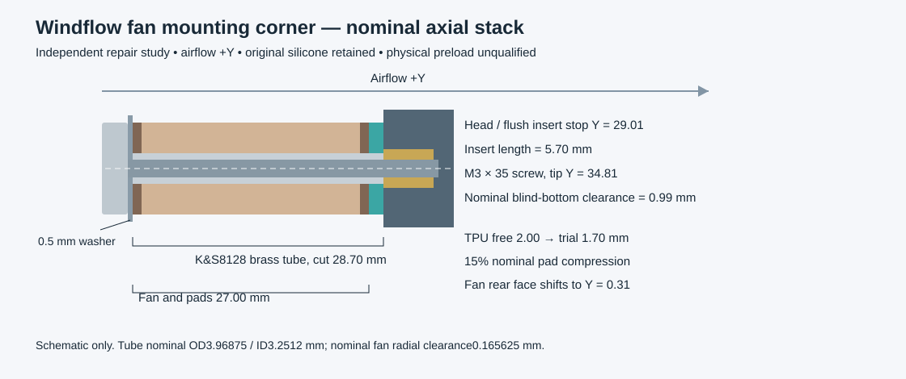

# Fan isolation mount repair study

At the frozen Rev B baseline, the mount omitted the steel limiter from the full assembly. Its exported TPU pad had a 3.4 mm bore, which interfered with the specified 4.0 mm outside-diameter sleeve. The bell plate also lacked clearance for the fan washers and screw heads at the 105 mm mounting pattern. Those are concrete geometry defects. The independent [repair generator](../cad/fan_mount_study.py) produces replacement geometry and focused checks; adoption into the main assembly is a separate operation with separate validation.

The defect comparison is frozen against commit **`ee3ddc9cbf206eec5d336ee8c083fa07e3193e1a`**. [baseline/](../cad/fan_mount_study/baseline/) retains byte-for-byte copies of the original two head STEP files, bell plate, old pad, parameter JSON and build/check scripts. The generator reads those archived inputs, so adoption of the repaired mount into the live model cannot remove the negative controls or change this study's geometry. The manufacturer's fan remains a downloaded dependency covered by the source manifest.

Noctua specifies the NF-A12x25 G2 as 120 × 120 × 25 mm without its silicone pads, 27 mm with them, and a 105 × 105 mm mounting pattern. The supplied manufacturer STEP additionally contains two 4.30 mm rigid bore sections at each mounting corner. Those STEP dimensions are measured in the generator; they are nominal geometry, not manufacturing tolerances. [Noctua mechanical specifications](https://www.noctua.at/en/products/nf-a12x25-g2-pwm/specifications), [manufacturer CAD](https://cdn.noctua.at/media/a7b1158c/NF-A12x25_G2_Public-CAD.zip?download=true).

## Proposed stack

Airflow follows +Y. The current head's nominal fan mounting face is at Y = 29.01 mm: the fan-bay boolean removes 0.01 mm from the originally constructed Y = 29 mm bosses. Fan centre height remains Z = 10 mm. Mount axes remain X = ±52.5 mm, Z = 10 ±52.5 mm.

| Part / feature | Nominal dimensions and position | Purpose |
| --- | --- | --- |
| Four replacement TPU pads | 14 mm OD, **4.4 mm through-bore**, 2.0 mm free thickness | Pass the sleeve with 0.215625 mm nominal radial allowance; separately replaceable |
| Four brass tube cut parts | **K&S Precision Metals SKU 8128**: 5/32 inch OD = **3.96875 mm**, published 0.128 inch ID = **3.2512 mm**; **28.70 ±0.05 mm initial trial cut length** | Rigid clamp stop around the M3 screw; final length follows measured stack |
| Four purchased washers | ISO 7089 A2 M3, 7 mm OD / 3.2 mm ID / 0.5 mm nominal thickness | Spread the load on the rear silicone face and bear on the sleeve end |
| Four purchased screws | ISO 4762 A2-70 M3 × 35, 5.5 mm nominal head OD, 3 mm head height | Accessible from the inlet side before the rear guard is fitted |
| Four heat-set inserts | ruthex RX-M3x5.7, 5.7 mm long; smooth reference envelope 4.6 mm OD | **Front face flush with the mounting face**, forming the sleeve's solid stop |
| Bell plate reliefs | Four **7.6 mm through-bores**, 105 × 105 pattern | Clear the washers and screw heads; outlet, fan throat and other head geometry remain unmodified in this study |

The 4.4 mm TPU bore addresses a sleeve, rather than merely fitting an M3 screw. The vendor fan's 4.30 mm rigid bores leave **0.165625 mm nominal radial sleeve clearance** with K&S 8128. Its published ±0.002 inch OD/ID tolerance is ±0.0508 mm; at maximum stock OD, the radial clearance against the nominal fan bore becomes **0.140225 mm**, and against the nominal TPU bore **0.190225 mm**. The minimum published stock ID gives **0.1002 mm radial clearance** to a nominal 3 mm screw. These calculations do not include unknown fan, screw or printed bore tolerances. A tube that is bent, burred or oversized is unsuitable. Inspect and deburr both ends, measure diameter and check free insertion through the actual fan before tightening anything.

The trial compressed TPU envelope is 1.70 mm thick, representing 15% axial compression of a 2.00 mm pad. Its downstream face ends at Y = 29.01 mm. The fan's original silicone geometry is retained and the complete fan envelope shifts **0.31 mm downstream**: rear silicone face Y = 0.31 mm, front face Y = 27.31 mm. This is a nominal assembly position; no actual stiffness, silicone compression or preload force is inferred from it.

With the 0.5 mm washer, the screw's under-head plane is Y = −0.19 mm and its tip is Y = 34.81 mm. A flush insert occupies Y = 29.01–34.71 mm, giving **5.70 mm maximum insert engagement**. The screw projects 0.10 mm past the insert's nominal end, into the existing deeper clearance, and has **0.99 mm nominal clearance to the blind pilot end at Y = 35.8 mm**. These are nominal values; actual screw length, washer thickness, insert depth and printed hole depth must be checked before assembly. A screw must not bottom before the sleeve is clamped.

The sleeve must bear on the **insert's exposed metal front face**. The selected tube cannot form a reliable stop against the raw 4.0 mm pilot. The pilot remains 4.0 mm in the printable geometry; the assembly check explicitly creates a 4.6 mm installed-insert cavity to represent material displaced during heat-setting. This allowance does not claim the real printed material will tolerate a particular installation process. The insert manufacturer confirms the 5.7 mm length and offers CAD; the selected pilot and retention still require a coupon. [ruthex RX-M3x5.7](https://www.ruthex.de/products/ruthex-gewindeeinsatz-m3-100-stuck-rx-m3x5-7-messing-gewindebuchsen).

## Determining the final sleeve length

Use `sleeve length = measured unloaded fan face-to-face stack + measured TPU free thickness × (1 − target compression) + measured insert-face recess`. A truly flush insert has zero recess. For the nominal values that is `27 + 2 × 0.85 = 28.70 mm`. Set all four insert faces to the same datum and cut all four sleeves to the measured target, with flat parallel ends.

The 15% value is a starting point for a small fixture, not a qualified preload specification. Original silicone compresses too, so the split of deformation between silicone and TPU cannot be obtained from this formula alone. Start with the full measured stack, shorten in controlled increments only if pad contact and alignment require it, and stop if the frame deforms or the rotor clearance changes. Record the accepted length, clamp procedure and settled dimensions after a warm endurance run. Do not tighten farther to conceal a poor fit.

The selected stock is **K&S Precision Metals 8128**, brass alloy 260/272, supplied as one 12 inch length with nominal 0.014 inch wall. The manufacturer's published ID is used directly; its rounded wall and OD figures produce a slightly different derived ID. One length is sufficient for four 28.7 mm pieces plus cutting and trial allowances. The manufacturer's stock-length tolerance is unrelated to the tighter **28.70 ±0.05 mm proposed cut-length requirement**: cut, square, deburr and measure the individual sleeves. Do not silently substitute 4.0 / 3.0 mm tube or a 4.5 mm spacer. Brass strength and end bearing still need a restrained clamp procedure and endurance validation. [K&S 8128 specifications](https://ksmetals.com/products/br014-5-32).

## Study exports and checks

Use [validation.json](../cad/fan_mount_study/validation.json) for measured bores, input and artifact SHA-256 hashes, fastener stack, pair checks, insertion checks and recorded limitations. [fan-mount-repaired-development.step](../cad/fan_mount_study/fan-mount-repaired-development.step) combines the vendor fan, existing head halves, corrected bell plate, four compressed-pad envelopes and the nominal metal hardware. `REF-*` geometry is purchased or machined hardware; **do not print it**. The compressed TPU assembly envelopes are also not print files.

The printable files are:

- `tpu-fan-pad-sleeve-4p4-free.stl`: the proposed free-state pad; four required after qualification.
- `tpu-fan-pad-bore-coupon-4p2.stl` and `tpu-fan-pad-bore-coupon-4p6.stl`: neighbouring fit trials, each with the same 14 mm OD and 2 mm thickness.
- `fan-insert-boss-coupon.stl`: an independent 20 × 20 × 8 mm pilot-installation fixture. Its 4 mm pilot is 6.8 mm deep.
- `fan-corner-27mm-stack-coupon.stl`: a rigid 18 × 18 × 27 mm stack surrogate with a nominal 4.3 mm tube bore. It checks assembly and dimensions; it does not simulate the fan's silicone or vibration behaviour.
- `bellmouth-rear-inlet-mount-reliefs.stl`: corrected bell plate, in the same local coordinates as the current inlet export.

Print TPU pad coupons with a broad annular face on the bed, for example rotate +90° about X so their Y thickness becomes build height. Start with a 0.4 mm nozzle, 0.2 mm layers, three perimeters and solid infill. Measure the resulting bore and settled thickness instead of assuming the STL is exact. Print the boss coupon on its closed face, with its open pilot pointing upward; avoid support inside the blind pilot. Print the rigid stack coupon with its bore vertical. Install and remove the insert on the small fixture before committing a head print.

The focused interference check includes all four sleeves, washers, screws, inserts, the shifted manufacturer fan, corrected bell plate and current head halves. It checks **276 static part pairs**, **16 exact continuous tube-sweep comparisons**, **132 tube poses contained in those swept annuli** and **16 driver comparisons**. The tube starts completely behind the bell plate at its mount axis. A 4 mm diameter straight driver shaft is checked at all four screw axes. These paths assume the rear guard has been removed. Nominal clearances, rather than measured manufacturing tolerances, are being checked. A smooth insert envelope and a smooth M3 shank deliberately omit threads and knurling.

The exact K&S stock run completed with **PASS and process exit code 0**, with no unintended intersections in these checks. The old pad overlaps the new sleeve by **5.595695 mm³** in the comparison fixture; all **eight old bell plate washer/head collisions** are detected before reliefs are applied. Each smooth installed insert intentionally displaces **23.100131 mm³** of the original 4.0 mm pilot material, confined to its own mounting boss. That exact accommodation is separate from other contact detection. Six exported printable pieces are valid single solids. These are geometric checks, not evidence of physical isolation or print quality.

## Adoption and physical qualification

The parent design can adopt this study by adding parametric pad bore, free thickness, compression target, sleeve OD/ID/length, washer thickness and bell relief diameter; shifting the fan by the computed stack; integrating all four metal sleeves and nominal fasteners in the assembly; and rebuilding the full collision and service sequence checks. Before a new Onshape import, reconcile the insert installation datum, changes to fan service order and final fastener quantities. The existing 76-instance model is **unchanged** by this study.

Physical acceptance still needs actual fan bore and pad dimensions, tube procurement and insertion, real insert fit/retention and seating depth, pad compression/creep, rotor freedom, four-corner alignment, frame-to-shell isolation, tightening repeatability, acoustic comparison and warm endurance testing. The small gap between the sleeve and fan frame limits lateral motion, but contact at that limit can transmit vibration. The design therefore needs measured alignment and acoustic results rather than assuming that TPU guarantees quietness.
