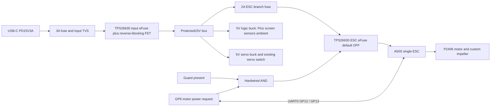

# Rev C motor and single-ESC architecture

Design decision dated6 October2026. This revision follows the user's replacement of the packaged fan with one **T-Motor Pacer V4 P2406 Juicy2060KV motor**, a custom axial impeller, and one ESC. The Rev B model, firmware binary and carrier retain their historical meaning. They do not power this motor. This document is a new circuit specification, with measured commissioning still required.

## Fixed component envelope

Use the manufacturer's **Ø30.2mm by31mm total axial envelope**, **four M3 holes on a16mm pitch circle**, M5 propeller shaft, and7 pole pairs from its12N14P configuration. The drawing dimensions only8mm of threaded shaft, whereas the page table saysM5×10mm: design the hub clamp against the conservative8mm until the actual motor is measured. Thread pitch/hand, propeller-seat diameter and maximum screw penetration are not separately established. The rotor coupon must resolve these before retaining hardware is finalized. The published48A and1116W values are explicitly one-second peaks and provide no continuous desktop rating. [Manufacturer specification](https://www.ligpower.com/product/p2406-fpv-freestyle-motor.html), [manufacturer drawing](https://www.ligpower.com/images/202508/Pacer-V4-Juicy-draw.png).

Select **TeamTriforceUK A50S V2.3c12S, SKU A50SV2.3c-12-10**, without the optional heatsink initially. Its published6–52V range includes the15V bus,35.5×21×13.8mm body excludes connector space, and its20A continuous phase-current capability without extra cooling exceeds this project's3A initial phase limit. Sensorless FOC, UART and speed/current/power limits support controlled operation and diagnosis. The motor manufacturer warns of desynchronization with different BL32 ESCs; that drone recommendation is not proof of low-speed FOC compatibility. VESC motor identification and startup tests are therefore release gates. [ESC product and controls](https://teamtriforceuk.com/a50s-v2/).

The manufacturer's linked CAD folder currently exposes **V2.2** STEP models. These are downloaded as historical references, with explicit version labeling, and cannot establish exact V2.3c fit. The bare V2.2 model imports as192 valid solids with a45.25×21.27×16.19mm overall envelope including its connectors. Reserve at least46×22×17mm for that reference plus additional cable insertion room; body-only dimensions cannot size the installed cradle. The motor has a primary dimensioned drawing but no exact manufacturer STEP obtained in this bounded search. Keep conservative envelopes and a removable service cradle until the actual parts can be measured.

## USB-C power and protected branches

Retain the battery-free architecture and **Adafruit5807 HUSB238**, changing its jumpers to **15V and3A**. Retain the selected Raspberry Pi45W UK supply with its15V3A PDO. A connector alone is insufficient: firmware must read a15V contract offering at least3A, confirm14–16V at the bus, and keep motion off for unsupported supplies. [HUSB238 hardware](https://www.adafruit.com/product/5807), [source PDOs](https://www.raspberrypi.com/products/45w-power-supply/).

Remove the old12V fan regulator, packaged-fan tach/PWM circuit,0.5A motor fuse and oldSW1 from the active motor path. The ESC receives the protected15V bus through a separately gated eFuse. The logic and servo retain independent5V buck regulators; the ESC's500mA BEC remains disconnected. Never parallel its5V/3.3V outputs with Pico or regulator supplies.

Both new eFuses are **TPS26630RGER**. They replace the formerTPS26600 input limiting arrangement and use system ground; its oldRTN island must not be carried into this circuit. Input RILIM=7.15k gives2.517A nominal from18k/R; ESC branchRILIM=10k gives1.8A. Use MODE open for latch-off, controlled slew, programmableUVLO/OVP, and the TI reverse-blocking reference circuit at the input usingCSD19537Q3 plusBSS138 pulldown. EF2SHDN is a3.3V control with10k pulldown. EF2PGOOD is open-drain, pulled to3.3V and routed toGP22. InputSHDN may self-enable for housekeeping; motorSHDN must be held low until all conditions are satisfied. [TI pinout, equations and layout](https://www.ti.com/lit/ds/symlink/tps2663.pdf).

For each eFuse, start with100k/10kUVLO (13.2V rising nominal),132k/10kOVP (17.04V nominal),100k/10kPGTH (13.2V rising nominal),100nFdVdT,1uF input ceramic and manufacturer-required output bypass. These are independent dividers rather than a shared ladder. **Leaving UVLO atGND selects a roughly15.46V internal default and can prevent starting from15V, so the divider is mandatory.** Input and branch thresholds, leakage and all tolerances require circuit review and measurements. TieIN_SYS to the actual supply node as required by the external blocking topology; never infer this from the former eFuse circuit. EF2 does not use an external blocking FET initially; inputEF1 protects the source from reverse current.

Place470uF35V plus a local100nF ceramic at the ESC behindEF2, including the vendor-required bulk capacitor in the total rather than blindly adding both. A3.3k0.25W bleeder across this rail dissipates68mW at15V;470uF alone has a1.55s time constant. Power removal is consequently not an instant zero-voltage or zero-speed guarantee. Retain fixed guards through rotor coast. SMBJ18A across the ESC supply suppresses transients but is not a continuous braking-energy sink.

EF2 power permission is `MCU_request AND guard_present`. UseSN74LVC1G04DBVR to invert the existing active-low guard signal andSN74LVC1G08DBVR for the AND, powered from3.3V; fit10k pulldown atSHDN and local bypass. Software safety and hardwired contact complement each other. A lost UART connection invokes ESC command timeout; a grille removal also drops the branch independently of software. Neither prevents motion from stored mechanical energy.

## Power calculation

The **18W ceiling is total ESC input**, including motor, ESC losses and ESC housekeeping. It is a design restriction, not a measured operating demand or an estimate from the drone's1116W peak. Preserve E3 upper allowances for accessories and full-white pixels even though normal brightness is lower.

| Load | Normal full-output scenario | Simultaneous electrical upper scenario |
|---|---:|---:|
| Motor plus ESC input |18.000W cap |18.000W cap |
| Servo5V |1.250W |5.000W transient/jam allowance |
| IPS screen5V |0.500W |0.500W engineering allowance |
| Eight ambient pixels5V |0.113W at12/255 |2.400W full-white allowance |
| Pico, sensors, buffers5V |0.750W |0.750W allowance |
| Accessory conversion,85% normal /80% upper allowance |3.074W bus demand |10.813W bus demand |
| Input/branch fuses, switches, wiring, PD reserve |0.700W |0.700W |
| **Total bus/source estimate** |**21.774W** |**29.513W** |
| At15V |**1.452A** |**1.968A** |
| At14V bus minimum |**1.555A** |**2.108A** |

The45W contract leaves15.487W beyond this upper scenario. Its3A capability also exceeds the input eFuse nominal2.517A ceiling. A conservative ±10% current-setting allowance and1% resistor tolerance give an input ceiling range of about2.243–2.797A; the lower estimate leaves135mA at14V under the extreme upper scenario. The former20W motor cap with85% conversion left only38mA. The revised18W cap and80% upper conversion allowance improve that margin. Firmware must still shed ambient lighting and stop a stalled servo promptly; verify the low-end hardware current limit, efficiency and transients. Ordinary5V USB-C is insufficient. The previous15V2A/30W contract lacks the required current margin at the14V validation floor and is intentionally unsupported. Thermal validation is required in the closed base; the ESC's advertised high phase current is not a power budget for the printed enclosure.

The editable [Rev C circuit](../hardware/pcb/rev_c/windflow-rev-c.kicad_sch) contains139 components and459 explicit pin connections, with a native netlist check and zero ERC violations. [The complete schematic PDF](../hardware/pcb/rev_c/windflow-rev-c-schematic.pdf) has10 sheets. This is circuit capture: the80×55mm board is not yet placed or routed. EF1SHDN is deliberately floating, using the datasheet's specified2.48–3.3V open-circuit voltage; EF2SHDN remains hard-gated and pulled down. The QRC1 drawing has source terminals1–3, gate4 and common drain5–8/EP; OCR alone misorders this figure.

## Pin and communication revision

Use UART0 at115200 baud,8N1. RP2040 GP12TX andGP13RX are available by relocating the old load-enable functions. Keep the existing servo50Hz signal atGP8, and move its rail enable toGP9. Motor power request usesGP6. The screen, encoder,I2C,ADC and ambient assignments remain as inE3. [RP2040 UART multiplexing](https://datasheets.raspberrypi.com/rp2040/rp2040-datasheet.pdf).

| Pico signal | Rev C assignment | Connection |
|---|---:|---|
| UART0TX |GP12 / physical16 |A50S RX |
| UART0RX |GP13 / physical17 |A50S TX |
| Motor branch request |GP6 / physical9 |Guard AND thenEF2SHDN |
| Servo enable |GP9 / physical12 |Existing servo-switchEN |
| Servo signal |GP8 / physical11 |Existing buffered servo signal |
| Optional independent optical RPM |GP3 / physical5 |3.3V-compatible isolated detector; no packaged-fan tach input |
| Motor branch good |GP22 / physical29 |EF2PGOOD,10k pullup to3.3V |
| Grille input |GP15 / physical20 |Existing active-low3.3V guard logic |

Cross TX/RX and share ground. The manufacturer's pinout identifies TX/RX as3.3V maximum, with board connector Molex5011892010; its drawing does not number cavities, so assembly instructions must mark the actual connector orientation rather than invent numbering. Use the provided shell/precrimped wires. Keep UART under150mm, next to its ground return and separate from phase leads. Leave ESC BEC,3.3V,AUX power and unused signals disconnected. [Manufacturer pinout](https://cdn11.bigcommerce.com/s-4t55i5fv4j/images/stencil/original/image-manager/pinout-v2.3.png?t=1684596909).

Use **74LVC2G125DP-Q100H** partial-power-safe buffers powered from Pico3.3V: pin8 VCC,4 GND; input1A pin2=GP12 and output1Y pin6=A50S RX; input2A pin5=A50S TX and output2Y pin3=GP13. Pins1 and7 are active-low output enables; join them to a second SN74LVC1G04DBVR output that inverts ESC branchPGOOD. Add10k from the enable node to3.3V and100nF bypass at each chip. HIGH PGOOD therefore enables both channels; branch-off disables outgoing drive into an unpowered ESC. With Pico3.3V absent, the buffer's specified Ioff behavior isolates the still-powered ESC transmitter. Add33ohm source damping at each output and verify UART levels/noise and all power sequencing on the finished board. [Buffer pinout and Ioff specification](https://assets.nexperia.com/documents/data-sheet/74LVC2G125_Q100.pdf).

HUSB238 `PD_STATUS0` has voltage code4 in its upper nibble for15V and current code10 (`0xA`) in its lower nibble for3A. The firmware qualification predicate is attached (`PD_STATUS1 &0x40`), voltage nibble4, current nibble at least10, plus measured bus limits. The previously accepted current code6 only represents2A and must be rejected for Rev C. [Adafruit's register definitions](https://raw.githubusercontent.com/adafruit/Adafruit_HUSB238/master/Adafruit_HUSB238.h).

## Control and release gates

Control speed using `ERPM = mechanicalRPM ×7`. A3000RPM **guarded trial ceiling** is21000ERPM;5000RPM analysis is35000ERPM and is not a certified operating limit. At15V the ideal no-load motor speed is30900RPM; a direct100% duty command would have no relationship to safe printed-rotor speed. The normal/boost screen interaction now requests a calibrated mechanical-speed target; boost holds the qualified maximum target while reducing outlet area. Startup's100% means100% of the commissioned safe speed and power envelope.

Configure no reverse and no regenerative braking. Normal stop/fault is zero motor current and coast, followed by branch shutdown when appropriate. Set an ESC-side command timeout of250ms with zero braking current, refresh speed commands at20Hz, and request telemetry at10Hz. Validate packetCRC, fault code, bus voltage, motor phase current, input current, electrical speed and MOSFET temperature. Stop on stale telemetry, overspeed, ESCfault, invalidPD or lostguard. Do not repeatedly restart a stalled sensorless motor: one bounded startup attempt, then latch a fault requiring deliberate user acknowledgement and an operator rotor-rest check. Acknowledgement returns the product to off and checks finite reported RPM within ±60; because branch shutdown makes ESC data stale, this is not an independent zero-speed confirmation. Fixed guards and the qualification optical RPM check remain required.

Independent optical RPM is strongly desirable before daily operation because ESC speed is an observer estimate. Fit its target outside all structural blade roots, verify pulses per revolution and correlate to an optical tachometer. Commission the ESC **with impeller removed first**, then fit a balanced rotor and test inside a containment fixture. Sensorless low-speed FOC can fail to start or lose synchronism; define a measured minimum sustainableRPM, and showOFF below that value rather than allowing unstable torque pulses. No current geometry, source code, vendor motor rating or nominal CAD clearance qualifies FDM blade containment, retention or fatigue.

Before release: verify thread/seat/screw depth; exactV2.3c envelope; ESC motor-detection result; cold/hot startup over all nozzle positions; trueRPM vs telemetry; observer/communication/guard faults; branch discharge; oscilloscope rail dips; input current and regeneration transients; sustained motor/ESC/print temperatures; blade balance, strength and guarded overspeed evidence; airflow and noise at usable desk settings. Keep firmware uncommissioned until these records exist.
