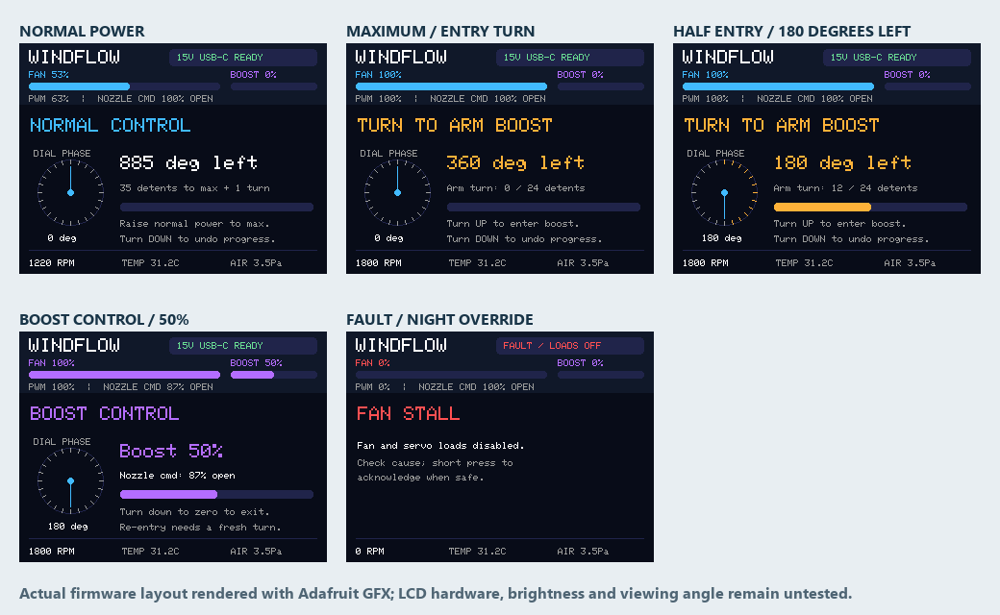

# Screen and rotary control — E3

The Adafruit 4311 IPS screen replaces the front speed LED chain and the separate power/status lamp. The eight downward ambient pixels remain behind their diffuser. The screen is 320 × 240 pixels in landscape orientation. Its top 64 pixels are reserved for fan power, boost level and system status; the lower area displays a relative encoder dial, entry progress and operating diagnostics.

The preview uses the production `DisplayLayout.cpp`, production control/view model and the unchanged Adafruit GFX renderer. It is a host rendering, not a photograph of a powered screen. `tools/render_display.ps1` reproduces the images and checks every pixel of five full frames against the fifteen 16-row strips sent by the device renderer.

## Turning the wheel

The horizontal Bourns PEC11H-4215F-S0024 encoder has 24 detents per turn. Upward movement increases output. A short press switches the fan on/off; a 1.2-second hold toggles night mode. Calibration requires the recessed service jumper plus a deliberate boot hold, as described in [calibration.md](calibration.md).

| Current state | Upward turn | Downward turn | Screen |
|---|---|---|---|
| Normal power below maximum | Raises normal power by one increment per detent. | Lowers normal power. | Blue power bar, relative angle and total degrees remaining to boost entry. |
| Normal maximum, nozzle verified open | Starts a fresh 24-detent / 360° entry turn. Fan stays at maximum; panels stay open. | Unwinds any partial entry progress before lowering normal power. | Amber entry prompt, 360° → 0° countdown and entry progress. |
| Entry turn complete | Enters boost control at zero closure. The next 24 detents progressively increase closure. | Returning to zero boost exits boost control. | Purple boost bar and boost percentage, plus commanded nozzle open area. |
| Just left boost | A new full 24-detent / 360° entry turn is required before closure can increase again. | Lowers normal power once entry progress is zero. | Fresh 360° countdown. |

The normal-power endpoint is stored at 750/1000 by default, with 10 counts per detent. That is 75 detents from zero to normal maximum. The older 75% threshold no longer starts closure by itself. At zero the displayed total remaining rotation is 75 × 15° + 360° = 1,485°. Once normal maximum is reached, only the deliberate 360° entry turn remains. Entry and boost adjustment travel are separate.

The dial reports position relative to this boot, modulo one turn, at 15° per detent. An incremental encoder does not provide absolute mechanical shaft angle; there is no claim of an absolute reference or accumulated complete-turn counter. Direction is configurable and must be confirmed with the installed wheel.

## Startup and safety

Startup qualifies power, verifies open panels and waits for the first full software-rendered frame before the fan ramp. It ramps smoothly for 1.8 seconds and returns over 0.9 seconds. A saved boost setting restarts at normal maximum with the panels open, requiring a fresh full entry turn. Saving settings records output/night/power values after inactivity; merely turning through the entry gesture or moving the dial phase does not schedule a flash write.

Off, fault and service entry clear boost authorization. Entry progress does not accumulate during startup, panel reopening, pressure limiting or thermal limiting. Safety can open the nozzle or remove loads regardless of encoder requests. The screen distinguishes commanded area from measured operation; RPM, pressure and temperature remain diagnostics, not proof of outlet velocity.

Night mode uses configurable screen/ambient brightness and suppresses unnecessary animations. Essential fault indication overrides night mode. The display receives unswitched logic power so switching off the ambient pixels does not hide a fault.

## Physical integration and qualification

The screen sits in a removable rear cradle behind a screw-retained front bezel and clear 1 mm acrylic window. Current manufacturer CAD includes a 6.0809 mm rear-component envelope, larger than the product-page height. Verify the supplied EYESPI revision, rear connector, pigtail, screws and window gap on the [fascia coupon](../cad/prototypes/display-coupons.json) before printing the whole base.

The final pins, buffers, harness and protection are specified in [wiring.md](../hardware/wiring.md). BUF2 handles CS/RST and the backlight PWM; the backlight channel has a GPIO-side 100k pulldown, 330 Ω output series resistor and 1k pulldown at the screen. This preserves active-high PWM and improves drive/reset margin. Screen current, electrical levels, SPI timing, fast encoder turns, viewing angle, complete night/reset darkness and actual printed fit remain physical tests. The firmware compiled and host checks passed; no screen or fan hardware has been operated.
