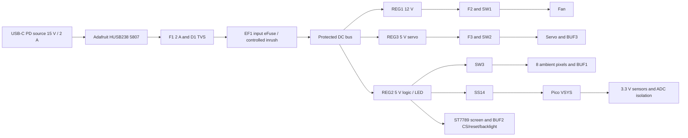

# Wiring and pin assignments — electrical revision E3

**Rev B historical wiring.** Use the [Rev C power and wiring specification](../docs/rev-c-motor-power.md) and [Rev C firmware pin mapping](../docs/rev-c-firmware.md) for the P2406 motor and A50S ESC. The four-wire fan circuitry below is superseded; ESC UART, branch power gating and a 15 V / 3 A PD contract require a revised carrier. Do not connect the new motor to this earlier fan circuit.

This is the prototype's net-level circuit specification, updated 2026-10-05 with the 5 V grille-contact circuit and 3.3 V BUF4 output. It corresponds to firmware defaults `busScale=11.1`, `logicScale=2.1` and a 50 ms LED rail-settle interval. It is **not a routed PCB, an ERC report, or a bench-tested circuit**. Build the carrier described in [electronics assembly](../docs/electronics-assembly.md) before enclosure integration.

## Power diagram

J1 PD+ goes through F1 to `RAW_FUSED`; D1 SMBJ18A cathode goes there, anode to system GND. C1=100 nF goes across this raw input. **No 100 uF reservoir is connected directly to raw USB VBUS.** EF1 feeds `BUS_PROTECTED`, with C2=100 uF and REG1/2/3 inputs. This places bulk capacitance behind controlled slew. The HUSB238 itself negotiates 15 V without requiring the Pico to be running. Unsupported low-voltage sources can leave the unit dark; a live status display is not promised without housekeeping power.

REG1 is D24V22F12; REG2 and REG3 are D24V22F5. Each has VIN to protected bus and GND to system GND. Leave module EN unconnected: its onboard pullup is to input voltage and **must not connect directly to a Pico GPIO**. REG1 PG goes to GP22; REG3 PG to GP21; REG2 PG is unused. C3/4/5=1 uF at the three input connections. C6/7/8=100 uF at REG1/2/3 outputs. REG2 feeds Pico VSYS pin 39 through D2 (anode REG2, cathode VSYS); no external connection to Pico VBUS in the installed power circuit.

F2=0.5 A goes between REG1 output and SW1 VIN. F3=1 A goes between REG3 output and SW2 VIN. SW3 VIN is REG2 output. Fuses protect branch wiring; a 1 A fuse will not reliably interrupt a 0.6 A servo stall, which is handled by feedback and timed cutoff.

## Input eFuse EF1

Use **TPS26600PWPR**, HTSSOP16. Pin 1 and 2 IN=`RAW_FUSED`; pin 15 and 16 OUT=`BUS_PROTECTED`; pin 9 GND=system GND. Pin 8 RTN and exposed thermal pad form a **local RTN island**, distinct from system ground. Reference the following control parts to this island. Do not silently join RTN to GND: that defeats the chip's reverse-polarity arrangement.

R44=100k from IN to pin 3 UVLO, R45=15k from UVLO to RTN. Also connect pin 7 SHDN to this UVLO node (at 15 V it is about 1.96 V, within SHDN's 0–4 V recommended range). This yields roughly 9.12 V rising UVLO and 8.43 V falling UVLO; firmware still requires the proper 15 V contract. R46=130k from IN to pin 5 OVP, R47=10k from OVP to RTN: nominal rising OVP16.66 V. R42=8.06k pin 11 ILIM to RTN sets approximately 1.49 A. R43=402k pin 6 MODE to RTN selects active limiting followed by latch-off if the eFuse overheats. C29=100 nF pin 12 dVdT to RTN controls initial ramp. Pin 10 IMON and 14 FLT are unconnected; pin 4 and 13 NC remain unconnected. A power disconnect resets a latched eFuse; firmware cannot clear it. All values are design choices requiring tolerance/bench verification against the [TI data sheet](https://www.ti.com/lit/ds/symlink/tps2660.pdf).

## Pico physical pins

| GPIO | Physical pin | Net and interface |
|---|---:|---|
| GP0 | 1 | Encoder A, R1=10k to 3.3 V, C26=10 nF toGND |
| GP1 | 2 | Encoder B, R2=10k, C27=10 nF |
| GP2 | 4 | Encoder push, R3=10k, C28=10 nF; contacts close toGND |
| GP3 | 5 | Fan tach, R4=4.7k to 3.3 V; two pulses/rev |
| GP4 | 6 | I2C0 SDA, optional R6=4.7k to 3.3 V |
| GP5 | 7 | I2C0 SCL, optional R7=4.7k to 3.3 V |
| GP6 | 9 | 25 kHz fan PWM through R13=100 ohm to Q1 gate |
| GP8 | 11 | 50 Hz servo PWM through BUF3, noninverting |
| GP7 | 10 | TFT RST via BUF2 channel 2, R54=33 ohm; R58=10k input pullup to 3.3 V |
| GP10 | 14 | TFT D/C through R53=33 ohm |
| GP11 | 15 | Ambient data via BUF1 channel 2 and R16=330 ohm |
| GP12 | 16 | SW1 EN, R10=100k pulldown |
| GP13 | 17 | SW2 EN, R11=100k pulldown |
| GP14 | 19 | SW3 EN, R12=100k pulldown |
| GP15 | 20 | Guard present via BUF4 3.3 V output; R60=100k to3.3 V. Installed grille closes the separate5 V contact node toCOM/GND |
| GP17 | 22 | Service jumper toGND; internal pullup |
| GP16 | 21 | TFT BL PWM via BUF2 channel 3, then R55=330 ohm; R59=100k GPIO-side pulldown, R56=1k to GND at display end |
| GP18 | 24 | SPI0 SCK through R51=33 ohm |
| GP19 | 25 | SPI0 MOSI through R50=33 ohm |
| GP20 | 26 | TFT CS via BUF2 channel 1, R52=33 ohm; R57=10k input pullup to 3.3 V |
| GP21 | 27 | REG3 PG, R8=4.7k to 3.3 V, high-good |
| GP22 | 29 | REG1 PG, R9=4.7k to 3.3 V, high-good |
| GP26 / ADC0 | 31 | Protected bus divider via ISO1, scale 11.1 |
| GP27 / ADC1 | 32 | Servo feedback divider via ISO1; calibrate raw five-point table |
| GP28 / ADC2 | 34 | REG2 monitor divider via ISO1, scale 2.1 |
| 3V3 OUT | 36 | Sensors, input pullups, ISO1, SUP1 |
| VSYS | 39 | D2 cathode only; REG2 is the anode source |
| GND / AGND | 3, 8, 13, 18, 23, 28, 33, 38 | Common circuit ground; high-current returns bypass MCU and ADC paths |

GP6 fan, GP8 servo and GP16 backlight occupy distinct RP2040 PWM slices (3, 4, 0 respectively). GP7 is a digital reset output, not a PWM backlight output; putting the backlight on GP7 would change the fan slice frequency. Preserve this separation when changing pins. No 5 V signal is connected directly to a Pico GPIO.

## Output drivers and default-off behavior

SW1/2/3 are **TPS22810DBVR**, with pin 1 VIN, pin 2 GND, pin 3 EN, pin 4 CT, pin 5 QOD and pin 6 VOUT. C11/12/13=1 uF from each VIN toGND; C14/15/16=100 nF from corresponding CT toGND. R39/40/41=330 ohm, 1206 0.25 W, connect QOD to its VOUT. Do not substitute a wire on the 470 uF branches. C9=470 uF goes across SW2 output and C10=470 uF across SW3 output. EN pulldowns are mandatory. The 100 nF CT is intentional: 10 nF made calculated capacitor inrush alone about 2.19 A. Servo/LED supply discharge is finite; do not infer an instant zero voltage from EN low. The [TI switch data sheet](https://www.ti.com/lit/ds/symlink/tps22810.pdf) governs layout and QOD sizing.

BUF1 and BUF2 are **74AHCT125D,118**. Pin 14 VCC and pin 7 GND; C17/C18=100 nF locally. BUF1 VCC is switched ambient 5 V. Ambient uses A5/Y6/OE4 with OE4=GND, R19=100k on A5 and R16=330 ohm in the data output. Unused A2/A9/A12 go toGND, OE1/OE10/OE13 toVCC, Y3/Y8/Y11 unconnected. The former main LED channel is removed.

BUF2 VCC is unswitched REG2. TFT CS uses A2=GP20, Y3 through R52=33 ohm to display CS, OE1=GND; TFT reset uses A5=GP7, Y6 through R54=33 ohm to display RST, OE4=GND. R57/R58=10k pull the corresponding **GPIO-side A inputs** to 3.3 V. Backlight uses A9=GP16, Y8 through R55=330 ohm to display BL, OE10=GND; new R59=100k pulls A9 to GND. Only channel 4 is unused: A12=GND, OE13=VCC, Y11 unconnected. This reuses the former status buffer as three noninverting outputs, preserving active-high 2 kHz backlight PWM. The display's current EYESPI schematic pulls CS and RST to **VIN through onboard 10k resistors**: connecting these two pins directly to a Pico GPIO with VIN=5 V would exceed the GPIO voltage limit during reset. Keep the selected buffer's input-at-zero-supply specification. [Manufacturer schematic](https://github.com/adafruit/Adafruit-2.0-inch-240x320-TFT-PCB/blob/master/Adafruit%20EYESPI%202.0%20Inch%20240x320%20IPS%20TFT.sch), [buffer pinout and electrical limits](https://assets.nexperia.com/documents/data-sheet/74AHC_AHCT125.pdf).

DISP1 **Adafruit 4311** VIN=unswitched REG2, GND=systemGND. C30=1 uF at VIN. GP19/MOSI, GP18/SCK and GP10/D/C go through R50/R51/R53=33 ohm at their driver ends; these inputs use the onboard 3.3 V level converter and have no onboard 5 V pullup. GP16 drives BL through BUF2 channel 3 and R55=330 ohm; it does not supply the BL pulldown current directly. R56=1k BL-to-GND is fitted at the display end. The onboard BL 10k pullup is to regulated 3.3 V and drives an onboard BSS138 gate. Adafruit specifies 3–5 V logic at BL, so the noninverting 5 V buffer is appropriate. With nominal rails/resistors and ideal buffer levels, the gate is **3.748 V HIGH, 0.0799 V LOW**, and **0.300 V** if the buffer output/harness is disconnected. During Pico reset R59 holds the buffer input low; do not describe the disconnected figure as the normal powered-reset level. These are resistor-network calculations, not measured gate voltages. Applying the buffer's conservative 0.44 V maximum VOL at −40 to +85 C gives about 0.403 V at the gate; verify absence of visible night/reset light and adequate HIGH drive across actual rail, temperature and module tolerances. The exact fitted BSS138 manufacturer is not specified in the vendor schematic. The display stays powered when SW3 disables ambient lighting, allowing essential faults to remain visible while the logic rail is healthy. SDCS is left unconnected because its onboard 10k pullup deselects the unused card slot; MISO, 3Vo and EYESPI are unused. No microSD card is installed. [Pinout and PWM control](https://learn.adafruit.com/2-0-inch-320-x-240-color-ips-tft-display/pinouts).

Keep J6's SPI harness shorter than 150 mm, away from motor/servo leads, with a nearby ground return and strain relief. The 33 ohm values are starting damping values; verify edges and pixel errors at the final SPI rate rather than adding arbitrary capacitance. Do not connect display 3Vo to Pico 3V3 or parallel regulator outputs.

BUF3 is **74AHCT1G125GW,125**. Pin 5 VCC=SW2 output, pin 3 GND; C19=100 nF locally. Pin 1 OE=GND, pin 2 A=GP8 with R23=100k pulldown. Pin 4 Y goes through R17=330 ohm to servo signal; R24=100k pulls that signal toGND. A powered MCU can therefore command an unpowered buffer without an always-on 5 V signal driving the servo. Use the specified Nexperia parts: their input leakage is characterized at VCC=0; this is not a blanket property of every buffer family. [Quad data sheet](https://assets.nexperia.com/documents/data-sheet/74AHC_AHCT125.pdf), [single data sheet](https://assets.nexperia.com/documents/data-sheet/74AHC_AHCT1G125.pdf).

Q1 **2N7002,215**: gate 1 via R13, source 2 GND, drain 3 fan PWM. R14=100k gate-toGND. Firmware inverts PWM because Q1 high pulls fan PWM low; fan power is separately disconnected when off. Use the fan's internal PWM pullup; add no 12 V pullup. Fan plug pins 1/2/3/4 are GND/12 V/tach/PWM.

## Grille-present contact and logic level

The 5 October guard correction replaces the former R5=4.7k pullup to3.3 V. Omron lists a1 mA /5 V minimum applicable load as a reference for D2F-01 gold contacts; the previous0.70 mA /3.3 V circuit did not match that reference. R5 is now **3.9k1% from unswitched REG2 5 V to GUARD_CONTACT_5V**. J12pin2 carries that node to the NO contact, and COM returns through J12pin1 toGND. Installed grille therefore pulls the node LOW; unplugging the loom makes it HIGH. NC is unused.

**BUF4 SN74LVC1G17DBVR** translates this input: pin1 NC, pin2 A=GUARD_CONTACT_5V, pin3 GND, pin4 Y=GUARD_LOGIC_3V3 /GP15, pin5 VCC=Pico3V3. C31=100 nF locally across VCC/GND; C32=10 nF across the raw contact node/GND; R60=100k from GP15 to3V3. Keep the raw5 V net away from Pico pads. This exact buffer accepts input to5.5 V and specifies Ioff behavior during power-down; a generic buffer without those ratings is not a substitute. [TI pinout and limits](https://www.ti.com/lit/ds/symlink/sn74lvc1g17.pdf).

Closed-contact current is1.282 mA nominal at5 V; allowing the4.65–5.35 V qualified rail and1% resistance gives approximately1.18–1.39 mA. The39 us nominal RC filters short interference; it does not replace software state qualification or prove switch life. Omron's load value is a reference, not a guarantee for every environment: verify voltage, contact resistance, repeated removal, dust and temperature on the actual switch. With service USB powering the Pico but REG2 absent, the contact node can read LOW; the independent PD, bus and regulator-good gates must remain effective so this condition cannot enable actuators. The fixed inner guard remains necessary, including during rotor coast and a contact/wiring fault.

## ADC isolation and divider values

ISO1 **TMUX1511PWR**: pin 14 VDD=3.3 V, pin 7 GND, C20=100 nF locally. Channel 1 S2/D3 is bus; channel 2 S5/D6 servo feedback; channel 3 S9/D8 logic. SEL pins 1/4/10 join `ADC_ENABLE`. Unused channel 4 SEL13, S12 and D11 go toGND. SUP1 **TPS3808G33DBVR** pin 6 VDD and pin 5 SENSE=3.3 V, pin 2 GND, C21=100 nF locally; pin 3 MR=3.3 V; pin 4 CT unconnected. Pin 1 /RESET=`ADC_ENABLE`, R37=10k to 3.3 V and R38=100k toGND. No connection to Pico RUN is required. /RESET high means isolation channels on.

| Channel | Upper resistor / source | Lower resistor toGND at ISO1 S pin | Filter at S pin | ADC-side pulldown at D pin | Nominal scale |
|---|---|---|---|---|---|
| Bus | R28=100k from protected bus | R29=10k | C23=100 nF | R30=1M | 1+100k/(10k parallel 1M)=11.1 |
| Feedback | R31=100k from servo feedback | R32=100k | C24=100 nF | R33=1M | 2.1, but firmware uses measured raw table |
| Logic | R34=100k from REG2 output | R35=100k | C25=100 nF | R36=1M | 2.1 |

Place the capacitors **before** ISO1, so stored charge is disconnected from ADC pins when 3.3 V falls. After the mux, only the 1M pulldown and short ADC trace are present. The servo divider presents about 191k load to its feedback wire instead of the previous 20k; verify it does not materially disturb the internal servo potentiometer. Normal 15 V bus gives 1.351 V at ADC0; 5 V logic gives 2.381 V at ADC2. Resistor tolerance, leakage, ADC reference error and servo pot impedance are covered by measured calibration, not mathematical ratios alone. [Isolator limits](https://www.ti.com/lit/ds/symlink/tmux1511.pdf), [supervisor behavior](https://www.ti.com/lit/ds/symlink/tps3808.pdf).

## I2C and connector schedule

Bus speed 100 kHz. TEMP1=0x18, TEMP2=0x19 with A0 tied to 3.3 V, SDP810=0x25, HUSB238=0x08. Power both temperature boards and SDP810 from 3.3 V. The HUSB238 receives its own power from USB; do not connect its PD voltage to a sensor VIN. Measure existing pullups before fitting R6/R7; target combined 2.2–4.7k to 3.3 V. Breakout revisions must not add a hidden 5 V pullup. C22=100 nF decouples the pressure sensor connector at its supply.

The following numbered positions define the **carrier header** nets; mark pin 1 on PCB and housing. Module ends are soldered to labeled pads with strain relief unless a native plug is listed. Verify continuity rather than infer wire colors.

| Connector | Positions in pin order | Destination |
|---|---|---|
| J1 XH2 | PD+, GND | HUSB238 output pads |
| J2 XH3 | GND, SDA, SCL | HUSB238 I2C pads |
| J3 Molex4 | GND, switched 12 V, tach, PWM | Original Noctua four-pin plug |
| J4 Samtec 3 | GND, switched 5 V, signal | Original FS90-FB plug; check brown/red/orange supplied harness |
| J5 Samtec 1 | feedback | Original separate servo feedback socket |
| J6 XH8 | VIN5 V, GND, MOSI, SCK, CS, D/C, RST, BL | Adafruit 4311 labeled solder pads; unswitched logic rail, buffered CS/RST |
| J7 XH3 | GND, switchedLED5 V, ambientDIN | Ambient stick |
| J8 XH4 | GND, A, B, push | Encoder daughterboard; C and second push contact toGND |
| J9 XH4 | GND, 3.3 V,SDA,SCL | TEMP1 |
| J10 XH4 | GND, 3.3 V,SDA,SCL | TEMP2 |
| J11 XH4 | GND, 3.3 V,SDA,SCL | SDP soldered daughterboard, 2 mm sensor pitch; sensor native pins 1/2/3/4=SCL/VDD/GND/SDA |
| J12 XH2 | GND, GUARD_CONTACT_5V | Omron COM/NO; NC unused. Pin2 feeds BUF4 input and never connects directly to GP15 |
| J14 Samtec 2 | GND,GP17 | Removable calibration jumper |

E3 retires J13 (RGB lamp) and the former main-pixel components: LED1/LED2, R15, R18, R20–22 and R25–27 are not fitted. Reference-designator gaps are intentional. BUF2 and C18 remain for TFT CS/reset/backlight. R56 is now 1k and R59=100k is added at the BL buffer input. J6 changes from 3 to 8 positions; an old main-LED harness must not be reused on the new display connector. The retired lamp is not an independent fallback indicator; essential faults use the screen while REG2 is healthy.

## USB service and routing

Set HUSB238 jumpers by cutting 5 V and 1 A, then closing 15 V and 2 A. Firmware reads the contract and measured bus before load enable. Use the specified 45 W supply or another documented source offering 15 V at at least 2 A. Never infer a PDO from the USB-C connector shape or wattage label.

Prototype recovery uses a USB-C-to-micro-B data cable to the Pico, with carrier disconnected for initial firmware loading. Powered calibration can use the PD wall supply and Pico data cable together: D2 and Pico's onboard USB diode prevent supply backfeed. Do not connect two USB data hosts. HUSB238 D+/D− pads are **not wired in E3**: the proposed single-socket USB route needs controlled-impedance PCB design and USB enumeration testing. The user-facing power socket is USB-C; the internal Pico recovery connector remains accessible. Disconnect J2 (PD I2C) when bench-running the Pico alone with PD board unpowered, until that board revision's unpowered-bus behavior has been verified.

Keep servo/LED/fan power pairs together, return high current to its regulator, join grounds on the carrier plane, and keep the EF1 RTN island separate. Keep ADC traces short and clear of switching nodes; do not split the ground plane beneath digital signal returns. Clamp the USB PCB near the receptacle. Preserve connector insertion room, service loops and strain relief, and keep wires/tubes outside all rotor and linkage sweeps. The removable grille switch complements a fixed inner guard; it does not justify access to a coasting rotor.
