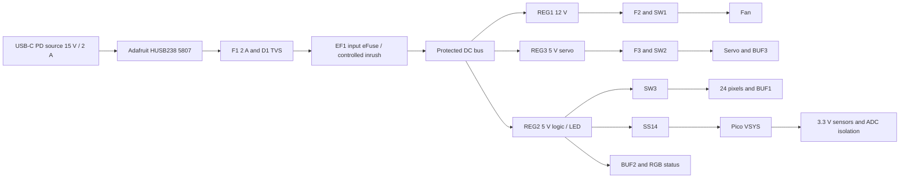

# Wiring and pin assignments — electrical revision E2

This is the prototype's net-level circuit specification, updated 2026-09-09. It corresponds to firmware defaults `busScale=11.1`, `logicScale=2.1` and a 50 ms LED rail-settle interval. It is **not a routed PCB, an ERC report, or a bench-tested circuit**. Build the carrier described in [electronics assembly](../docs/electronics-assembly.md) before enclosure integration.

## Power diagram

J1 PD+ goes through F1 to `RAW_FUSED`; D1 SMBJ18A cathode goes there, anode to system GND. C1=100 nF goes across this raw input. **No 100 uF reservoir is connected directly to raw USB VBUS.** EF1 feeds `BUS_PROTECTED`, with C2=100 uF and REG1/2/3 inputs. This places bulk capacitance behind controlled slew. The HUSB238 itself negotiates 15 V without requiring the Pico to be running. Unsupported low-voltage sources can leave the unit dark; a live status display is not promised without housekeeping power.

REG1 is D24V22F12; REG2 and REG3 are D24V22F5. Each has VIN to protected bus and GND to system GND. Leave module EN unconnected: its onboard pullup is to input voltage and **must not connect directly to a Pico GPIO**. REG1 PG goes to GP22; REG3 PG to GP21; REG2 PG is unused. C3/4/5=1 uF at the three input connections. C6/7/8=100 uF at REG1/2/3 outputs. REG2 feeds Pico VSYS pin39 through D2 (anode REG2, cathode VSYS); no external connection to Pico VBUS in the installed power circuit.

F2=0.5 A goes between REG1 output and SW1 VIN. F3=1 A goes between REG3 output and SW2 VIN. SW3 VIN is REG2 output. Fuses protect branch wiring; a 1 A fuse will not reliably interrupt a 0.6 A servo stall, which is handled by feedback and timed cutoff.

## Input eFuse EF1

Use **TPS26600PWPR**, HTSSOP16. Pin1 and2 IN=`RAW_FUSED`; pin15 and16 OUT=`BUS_PROTECTED`; pin9 GND=system GND. Pin8 RTN and exposed thermal pad form a **local RTN island**, distinct from system ground. Reference the following control parts to this island. Do not silently join RTN to GND: that defeats the chip's reverse-polarity arrangement.

R44=100k from IN to pin3 UVLO, R45=15k from UVLO to RTN. Also connect pin7 SHDN to this UVLO node (at 15 V it is about1.96 V, within SHDN's 0–4 V recommended range). This yields roughly9.12 V rising UVLO and8.43 V falling UVLO; firmware still requires the proper 15 V contract. R46=130k from IN to pin5 OVP, R47=10k from OVP to RTN: nominal rising OVP16.66 V. R42=8.06k pin11 ILIM to RTN sets approximately1.49 A. R43=402k pin6 MODE to RTN selects active limiting followed by latch-off if the eFuse overheats. C29=100 nF pin12 dVdT to RTN controls initial ramp. Pin10 IMON and14 FLT are unconnected; pin4 and13 NC remain unconnected. A power disconnect resets a latched eFuse; firmware cannot clear it. All values are design choices requiring tolerance/bench verification against the [TI data sheet](https://www.ti.com/lit/ds/symlink/tps2660.pdf).

## Pico physical pins

| GPIO | Physical pin | Net and interface |
|---|---:|---|
| GP0 | 1 | Encoder A, R1=10k to3.3 V, C26=10 nF toGND |
| GP1 | 2 | Encoder B, R2=10k, C27=10 nF |
| GP2 | 4 | Encoder push, R3=10k, C28=10 nF; contacts close toGND |
| GP3 | 5 | Fan tach, R4=4.7k to3.3 V; two pulses/rev |
| GP4 | 6 | I2C0 SDA, optional R6=4.7k to3.3 V |
| GP5 | 7 | I2C0 SCL, optional R7=4.7k to3.3 V |
| GP6 | 9 | 25 kHz fan PWM through R13=100 ohm to Q1 gate |
| GP8 | 11 | 50 Hz servo PWM through BUF3, noninverting |
| GP10 | 14 | Main data via BUF1 channel1 and R15=330 ohm |
| GP11 | 15 | Ambient data via BUF1 channel2 and R16=330 ohm |
| GP12 | 16 | SW1 EN, R10=100k pulldown |
| GP13 | 17 | SW2 EN, R11=100k pulldown |
| GP14 | 19 | SW3 EN, R12=100k pulldown |
| GP15 | 20 | Guard present, R5=4.7k to3.3 V; installed grille closes NO toCOM/GND |
| GP17 | 22 | Service jumper toGND; internal pullup |
| GP18 | 24 | Status red via BUF2 channel2 |
| GP19 | 25 | Status green via BUF2 channel3 |
| GP20 | 26 | Status blue via BUF2 channel4 |
| GP21 | 27 | REG3 PG, R8=4.7k to3.3 V, high-good |
| GP22 | 29 | REG1 PG, R9=4.7k to3.3 V, high-good |
| GP26 / ADC0 | 31 | Protected bus divider via ISO1, scale11.1 |
| GP27 / ADC1 | 32 | Servo feedback divider via ISO1; calibrate raw five-point table |
| GP28 / ADC2 | 34 | REG2 monitor divider via ISO1, scale2.1 |
| 3V3 OUT | 36 | Sensors, input pullups, ISO1, SUP1 |
| VSYS | 39 | D2 cathode only; REG2 is the anode source |
| GND / AGND | 3,8,13,18,23,28,33,38 | Common circuit ground; high-current returns bypass MCU and ADC paths |

GP6 and GP8 occupy different RP2040 PWM slices. Preserve this separation when changing pins. No 5 V signal is connected directly to a Pico GPIO.

## Output drivers and default-off behavior

SW1/2/3 are **TPS22810DBVR**, with pin1 VIN, pin2 GND, pin3 EN, pin4 CT, pin5 QOD and pin6 VOUT. C11/12/13=1 uF from each VIN toGND; C14/15/16=100 nF from corresponding CT toGND. R39/40/41=330 ohm, 1206 0.25 W, connect QOD to its VOUT. Do not substitute a wire on the 470 uF branches. C9=470 uF goes across SW2 output and C10=470 uF across SW3 output. EN pulldowns are mandatory. The 100 nF CT is intentional: 10 nF made calculated capacitor inrush alone about2.19 A. Servo/LED supply discharge is finite; do not infer an instant zero voltage from EN low. The [TI switch data sheet](https://www.ti.com/lit/ds/symlink/tps22810.pdf) governs layout and QOD sizing.

BUF1 and BUF2 are **74AHCT125D,118**. Pin14 VCC and pin7 GND; C17/C18=100 nF locally. BUF1 VCC is switched cosmetic5 V. Main uses A2/Y3/OE1; ambient uses A5/Y6/OE4; both OE pins go toGND. R18/R19=100k pull down the two A inputs. Unused A9/A12 go toGND, OE10/OE13 toVCC, Y8/Y11 unconnected.

BUF2 VCC is REG2. Channel1 is unused: A2=GND, OE1=VCC, Y3 unconnected. Red uses A5/Y6/OE4, green A9/Y8/OE10, blue A12/Y11/OE13; active OEs go toGND. R20/R21/R22=100k pull down the three A inputs. Y6 through R25=1.5k goes to RGB pin1 red; Y8 through R26=1k to RGB pin4 green; Y11 through R27=1k to RGB pin3 blue. RGB pin2 common cathode goes toGND.

BUF3 is **74AHCT1G125GW,125**. Pin5 VCC=SW2 output, pin3 GND; C19=100 nF locally. Pin1 OE=GND, pin2 A=GP8 with R23=100k pulldown. Pin4 Y goes through R17=330 ohm to servo signal; R24=100k pulls that signal toGND. A powered MCU can therefore command an unpowered buffer without an always-on 5 V signal driving the servo. Use the specified Nexperia parts: their input leakage is characterized at VCC=0; this is not a blanket property of every buffer family. [Quad data sheet](https://assets.nexperia.com/documents/data-sheet/74AHC_AHCT125.pdf), [single data sheet](https://assets.nexperia.com/documents/data-sheet/74AHC_AHCT1G125.pdf).

Q1 **2N7002,215**: gate1 via R13, source2 GND, drain3 fan PWM. R14=100k gate-toGND. Firmware inverts PWM because Q1 high pulls fan PWM low; fan power is separately disconnected when off. Use the fan's internal PWM pullup; add no 12 V pullup. Fan plug pins1/2/3/4 are GND/12 V/tach/PWM.

## ADC isolation and divider values

ISO1 **TMUX1511PWR**: pin14 VDD=3.3 V, pin7 GND, C20=100 nF locally. Channel1 S2/D3 is bus; channel2 S5/D6 servo feedback; channel3 S9/D8 logic. SEL pins1/4/10 join `ADC_ENABLE`. Unused channel4 SEL13, S12 and D11 go toGND. SUP1 **TPS3808G33DBVR** pin6 VDD and pin5 SENSE=3.3 V, pin2 GND, C21=100 nF locally; pin3 MR=3.3 V; pin4 CT unconnected. Pin1 /RESET=`ADC_ENABLE`, R37=10k to3.3 V and R38=100k toGND. No connection to Pico RUN is required. /RESET high means isolation channels on.

| Channel | Upper resistor / source | Lower resistor toGND at ISO1 S pin | Filter at S pin | ADC-side pulldown at D pin | Nominal scale |
|---|---|---|---|---|---|
| Bus | R28=100k from protected bus | R29=10k | C23=100 nF | R30=1M | 1+100k/(10k parallel1M)=11.1 |
| Feedback | R31=100k from servo feedback | R32=100k | C24=100 nF | R33=1M | 2.1, but firmware uses measured raw table |
| Logic | R34=100k from REG2 output | R35=100k | C25=100 nF | R36=1M | 2.1 |

Place the capacitors **before** ISO1, so stored charge is disconnected from ADC pins when3.3 V falls. After the mux, only the 1M pulldown and short ADC trace are present. The servo divider presents about191k load to its feedback wire instead of the previous20k; verify it does not materially disturb the internal servo potentiometer. Normal15 V bus gives1.351 V at ADC0;5 V logic gives2.381 V at ADC2. Resistor tolerance, leakage, ADC reference error and servo pot impedance are covered by measured calibration, not mathematical ratios alone. [Isolator limits](https://www.ti.com/lit/ds/symlink/tmux1511.pdf), [supervisor behavior](https://www.ti.com/lit/ds/symlink/tps3808.pdf).

## I2C and connector schedule

Bus speed100 kHz. TEMP1=0x18, TEMP2=0x19 with A0 tied to3.3 V, SDP810=0x25, HUSB238=0x08. Power both temperature boards and SDP810 from3.3 V. The HUSB238 receives its own power from USB; do not connect its PD voltage to a sensor VIN. Measure existing pullups before fitting R6/R7; target combined2.2–4.7k to3.3 V. Breakout revisions must not add a hidden5 V pullup. C22=100 nF decouples the pressure sensor connector at its supply.

The following numbered positions define the **carrier header** nets; mark pin1 on PCB and housing. Module ends are soldered to labeled pads with strain relief unless a native plug is listed. Verify continuity rather than infer wire colors.

| Connector | Positions in pin order | Destination |
|---|---|---|
| J1 XH2 | PD+, GND | HUSB238 output pads |
| J2 XH3 | GND, SDA, SCL | HUSB238 I2C pads |
| J3 Molex4 | GND, switched12 V, tach, PWM | Original Noctua four-pin plug |
| J4 Samtec3 | GND, switched5 V, signal | Original FS90-FB plug; check brown/red/orange supplied harness |
| J5 Samtec1 | feedback | Original separate servo feedback socket |
| J6 XH3 | GND, switchedLED5 V, mainDIN | First main stick; connect its DOUT to second DIN, parallel power to both |
| J7 XH3 | GND, switchedLED5 V, ambientDIN | Ambient stick |
| J8 XH4 | GND, A, B, push | Encoder daughterboard; C and second push contact toGND |
| J9 XH4 | GND,3.3 V,SDA,SCL | TEMP1 |
| J10 XH4 | GND,3.3 V,SDA,SCL | TEMP2 |
| J11 XH4 | GND,3.3 V,SDA,SCL | SDP socket board; sensor native pins1/2/3/4=SCL/VDD/GND/SDA |
| J12 XH2 | GND, guard | Omron COM/NO; NC unused |
| J13 XH4 | GND, limitedR, limitedG, limitedB | Status LED pins2/1/4/3 respectively |
| J14 Samtec2 | GND,GP17 | Removable calibration jumper |

## USB service and routing

Set HUSB238 jumpers by cutting5 V and1 A, then closing15 V and2 A. Firmware reads the contract and measured bus before load enable. Use the specified45 W supply or another documented source offering15 V at at least2 A. Never infer a PDO from the USB-C connector shape or wattage label.

Prototype recovery uses a USB-C-to-micro-B data cable to the Pico, with carrier disconnected for initial firmware loading. Powered calibration can use the PD wall supply and Pico data cable together: D2 and Pico's onboard USB diode prevent supply backfeed. Do not connect two USB data hosts. HUSB238 D+/D− pads are **not wired in E2**: the proposed single-socket USB route needs controlled-impedance PCB design and USB enumeration testing. The user-facing power socket is USB-C; the internal Pico recovery connector remains accessible. Disconnect J2 (PD I2C) when bench-running the Pico alone with PD board unpowered, until that board revision's unpowered-bus behavior has been verified.

Keep servo/LED/fan power pairs together, return high current to its regulator, join grounds on the carrier plane, and keep the EF1 RTN island separate. Keep ADC traces short and clear of switching nodes; do not split the ground plane beneath digital signal returns. Clamp the USB PCB near the receptacle. Preserve connector insertion room, service loops and strain relief, and keep wires/tubes outside all rotor and linkage sweeps. The removable grille switch complements a fixed inner guard; it does not justify access to a coasting rotor.
