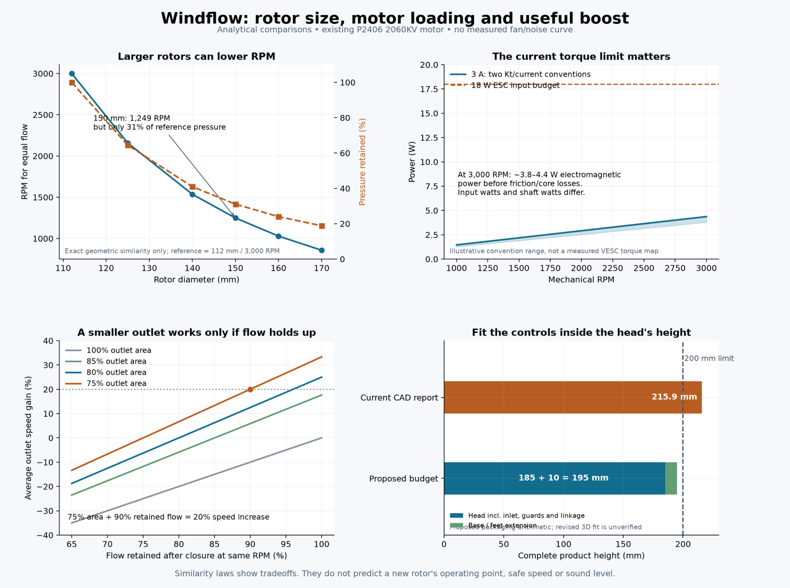
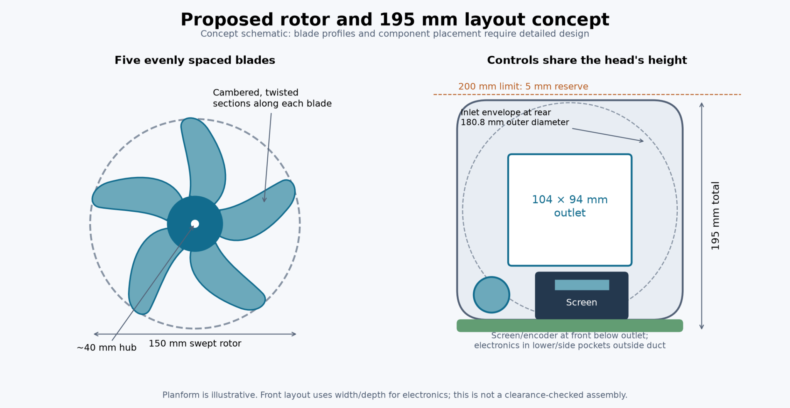
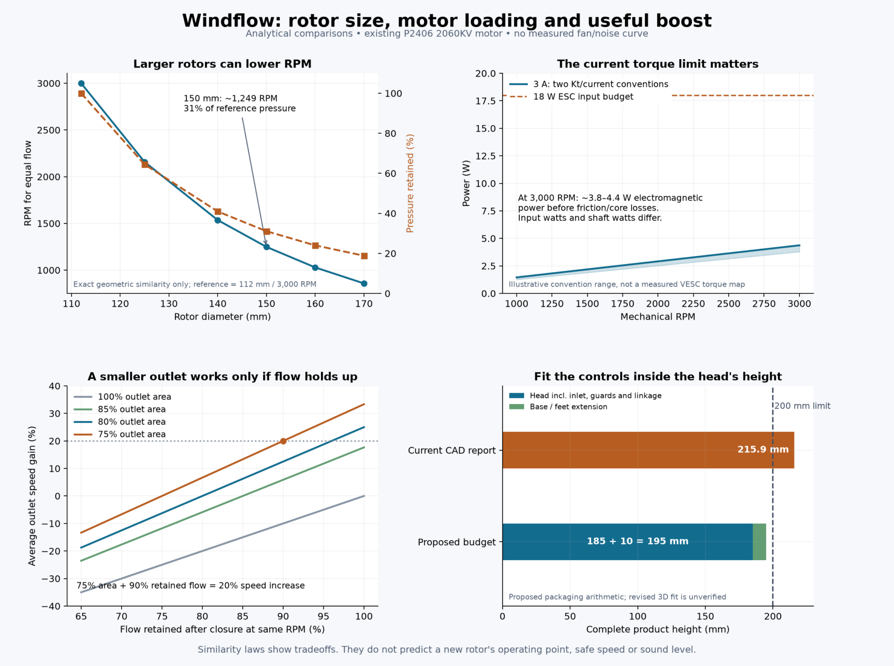

# Original research and tool record

Exact retained calls and returned text from the study. Earlier truncated outputs remain marked as truncated.

## Call 3: exec — 2026-10-09T16:15:15.748Z

````text
const r = await tools.exec_command({cmd:"rg -n -i \"Windflow|motor|fan|boost\" 'C:\\Users\\admin\\.codex\\memories\\MEMORY.md'","max_output_tokens":5500});text(r.output);
const s = await tools.exec_command({cmd:"rg --files -g AGENTS.md -g '*motor*' -g '*fan*' -g '*.md' -g '*.json' -g '*.csv' -g '*.yaml' -g '*.toml'","workdir":"C:\\Users\\admin\\iCloudDrive\\Windflow","max_output_tokens":7500});text(s.output);
text(ALL_TOOLS.filter(x=>/search|onshape|blender|pages|visual/i.test(x.name+" "+x.description)).map(x=>({name:x.name,description:x.description.substring(0,220)})).slice(0,100));

````

## Result 4 — 2026-10-09T16:15:18.019Z

````text
Script completed
Wall time 2.1 seconds
Output:

````

````text
Warning: truncated output (original token count: 10443)
Total output lines: 183

63:- Keep significant behavior; "a button that when pressed once makes the drive at 70% velo and when pressed again goes to 100 (starts match on 70)" -> start each driver period at 70%, use Right-arrow edge detection, and keep controller averages alongside individual Brain motor rows. "I still want the nlcs drive though, as it was before" -> preserve both NLCS and Bedford when branching. [Task 1]
68:- Bedford drive.v5python is the enhanced variant; nlcs drive.v5python is restored to its 357-line pre-change behavior. Use rising-edge toggle, update remembered state, scale both drivetrain outputs, read ten named motors numerically before six-drive/four-lift averages, and avoid row or tuple temperature calls. Pair lives under code/VEXCODEV5/drive/2026-09/. [Task 1]
170:# Task Group: Windflow Rev B engineering and workstation integrations
172:scope: Continue the screen/boost interaction, local CAD/electronics studies, evidence-matched assembly validation, or prepared Blender/Bambu/Onshape FeatureScript integrations.
173:applies_to: cwd=C:\Users\admin\iCloudDrive\Windflow; reuse_rule=regenerate source-matched reports after geometry changes; local CAD/software results are not physical or current-Onshape qualification, and printer control needs explicit authorization.
179:- rollout_summaries/2026-09-08T20-44-35-XAFw-windflow_screen_full_turn_boost_rev_b_integration.md (cwd=\\?\C:\Users\admin\iCloudDrive\Windflow, rollout_path=\\?\C:\Users\admin\.codex\sessions\2026\10\03\rollout-2026-10-03T11-53-34-01a082c3-f6b3-77a2-b642-16afc9a7a406_01a10165-d9a1-7fb0-9819-40f28882b7ae.jsonl, updated_at=2026-10-05T20:14:53+00:00, thread_id=01a082c3-f6b3-77a2-b642-16afc9a7a406, local integration only)
185:## Task 2: Full-turn boost-entry firmware/UI contract, focused software success
189:- rollout_summaries/2026-09-08T20-44-35-XAFw-windflow_screen_full_turn_boost_rev_b_integration.md (cwd=\\?\C:\Users\admin\iCloudDrive\Windflow, rollout_path=\\?\C:\Users\admin\.codex\sessions\2026\10\03\rollout-2026-10-03T11-53-34-01a082c3-f6b3-77a2-b642-16afc9a7a406_01a10165-d9a1-7fb0-9819-40f28882b7ae.jsonl, updated_at=2026-10-05T20:14:53+00:00, thread_id=01a082c3-f6b3-77a2-b642-16afc9a7a406, host/build evidence only)
193:- Control.cpp, RotaryMode, entryDetentsRemaining, 24 detents, boostEntryReady, markChanged, 6,649 host assertions, RP2040
195:## Task 3: Grille/fan/Pico/encoder/carrier/pressure studies, partial
199:- rollout_summaries/2026-09-08T20-44-35-XAFw-windflow_screen_full_turn_boost_rev_b_integration.md (cwd=\\?\C:\Users\admin\iCloudDrive\Windflow, rollout_path=\\?\C:\Users\admin\.codex\sessions\2026\10\03\rollout-2026-10-03T11-53-34-01a082c3-f6b3-77a2-b642-16afc9a7a406_01a10165-d9a1-7fb0-9819-40f28882b7ae.jsonl, updated_at=2026-10-05T20:14:53+00:00, thread_id=01a082c3-f6b3-77a2-b642-16afc9a7a406, current assembly verification incomplete)
203:- grille_interlock_study.py, pressure_plumbing_study.py, 76 parts, 5,536 pairs, intersections_to_resolve, M1.6, windflow-carrier.kicad_sch, encoder P1
209:- rollout_summaries/2026-10-03T10-43-45-87nT-windflow_blender_bambu_onshape_mcp_setup.md (cwd=\\?\C:\Users\admin\iCloudDrive\Windflow, rollout_path=\\?\C:\Users\admin\.codex\sessions\2026\10\03\rollout-2026-10-03T11-43-45-01a1015c-db2d-7152-a357-7c87a3eec245.jsonl, updated_at=2026-10-06T20:45:10+00:00, thread_id=01a1015c-db2d-7152-a357-7c87a3eec245, 26 tools and scene query)
219:- rollout_summaries/2026-10-03T10-43-45-87nT-windflow_blender_bambu_onshape_mcp_setup.md (cwd=\\?\C:\Users\admin\iCloudDrive\Windflow, rollout_path=\\?\C:\Users\admin\.codex\sessions\2026\10\03\rollout-2026-10-03T11-43-45-01a1015c-db2d-7152-a357-7c87a3eec245.jsonl, updated_at=2026-10-06T20:45:10+00:00, thread_id=01a1015c-db2d-7152-a357-7c87a3eec245, server startup verified; no printer configured)
229:- rollout_summaries/2026-10-03T10-43-45-87nT-windflow_blender_bambu_onshape_mcp_setup.md (cwd=\\?\C:\Users\admin\iCloudDrive\Windflow, rollout_path=\\?\C:\Users\admin\.codex\sessions\2026\10\03\rollout-2026-10-03T11-43-45-01a1015c-db2d-7152-a357-7c87a3eec245.jsonl, updated_at=2026-10-06T20:45:10+00:00, thread_id=01a1015c-db2d-7152-a357-7c87a3eec245, authenticated; active chat tool catalog stale)
237:- When the user requested "a clear screen instead of multiple light bars" with "a top section reserved to act as the light bars it is replacing" -> retain the top status/speed/boost area, the lower interactive area, and separate downward ambient lighting. [Task 1]
238:- When the user requested encoder position and "how far is left before entering boost mode control" -> show relative phase plus visible boost-entry countdown, not only power. The requested interaction is a separate full 24-detent arming turn, and after exit re-entry needs another turn. [Task 2]
240:- When the user said “install the MCP for it into Codex. Do that now” before later fan rendering, prepare official integrations ahead of dependent work, not merely document them. [Task 4]
242:- Keep local CAD/build checks distinct from an authenticated Onshape operation; inspect source/state before claiming a Windflow assembly or manufacturing-ready CAD result. [Task 6]
247:- Normal control is 24 detents to normal maximum (default 750/1000); with Live/open/safety gates satisfied, a further 24 detents arms boost while fan/panels stay at maximum, then another 24 controls boost. Reverse to zero resets authorization. Preserve `RotaryMode`, `entryDetentsRemaining()`, phase/turn telemetry, and keep entry progress volatile: mark settings dirty only when `settings.setting` changes. [Task 2]
248:- Reproducible reports/generators include `cad/build_head.py`, `cad/build_base.py`, `cad/check_assembly.py`, grille/pressure/fan/encoder/carrier studies. The 3 October historical report (76 parts, 5,536 pairs, 183 cover-removal samples) applies only to that snapshot. Carrier routing/fabrication and all physical validation remain incomplete. [Task 3]
256:- Host assertions, Pico build, and GFX comparisons do not prove a flashed display, fan, servo, pressure sensor, or safety behavior. [Task 2]
260:- The running chat retained only whoami/logout after Onshape subscription/authentication; reopen/restart Codex before attempting FeatureScript operations. No Windflow CAD, FeatureScript, geometry, or Onshape document mutation was performed in this rollout. [Task 6]

tools\routing-dependencies.json
tools\kicad-runtime.json
README.md
hardware\wiring.md
hardware\sources.json
hardware\rev_c\wiring.md
hardware\rev_c\wiring-validation.json
hardware\rev_c\reference-download-manifest.json
hardware\rev_c\motor-esc-specification.json
hardware\rev_c\BOM.csv
hardware\rev_c\BOM-validation.json
hardware\rev_c\BOM-fragment.csv
hardware\rev_c\architecture-validation.json
hardware\power-budget.md
hardware\BOM.md
hardware\pcb\rev_c\circuit-population.json
hardware\carrier-interface-study.md
hardware\encoder-board.md
hardware\circuit-review.md
hardware\pcb\rev_c\provenance.json
hardware\pcb\rev_c\netlist-validation.json
hardware\pcb\rev_c\erc.json
hardware\pcb\rev_c\board-placement-drc.json
hardware\pcb\rev_c\circuit-BOM.csv
hardware\pcb\rev_c\verification-commands.json
hardware\pcb\rev_c\board-placement.json
cad\vendor-checks.json
docs\screen-and-controls.md
docs\rev-c-requirements-audit.md
docs\rev-c-printing-and-assembly.md
docs\rev-c-motor-power.md
docs\rev-c-implementation-plan.md
docs\rev-c-impeller.md
docs\rev-c-front-controls.md
docs\rev-c-firmware.md
docs\rev-c-daily-use-review.md
docs\rev-c-airflow-and-mechanism.md
docs\rev-b-deliverable-status-history.md
docs\requirements-audit.md
docs\printing-and-assembly.md
docs\physical-validation.md
docs\implementation-plan.md
docs\deliverable-status.md
docs\daily-use-review.md
docs\continuation-state.md
docs\calibration.md
docs\fan-mount-review.md
docs\electronics-assembly.md
docs\firmware-operation.md
docs\grille-interlock-review.md
hardware\pcb\carrier\netlist-validation.json
hardware\pcb\carrier\fan_servo.kicad_sch
hardware\pcb\carrier\erc.json
hardware\pcb\carrier\circuit-population.json
firmware\WindflowRevC\validation.json
hardware\pcb\carrier\verification-commands.json
cad\mechanism-notes.md
hardware\pcb\carrier\provenance.json
cad\fan_mount_parameters.json
cad\fan_mount_layout.py
hardware\pcb\carrier-mechanical\validation.json
hardware\pcb\carrier-mechanical\README.md
firmware\dist\build-validation.json
hardware\pcb\carrier-mechanical\parameters.json
hardware\pcb\encoder\mechanical-interface.json
hardware\pcb\carrier-mechanical\drc.json
hardware\pcb\carrier-mechanical\native-load-validation.json
cad\fan_mount_study.py
cad\interface_study\validation.json
cad\onshape-inspection.md
cad\model-register.md
cad\onshape-rev-c-checkpoint.json
cad\parameters.json
cad\rev_c\guard-interfaces.json
cad\rev_c\encoder-validation.json
cad\rev_c\build-state.json
hardware\pcb\encoder\verification-commands.json
cad\pressure_plumbing_study\vendor-port-inspection.json
cad\pressure_plumbing_study\validation.json
hardware\pcb\encoder\erc.json
hardware\pcb\encoder\drc.json
hardware\pcb\encoder\mechanical-validation.json
hardware\pcb\encoder\provenance.json
hardware\pcb\carrier-mechanical\negative-probes\probe-pad.json
cad\fan_mount_study\vendor-inspection.json
cad\fan_mount_study\validation.json
hardware\pcb\carrier-mechanical\negative-probes\probe-copper.json
cad\fan_mount_study\tpu-fan-pad-sleeve-4p4-free.stl
hardware\pcb\carrier-mechanical\negative-probes\probe-component.json
cad\fan_mount_study\tpu-fan-pad-sleeve-4p4-free.step
cad\fan_mount_study\tpu-fan-pad-bore-coupon-4p6.stl
cad\fan_mount_study\tpu-fan-pad-bore-coupon-4p6.step
cad\fan_mount_study\tpu-fan-pad-bore-coupon-4p2.stl
cad\fan_mount_study\tpu-fan-pad-bore-coupon-4p2.step
cad\fan_mount_study\parameters.json
cad\fan_mount_study\fan-mount-repaired-development.step
cad\fan_mount_study\fan-insert-boss-coupon.stl
cad\fan_mount_study\fan-insert-boss-coupon.step
cad\fan_mount_study\fan-corner-27mm-stack-coupon.stl
cad\fan_mount_study\fan-corner-27mm-stack-coupon.step
cad\grille_interlock_study\check-diagnostics.json
cad\grille_interlock_study\parameters.json
cad\rev_c\rigid-motor-carrier-PCD16.step
cad\rev_c\motion-validation.json
cad\rev_c\integration-export-validation.json
cad\rev_c\head-validation.json
cad\rev_c\head-parameters.json
cad\rev_c\rotor-section-profiles.json
cad\rev_c\rotor-parameters.json
cad\rev_c\rigid-motor-carrier-PCD16.stl
cad\rev_c\rotor-validation.json
cad\rev_c\service-interfaces.json
cad\grille_interlock_study\validation.json
cad\pressure_plumbing_study\baseline\base-validation.json
cad\fan_mount_study\baseline\tpu-fan-pad-m3.step
cad\fan_mount_study\baseline\README.md
cad\fan_mount_study\baseline\parameters.json
cad\pressure_plumbing_study\baseline\parameters.json
cad\rev_c\testpieces\testpiece-validation.json
cad\grille_interlock_study\baseline\provenance.json
cad\prototypes\validation.json
cad\rev_c\testpieces\carrier-fit-section-rigid-motor-carrier-PCD16.stl
cad\prototypes\tpu-fan-pad.stl
cad\prototypes\tpu-fan-pad.step
cad\prototypes\insertion-validation.json
cad\prototypes\display-coupons.json
cad\grille_interlock_study\baseline\parameters.json
cad\rev_b\display-fastener-validation.json
cad\rev_b\base-validation.json
cad\rev_b\assembly-interference.json
cad\rev_b\display-validation.json
cad\rev_b\fan-compression-limiter-reference.step
cad\rev_c\testpieces\carrier-fit-section-rigid-motor-carrier-PCD16.step
cad\grille_interlock_study\baseline\prototypes\validation.json
cad\rev_b\REF-ISO7089-fan-M3-washer-1.step
cad\rev_b\REF-ISO4762-fan-M3x35-4.step
cad\rev_b\REF-ISO4762-fan-M3x35-3.step
cad\rev_b\REF-ISO4762-fan-M3x35-2.step
cad\rev_b\REF-ISO4762-fan-M3x35-1.step
cad\rev_b\REF-ISO7089-fan-M3-washer-4.step
cad\rev_b\REF-ISO7089-fan-M3-washer-3.step
cad\rev_b\REF-ISO7089-fan-M3-washer-2.step
cad\rev_b\REF-KS8128-fan-limiter-2.step
cad\rev_b\REF-KS8128-fan-limiter-1.step
cad\rev_b\REF-KS8128-fan-limiter-3.step
cad\rev_b\REF-RX-M3x5p7-fan-insert-4.step
cad\rev_b\TPU-fan-compressed-pad-3.step
cad\rev_b\validation.json
cad\rev_b\REF-RX-M3x5p7-fan-insert-2.step
cad\rev_b\TPU-fan-compressed-pad-2.step
cad\rev_b\REF-RX-M3x5p7-fan-insert-3.step
cad\rev_b\tpu-fan-pad-m3.stl
cad\rev_b\TPU-fan-compressed-pad-1.step
cad\rev_b\tpu-fan-pad-m3.step
cad\rev_b\REF-RX-M3x5p7-fan-insert-1.step
cad\rev_b\REF-KS8128-fan-limiter-4.step
cad\rev_b\TPU-fan-compressed-pad-4.step

[{"name":"image_gen__imagegen","description":"Tools in the image_gen namespace.\n\nThe `image_gen.imagegen` tool enables image generation from descriptions and editing of existing images based on specific instructions. Use it when:\r\n\r\n- The user requests an image base"},{"name":"list_mcp_resource_templates","description":"Lists resource templates provided by MCP servers. Parameterized resource templates allow servers to share data that takes parameters and provides context to language models, such as files, database schemas, or applicatio"},{"name":"list_mcp_resources","description":"Lists resources provided by MCP servers. Resources allow servers to share data that provides context to language models, such as files, database schemas, or application-specific information. Prefer resources over web sea"},{"name":"mcp__bitwarden__get","description":"Get a specific item from your vault or organization\n\nexec tool declaration:\n```ts\ndeclare const tools: { mcp__bitwarden__get(args: {\n  // ID or search term for the object (use \"me\" for your own fingerprint, or filename f"},{"name":"mcp__bitwarden__list","description":"List items from your vault or organization\n\nexec tool declaration:\n```ts\ndeclare const tools: { mcp__bitwarden__list(args: {\n  // Filter items by collection ID (items only, supports \"null\" and \"notnull\" literals)\n  colle"},{"name":"mcp__blender__execute_blender_code","description":"You have access to Blender tools to interact with a Blender scene directly.\nBlender must be running with the MCP add-on enabled and connected.\n\nIMPORTANT: Respect existing structure and naming conventions.\nNEVER assume m"},{"name":"mcp__blender__execute_blender_code_for_cli","description":"You have access to Blender tools to interact with a Blender scene directly.\nBlender must be running with the MCP add-on enabled and connected.\n\nIMPORTANT: Respect existing structure and naming conventions.\nNEVER assume m"},{"name":"mcp__blender__get_blendfile_summary_datablocks","description":"You have access to Blender tools to interact with a Blender scene directly.\nBlender must be running with the MCP add-on enabled and connected.\n\nIMPORTANT: Respect existing structure and naming conventions.\nNEVER assume m"},{"name":"mcp__blender__get_blendfile_summary_datablocks_for_cli","description":"You have access to Blender tools to interact with a Blender scene directly.\nBlender must be running with the MCP add-on enabled and connected.\n\nIMPORTANT: Respect existing structure and naming conventions.\nNEVER assume m"},{"name":"mcp__blender__get_blendfile_summary_missing_files","description":"You have access to Blender tools to interact with a Blender scene directly.\nBlender must be running with the MCP add-on enabled and connected.\n\nIMPORTANT: Respect existing structure and naming conventions.\nNEVER assume m"},{"name":"mcp__blender__get_blendfile_summary_missing_files_for_cli","description":"You have access to Blender tools to interact with a Blender scene directly.\nBlender must be running with the MCP add-on enabled and connected.\n\nIMPORTANT: Respect existing structure and naming conventions.\nNEVER assume m"},{"name":"mcp__blender__get_blendfile_summary_of_linked_libraries","description":"You have access to Blender tools to interact with a Blender scene directly.\nBlender must be running with the MCP add-on enabled and connected.\n\nIMPORTANT: Respect existing structure and naming conventions.\nNEVER assume m"},{"name":"mcp__blender__get_blendfile_summary_of_linked_libraries_for_cli","description":"You have access to Blender tools to interact with a Blender scene directly.\nBlender must be running with the MCP add-on enabled and connected.\n\nIMPORTANT: Respect existing structure and naming conventions.\nNEVER assume m"},{"name":"mcp__blender__get_blendfile_summary_path_info","description":"You have access to Blender tools to interact with a Blender scene directly.\nBlender must be running with the MCP add-on enabled and connected.\n\nIMPORTANT: Respect existing structure and naming conventions.\nNEVER assume m"},{"name":"mcp__blender__get_blendfile_summary_path_info_for_cli","description":"You have access to Blender tools to interact with a Blender scene directly.\nBlender must be running with the MCP add-on enabled and connected.\n\nIMPORTANT: Respect existing structure and naming conventions.\nNEVER assume m"},{"name":"mcp__blender__get_blendfile_summary_usage_guess","description":"You have access to Blender tools to interact with a Blender scene directly.\nBlender must be running with the MCP add-on enabled and connected.\n\nIMPORTANT: Respect existing structure and naming conventions.\nNEVER assume m"},{"name":"mcp__blender__get_blendfile_summary_usage_guess_for_cli","description":"You have access to Blender tools to interact with a Blender scene directly.\nBlender must be running with the MCP add-on enabled and connected.\n\nIMPORTANT: Respect existing structure and naming conventions.\nNEVER assume m"},{"name":"mcp__blender__get_object_detail_summary","description":"You have access to Blender tools to interact with a Blender scene directly.\nBlender must be running with the MCP add-on enabled and connected.\n\nIMPORTANT: Respect existing structure and naming conventions.\nNEVER assume m"},{"name":"mcp__blender__get_objects_summary","description":"You have access to Blender tools to interact with a Blender scene directly.\nBlender must be running with the MCP add-on enabled and connected.\n\nIMPORTANT: Respect existing structure and naming conventions.\nNEVER assume m"},{"name":"mcp__blender__get_python_api_docs","description":"You have access to Blender tools to interact with a Blender scene directly.\nBlender must be running with the MCP add-on enabled and connected.\n\nIMPORTANT: Respect existing structure and naming conventions.\nNEVER assume m"},{"name":"mcp__blender__get_screenshot_of_area_as_image","description":"You have access to Blender tools to interact with a Blender scene directly.\nBlender must be running with the MCP add-on enabled and connected.\n\nIMPORTANT: Respect existing structure and naming conventions.\nNEVER assume m"},{"name":"mcp__blender__get_screenshot_of_window_as_image","description":"You have access to Blender tools to interact with a Blender scene directly.\nBlender must be running with the MCP add-on enabled and connected.\n\nIMPORTANT: Respect existing structure and naming conventions.\nNEVER assume m"},{"name":"mcp__blender__get_screenshot_of_window_as_json","description":"You have access to Blender tools to interact with a Blender scene directly.\nBlender must be running with the MCP add-on enabled and connected.\n\nIMPORTANT: Respect existing structure and naming conventions.\nNEVER assume m"},{"name":"mcp__blender__jump_to_tab_by_name","description":"You have access to Blender tools to interact with a Blender scene directly.\nBlender must be running with the MCP add-on enabled and connected.\n\nIMPORTANT: Respect existing structure and naming conventions.\nNEVER assume m"},{"name":"mcp__blender__jump_to_tab_by_space_type","description":"You have access to Blender tools to interact with a Blender scene directly.\nBlender must be running with the MCP add-on enabled and connected.\n\nIMPORTANT: Respect existing structure and naming conventions.\nNEVER assume m"},{"name":"mcp__blender__jump_to_view3d_object_by_name","description":"You have access to Blender tools to interact with a Blender scene directly.\nBlender must be running with the MCP add-on enabled and connected.\n\nIMPORTANT: Respect existing structure and naming conventions.\nNEVER assume m"},{"…443 tokens truncated…pps__atlassian_discover","description":"Jira, Confluence, Loom, & more\n\nFind Atlassian operations that are not already in your tool list. Searches ~310 operations across Jira, Confluence, Compass, Bitbucket, Focus, Goals, Projects, Loom, Talent, Teams, Capacit"},{"name":"mcp__codex_apps__atlassian_getconfluencecontent","description":"Jira, Confluence, Loom, & more\n\nREQUIRED: Supply at least one content locator: content_id or content_url.\nRead any Confluence content (page, blog, live doc, comment, whiteboard, embed, database, folder). This tool is par"},{"name":"mcp__codex_apps__atlassian_getgraphcontext","description":"Jira, Confluence, Loom, & more\n\nRetrieves connected context from Teamwork Graph for any Atlassian entity. Returns all relationships and linked objects within one traversal – including cross-product and third-party connec"},{"name":"mcp__codex_apps__atlassian_getjiraissue","description":"Jira, Confluence, Loom, & more\n\nGet a Jira or JSM issue by key or ID. Use for one known issue; use searchJiraIssuesUsingJql to find or list many issues. Reports how many comments an issue has, not the comments themselves"},{"name":"mcp__codex_apps__atlassian_search","description":"Jira, Confluence, Loom, & more\n\nSemantically search Jira, Confluence, and connected third-party content using Rovo Search. ALWAYS use this tool to search for Jira and Confluence content unless CQL or JQL is specified. Th"},{"name":"mcp__codex_apps__atlassian_searchconfluence","description":"Jira, Confluence, Loom, & more\n\nSearch Confluence content with CQL. This tool is part of plugin `Codex Security`.\n\nexec tool declaration:\n```ts\ndeclare const tools: { mcp__codex_apps__atlassian_searchconfluence(args: {\n "},{"name":"mcp__codex_apps__atlassian_searchjiraissuesusingjql","description":"Jira, Confluence, Loom, & more\n\nSearch for Jira issues using JQL, with an optional approximate count. Use view: \"evidence\" to fetch and map custom fields. Page with nextPageToken until isLast is true. For one known issue"},{"name":"mcp__codex_apps__atlassian_updateconfluencecontent","description":"Jira, Confluence, Loom, & more\n\nUpdate Confluence docs, whiteboards, or databases.\n\nBefore choosing body.format or authoring an edit, call getContentFormatGuide through execute with\nname=getContentFormatGuide and inputs="},{"name":"mcp__codex_apps__canva_autofill_design","description":"Create, review, edit designs\n\nMerge structured text, image, video, or chart values into named autofill fields to populate a Canva design, either as a new design or by overwriting an existing one in place. Use to merge a "},{"name":"mcp__codex_apps__canva_copy_design","description":"Create, review, edit designs\n\nDuplicate an existing Canva design, or copy selected pages from it, into a new design.\n\nUse to make a separate working copy, create an independent cloned, forked, or backup version, or prese"},{"name":"mcp__codex_apps__canva_create_design_from_brand_template","description":"Create, review, edit designs\n\nCreate a new Canva design from a brand template. Optionally select specific pages to include. If the user has already provided a brand template ID (a string starting with \"BTM\"), call this t"},{"name":"mcp__codex_apps__canva_fetch","description":"Create, review, edit designs\n\nGet the content of a doc, presentation, whiteboard, social media post, sheet, and other designs in Canva. You must provide the design ID, which you can find with the 'search' tool. When give"},{"name":"mcp__codex_apps__canva_generate_design","description":"Create, review, edit designs\n\nLEGACY-ONLY — DO NOT CALL WHEN create-design IS AVAILABLE.\nIf create-design is in the tool list, you MUST NOT call this tool. Call create-design instead.\nBRAND EXCEPTION: create-design canno"},{"name":"mcp__codex_apps__canva_get_design","description":"Create, review, edit designs\n\nLook up the record for one existing Canva design, including what type of design it is (such as doc, presentation, whiteboard, sheet), its title, owner, edit and view links, thumbnail, create"},{"name":"mcp__codex_apps__canva_get_design_content","description":"Create, review, edit designs\n\nExtract rich text from an existing Canva design for read-only use.\n\nUse to read the wording in a design, pull copy from selected pages, summarize a presentation or document, or quote text wi"},{"name":"mcp__codex_apps__canva_get_design_pages","description":"Create, review, edit designs\n\nList the pages in an existing Canva design, including each page's index and individual thumbnail.\n\nUse to browse a design's pages or slides, see each page thumbnail in order, show what a spe"},{"name":"mcp__codex_apps__canva_get_design_thumbnail","description":"Create, review, edit designs\n\nGet the thumbnail for a particular page of the design in the specified editing transaction. This tool needs to be used with the `start-editing-transaction` tool to obtain an editing transact"},{"name":"mcp__codex_apps__canva_get_presenter_notes","description":"Create, review, edit designs\n\nGet presenter notes from an existing Canva presentation for read-only use.\n\nUse for reviewing speaker notes, pulling talking points for particular slides, or summarizing notes across a prese"},{"name":"mcp__codex_apps__canva_image_to_design","description":"Create, review, edit designs\n\nTransform a flat PNG, JPEG, or WEBP into a new Canva design with independently editable elements. Use when text, objects, or layers within an image need to be changed, replaced, or removed s"},{"name":"mcp__codex_apps__canva_import_design_from_url","description":"Create, review, edit designs\n\nConvert content at a public URL into a new Canva design.\n\nUse to turn a publicly hosted PDF, slide deck (PowerPoint or Keynote), document (Word, Pages, or Markdown), spreadsheet (Excel, CSV,"},{"name":"mcp__codex_apps__canva_list_brand_kits","description":"Create, review, edit designs\n\nFind or browse the Canva Brand Kits available to the user. A Brand Kit is an organisation’s high-level home for brand styles and assets, such as colors, fonts, and logos. Use to find a user’"},{"name":"mcp__codex_apps__canva_merge_designs","description":"Create, review, edit designs\n\nRestructure a Canva design by combining designs, inserting or removing whole pages, or changing page order.\n\nUse to make a new presentation from selected pages, add slides from another desig"},{"name":"mcp__codex_apps__canva_perform_editing_operations","description":"Create, review, edit designs\n\nApply one or more draft changes to the content or layout of an existing Canva design within an active editing transaction.\n\nUse to revise, rewrite, or translate text; replace, insert, positi"},{"name":"mcp__codex_apps__canva_prepare_design_generation","description":"Create, review, edit designs\n\nLEGACY-ONLY — DO NOT CALL WHEN create-design IS AVAILABLE.\nIf create-design is in the tool list, you MUST NOT call this tool. Call create-design instead.\nBRAND EXCEPTION: create-design canno"},{"name":"mcp__codex_apps__canva_search","description":"Create, review, edit designs\n\nSearch docs, presentations, videos, whiteboards, sheets, and other designs in Canva.\n        Use the continuation token to get the next page of results, if needed.\n        The design URLs ar"},{"name":"mcp__codex_apps__canva_search_brand_templates","description":"Create, review, edit designs\n\nFind or browse the user's Canva Brand Templates: reusable, on-brand layouts. Some include data fields that can be autofilled.\n\nUse when a particular Brand Template needs to be located, a reu"},{"name":"mcp__codex_apps__canva_search_designs","description":"Create, review, edit designs\n\nLocate or browse the user's existing Canva designs. Find specific design documents they own or that have been shared with them.\n\nUse to find a single past presentation, doc, whiteboard, vide"},{"name":"mcp__codex_apps__canva_search_folders","description":"Create, review, edit designs\n\nFind or browse Canva folders the user owns or that are shared with them.\n\nUse to locate a project folder by its name or tags, find a shared workspace, or identify a folder before reviewing i"},{"name":"mcp__codex_apps__chatgpt_ads_manager_list_ad_account_users","description":"Use Ads Manager to discover account-linked product feeds and to manage ad accounts, account access, campaigns, ad groups, and ads; analyze performance, conversions, and change history; upload creative images; and, when a"},{"name":"mcp__codex_apps__chatgpt_ads_manager_list_ad_groups","description":"Use Ads Manager to discover account-linked product feeds and to manage ad accounts, account access, campaigns, ad groups, and ads; analyze performance, conversions, and change history; upload creative images; and, when a"},{"name":"mcp__codex_apps__chatgpt_ads_manager_list_ads","description":"Use Ads Manager to discover account-linked product feeds and to manage ad accounts, account access, campaigns, ad groups, and ads; analyze performance, conversions, and change history; upload creative images; and, when a"},{"name":"mcp__codex_apps__chatgpt_ads_manager_list_audit_logs","description":"Use Ads Manager to discover account-linked product feeds and to manage ad accounts, account access, campaigns, ad groups, and ads; analyze performance, conversions, and change history; upload creative images; and, when a"},{"name":"mcp__codex_apps__chatgpt_ads_manager_list_custom_audiences","description":"Use Ads Manager to discover account-linked product feeds and to manage ad accounts, account access, campaigns, ad groups, and ads; analyze performance, conversions, and change history; upload creative images; and, when a"},{"name":"mcp__codex_apps__chatgpt_ads_manager_preview_existing_ad","description":"Use Ads Manager to discover account-linked product feeds and to manage ad accounts, account access, campaigns, ad groups, and ads; analyze performance, conversions, and change history; upload creative images; and, when a"},{"name":"mcp__codex_apps__chatgpt_ads_manager_preview_existing_ad_collection","description":"Use Ads Manager to discover account-linked product feeds and to manage ad accounts, account access, campaigns, ad groups, and ads; analyze performance, conversions, and change history; upload creative images; and, when a"},{"name":"mcp__codex_apps__chatgpt_ads_manager_scrape_website_ad_images","description":"Use Ads Manager to discover account-linked product feeds and to manage ad accounts, account access, campaigns, ad groups, and ads; analyze performance, conversions, and change history; upload creative images; and, when a"},{"name":"mcp__codex_apps__chatgpt_ads_manager_search_geo_locations","description":"Use Ads Manager to discover account-linked product feeds and to manage ad accounts, account access, campaigns, ad groups, and ads; analyze performance, conversions, and change history; upload creative images; and, when a"},{"name":"mcp__codex_apps__figma_generate_deck","description":"Create designs, ship to code\n\nGenerates polished and fully editable presentation decks in Figma Slides, suitable for a wide range of use cases including pitches, slideshows, portfolios, readouts, workshops, research summ"},{"name":"mcp__codex_apps__figma_generate_diagram","description":"Create designs, ship to code\n\nCreate a flowchart, decision tree, gantt chart, sequence diagram, state diagram, or entity relationship diagram in FigJam, using Mermaid.js. Generated diagrams should be simple, unless a use"},{"name":"mcp__codex_apps__figma_generate_figma_design","description":"Create designs, ship to code\n\nCapture a live web page by URL into an *existing* Figma design file. Use this tool when the user wants to capture, screenshot, or push a running webpage (localhost or external URL) into Figm"},{"name":"mcp__codex_apps__figma_get_libraries","description":"Create designs, ship to code\n\nGet the design libraries associated with a Figma file. Returns two lists: (1) libraries currently added to the file (subscribed), and (2) libraries available to add (community UI kits and or"},{"name":"mcp__codex_apps__figma_get_metadata","description":"Create designs, ship to code\n\nIMPORTANT: Always prefer to use get_design_context tool. Get metadata for a node or page in the Figma desktop app in XML format. Useful only for getting an overview of the structure, it only"},{"name":"mcp__codex_apps__figma_get_screenshot","description":"Create designs, ship to code\n\nGenerate a screenshot for a given node or the currently selected node in the Figma desktop app. Works on Figma design files (URL path `/design/`), FigJam boards (`/board/`), and Figma Slides"},{"name":"mcp__codex_apps__figma_list_generative_plugins","description":"Create designs, ship to code\n\nLists the generative plugins in the authenticated user's account library, including Figma's first-party plugins. Returns each plugin's id, name, description, and owner (plus a nextCursor whe"},{"name":"mcp__codex_apps__figma_list_shaders","description":"Create designs, ship to code\n\nLists the shader effects and shader fills in the authenticated user's account library. Returns each shader's id, name, description, owner, and type (effect or fill), plus a nextCursor when m"},{"name":"mcp__codex_apps__figma_search_design_system","description":"Create designs, ship to code\n\nSearch for design system assets (components, variables, and styles). Returns matching assets from all design libraries. Use this when you need to find specific components, variables (e.g. co"},{"name":"mcp__codex_apps__figma_use_figma","description":"Create designs, ship to code\n\nCreate, edit, generate, or sync any design in Figma — UIs, screens, mockups, components, frames, variables, styles, text, images, layouts, and design systems. This general-purpose tool write"},{"name":"mcp__codex_apps__figma_weave_list_tools","description":"Create designs, ship to code\n\nLists the Weave tools the authenticated user can run — published Weave workflows — in their active Weave workspace: their own, those shared with the workspace, and those shared with them dir"},{"name":"mcp__codex_apps__github_fetch","description":"Access repositories, issues, and pull requests. Required for some features such as Codex\n\nFetch approved public GitHub repository resources and repository files. Supports repositories, directories, code and issue search,"},{"name":"mcp__codex_apps__github_fetch_issue_comments","description":"Access repositories, issues, and pull requests. Required for some features such as Codex\n\nFetch comments for a GitHub issue across all pages. This tool is part of plugins `Codex Security`, `GitHub`.\n\nexec tool declaratio"},{"name":"mcp__codex_apps__github_fetch_pr_patch","description":"Access repositories, issues, and pull requests. Required for some features such as Codex\n\nFetch the patch for a GitHub pull request across all changed-file pages. This tool is part of plugins `Codex Security`, `GitHub`.\n"},{"name":"mcp__codex_apps__github_get_users_recent_prs_in_repo","description":"Access repositories, issues, and pull requests. Required for some features such as Codex\n\nList the user's recent GitHub pull requests in a repository. `limit` is the final number of PRs returned. The connector paginates "},{"name":"mcp__codex_apps__github_list_pr_changed_filenames","description":"Access repositories, issues, and pull requests. Required for some features such as Codex\n\nList changed filenames for a PR across all paginated file-list pages. This tool is part of plugins `Codex Security`, `GitHub`.\n\nex"},{"name":"mcp__codex_apps__github_list_recent_issues","description":"Access repositories, issues, and pull requests. Required for some features such as Codex\n\nReturn the most recent GitHub issues the user can access. `top_k` is the final result limit. The connector transparently paginates"},{"name":"mcp__codex_apps__github_list_repositories","description":"Access repositories, issues, and pull requests. Required for some features such as Codex\n\nList repositories accessible to the authenticated user. This tool is part of plugins `Codex Security`, `GitHub`.\n\nexec tool declar"},{"name":"mcp__codex_apps__github_search","description":"Access repositories, issues, and pull requests. Required for some features such as Codex\n\nSearch GitHub files and return matching excerpts when available. Provide a plain string query, avoid GitHub query flags such as ``"},{"name":"mcp__codex_apps__github_search_branches","description":"Access repositories, issues, and pull requests. Required for some features such as Codex\n\nSearch GitHub branches within a repository. This tool is part of plugins `Codex Security`, `GitHub`.\n\nexec tool declaration:\n```ts"},{"name":"mcp__codex_apps__github_search_commits","description":"Access repositories, issues, and pull requests. Required for some features such as Codex\n\nSearch GitHub commits globally, by organization, or optionally by repository. Include at least one non-qualifier search term in th"},{"name":"mcp__codex_apps__github_search_installed_repositories_streaming","description":"Access repositories, issues, and pull requests. Required for some features such as Codex\n\nSearch for a repository (not a file) by name or description. To search for a file, use `search`. This tool is part of plugins `Cod"},{"name":"mcp__codex_apps__github_search_installed_repositories_v2","description":"Access repositories, issues, and pull requests. Required for some features such as Codex\n\nSearch repositories within the user's installations using GitHub search. This tool is part of plugins `Codex Security`, `GitHub`.\n"},{"name":"mcp__codex_apps__github_search_issues","description":"Access repositories, issues, and pull requests. Required for some features such as Codex\n\nSearch one repository or every repository the linked account can access. Supply at most one repository selector. Empty lists mean "},{"name":"mcp__codex_apps__github_search_prs","description":"Access repositories, issues, and pull requests. Required for some features such as Codex\n\nSearch GitHub pull requests globally, by organization, or optionally by repository. This tool is part of plugins `Codex Security`,"},{"name":"mcp__codex_apps__github_search_repositories","description":"Access repositories, issues, and pull requests. Required for some features such as Codex\n\nSearch for a repository (not a file) by name or description. To search for a file, use `search`. This tool is part of plugins `Cod"},{"name":"mcp__codex_apps__gmail_apply_labels_to_emails","description":"Gmail tools for label counts, searching and reading emails/threads/attachments, reviewing drafts, and explicit mail changes like send, draft, forward, archive, Trash, and label actions.\n\nApply labels to Gmail messages us"},{"name":"mcp__codex_apps__gmail_archive_emails","description":"Gmail tools for label counts, searching and reading emails/threads/attachments, reviewing drafts, and explicit mail changes like send, draft, forward, archive, Trash, and label actions.\n\nArchive Gmail threads while keepi"},{"name":"mcp__codex_apps__gmail_batch_modify_email","description":"Gmail tools for label counts, searching and reading emails/threads/attachments, reviewing drafts, and explicit mail changes like send, draft, forward, archive, Trash, and label actions.\n\nAdd or remove Gmail labels on a b"},{"name":"mcp__codex_apps__gmail_batch_read_email","description":"Gmail tools for label counts, searching and reading emails/threads/attachments, reviewing drafts, and explicit mail changes like send, draft, forward, archive, Trash, and label actions.\n\nRead up to 100 Gmail messages as "},{"name":"mcp__codex_apps__gmail_batch_read_email_threads","description":"Gmail tools for label counts, searching and reading emails/threads/attachments, reviewing drafts, and explicit mail changes like send, draft, forward, archive, Trash, and label actions.\n\nRead recent messages from threads"}]
````

## Call 5: exec — 2026-10-09T16:15:31.571Z

````text
const results = await Promise.allSettled([
 tools.exec_command({cmd:"$paths = @('C:\\AGENTS.md','C:\\Users\\AGENTS.md','C:\\Users\\admin\\AGENTS.md','C:\\Users\\admin\\iCloudDrive\\AGENTS.md','C:\\Users\\admin\\iCloudDrive\\Windflow\\AGENTS.md'); foreach ($p in $paths) { if (Test-Path -LiteralPath $p) { Write-Output $p; Get-Content -LiteralPath $p } }; git status --short; Get-Content -LiteralPath 'hardware\\rev_c\\motor-esc-specification.json'; Get-Content -LiteralPath 'docs\\rev-c-motor-power.md'; Get-Content -LiteralPath 'docs\\rev-c-impeller.md'","max_output_tokens":10500}),
 tools.exec_command({cmd:"$p='C:\\Users\\admin\\.codex\\memories\\MEMORY.md'; $t=Get-Content -LiteralPath $p; for($i=170;$i -le 206;$i++){ '{0}: {1}' -f ($i+1),$t[$i] }; Get-Content -LiteralPath 'C:\\Users\\admin\\.codex\\memories\\rollout_summaries\\2026-09-08T20-44-35-XAFw-windflow_screen_full_turn_boost_rev_b_integration.md'","max_output_tokens":6500}),
 tools.exec_command({cmd:"Get-Content -LiteralPath 'cad\\rev_c\\rotor-parameters.json'; Get-Content -LiteralPath 'cad\\rev_c\\head-parameters.json'; Get-Content -LiteralPath 'docs\\rev-c-airflow-and-mechanism.md'; Get-Content -LiteralPath 'hardware\\power-budget.md'","max_output_tokens":9500})
]); results.forEach((r,i)=>text({i,...(r.status==="fulfilled"?{result:r.value.output}:{error:String(r.reason)})}));

````

## Result 6 — 2026-10-09T16:15:32.583Z

````text
Script completed
Wall time 0.8 seconds
Output:

````

````text
Warning: truncated output (original token count: 18966)
Total output lines: 3

{"i":0,"result":" M .gitignore\n M README.md\n M cad/build_base.py\n M cad/build_head.py\n M cad/check_assembly.py\n M cad/model-register.md\n M cad/onshape-inspection.md\n M cad/rev_b/REF-Bourns-PEC11H-drawing-envelope.step\n M cad/rev_b/REF-M7x0p75-encoder-panel-nut.step\n M cad/rev_b/REF-SDP810-daughterboard-required-outline.step\n M cad/rev_b/REF-display-clear-window-45x34p4x1.step\n M cad/rev_b/REF-driver-carrier-90x65x22-NOT-DESIGNED.step\n M cad/rev_b/REF-grille-magnet--56.1--51.1.step\n M cad/rev_b/REF-grille-magnet--56.1-51.1.step\n M cad/rev_b/REF-grille-magnet-56.1--51.1.step\n M cad/rev_b/REF-grille-magnet-56.1-51.1.step\n M cad/rev_b/REF-head-magnet--56.1--51.1.step\n M cad/rev_b/REF-head-magnet--56.1-51.1.step\n M cad/rev_b/REF-head-magnet-56.1--51.1.step\n M cad/rev_b/REF-head-magnet-56.1-51.1.step\n M cad/rev_b/ambient-diffuser-keeper.step\n M cad/rev_b/ambient-light-diffuser.step\n M cad/rev_b/base-validation.json\n M cad/rev_b/bellmouth-rear-inlet.step\n M cad/rev_b/bellmouth-rear-inlet.stl\n M cad/rev_b/display-front-bezel.step\n M cad/rev_b/display-removable-cradle.step\n M cad/rev_b/display-validation.json\n M cad/rev_b/electronics-base-shell.step\n M cad/rev_b/electronics-service-tray.step\n M cad/rev_b/electronics-service-tray.stl\n M cad/rev_b/fan-compression-limiter-reference.step\n M cad/rev_b/fixed-inner-finger-guard.step\n M cad/rev_b/grille-magnet-retaining-rim.step\n M cad/rev_b/head-left-integral-outlet.step\n M cad/rev_b/head-left-integral-outlet.stl\n M cad/rev_b/head-magnet-retaining-rim.step\n M cad/rev_b/head-magnet-retaining-rim.stl\n M cad/rev_b/head-right-integral-outlet.step\n M cad/rev_b/horizontal-encoder-mount.step\n M cad/rev_b/horizontal-encoder-mount.stl\n M cad/rev_b/horizontal-encoder-thumbwheel.step\n M cad/rev_b/linkage-service-cover.step\n M cad/rev_b/magnetic-front-grille.step\n M cad/rev_b/magnetic-front-grille.stl\n M cad/rev_b/radial-straightener-trial.step\n M cad/rev_b/rear-inlet-finger-guard.step\n M cad/rev_b/tpu-desk-foot-1.step\n M cad/rev_b/tpu-desk-foot-2.step\n M cad/rev_b/tpu-desk-foot-3.step\n M cad/rev_b/tpu-desk-foot-4.step\n M cad/rev_b/tpu-fan-pad-m3.step\n M cad/rev_b/tpu-fan-pad-m3.stl\n M cad/rev_b/tpu-servo-cable-grommet.step\n M cad/rev_b/tpu-stator-axial-shim.step\n M cad/rev_b/validation.json\n M docs/deliverable-status.md\n M docs/electronics-assembly.md\n M docs/firmware-operation.md\n M hardware/BOM.md\n M hardware/circuit-review.md\n M hardware/power-budget.md\n M hardware/sources.json\n M hardware/wiring.md\n M tools/fetch_assets.py\n?? cad/WindflowRevC.fs\n?? cad/carrier_interface_study.py\n?? cad/encoder_layout.py\n?? cad/evidence/onshape-carrier-blank-2026-10-04.jpg\n?? cad/evidence/onshape-encoder-pcb-P1-2026-10-05.png\n?? cad/evidence/onshape-rev-c-corrected-interference-2026-10-08.png\n?? cad/evidence/onshape-rev-c-import-contacts-2026-10-08.png\n?? cad/evidence/onshape-rev-c-native-2026-10-07.jpg\n?? cad/evidence/onshape-rev-c-outlet-2026-10-08.png\n?? cad/evidence/onshape-rev-c-version-2026-10-08.png\n?? cad/fan_mount_layout.py\n?? cad/fan_mount_parameters.json\n?? cad/fan_mount_study.py\n?? cad/fan_mount_study/\n?? cad/grille_interlock_study.py\n?? cad/grille_interlock_study/\n?? cad/interface_study/\n?? cad/onshape-rev-c-checkpoint.json\n?? cad/pico_mount.py\n?? cad/pressure_plumbing_study.py\n?? cad/pressure_plumbing_study/\n?? cad/rev_b/REF-COM-R4-elbow.step\n?? cad/rev_b/REF-COM-down.step\n?? cad/rev_b/REF-COM-tail.step\n?? cad/rev_b/REF-D2F-01L-drawing-case.step\n?? cad/rev_b/REF-D2F-01L-installed-lever-envelope.step\n?? cad/rev_b/REF-ISO4762-fan-M3x35-1.step\n?? cad/rev_b/REF-ISO4762-fan-M3x35-2.step\n?? cad/rev_b/REF-ISO4762-fan-M3x35-3.step\n?? cad/rev_b/REF-ISO4762-fan-M3x35-4.step\n?? cad/rev_b/REF-ISO7089-fan-M3-washer-1.step\n?? cad/rev_b/REF-ISO7089-fan-M3-washer-2.step\n?? cad/rev_b/REF-ISO7089-fan-M3-washer-3.step\n?? cad/rev_b/REF-ISO7089-fan-M3-washer-4.step\n?? cad/rev_b/REF-KS8128-fan-limiter-1.step\n?? cad/rev_b/REF-KS8128-fan-limiter-2.step\n?? cad/rev_b/REF-KS8128-fan-limiter-3.step\n?? cad/rev_b/REF-KS8128-fan-limiter-4.step\n?? cad/rev_b/REF-NO-R4-elbow.step\n?? cad/rev_b/REF-NO-down.step\n?? cad/rev_b/REF-NO-tail.step\n?? cad/rev_b/REF-Pico-M1p6-hex-nut-1.step\n?? cad/rev_b/REF-Pico-M1p6-hex-nut-2.step\n?? cad/rev_b/REF-Pico-M1p6-hex-nut-3.step\n?? cad/rev_b/REF-Pico-M1p6-hex-nut-4.step\n?? cad/rev_b/REF-Pico-M1p6x10-cap-screw-1.step\n?? cad/rev_b/REF-Pico-M1p6x10-cap-screw-2.step\n?? cad/rev_b/REF-Pico-M1p6x10-cap-screw-3.step\n?? cad/rev_b/REF-Pico-M1p6x10-cap-screw-4.step\n?? cad/rev_b/REF-RX-M3x5p7-fan-insert-1.step\n?? cad/rev_b/REF-RX-M3x5p7-fan-insert-2.step\n?? cad/rev_b/REF-RX-M3x5p7-fan-insert-3.step\n?? cad/rev_b/REF-RX-M3x5p7-fan-insert-4.step\n?? cad/rev_b/REF-TPU-wire-liner-installed.step\n?? cad/rev_b/REF-bracket-M2x16-1-nut.step\n?? cad/rev_b/REF-bracket-M2x16-1-screw.step\n?? cad/rev_b/REF-bracket-M2x16-1-washer.step\n?? cad/rev_b/REF-bracket-M2x16-2-nut.step\n?? cad/rev_b/REF-bracket-M2x16-2-screw.step\n?? cad/rev_b/REF-bracket-M2x16-2-washer.step\n?? cad/rev_b/REF-clamp-M2x10-1-nut.step\n?? cad/rev_b/REF-clamp-M2x10-1-screw.step\n?? cad/rev_b/REF-clamp-M2x10-1-washer.step\n?? cad/rev_b/REF-clamp-M2x10-2-nut.step\n?? cad/rev_b/REF-clamp-M2x10-2-screw.step\n?? cad/rev_b/REF-clamp-M2x10-2-washer.step\n?? cad/rev_b/REF-encoder-ENC1-A-terminal.step\n?? cad/rev_b/REF-encoder-ENC1-B-terminal.step\n?? cad/rev_b/REF-encoder-ENC1-C-terminal.step\n?? cad/rev_b/REF-encoder-ENC1-S1-terminal.step\n?? cad/rev_b/REF-encoder-ENC1-S2-terminal.step\n?? cad/rev_b/REF-encoder-ENC1-SH-terminal-other.step\n?? cad/rev_b/REF-encoder-ENC1-SH-terminal.step\n?? cad/rev_b/REF-encoder-J1-1-terminal.step\n?? cad/rev_b/REF-encoder-J1-2-terminal.step\n?? cad/rev_b/REF-encoder-J1-3-terminal.step\n?? cad/rev_b/REF-encoder-J1-4-terminal.step\n?? cad/rev_b/REF-encoder-JST-XH4-mated-envelope.step\n?? cad/rev_b/REF-encoder-M2-hex-nut-1.step\n?? cad/rev_b/REF-encoder-M2-hex-nut-2.step\n?? cad/rev_b/REF-encoder-M2x10-screw-1.step\n?? cad/rev_b/REF-encoder-M2x10-screw-2.step\n?? cad/rev_b/REF-raceway-M2x10-1-nut.step\n?? cad/rev_b/REF-raceway-M2x10-1-screw.step\n?? cad/rev_b/REF-raceway-M2x10-1-washer.step\n?? cad/rev_b/REF-raceway-M2x10-2-nut.step\n?? cad/rev_b/REF-raceway-M2x10-2-screw.step\n?? cad/rev_b/REF-raceway-M2x10-2-washer.step\n?? cad/rev_b/REF-switch-M2x10-1-nut.step\n?? cad/rev_b/REF-switch-M2x10-1-screw.step\n?? cad/rev_b/REF-switch-M2x10-1-washer.step\n?? cad/rev_b/REF-switch-M2x10-2-nut.step\n?? cad/rev_b/REF-switch-M2x10-2-screw.step\n?? cad/rev_b/REF-switch-M2x10-2-washer.step\n?? cad/rev_b/REF-switch-terminal-1.step\n?? cad/rev_b/REF-switch-terminal-2.step\n?? cad/rev_b/REF-switch-terminal-3.step\n?? cad/rev_b/TPU-fan-compressed-pad-1.step\n?? cad/rev_b/TPU-fan-compressed-pad-2.step\n?? cad/rev_b/TPU-fan-compressed-pad-3.step\n?? cad/rev_b/TPU-fan-compressed-pad-4.step\n?? cad/rev_b/encoder-daughterboard-P1-FR4.step\n?? cad/rev_b/interlock-protective-cover.step\n?? cad/rev_b/interlock-protective-cover.stl\n?? cad/rev_b/interlock-raceway-lid.step\n?? cad/rev_b/interlock-raceway-lid.stl\n?? cad/rev_b/interlock-sliding-bracket.step\n?? cad/rev_b/interlock-sliding-bracket.stl\n?? cad/rev_b/interlock-tpu-wire-liner-free.step\n?? cad/rev_b/interlock-tpu-wire-liner-free.stl\n?? cad/rev_b/interlock-wire-clamp.step\n?? cad/rev_b/interlock-wire-clamp.stl\n?? cad/rev_b/interlock-wire-raceway.step\n?? cad/rev_b/interlock-wire-raceway.stl\n?? cad/rev_c/\n?? cad/rev_c_encoder.py\n?? cad/rev_c_export.py\n?? cad/rev_c_guards.py\n?? cad/rev_c_head.py\n?? cad/rev_c_motion.py\n?? cad/rev_c_rotor.py\n?? cad/rev_c_service.py\n?? cad/rev_c_testpieces.py\n?? docs/daily-use-review.md\n?? docs/fan-mount-review.md\n?? docs/grille-interlock-review.md\n?? docs/requirements-audit.md\n?? docs/rev-b-deliverable-status-history.md\n?? docs/rev-c-airflow-and-mechanism.md\n?? docs/rev-c-daily-use-review.md\n?? docs/rev-c-firmware.md\n?? docs/rev-c-front-controls.md\n?? docs/rev-c-impeller.md\n?? docs/rev-c-implementation-plan.md\n?? docs/rev-c-motor-power.md\n?? docs/rev-c-printing-and-assembly.md\n?? docs/rev-c-requirements-audit.md\n?? firmware/WindflowRevC/\n?? firmware/dist/rev-c/\n?? hardware/carrier-interface-study.md\n?? hardware/encoder-board.md\n?? hardware/pcb/\n?? hardware/rev_c/\n?? tests/rev_c_esc_service_tests.cpp\n?? tests/rev_c_esc_shipping_tests.cpp\n?? tests/rev_c_esc_tests.cpp\n?? tools/build_carrier_circuit.py\n?? tools/build_carrier_mechanical.py\n?? tools/build_encoder_board.py\n?? tools/build_rev_c_board.py\n?? tools/build_rev_c_bom.py\n?? tools/build_rev_c_circuit.py\n?? tools/build_rev_c_firmware.ps1\n?? tools/build_rev_c_wiring.py\n?? tools/fetch_routing_dependencies.py\n?? tools/import_rev_c_routing.py\n?? tools/routing-dependencies.json\n?? tools/test_rev_c_firmware.ps1\n?? tools/verify_rev_c_firmware.ps1\n{\r\n  \"revision\": \"Rev C architecture candidate\",\r\n  \"date\": \"2026-10-06\",\r\n  \"motion_qualified\": false,\r\n  \"motor\": {\r\n    \"manufacturer\": \"T-Motor / T-Hobby / LIGPOWER\",\r\n    \"model\": \"Pacer V4 P2406 Juicy 2060KV\",\r\n    \"source\": \"https://www.ligpower.com/product/p2406-fpv-freestyle-motor.html\",\r\n    \"drawing\": \"https://www.ligpower.com/images/202508/Pacer-V4-Juicy-draw.png\",\r\n    \"diameter_mm\": 30.2,\r\n    \"total_axial_length_mm\": 31,\r\n    \"shaft_diameter_mm\": 5,\r\n    \"shaft_thread\": \"M5; pitch/hand require supplier or physical confirmation\",\r\n    \"thread_length_drawing_mm\": 8,\r\n    \"thread_length_table_mm\": 10,\r\n    \"mount_holes\": \"4 x M3 on diameter 16 mm pitch circle\",\r\n    \"mount_pcd_mm\": 16,\r\n    \"pole_count\": 14,\r\n    \"pole_pairs\": 7,\r\n    \"stator_slots\": 12,\r\n    \"kv_rpm_per_volt\": 2060,\r\n    \"nominal_vendor_voltage_v\": 24,\r\n    \"vendor_one_second_peak_current_a\": 48,\r\n    \"vendor_one_second_peak_power_w\": 1116,\r\n    \"weight_with_leads_g\": 36,\r\n    \"lead\": \"20 AWG x 150 mm\",\r\n    \"nominal_continuous_rating\": \"Not supplied by the cited page; peak drone data cannot establish desktop duty.\",\r\n    \"unresolved\": [\"prop-seat shoulder diameter and axial position\", \"shaft thread pitch/hand\", \"mounting screw insertion limit\", \"long-duration low-RPM FOC operation\", \"exact manufacturer STEP unavailable in bounded search\"]\r\n  },\r\n  \"esc\": {\r\n    \"manufacturer\": \"TeamTriforceUK\",\r\n    \"model\": \"A50S V2.3c, 12S variant, without heatsink\",\r\n    \"sku\": \"A50SV2.3c-12-10\",\r\n    \"source\": \"https://teamtriforceuk.com/a50s-v2/\",\r\n    \"dimensions_excluding_connectors_mm\": [35.5, 21, 13.8],\r\n    \"voltage_range_v\": [6, 52],\r\n    \"vendor_continuous_motor_phase_current_without_heatsink_a\": 20,\r\n    \"vendor_phase_current_with_heatsink_a\": 40,\r\n    \"mass_without_heatsink_g\": 11,\r\n    \"interfaces\": [\"UART\", \"USB\", \"CAN\", \"PPM\", \"ADC\"],\r\n    \"mode\": \"sensorless FOC with PID mechanical-speed target converted to ERPM\",\r\n    \"signal_maximum_v\": 3.3,\r\n    \"io_connector_board_pn\": \"Molex 5011892010\",\r\n    \"power_connector\": \"Amass XT30\",\r\n    \"motor_connector\": \"Amass MR30\",\r\n    \"bec\": \"5 V 500 mA output left unconnected\",\r\n    \"cad_status\": \"Manufacturer linked folder exposes V2.2 models only; download and inspect as historical reference, not an exact V2.3c fitted part.\"\r\n  },\r\n  \"power_targets\": {\r\n    \"battery\": false,\r\n    \"usb_pd_contract_voltage_v\": 15,\r\n    \"usb_pd_contract_current_a\": 3,\r\n    \"usb_pd_contract_power_w\": 45,\r\n    \"motor_esc_input_ceiling_w\": 18,\r\n    \"esc_input_current_target_a\": 1.4,\r\n    \"motor_phase_current_initial_ceiling_a\": 3,\r\n    \"esc_input_efuse_nominal_a\": 1.8,\r\n    \"system_input_efuse_nominal_a\": 2.5174825175,\r\n    \"system_input_rilim_ohm\": 7150,\r\n    \"esc_input_rilim_ohm\": 10000,\r\n    \"efuse_part\": \"TPS26630RGER\",\r\n    \"shutdown_low\": \"off\",\r\n    \"regenerative_braking\": false,\r\n    \"reverse_rotation\": false,\r\n    \"rpm_trial_ceiling\": 3000,\r\n    \"rpm_analysis_ceiling_unqualified\": 5000,\r\n    \"erpm_trial_ceiling\": 21000,\r\n    \"all_targets_require_measured_commissioning\": true\r\n  },\r\n  \"pin_changes_from_E3\": {\r\n    \"uart0_tx\": 12,\r\n    \"uart0_rx\": 13,\r\n    \"esc_power_request\": 6,\r\n    \"servo_enable\": 9,\r\n    \"servo_pwm_unchanged\": 8,\r\n    \"optional_optical_rpm\": 3,\r\n    \"esc_branch_power_good\": 22,\r\n    \"guard_unchanged\": 15\r\n  }\r\n}\r\n# Rev C motor and single-ESC architecture\r\n\r\nDesign decision dated6 October2026. This revision follows the user's replacement of the packaged fan with one **T-Motor Pacer V4 P2406 Juicy2060KV motor**, a custom axial impeller, and one ESC. The Rev B model, firmware binary and carrier retain their historical meaning. They do not power this motor. This document is a new circuit specification, with measured commissioning still required.\r\n\r\n## Fixed component envelope\r\n\r\nUse the manufacturer's **Ø30.2mm by31mm total axial envelope**, **four M3 holes on a16mm pitch circle**, M5 propeller shaft, and7 pole pairs from its12N14P configuration. The drawing dimensions only8mm of threaded shaft, whereas the page table saysM5×10mm: design the hub clamp against the conservative8mm until the actual motor is measured. Thread pitch/hand, propeller-seat diameter and maximum screw penetration are not separately established. The rotor coupon must resolve these before retaining hardware is finalized. The published48A and1116W values are explicitly one-second peaks and provide no continuous desktop rating. [Manufacturer specification](https://www.ligpower.com/product/p2406-fpv-freestyle-motor.html), [manufacturer drawing](https://www.ligpower.com/images/202508/Pacer-V4-Juicy-draw.png).\r\n\r\nSelect **TeamTriforceUK A50S V2.3c12S, SKU A50SV2.3c-12-10**, without the optional heatsink initially. Its published6–52V range includes the15V bus,35.5×21×13.8mm body excludes connector space, and its20A continuous phase-current capability without extra cooling exceeds this project's3A initial phase limit. Sensorless FOC, UART and speed/current/power limits support controlled operation and diagnosis. The motor manufacturer warns of desynchronization with different BL32 ESCs; that drone recommendation is not proof of low-speed FOC compatibility. VESC motor identification and startup tests are therefore release gates. [ESC product and controls](https://teamtriforceuk.com/a50s-v2/).\r\n\r\nThe manufacturer's linked CAD folder currently exposes **V2.2** STEP models. These are downloaded as historical references, with explicit version labeling, and cannot establish exact V2.3c fit. The bare V2.2 model imports as192 valid solids with a45.25×21.27×16.19mm overall envelope including its connectors. Reserve at least46×22×17mm for that reference plus additional cable insertion room; body-only dimensions cannot size the installed cradle. The motor has a primary dimensioned drawing but no exact manufacturer STEP obtained in this bounded search. Keep conservative envelopes and a removable service cradle until the actual parts can be measured.\r\n\r\n## USB-C power and protected branches\r\n\r\nRetain the battery-free architecture and **Adafruit5807 HUSB238**, changing its jumpers to **15V and3A**. Retain the selected Raspberry Pi45W UK supply with its15V3A PDO. A connector alone is insufficient: firmware must read a15V contract offering at least3A, confirm14–16V at the bus, and keep motion off for unsupported supplies. [HUSB238 hardware](https://www.adafruit.com/product/5807), [source PDOs](https://www.raspberrypi.com/products/45w-power-supply/).\r\n\r\nRemove the old12V fan regulator, packaged-fan tach/PWM circuit,0.5A motor fuse and oldSW1 from the active motor path. The ESC receives the protected15V bus through a separately gated eFuse. The logic and servo retain independent5V buck regulators; the ESC's500mA BEC remains disconnected. Never parallel its5V/3.3V outputs with Pico or regulator supplies.\r\n\r\n```mermaid\r\nflowchart LR\r\n  PD[USB-C PD15V3A] --> F[3A fuse and input TVS]\r\n  F --> EF1[TPS26630 input eFuse plus reverse-blocking FET]\r\n  EF1 --> BUS[Protected15V bus]\r\n  BUS --> F2[2A ESC branch fuse]\r\n  F2 --> EF2[TPS26630 ESC eFuse default OFF]\r\n  EF2 --> ESC[A50S single ESC]\r\n  ESC --> M[P2406 motor and custom impeller]\r\n  BUS --> L[5V logic buck: Pico screen sensors ambient]\r\n  BUS --> S[5V servo buck and existing servo switch]\r\n  GUARD[Guard present] --> G[Hardwired AND]\r\n  MCU[GP6 motor power request] --> G\r\n  G --> EF2\r\n  MCU <-->|UART0 GP12 / GP13| ESC\r\n```\r\n\r\nBoth new eFuses are **TPS26630RGER**. They replace the formerTPS26600 input limiting arrangement and use system ground; its oldRTN island must not be carried into this circuit. Input RILIM=7.15k gives2.517A nominal from18k/R; ESC branchRILIM=10k gives1.8A. Use MODE open for latch-off, controlled slew, programmableUVLO/OVP, and the TI reverse-blocking reference circuit at the input usingCSD19537Q3 plusBSS138 pulldown. EF2SHDN is a3.3V control with10k pulldown. EF2PGOOD is open-drain, pulled to3.3V and routed toGP22. InputSHDN may self-enable for housekeeping; motorSHDN must be held low until all conditions are satisfied. [TI pinout, equations and layout](https://www.ti.com/lit/ds/symlink/tps2663.pdf).\r\n\r\nFor each eFuse, start with100k/10kUVLO (13.2V rising nominal),132k/10kOVP (17.04V nominal),100k/10kPGTH (13.2V rising nominal),100nFdVdT,1uF input ceramic and manufacturer-required output bypass. These are independent dividers rather than a shared ladder. **Leaving UVLO atGND selects a roughly15.46V internal default and can prevent starting from15V, so the divider is mandatory.** Input and branch thresholds, leakage and all tolerances require circuit review and measurements. TieIN_SYS to the actual supply node as required by the external blocking topology; never infer this from the former eFuse circuit. EF2 does not use an external blocking FET initially; inputEF1 protects the source from reverse current.\r\n\r\nPlace470uF35V plus a local100nF ceramic at the ESC behindEF2, including the vendor-required bulk capacitor in the total rather than blindly adding both. A3.3k0.25W bleeder across this rail dissipates68mW at15V;470uF alone has a1.55s time constant. Power removal is consequently not an instant zero-voltage or zero-speed guarantee. Retain fixed guards through rotor coast. SMBJ18A across the ESC supply suppresses transients but is not a continuous braking-energy sink.\r\n\r\nEF2 power permission is `MCU_request AND guard_present`. UseSN74LVC1G04DBVR to invert the existing active-low guard signal andSN74LVC1G08DBVR for the AND, powered from3.3V; fit10k pulldown atSHDN and local bypass. Software safety and hardwired contact complement each other. A lost UART connection invokes ESC command timeout; a grille removal also drops the branch independently of software. Neither prevents motion from stored mechanical energy.\r\n\r\n## Power calculation\r\n\r\nThe **18W ceiling is total ESC input**, including motor, ESC losses and ESC housekeeping. It is a design restriction, not a measured operating demand or an estimate from the drone's1116W peak. Preserve E3 upper allowances for accessories and full-white pixels even though normal brightness is lower.\r\n\r\n| Load | Normal full-output scenario | Simultaneous electrical upper scenario |\r\n|---|---:|---:|\r\n| Motor plus ESC input |18.000W cap |18.000W cap |\r\n| Servo5V |1.250W |5.000W transient/jam allowance |\r\n| IPS screen5V |0.500W |0.500W engineering allowance |\r\n| Eight ambient pixels5V |0.113W at12/255 |2.400W full-white allowance |\r\n| Pico, sensors, buffers5V |0.750W |0.750W allowance |\r\n| Accessory conversion,85% normal /80% upper allowance |3.074W bus demand |10.813W bus demand |\r\n| Input/branch fuses, switches, wiring, PD reserve |0.700W |0.700W |\r\n| **Tot…8966 tokens truncated…,536 pairs, 183 cover-removal samples, zero unintended intersections for the 3 October source snapshot.\r\n- Current head rebuild evidence: `build/head-interlock-adoption.log`; it ended with valid geometry/check output and `head-left-integral-outlet.step` timestamped 5 October 2026.\r\n- Interlock report: `cad/grille_interlock_study/validation.json`; detailed diagnostics: `cad/grille_interlock_study/check-diagnostics.json`.\r\n- Pressure report: `cad/pressure_plumbing_study/validation.json`; at the last explicitly inspected point it showed `nominal_static_pairs_checked=526`, `connector_corridor_checks=38`, and four issues before later helper work was still in progress.\r\n- Carrier files: `hardware/pcb/carrier/windflow-carrier.kicad_sch`, `hardware/pcb/carrier/erc.json`, `hardware/pcb/carrier/netlist-validation.json`.\r\n- Encoder files: `hardware/pcb/encoder/windflow-encoder.kicad_pcb`, `hardware/pcb/encoder/windflow-encoder-mechanical-datum.step`, `hardware/pcb/encoder/provenance.json`.\r\n\r\n## Task 5: Continuation/reserve workflow\r\n\r\nOutcome: uncertain\r\n\r\nKey steps:\r\n\r\n- A later user request said: \"Continue with the previous task using GPT Reserve.\" The assistant continued the same Windflow workstream and did not reset scope.\r\n- The rollout context contained instructions about usage-limit reset credits, but no reset was performed or verified in this rollout. Do not treat availability or continuation language as evidence that a reset occurred.\r\n- The in-app Onshape browser state later showed a sign-in page, while a separate Chrome extension session had previously exposed a signed-in Onshape tab. Browser reconnect/recovery was attempted, but the final browser/import state was not completed in the rendered rollout.\r\n\r\nFailures and how to do differently:\r\n\r\n- Do not claim the reserve workflow completed the project. The rollout ended during active subprocesses/agents and unresolved integration work.\r\n- Do not infer browser login, Onshape adoption, or external publication merely from tab discovery. Require visible post-action confirmation and preserve the distinction between local files and the current Onshape checkpoint.\r\n\r\nReferences:\r\n\r\n- Workspace: `C:\\Users\\admin\\iCloudDrive\\Windflow`\r\n- Remote: `https://github.com/ericxyuan/windflow.git`\r\n- Historical Onshape checkpoint: element `9ee256003ae02b710e21a9ec`, 76 instances.\r\n- Encoder datum studio: element `21041dd778175eaad866a4ab`, one part.\r\n\r\n\r\n"}
{"i":2,"result":"{\r\n  \"revision\": \"Rev C development impeller P1 — guarded test article only\",\r\n  \"units\": \"mm\",\r\n  \"axis\": \"+Y, motor prop-seat plane Y=0, airflow +Y\",\r\n  \"rotor_diameter_mm\": 112.0,\r\n  \"duct_throat_diameter_mm\": 114.0,\r\n  \"blade_count\": 5,\r\n  \"hub_diameter_mm\": 36.0,\r\n  \"hub_length_mm\": 26.0,\r\n  \"hub_outer_round_mm\": 1.5,\r\n  \"hub_root_blend_radius_mm\": 2.5,\r\n  \"shaft_bore_mm\": 5.2,\r\n  \"clamp_web_mm\": 2.5,\r\n  \"nut_access_diameter_mm\": 14.5,\r\n  \"minimum_motor_side_axial_clearance_mm\": 0.5,\r\n  \"section_center_y_mm\": 13.5,\r\n  \"pitch_design_axial_velocity_m_s\": 5.0,\r\n  \"pitch_incidence_deg\": 8.0,\r\n  \"pitch_design_rpm\": 3000,\r\n  \"guarded_initial_commissioning_ceiling_rpm\": 3000,\r\n  \"analytical_overspeed_case_rpm\": 5000,\r\n  \"overspeed_case_is_operating_permission\": false,\r\n  \"material_density_kg_m3_for_mass_estimate\": 1270,\r\n  \"section_radii_mm\": [13.0, 17.0, 22.0, 32.0, 42.0, 52.0, 56.0],\r\n  \"section_chords_mm\": [25.0, 28.0, 28.0, 25.0, 21.0, 18.0, 14.0],\r\n  \"section_max_thickness_mm\": [6.0, 6.0, 5.0, 4.2, 3.5, 2.8, 2.6],\r\n  \"section_leading_radius_mm\": [1.8, 1.8, 1.6, 1.5, 1.4, 1.3, 1.2],\r\n  \"section_trailing_radius_mm\": [1.2, 1.2, 1.0, 0.8, 0.7, 0.6, 0.6],\r\n  \"section_camber_mm\": [0.35, 0.35, 0.35, 0.30, 0.25, 0.20, 0.15],\r\n  \"filament\": \"Dry PETG prototype; exact brand/lot and tensile/fatigue/creep properties require physical qualification\",\r\n  \"nozzle_mm\": 0.4,\r\n  \"recommended_layer_height_mm\": 0.16,\r\n  \"minimum_perimeters\": 6,\r\n  \"infill_percent\": 100,\r\n  \"speed_permission\": \"Do not run on a desk or uncontained. No operational RPM approved by this geometric report.\"\r\n}\r\n{\r\n  \"revision\": \"Rev C local integrated development, 2026-10-07\",\r\n  \"units\": \"mm\",\r\n  \"airflow_axis\": \"+Y\",\r\n  \"throat_diameter\": 114,\r\n  \"bellmouth_radius\": 14,\r\n  \"wall\": 2.4,\r\n  \"outer_sections_y_w_h_r\": [[0,126,126,52],[52,128,128,46],[110,120,110,15],[182,122,112,10]],\r\n  \"transition_y0\": 80,\r\n  \"transition_y1\": 110.02,\r\n  \"outlet_width\": 104,\r\n  \"outlet_height\": 94,\r\n  \"outlet_corner_radius\": 3,\r\n  \"panel_hinge_y\": 110,\r\n  \"stator_y0\": 60,\r\n  \"stator_length\": 18,\r\n  \"stator_vane_count\": 7,\r\n  \"stator_vane_thickness\": 1.2,\r\n  \"panel_length\": 55,\r\n  \"minimum_gross_outlet_ratio\": 0.75,\r\n  \"carrier_y0\": 52,\r\n  \"carrier_y1\": 58,\r\n  \"carrier_outer_radius\": 59.4,\r\n  \"carrier_inner_radius\": 55.4,\r\n  \"carrier_radial_clearance\": 0.8,\r\n  \"carrier_axial_clearance\": 0.4,\r\n  \"carrier_hard_stop_gap\": 0.3,\r\n  \"motor_prop_seat_y_assumed\": 29,\r\n  \"motor_mount_face_y_assumed\": 52,\r\n  \"motor_thread_tip_y\": 21,\r\n  \"motor_diameter\": 30.2,\r\n  \"motor_mount_pcd\": 16,\r\n  \"motor_mount_clearance_hole\": 3.4,\r\n  \"motor_plate_diameter\": 36,\r\n  \"motor_shaft_relief_diameter\": 8,\r\n  \"support_strut_thickness\": 3.2,\r\n  \"shell_seam_positions_y\": [18,75,154],\r\n  \"seam_insert_pilot_diameter\": 4,\r\n  \"seam_screw_clearance_diameter\": 3.4,\r\n  \"base_bottom_z\": -118,\r\n  \"base_top_z\": -74,\r\n  \"base_center_y\": 84,\r\n  \"base_bottom_width\": 190,\r\n  \"base_bottom_depth\": 175,\r\n  \"base_top_width\": 184,\r\n  \"base_top_depth\": 160,\r\n  \"base_corner_radius\": 24,\r\n  \"base_wall\": 3,\r\n  \"display_active_center_x\": 0,\r\n  \"display_active_center_z\": -95.5,\r\n  \"display_active_face_y\": 170,\r\n  \"encoder_center_x\": -66,\r\n  \"encoder_center_z\": -95.5,\r\n  \"encoder_mount_face_y\": 166.3,\r\n  \"development_limit\": \"Geometry and nominal assembly study only. No motor or FDM rotor operating speed is authorized.\"\r\n}\r\n# Rev C airflow and progressive outlet design\r\n\r\nThe P2406 redesign uses a 112 mm, five-blade development impeller in a 114 mm throat. The selected motor drives it through a qualified speed request to the A50S FOC controller. The 18 W ceiling covers the motor and ESC input together. Neither the drone motor's peak rating nor a CAD rendering establishes useful airflow or quiet operation.\r\n\r\nAir travels along +Y: rounded rear entry → impeller → rigid motor carrier → trial stator → circular-to-rounded-rectangular transition → integral outlet with two converging panels → fixed guard and magnetic cleaning grille. Electronics and the drive linkage sit outside this path. The final outlet is part of the two structural head halves; it is not a removable nozzle.\r\n\r\n## Bell-mouth and internal transitions\r\n\r\nThe initial bell-mouth has a true 14 mm quarter-circle inner profile, a 2.4 mm wall and a 114 mm throat. Its radius/diameter ratio is 0.123. The shaped mouth reaches 142 mm diameter. A locating spigot and bead are positively captured when the head halves close. The rear fixed guard and mounting flange limit the usable clear entry to roughly 138 mm; this small masking edge is recorded for inlet testing rather than represented as a perfect unobstructed mouth.\r\n\r\nThe downstream transition spans Y80–110.02 mm, ending at a 104 × 94 mm rounded outlet. The 30 mm length, corner radii, inlet radius, throat, wall and outlet dimensions are adjustable in the local parameters and native Onshape architecture feature. Check the generated thin walls and retained seats after changing dimensions. A smaller outlet does not automatically improve the product: it also raises system resistance and can reduce useful flow.\r\n\r\nThe motor carrier's four struts support a rigid Ø16 mm pitch-circle motor mount. Its separate TPU sleeve has 0.8 mm radial thickness and 0.4 mm axial lips. Four rigid stops bound nominal carrier movement to 0.3 mm toward each stop. Nominal rotor tip clearance is 1 mm. Print error, bearing runout, balance, compression and creep still need measurement; the nominal stop geometry does not guarantee a safe operating tip gap.\r\n\r\n## Straightener choice\r\n\r\nUse the short seven-vane radial trial as the initial comparison article: 1.2 mm vane thickness and 18 mm length. It is separately printable and replaceable. The vane count, thickness and length are parameters. A honeycomb is omitted because a dense cellular insert adds friction, occupies axial space and could worsen a low-pressure rotor's operating point. Straight radial vanes provide a printable baseline but are not yet matched to the actual rotor's swirl angle.\r\n\r\nThe carrier and straightener rings reduce local area, and the guards have approximately 4.8 mm clear slots. Measure the combination rather than rating individual parts in isolation. Compare the trial with an open spacer at the same RPM/input limit, using outlet velocity profiles, flow, static pressure and sound. Retain the vanes only if their reduction of swirl produces a useful net result; otherwise tune incidence/count/length or use the open configuration.\r\n\r\n## Progressive one-servo mechanism\r\n\r\nTwo 55 mm panels hinge at Y110 and Z±47 mm. The matched 24 mm cranks share a guided yoke. A 35 mm connecting rod and 10 mm servo horn move this yoke, so one FS90-FB servo moves both panels symmetrically. At the initial endpoint the yoke travels 5.127 mm and the ideal linkage uses about 31.04° of servo rotation. Smooth metal sleeves carry the pivot loads, and metal shafts, collars and spacers retain the hinges. Keep linkages accessible under the removable curved cover.\r\n\r\nFor panel angle θ, the initial gross exit-area approximation is:\r\n\r\n`A(θ) = 104 × (94 − 2 × 55 × sin θ) mm²`.\r\n\r\nThe 75% minimum gross area gives a 12.3355° closure angle, below the 15° absolute design bound. Open and minimum gross areas are 9,776 and 7,332 mm² before grille/rib deductions. The rounded-corner correction and actual free area must be included when comparing measured flow. No panel command closes the duct completely. The panels converge smoothly; narrow edge gaps and pivot reliefs still need tolerance/friction checks.\r\n\r\nAt a fixed flow Q, average exit velocity is Q/A. A 25% area reduction increases average velocity only if boost flow remains above 75% of the open-flow value. The current geometry demonstrates contraction; it does not prove a faster jet or greater throw. Confirm benefit at several closure positions while enforcing the motor power ceiling, and reduce the endpoint if flow, noise or stability worsens.\r\n\r\n## Conservative servo load estimate\r\n\r\nFor a uniform 24 Pa differential across a 104 × 55 mm panel, each panel's hinge moment is approximately `24 × 0.104 × 0.055 × 0.0275 = 0.003775 N·m`. Both panels together require about 0.0315 kg·cm at the servo for an ideal 10/24 leverage ratio. This excludes friction, linkage-angle changes, pressure nonuniformity and acceleration. The servo's published stall torque is not a continuous holding rating. Measure current/temperature and lever force through the complete stroke, including a worst-case jam; use the feedback and timed supply cutoff rather than repeatedly driving an endpoint.\r\n\r\nThe shipping settings start at 18 Pa soft restriction and 24 Pa hard restriction. These conservative, unqualified thresholds open the panels and reduce load; they are not a measured fan curve or proof of safe pressure. The actual rotor's sustainable range, sensor placement/zero and torque margin are commissioning gates. [Selected feedback servo](https://www.pololu.com/product/3436).\r\n\r\n## Tuning and acceptance\r\n\r\n- Measure open flow and noise first, then compare straightener/open-spacer configurations at equal RPM and electrical input.\r\n- Sweep closure in small increments, recording flow, centerline/profile velocity, throw, RPM, input/phase current and sound. Keep a measured beneficial endpoint above the minimum area.\r\n- Verify startup, normal stop, faults and grille removal with the rotor inside a containment fixture; the printed guards are not qualified fragment containment.\r\n- Tune inlet profile/guard spacing, stator incidence/count/length, panel endpoint, gaps, servo feedback/pulses, RPM ceiling/minimum and pressure/thermal limits from those results.\r\n\r\nThe CAD source and native FeatureScript expose geometry. The measurements needed to call this a powerful, efficient and quiet desktop fan do not yet exist.\r\n# USB-C power architecture and budget\r\n\r\n**Rev B historical budget.** The active [Rev C calculation](../docs/rev-c-motor-power.md) requires 15 V / 3 A USB PD (45 W), revised protection and a capped ESC branch. The 2 A request and 12 V fan rail below are not the current motor architecture.\r\n\r\nElectrical revision E3, 2026-10-03. Selected contract: **USB PD 15 V / 2 A (30 W)**, supplied by the Raspberry Pi 45W USB-C Power Supply, UK Type G, white, with captive cable. Its 15 V / 3 A PDO supports this request. No rechargeable battery is needed for the stated desk use. The reserved top section of the IPS screen indicates system power/service/fault status. [Supply specifications](https://www.raspberrypi.com/products/45w-power-supply/).\r\n\r\n| Load | Rail | Continuous design scenario | Electrical upper allowance |\r\n|---|---:|---:|---:|\r\n| Noctua NF-A12x25 G2 | 12 V | 0.15 A / 1.80 W at full PWM | 0.15 A / 1.80 W manufacturer maximum; validate startup pulse |\r\n| Servo | 5 V dedicated | 0.25 A / 1.25 W moving/holding allowance | **1.00 A / 5.00 W** transient/jam allowance; above 0.6 A supplier measurement and 0.8 A family drawing |\r\n| Adafruit 4311 IPS screen | 5 V logic | **0.100 A / 0.500 W** reserved even with dimmed backlight | **0.100 A / 0.500 W engineering allowance**, not a manufacturer maximum; measure the actual board |\r\n| 8 ambient pixels | 5 V logic/LED | At 12/255 brightness, worst white 0.0226 A /0.113 W |0.480 A /2.400 W at unbounded full white |\r\n| Pico, sensors and buffers | 5 V logic allocation |0.150 A /0.750 W |0.150 A /0.750 W conservative allocation; verify real firmware board current |\r\n| **Total delivered to loads** | | **4.413 W** | **10.450 W** |\r\n| Conversion, assuming only 85% aggregate efficiency | | **5.192 W input** | **12.294 W input** |\r\n| PD/control/quiescent reserve | |0.20 W |0.20 W |\r\n| Input eFuse, fuse and wiring reserve | |0.50 W |0.50 W |\r\n| **Total input estimate** |15 V | **5.892 W /0.393 A** | **12.994 W /0.866 A** |\r\n\r\nThe E3 screen replaces the 16 main pixels and discrete RGB status lamp; the 8 downward ambient pixels remain. The upper allowance includes full-white ambient pixels and servo jam concurrently with full fan and screen. The 30 W contract leaves about **17.01 W /56.7% headroom**. EF1's approximately 1.49 A current limit remains a lower hardware ceiling; the 0.866 A estimate leaves about 0.54 A against a conservative 1.41 A low limit including resistor/tolerance allowance. These are engineering budgets, not measured efficiency or temperature results. A screen drawing more than its 100 mA allowance requires revising the budget before release.\r\n\r\nREG2 carries worst 0.48 A ambient +0.10 A screen +0.15 A housekeeping = **0.73 A**, below the nominal 2.5 A family capability. The ambient TPS22810 carries only 0.48 A steady pixels. REG3 and its switch see 1.0 A allowance. REG1 sees 0.15 A. The screen and its CS/reset/backlight buffer are powered directly from REG2, allowing fault indication while SW3 shuts down decorative lighting. The new BUF2 backlight channel supplies about **3.79 mA /19.0 mW** with HIGH continuously asserted into R55=330 ohm, R56=1k and the onboard 10k pullup. That conservative DC load is included within the existing 150 mA /0.75 W Pico/sensor/buffer allocation, so it is not added again to the screen allowance. At the maximum allowed 80/255 PWM duty its HIGH-path average is about 6 mW before buffer switching/quiescent current, which also remains in that allocation. No display or LED power flows through GPIO. Use enough copper area and ventilation to maintain ratings in the closed base; Pololu's continuous rating is thermally dependent. [Regulator details](https://www.pololu.com/product/2858), [switch limits](https://www.ti.com/lit/ds/symlink/tps22810.pdf), [screen power and backlight interface](https://learn.adafruit.com/2-0-inch-320-x-240-color-ips-tft-display/pinouts).\r\n\r\nAt 85% efficiency, simultaneous upper loads imply approximately **1.84 W conversion heat**, plus the 0.5 W input-path allowance and smaller load-switch losses. Put TEMP1 near the REG2/REG3 hot region, thermally coupled to the board rather than measuring cold intake air. Vent the electronics base independently; the main fan cannot be assumed to cool the base after a stall. Screen backlight dimming reduces actual draw, but this budget conservatively reserves 100 mA in both columns.\r\n\r\n## Commissioning measurements\r\n\r\nThe5 October guard correction adds a nominal1.282 mA closed-contact path from unswitched5 V (6.41 mW), plus BUF4's at-most10 uA quiescent current and the33 uA GP15 pullup when LOW. These remain within the150 mA housekeeping allowance and are not added twice to the totals. Verify the contact load and buffer sequencing on the captured circuit before hardware operation; this analytical allowance is not a bench result.\r\n\r\nRecord input current at cold connection, open-nozzle full speed, fastest servo motion, jam cutoff, full-white ambient test, screen at maximum allowed backlight, and hot steady state. Use an oscilloscope at Pico VSYS, the servo connector and fan connector while exercising the linkage. Acceptance: no MCU brownout, no unexplained USB renegotiation, regulated fan voltage within 12 V nominal and below 13.2 V fan operating maximum, servo supply near 5 V, and PD input within 14–16 V during enabled operation. Verify fuse inrush coordination instead of raising fuse values after nuisance trips.\r\n\r\nThe firmware does not measure current directly. EF1 provides input current limiting and controlled startup; its IMON output is unused. Fuses, branch voltage monitoring, temperature and servo feedback provide further protection. EF1 in current-limit/latch mode can limit current before thermal shutdown; it is not an instantaneous disconnect at 1.49 A. Any regulator or switch that reaches its thermal shutdown during normal operation fails the enclosure thermal test.\r\n\r\n## Capacitor inrush and sequencing\r\n\r\nEach 470 uF output reservoir with TPS22810 CT=100 nF has estimated charging current `Cload × 46.62/Ct = 0.219 A`, using Ct in pF and consistent time units. The previous 10 nF value gave about 2.19 A before adding load current. The calculated full 5 V ramp is about 10.7 ms; firmware now waits 50 ms before pixel data. The theoretical ambient branch demand during charging plus a full-white load is about 0.70 A; use an oscilloscope to verify because load startup and CT tolerance are not ideal capacitors. [Switch slew model](https://www.ti.com/lit/ds/symlink/tps22810.pdf).\r\n\r\nEF1 C29=100 nF gives approximately 12 ms initial 15 V ramp from TI's relation `t=8000×Vin×C`. Only C1=100 nF is added on the raw side; C2 and the regulator input capacitance are behind EF1. Sum actual module input capacitance and measure USB connection current rather than claiming USB compliance from this estimate. R39–41=330 ohm QOD resistors limit discharge heating; the output may take hundreds of milliseconds to discharge, so magnetic grille release still needs a fixed inner guard. [Input eFuse data](https://www.ti.com/lit/ds/symlink/tps2660.pdf).\r\n"}
````

## Call 7: exec — 2026-10-09T16:15:45.289Z

````text
const results = await Promise.allSettled([
 tools.exec_command({cmd:"Get-Content -LiteralPath 'docs\\rev-c-impeller.md'; rg -n -i \"height|200|rpm|normal|boost|power|18.?w\" 'docs\\rev-c-motor-power.md' 'docs\\rev-c-firmware.md' 'cad\\rev_c\\rotor-validation.json' 'cad\\rev_c\\integration-export-validation.json' 'cad\\rev_c\\build-state.json' 'firmware\\WindflowRevC' 'README.md'","max_output_tokens":7300}),
 tools.exec_command({cmd:"$p='C:\\Users\\admin\\.codex\\memories\\MEMORY.md'; $t=Get-Content -LiteralPath $p; foreach($i in 172..203){ '{0}: {1}' -f ($i+1),$t[$i] }; $p='C:\\Users\\admin\\.codex\\memories\\rollout_summaries\\2026-09-08T20-44-35-XAFw-windflow_screen_full_turn_boost_rev_b_integration.md'; $t=Get-Content -LiteralPath $p; foreach($i in 0..30){ '{0}: {1}' -f ($i+1),$t[$i] }; rg -n \"rotor|fan|motor|assembly|76|rollout\" $p","max_output_tokens":3700}),
 tools.web__run({open:[{ref_id:"https://www.ligpower.com/product/p2406-fpv-freestyle-motor.html"},{ref_id:"https://teamtriforceuk.com/a50s-v2/"}],search_query:[{q:"site.amca.org fan laws axial centrifugal fan noise diameter tip speed airflow"},{"q":"site.ebmpapst.com swept blade axial fan noise tip clearance diffuser"}],response_length:"long"})
]); results.forEach((r,i)=>text({i,...(r.status==="fulfilled"?{result:i===2?r.value:r.value.output}:{error:String(r.reason)})}));

````

## Result 8 — 2026-10-09T16:15:47.902Z

````text
Script completed
Wall time 2.3 seconds
Output:

````

````text
Warning: truncated output (original token count: 18411)
Total output lines: 3

{"i":0,"result":"Warning: truncated output (original token count: 17757)\nTotal output lines: 393\n\n# Rev C impeller P1 — development article\r\n\r\nThis is an actual five-blade, 112 mm diameter impeller model for the requested T-Motor Pacer V4 P2406 Juicy 2060KV motor. It is a **guarded prototype only**. The model's closed solid and mesh checks establish geometric consistency; they do not establish a safe operating speed, adequate shaft retention, strength, balance, airflow or noise.\r\n\r\nThe repeatable design is in `cad/rev_c_rotor.py`, with editable parameters in `cad/rev_c/rotor-parameters.json`. A successful run writes STEP and STL files, a stationary M5 shaft/clamping fit coupon, station dimensions and `cad/rev_c/rotor-validation.json`. Generated reports include hashes of the exact source and parameters. Do not use an old report after altering either file.\r\n\r\n## Blade and hub geometry\r\n\r\nThe local rotation axis is +Y. Y=0 is the motor prop-seat plane. All rotor geometry lies forward of this plane so that the rotating motor bell can remain behind it. To place the rotor with the main design's motor seat at global Y=29 mm, rotate 180° around X and translate by (0,29,0): `(x,y,z) -> (x,29-y,-z)`. This points the rotor's local +Y away from the motor and upstream. The final ESC direction must be established from actual airflow in a guarded test; do not infer motor phase order from a perspective view.\r\n\r\nFive identical blades begin inside the 36 mm hub and merge into it. The unflared radial stations use a wide 28 mm root/mid-root chord, falling to a 14 mm tip chord. The base root section thickness is 6 mm and tip section thickness is 2.6 mm; the reinforcement flare increases the innermost chord and thickness by up to 5 mm. Leading edges and trailing edges are circular caps; the unflared root trailing-edge diameter is 2.4 mm and the outer trailing-edge diameter is 1.2 mm. The reinforced inner tails are thicker. These finite thicknesses accommodate a 0.4 mm FDM nozzle. They incur more drag than a thin molded trailing edge, which must be assessed in airflow and acoustic measurements.\r\n\r\nThe root section expands into a radius-controlled flare, using a 2.5 mm quarter-circle offset sampled at eight stations. The inner blend uses ruled loft intervals for a robust solid and the outer blade uses a smooth loft. This is an approximation to a rounded root transition, with thicker material around the attachment, rather than an exact rolling-ball fillet. The report records the construction and the stations. The hub has rounded outer rims. Neither the loft nor the nominal blend radius is a substitute for layer-adhesion or fatigue testing.\r\n\r\nThe blade pitch follows a deliberately transparent initial rule:\r\n\r\n`pitch(r) = atan(V_design / (omega_design * r)) + incidence`\r\n\r\nHere `V_design=5 m/s`, `omega_design=2*pi*3000/60 rad/s` and incidence is 8°. This is a relative-velocity geometric starting point with modest camber, not a prediction of a uniform 5 m/s flow. Induced flow, blockage, swirl, radial variation, tip leakage, inlet/outlet loading and viscous losses change the actual flow and incidence. There is no measured fan curve or CFD result for this impeller. The five-blade rotor and seven-vane stator have different counts, reducing repeated simultaneous alignment; noise benefit remains unmeasured. The previous straightener geometry must be rechecked for the motor and rotor wake.\r\n\r\nThe nominal radial clearance in the earlier 114 mm throat is 1 mm. Printing error, radial runout, mount deflection, shaft error and thermal changes consume this allowance. It must be measured around the complete revolution and under load. The enclosure, motor mount and guards must be checked again in the complete Rev C assembly; the old Noctua assembly clearance report is superseded for motor/rotor fit.\r\n\r\n## Shaft and clamping interface\r\n\r\nThe motor [manufacturer's drawing](https://www.ligpower.com/images/202508/Pacer-V4-Juicy-draw.png) gives an M5 threaded shaft and 8 mm dimension at the thread; the [product specifications](https://www.ligpower.com/product/p2406-fpv-freestyle-motor.html) give 10 mm. Use 8 mm conservatively until the supplied motor is measured. The drawing does not separately define the prop-seat diameter or plain shoulder length. The shaft clearance is initially 5.2 mm, and the fit coupon includes 5.1, 5.2 and 5.3 mm bores.\r\n\r\nThe hub's central clamping web is 2.5 mm thick with a 14.5 mm access recess for a metal nut and washer. The 26 mm outer hub gives the blades an extended root connection, while the thin central web preserves thread engagement. Use thin, flat metal load-spreading washers only after confirming the actual seat, thread length and nut engagement. The metal nut must turn freely through the recess, clamp the web evenly and leave useful thread engagement. Do not bury a nut directly in plastic, use a loose grub screw as primary retention or let a washer catch a shaft shoulder instead of clamping the rotor. A retaining system cannot be finalized from the incomplete shaft drawing.\r\n\r\nThe coupon is a stationary fit test. It must not be spun. Check bore fit, concentricity, web creep under clamping, nut tool access and both washer faces before a full rotor is printed. Physical shaft and prop-seat measurements may require a change to the central hub and web dimensions.\r\n\r\n## Rotational estimates and speed control\r\n\r\nAt 3000 rpm the 112 mm tip travels approximately 17.6 m/s. At the separate 5000 rpm analytical case it travels approximately 29.3 m/s. The report estimates centrifugal load for an individual lofted blade using its CAD mass and center of mass, assuming a material density of 1270 kg/m³. It also gives a conservative upper bound on total rotor kinetic energy by putting the entire estimated mass at the tip radius: `E <= 0.5 * m * R² * omega²`. These calculations are load/energy estimates, not allowable stresses or a burst-speed calculation. The real print may have voids, weld weaknesses, moisture effects, defects, residual stresses and different density.\r\n\r\nThe 3000 rpm figure is the first guarded commissioning ceiling, pending qualification. The 5000 rpm case is **not operating permission** and must not become the default firmware maximum. No uncontained or unattended run is approved by this geometry package. Motor KV is far too high to infer a safe fan speed from a fixed throttle fraction or USB input voltage. The ESC and firmware must use measured RPM, power/current limiting, stall protection and an independent overspeed response. Boost changes the aerodynamic load, so the limits must remain active across the full panel travel.\r\n\r\n## Printing and inspection\r\n\r\nPrint the rotor in one piece with the shaft axis vertical and the motor-side clamping face toward the bed. A rigid, dry PETG prototype is the initial material choice; a specific filament brand/lot, print process and thermal range require qualification. Use 0.16 mm layers, a 0.4 mm nozzle, at least six perimeters and 100% infill. Inspect the slicer to ensure the 1.2 mm tails resolve into connected extrusion paths and that the roots do not contain sparse infill or unbonded islands. The curved blade undersides require deliberately placed, removable support. Keep support contact off the clamping faces, leading/trailing edges and bore where possible. Do not describe this rotor as support-free.\r\n\r\nRemove supports and finish each blade consistently. Do not remove material from one blade casually to disguise an unbalanced print. Inspect the bore, hub web, fillet surfaces, roots, tips and every layer transition for cracks, gaps, seams or damage. Recheck tip diameter after finishing. Reject distorted or defective prints. Use a proper low-friction propeller/rotor balancer with a straight metal mandrel for static balancing; a printed bearing or fit coupon does not prove balance. Dynamic imbalance at operating speed requires vibration measurement, not just a stationary balance.\r\n\r\nThe first full article must be tested behind a containment barrier with the finished front and rear guards, secure mounting, a controlled power limit, measured RPM and a working stop. Conduct staged spin, temperature, vibration and endurance tests before qualifying any desktop-use maximum. Test nut retention and clamping creep after warm operation. Inspect the rotor again after each early test. A cosmetic grille is not a certified fragment containment shield, and its removable interlock must disable torque before access while allowing for coast-down.\r\n\r\n## Physical work still required\r\n\r\n1. Measure the purchased motor's seat, shaft and thread; test washer/nut engagement and the stationary coupon.\r\n2. Measure actual rotor dimensions, runout, static balance and dynamic vibration.\r\n3. Establish a contained spin-test procedure, independent RPM shutdown and safe coast-down/access behavior.\r\n4. Qualify printed-root fatigue, web creep, warm clamping, layer adhesion and rotor retention.\r\n5. Recheck motor/rotor/guard/stator collisions and insertion order in the full assembly.\r\n6. Measure airflow, pressure, useful throw, noise and power across normal speed and progressive boost. Tune the pitch, chord, stator, throat clearance and panel minimum area from those results.\r\n\r\nAll remaining physical uncertainties are material requirements for release, even if every CAD and software check passes.\r\nREADME.md:5:The canonical repository is [ericxyuan/windflow](https://github.com/ericxyuan/windflow). Work is in the user's existing [Onshape document](https://cad.onshape.com/documents/5ca1b5b26cd9a4a93dde4737/w/6d3d38529391b53ad011b362/e/6b5211a8cb2c1370bdde64a6). It contains a native adjustable ten-part Rev C airflow/boost architecture and the named purchased/mechanical development integration. The original dual-fan design and earlier Rev B versions remain preserved. The [checkpoint record](cad/onshape-rev-c-checkpoint.json) identifies the matching exports, inspections and limitations.\r\nREADME.md:7:The protected IPS screen replaces the front speed and status light bars. Its top 64 rows retain that status role; the main view shows normal power, relative wheel phase and the degrees remaining before boost control. A 24-detent turn covers normal output. At maximum normal output, another **fresh full turn** enters boost control while the panels remain open; subsequent rotation progressively closes them. Every exit, off/fault or reboot requires a fresh entry turn. The encoder sits beside the screen, turning parallel to its surface. Downward ambient lighting and long-press night mode remain. See [front controls](docs/rev-c-front-controls.md).\r\nREADME.md:12:- [Airflow, bell mouth and one-servo boost mechanism](docs/rev-c-airflow-and-mechanism.md), [impeller development](docs/rev-c-impeller.md), [printing and assembly](docs/rev-c-printing-and-assembly.md) and [neutral daily-use assessment](docs/rev-c-daily-use-review.md).\r\nREADME.md:14:- [15 V / 3 A USB-C PD architecture and power budget](docs/rev-c-motor-power.md). The 18 W motor/ESC cap gives a calculated 21.774 W normal-full-output scenario and 29.513 W simultaneous upper scenario; these are allowances, not measured consumption.\r\ndocs\\rev-c-motor-power.md:3:Design decision dated6 October2026. This revision follows the user's replacement of the packaged fan with one **T-Motor Pacer V4 P2406 Juicy2060KV motor**, a custom axial impeller, and one ESC. The Rev B model, firmware binary and carrier retain their historical meaning. They do not power this motor. This document is a new circuit specification, with measured commissioning still required.\r\ndocs\\rev-c-motor-power.md:7:Use the manufacturer's **Ø30.2mm by31mm total axial envelope**, **four M3 holes on a16mm pitch circle**, M5 propeller shaft, and7 pole pairs from its12N14P configuration. The drawing dimensions only8mm of threaded shaft, whereas the page table saysM5×10mm: design the hub clamp against the conservative8mm until the actual motor is measured. Thread pitch/hand, propeller-seat diameter and maximum screw penetration are not separately established. The rotor coupon must resolve these before retaining hardware is finalized. The published48A and1116W values are explicitly one-second peaks and provide no continuous desktop rating. [Manufacturer specification](https://www.ligpower.com/product/p2406-fpv-freestyle-motor.html), [manufacturer drawing](https://www.ligpower.com/images/202508/Pacer-V4-Juicy-draw.png).\r\ndocs\\rev-c-motor-power.md:9:Select **TeamTriforceUK A50S V2.3c12S, SKU A50SV2.3c-12-10**, without the optional heatsink initially. Its published6–52V range includes the15V bus,35.5×21×13.8mm body excludes connector space, and its20A continuous phase-current capability without extra cooling exceeds this project's3A initial phase limit. Sensorless FOC, UART and speed/current/power limits support controlled operation and diagnosis. The motor manufacturer warns of desynchronization with different BL32 ESCs; that drone recommendation is not proof of low-speed FOC compatibility. VESC motor identification and startup tests are therefore release gates. [ESC product and controls](https://teamtriforceuk.com/a50s-v2/).\r\ndocs\\rev-c-motor-power.md:13:## USB-C power and protected branches\r\ndocs\\rev-c-motor-power.md:15:Retain the battery-free architecture and **Adafruit5807 HUSB238**, changing its jumpers to **15V and3A**. Retain the selected Raspberry Pi45W UK supply with its15V3A PDO. A connector alone is insufficient: firmware must read a15V contract offering at least3A, confirm14–16V at the bus, and keep motion off for unsupported supplies. [HUSB238 hardware](https://www.adafruit.com/product/5807), [source PDOs](https://www.raspberrypi.com/products/45w-power-supply/).\r\ndocs\\rev-c-motor-power.md:31:  MCU[GP6 motor power request] --> G\r\ndocs\\rev-c-motor-power.md:40:Place470uF35V plus a local100nF ceramic at the ESC behindEF2, including the vendor-required bulk capacitor in the total rather than blindly adding both. A3.3k0.25W bleeder across this rail dissipates68mW at15V;470uF alone has a1.55s time constant. Power removal is consequently not an instant zero-voltage or zero-speed guarantee. Retain fixed guards through rotor coast. SMBJ18A across the ESC supply suppresses transients but is not a continuous braking-energy sink.\r\ndocs\\rev-c-motor-power.md:42:EF2 power permission is `MCU_request AND guard_present`. UseSN74LVC1G04DBVR to invert the existing active-low guard signal andSN74LVC1G08DBVR for the AND, powered from3.3V; fit10k pulldown atSHDN and local bypass. Software safety and hardwired contact complement each other. A lost UART connection invokes ESC command timeout; a grille removal also drops the branch in…10457 tokens truncated…nf(boostCeiling_,out.closure)-dt*.9f);\r\nfirmware\\WindflowRevC\\Control.cpp:217:  out.boostLimited=boostCeiling_<.999f;\r\nfirmware\\WindflowRevC\\Control.cpp:218:  float targetClosure=fminf(m.closure,boostCeiling_);\r\nfirmware\\WindflowRevC\\Control.cpp:221:  if(in.pressureValid&&pressure>settings.pressureHard){targetClosure=0;boostCeiling_=0;targetSpeed=fminf(targetSpeed,.4f);pressureMs_+=ms;}\r\nfirmware\\WindflowRevC\\Control.cpp:223:  if(pressureMs_>1200){trip(Fault::Pressure,now);return;}\r\nfirmware\\WindflowRevC\\Control.cpp:228:   bool home=abs(int(in.servoAdc)-int(settings.feedback[0]))<60&&in.servoPowerGood;\r\nfirmware\\WindflowRevC\\Control.cpp:256:  if(now-entered_>600&&(!in.servoPowerGood||abs(int(in.servoAdc)-int(feedbackTarget()))>90))servoErrorMs_+=ms;else servoErrorMs_=0;\r\nfirmware\\WindflowRevC\\Control.cpp:261: if(out.motorEnable&&now-motorStarted_>300&&!in.motorPowerGood){trip(Fault::Power,now);return;}\r\nfirmware\\WindflowRevC\\Control.cpp:262: if(out.servoEnable&&state==State::Service&&now-serviceLast_>200&&!in.servoPowerGood){trip(Fault::Power,now);return;}\r\nfirmware\\WindflowRevC\\Control.cpp:264:  float floor=fmaxf(250,settings.rpmAtMax*out.speedFraction*.30f);\r\nfirmware\\WindflowRevC\\Control.cpp:265:  if(!isfinite(in.rpm)||in.rpm<floor)stallMs_+=ms;else stallMs_=0;\r\nfirmware\\WindflowRevC\\Control.cpp:269:  if(in.rpm<settings.rpmAtMax*settings.maxSpeedFraction*.70f||in.rpm>settings.rpmAtMax*settings.maxSpeedFraction*1.10f)rpmErrorMs_+=ms;else rpmErrorMs_=0;\r\nfirmware\\WindflowRevC\\Control.cpp:270:  if(rpmErrorMs_>=800){boostCeiling_=0;out.boostLimited=true;}\r\nfirmware\\WindflowRevC\\Control.cpp:271:  if(rpmErrorMs_>=4000){trip(Fault::Stall,now);return;}\r\nfirmware\\WindflowRevC\\Control.cpp:272: }else rpmErrorMs_=0;\r\nfirmware\\WindflowRevC\\Control.cpp:273: if(!boostControl_&&!boostEntryReady())entryDetents_=0;\r\nfirmware\\WindflowRevC\\Display.h:15: enum class Init:uint8_t {Off,ResetLow,ResetHigh,SoftwareReset,SleepOut,Normal,On,Ready};\r\nfirmware\\WindflowRevC\\DisplayView.h:7: State state=State::WaitPower;\r\nfirmware\\WindflowRevC\\DisplayView.h:9: RotaryMode mode=RotaryMode::Normal;\r\nfirmware\\WindflowRevC\\DisplayView.h:10: uint16_t dialDegrees=0,entryDegreesLeft=360,entryDetents=0,normalDetentsLeft=0;\r\nfirmware\\WindflowRevC\\DisplayView.h:11: uint16_t normalPercent=0,boostPercent=0,nozzlePercent=100,speedPercent=0;\r\nfirmware\\WindflowRevC\\DisplayView.h:12: uint16_t rpm=0;\r\nfirmware\\WindflowRevC\\DisplayView.h:14: bool on=false,night=false,entryReady=false,outletReady=false,powerReady=false,limited=false,thermal=false;\r\nfirmware\\WindflowRevC\\Input.h:45:  if(down_&&!longSent_&&now-pressed_>=1200){e.longPress=true;longSent_=true;}\r\nfirmware\\WindflowRevC\\Service.cpp:13:static const Field fields[]={WF_FLOAT_FIELD(boostThreshold),WF_FLOAT_FIELD(minAreaRatio),WF_FLOAT_FIELD(minSpeedFraction),WF_FLOAT_FIELD(maxSpeedFraction),WF_FLOAT_FIELD(rpmAtMax),WF_FLOAT_FIELD(escInputLimitA),WF_FLOAT_FIELD(escPhaseLimitA),WF_FLOAT_FIELD(escPowerLimitW),WF_FLOAT_FIELD(pressureSoft),WF_FLOAT_FIELD(pressureHard),WF_FLOAT_FIELD(warnC),WF_FLOAT_FIELD(tripC),WF_FLOAT_FIELD(busScale),WF_FLOAT_FIELD(logicScale),WF_BYTE_FIELD(encoderReverse),WF_BYTE_FIELD(ambientCount),WF_COSMETIC_FIELD(mainBrightness),WF_COSMETIC_FIELD(ambientBrightness),WF_COSMETIC_FIELD(nightMain),WF_COSMETIC_FIELD(nightAmbient)};\r\nfirmware\\WindflowRevC\\Service.cpp:17:  char b[320];snprintf(b,sizeof(b),\"state=%u fault=%u u=%u mode=%u entry=%u left=%u dial=%u speed=%.3f close=%.3f rpm=%.0f dp=%.2f temp=%.1f/%.1f bus=%.2f logic=%.2f servo=%u adc=%u pd=%u tempOK=%u dpOK=%u guard=%u commissioned=%u fs=%u\\n\",unsigned(c.state),unsigned(c.fault),c.settings.setting,unsigned(c.rotaryMode()),c.entryDetents(),c.entryDetentsRemaining(),c.encoderPositionDetents(),c.out.speedFraction,c.out.closure,hw.in.rpm,hw.in.pressurePa,hw.in.tempPower,hw.in.tempMotor,hw.in.busV,hw.in.logicV,c.out.servoUs,hw.in.servoAdc,hw.in.pd15v,hw.in.tempsValid,hw.in.pressureValid,hw.in.guardClosed,c.settings.commissioned,storage.available());\r\nfirmware\\WindflowRevC\\Service.cpp:21: if(!strcmp(cmd,\"esc\")){char b[192];snprintf(b,sizeof(b),\"escFresh=%u fault=%u rpm=%.0f fet=%.1f inputA=%.2f phaseA=%.2f V=%.2f duty=%.3f buildQualified=%u rotorQualified=%u\",hw.in.escTelemetryValid,hw.in.escFault,hw.in.rpm,hw.in.escFetC,hw.in.escInputA,hw.in.escPhaseA,hw.in.escVoltage,hw.in.escDuty,kMotionBuildQualified,c.settings.rotorQualified);reply(b);return;}\r\nfirmware\\WindflowRevC\\Service.cpp:26:  if(!proof||strcmp(proof,\"CONTAINED_QUALIFIED\")||strtok(nullptr,\" \")||!kMotionBuildQualified||c.out.motorEnable||c.out.servoEnable||!hw.in.escTelemetryValid||fabsf(hw.in.rpm)>60||escSafetyFault(c.settings,hw.in)!=Fault::None){reply(\"ERR qualified build, stopped rotor and healthy ESC required\");return;}\r\nfirmware\\WindflowRevC\\Service.cpp:32: if(!strcmp(cmd,\"exit\")){if(c.out.motorEnable||c.out.servoEnable||!hw.in.escTelemetryValid||fabsf(hw.in.rpm)>=60){reply(\"ERR stop loads; wait for rotor rest before exit\");return;}c.exitService(now);reply(\"OK\");retu…8411 tokens truncated…\no \nD \nImpeller diameter \no \nCL \nCylinder length \no \nTip \nTip clearance \no \nG \nGeometry of inlet shape \no \nT \nPosition of the impeller \no \nDD \nDriver distance \nIf the model is also certified for efficiency, FEI or FEG, then the performance ratings shall include the \ncorresponding certified values. \n \nNote: The “maximum fan input power over the range cataloged” is the largest recorded input power value \nbetween the values at the greatest airflow and lowest airflow in all approved catalogs. \n \nWhen a nominal speed is cataloged, the following statement shall be shown immediately adjacent to the ratings \ntables, graphs and/or charts: \n \n“Speed shown is nominal. Performance is based on actual speed of test.” \n \n \nAMCA Publication 211- 13 (Rev. 10-18) | 11--------------------------------------------------------------------------------\nEC axial fans (https://www.ebmpapst.com/content/dam/ebm-papst/media/catalogs/products/Product_Catalog_EC_axial_fans_AxiBlade_.pdf)\nciteturn0search15 [wordlim: 200] Published: 2.1 years ago; The noise characteristics of several identical fans can be predicted ... microphone and the fan in relation to the fan diameter and the wa- ... EC axial fans - AxiBlade · Ausgabe 2021-07\nsure level of 75 dB(A) at the point of operation and one fan with \n71 dB(A). The difference in level is 4 dB. The level increase of \napprox. 1.5 dB can now be read off the graph. This means that \na total level of 76.5 dB(A) is to be expected for the unit.\nTechnology\n2\n1\n1,5\n0\n0\n12\n16\n20\n24\n8\n4\nIncrease in sound pressure / sound power level \n[dB]\n[dB(A)]\nDifference in level with two sources of sound \n[dB]\n[dB(A)]\n0\nDistance laws\n-10\n-26\n-20\n-30\n-40\n1\n10\n20\n50\n100\n5\n2\nDecrease in sound pressure level \n[dB]\n[dB(A)]\n[m] \nDistance \nThe sound power level is not governed by the distance from the \nnoise source. By contrast, the sound pressure level decreases with \nincreasing distance from the sound source. The adjacent graph \nshows the decrease in level under far fi eld conditions. Far field \nconditions apply if there is a considerable distance between the \nmicrophone and the fan in relation to the fan diameter and the wa-\nvelength under consideration. On account of the complexity of the \ntopic, literature should be consulted for more detailed information \non far fields. The level in the far field decreases by 6 dB each time \nthe distance is doubled. Different relationships apply in the near\nfield of the fan and the level may decrease to a far lesser extent. \nThe following example only applies to far field conditions and may \nvary considerably as a result of installation effects:\nFor a fan, a sound pressure level of 65 dB(A) was measured at a \ndistance of 1 m. From the adjacent graph, this would yield a re- \nduction of 26 dB at a distance of 20 m, i.e. a sound pressure level \nof 39 dB(A).\n11\nEC axial fans - AxiBlade · Ausgabe 2021-07\n73--------------------------------------------------------------------------------\nThinking Big: Large, Modular Fans for AI-Data-Center Heat Rejection (https://www.amca.org/educate/articles-and-technical-papers/amca-inmotion-articles/thinking-big-large%2C-modular-fans-for-ai-data-center-heat-rejection.html)\nciteturn0search2 [wordlim: 200] Published: last year; Crawled: last week;   * better psychoacoustics—larger, lower-speed fans deliver lower human-perceived noise than smaller (32 to 39 in. [800 to 990 mm]), higher-speed fans with higher “pitch” frequencies  * lower tip speed—less vortex shedding and reduced mechanical turbulence ... It takes four 3-ft- (0.9-m-) diameter fans to produce the airflow of one 6-ft- (1.8-m-) diameter fan. ... When implemented at scale, large axial fans, especially when coupled with high-efficiency electronically commutated (EC) motors or intelligent variable-frequency drives (VFDs), can yield systemwide energy savings of 10 to 20 percent compared with legacy compact fan arrays.\n  * lower tip speed—less vortex shedding and reduced mechanical turbulence\n  * improved inlet conditions—facilitate better airflow alignment, minimizing separation noise\n\nOn a very simple level, one can compare small, high-speed fans and large, low-speed fans as simple sound sources. When the number of identical sound sources (fans) is doubled, the sound level increases by approximately 3 dB. This is because sound intensity, measured in decibels, is on a logarithmic scale. It takes four 3-ft- (0.9-m-) diameter fans to produce the airflow of one 6-ft- (1.8-m-) diameter fan. A 4-to-1 ratio means the sources “double” twice. Even if the 3-ft- (0.9-m-) diameter fan and the 6-ft- (1.8-m-) diameter fan were equal in terms of sound level on an individual basis, there still would be a 6-dBA benefit with one 6-ft- (1.8-m-) diameter fan compared with four 3-ft- (0.9-m-) diameter fans at the system level. If the cooling-system manufacturer and the fan manufacturer worked closely early in design to optimize the fan’s application- and size-related advantages, the sound-level benefits could be even greater.\n--------------------------------------------------------------------------------\nThe formula for vorticity | mag (https://mag.ebmpapst.com/en/products/fans/the-formula-for-vorticity_11766/)\nciteturn0search3 [wordlim: 200] Crawled: 4 weeks ago; Image Oliver Haaf, Group Leader in Proto­type and Func­tion Devel­op­ment for Aero­dy­namics at ebm-papst in Mulfingen ... The gap between the blade tip and the fan housing has a major impact on the noise level, with the noise decreasing as the size of the gap is reduced. ... A good example is provided by the AxiBlade axial fans made of strong, glass-fiber rein­forced plastic that enables the winglet shape to be adapted to the inter­ac­tion with the newly devel­oped housing geom­etry, reducing the noise gener­ated at the gap.\n--------------------------------------------------------------------------------\nCentrifugal Fan manufacturers (https://www.amca.org/certify/amca-certified/product-type/centrifugal-fan.html)\nciteturn0search4 [wordlim: 200] Crawled: today; # Centrifugal Fan ... All fans shall bear the AMCA Certified Ratings Program seal for Air Performance and Fan Energy Index (FEI).\n--------------------------------------------------------------------------------\n“Axial and centrifugal in one fan” | mag (https://mag.ebmpapst.com/en/industries/electronics/diaforce-diagonal-fan-combines-axial-and-centrifugal-in-one-fan_14990/)\nciteturn0search5 [wordlim: 200] Published: 5.6 years ago; Crawled: 2 weeks ago; © ebm-papst | Gernot Walter ... To achieve this, we fitted the fan impeller with a conical cover plate that surrounds the ends of the blade.There is no longer a tip gap which would lead to a drop in pres­sure and turbu­lence at the edge.As the outlet opening of the fan impeller is larger than the intake opening, the air flows through the fan in both an axial and a radial direc­tion.\n--------------------------------------------------------------------------------\nBrochures and catalogs by ebm-papst (https://www.ebmpapst.com/us/en/support/downloads/brochures-and-catalogs.html)\nciteturn0search6 [wordlim: 200] Crawled: last week;   * Discover ebm-papst for data centers [PDF] - 8,26MB ... AxiBlade axial fan [PDF] - 6,32MB ...   * AxiTop Diffuser Brochure [PDF] - 4,96MB\n--------------------------------------------------------------------------------\nAMCA Publications (https://www.amca.org/publish/)\nciteturn0search7 [wordlim: 200] Crawled: today;   * AMCA Publication 211-26 | Certified Ratings Program — Product Rating Manual for Fan and Air Moving Product Air Performance Ratings ...   * AMCA Standard 803-26 | Industrial Process/Power Generation Fans: Site Performance Test Standard ... AMCA 204 – 3 — Balance Quality and Vibration Levels for Fans relating to Rotational Speed vs VFDs\n--------------------------------------------------------------------------------\nRobust Axial Fans for Refrigeration, Ventilation and Air Conditioning | mag (https://mag.ebmpapst.com/en/industries/refrigeration-ventilation/robust-axial-fans-for-refrigeration-ventilation-and-air-conditioning_14296/)\nciteturn0search8 [wordlim: 200] Published: 6.4 years ago; Crawled: 3 weeks ago; Against this back­ground, ebm-papst has devel­oped a new axial fan series in which AC vari­ants also meet the future ErP require­ments. ... From that point of depar­ture, motor and fan specialist ebm-papst devel­oped AxiEco Protect (Fig. 1), a new axial fan series in both EC and AC tech­nology. ... This elim­i­nates the head gap between nozzle and impeller, also elim­i­nating the blade tip over­top­ping seen in conven­tional axial fans.\n--------------------------------------------------------------------------------\nProduct Detail (https://www.ebmpapst.com/au/en/products/axial-fans/p/A3G630AU2335.html)\nciteturn0search9 [wordlim: 200] Crawled: 3 days ago; ## EC axial fan - HyBlade ... 2  | Max. clearance for screw 25 mm\n--------------------------------------------------------------------------------\nAxiTop – Less noise and more efficiency | mag (https://mag.ebmpapst.com/en/industries/refrigeration-ventilation/axitop-less-noise-and-more-efficiency_7743/)\nciteturn0search10 [wordlim: 200] Published: 13.3 years ago; Crawled: last month; The motor and fan manu­fac­turer ebm-papst has now picked up this issue and has devel­oped a new kind of diffuser, the AxiTop. ... Replacing a normal fan with a guard grille with the same fan with a support bracket, guard grille and diffuser allows savings of 27 % for energy consump­tion while enabling an oper­ating noise level 7.2 dB(A) lower with the same air flow (see Fig.\n--------------------------------------------------------------------------------\nAMCA Online Technical Seminar: Fan and Blower Applications Engineering I (https://learning.amca.org/ecommerce/pages/amca-online-technical-seminar-fan-and-blower-applications-engineering-i)\nciteturn0search11 [wordlim: 200] Crawled: last week; Specifying a fan with an AMCA certified rating ensures that your client gets the necessary airflow and pressure without exceeding allowable noise and power specifications. ... Module 5: Centrifugal- and Axial-Fan Characteristics ... This session will explore velocity-pressure calculation, loss coefficients, equivalent duct diameter, and turbulent flow. ... At a given rotational speed and fan pressure, centrifugal fans develop a constant volume of airflow. ... The fan-power law defines the fundamental engineering relationship between four key indicators of fan performance: fan flow rate, fan static (or total) pressure, fan power, and fan static (or total) efficiency.\n--------------------------------------------------------------------------------\nFlowGrid \nfor Axial and Centrifugal Fans\nLess nois (https://www.ebmpapst.com.tr/media/captcha/uploadlar/FlowGrid_Brochure.pdf)\nciteturn0search16 [wordlim: 200] Published: 2.1 years ago; Blade-passing noise ... An axial fan with five blades and 1,200 rpm, for example, would\n--------------------------------------------------------------------------------\nAffinity laws (https://en.wikipedia.org/wiki/Affinity_laws)\nciteturn0search17 [wordlim: 200] Crawled: 10 months ago; In these rotary implements, the affinity laws apply both to centrifugal and axial flows. ... The affinity laws are useful as they allow the prediction of the head discharge characteristic of a pump or fan from a known characteristic measured at a different speed or impeller diameter.\n--------------------------------------------------------------------------------\nCentrifugal fan (https://en.wikipedia.org/wiki/Centrifugal_fan)\nciteturn0search18 [wordlim: 200] Crawled: 7 months ago; Centrifugal fans are, like axial fans, constant-volume devices, meaning that, at a constant fan speed, a centrifugal fan moves a relatively constant volume of air rather than a constant mass. ... Centrifugal fans rated by the Air Movement and Control Association (AMCA) are tested in laboratories with test setups that simulate installations that are typical for that type of fan. ... AMCA Standard 210 defines uniform methods for conducting laboratory tests on housed fans to determine airflow rate, pressure, power and efficiency, at a given speed of rotation.\n--------------------------------------------------------------------------------\nAir Movement and Control Association (https://en.wikipedia.org/wiki/Air_Movement_and_Control_Association)\nciteturn0search19 [wordlim: 200] Crawled: 5 months ago; * Centrifugal fan ... * official website (http://www.amca.org/) ... It includes separate axial fan factors and is aimed primarily at the designer of the air moving system. ... * Fan Acoustics - Noise Generation and Control Methods by Alain Guédel discusses the sources of noise generation in fan construction and system installation. ... * ANSI/AMCA Standard 210 - Laboratory Methods of Testing Fans for Certified Aerodynamic Performance Rating establishes uniform test methods for a laboratory test of a fan or other air moving device to determine its aerodynamic performance in terms of airflow rate, pressure developed, power consumption, air density, speed of rotation, and efficiency for rating or guarantee purposes. ... * AMCA Standard 803 - Industrial Process/Power Generation Fans: Site Performance Test Standard establishes uniform methods to determine the aerodynamic performance of large fans in-situ.\n--------------------------------------------------------------------------------\nHigh-volume low-speed fan (https://en.wikipedia.org/wiki/High-volume_low-speed_fan)\nciteturn0search20 [wordlim: 200] Crawled: last year; The current version, AMCA 230–12, reintroduced airflow rate with a revised equation, and new efficiency metrics. ... Measurement of Flow Characteristics of a Ceiling Fan with Varying Rotational Speed. ... * Air Movement and Control Association (http://www.amca.org)\n--------------------------------------------------------------------------------\nAxial fan design (https://en.wikipedia.org/wiki/Axial_fan_design)\nciteturn0search21 [wordlim: 200] Crawled: last year; Axial fans generally comprise fewer blades (two to six) than centrifugal fan s. ... By designing the fan blades with proper hub-to-tip ratio and analyzing performance on the number of blades so that the flow doesn't separate on the blade surface these effects can be reduced.Some of the methods to overcome these effects are re-circulation of excess air through the fan, axial fans are high specific speed devices operating them at high efficiency and to minimize the effects they have to be operated at low speed s. ... They occur because of the improper design, fan physical properties and are generally accompanied by noise generation.\n--------------------------------------------------------------------------------\nSelf-Noise modelling and acoustic scaling of an axial fan configured with rotating controlled diffusion blade (https://arxiv.org/abs/1812.10003)\nciteturn0academia22 [wordlim: 200] Published: 7.8 years ago; Title: Self-Noise modelling and acoustic scaling of an axial fan configured with rotating controlled diffusion blade ... For a given dimensionless operating condition, the self-noise was obtained for different rotational speeds, and the effect of the fan speed on the propagated noise was evaluated.\n--------------------------------------------------------------------------------\nEbm-papst (https://en.wikipedia.org/wiki/Ebm-papst)\nciteturn0search23 [wordlim: 200] Crawled: 7 months ago; Ebm-papst presented the HyBlade fan series for the first time in 2007, which improved the noise behavior and efficiency of large axial fans.\n--------------------------------------------------------------------------------\nSeries #11 | Why higher fan speed increases noise exponentially (https://www.reddit.com/r/Enershare_Network/comments/1r9o9yb/series_11_why_higher_fan_speed_increases_noise/)\nciteturn0reddit24 [wordlim: 200] Published: 7 months ago;    For most axial fans: ...    ➡️ Fan blade tip speed = Diameter × RPM. ...    ➡️ When RPM increases, fan power increases with cube law. ... 💠 Always remember: Fan speed increases airflow gradually but noise aggressively.\n--------------------------------------------------------------------------------\nWhat is the standard value of axial fan vibration? (https://www.reddit.com/r/u_dualinletfan/comments/ln38u1)\nciteturn0reddit25 [wordlim: 200] Published: 5.6 years ago; General centrifugal / axial flow fan vibration judgment standard (JBTQ334-87) ≤5.0mm / s is good; ≤6.3mm / s is qualified. ... The guide vane  changes the deflected air flow into axial flow, and at the same time  introduces the gas into the diffuser tube, further converts the gas  kinetic energy into pressure energy, and finally introduces it into the  working pipeline.\n--------------------------------------------------------------------------------\nNumerical and experimental study of tonal noise sources at the outlet of an isolated centrifugal fan (https://arxiv.org/abs/2011.13645)\nciteturn0academia26 [wordlim: 200] Published: 5.9 years ago; Title: Numerical and experimental study of tonal noise sources at the outlet of an isolated centrifugal fan ... In this study, tonal noise produced by an isolated centrifugal fan is investigated using unsteady Reynolds-averaged Navier-Stokes (URANS) equations.\n--------------------------------------------------------------------------------\nCan someone ELI5. Have 24v axial fan for 3d printing. added this turbine shaped fan guard at inlet. the turbine design increases fan noise. does this have an additive or subtractive affect to fan flow cooling performance. or is it just extra audio noise and no benefit. loud = faster???? (https://www.reddit.com/r/aerodynamics/comments/p0q6hx)\nciteturn0reddit27 [wordlim: 200] Published: 5.2 years ago; Crawled: 5.1 years ago;       Yeah but I wanted to magically belive as if I was an Asian ricer race car driver if I put fancy jet parts on there that make a lot of noise somehow it would also increase the performance of the fan magically ahaha. ... Before you add blades like crazy like that, you need to know the critical speed of the flow to determine the the blade attack angle and other blade properties, same for the propeller nose and for the inlet diffuser, the sound comes for turbulence due to either stalling (flow separation before the end of the shape of the blade) or poor outlet blade design that is creating more vortices at the end of the I let, therefore reducing laminarity of the flow.\n--------------------------------------------------------------------------------\nDataset FAN-01: Revisiting the EAA Benchmark for a low-pressure axial fan (https://arxiv.org/abs/2211.12014)\nciteturn0academia28 [wordlim: 200] Published: 3.9 years ago; Title: Dataset FAN-01: Revisiting the EAA Benchmark for a low-pressure axial fan\n--------------------------------------------------------------------------------\nP2406 V4 2060KV Motor for 5-6\" Freestyle FPV Drones (https://www.ligpower.com/product/p2406-fpv-freestyle-motor.html)\nciteturn0view0 [wordlim: 200] Crawled: today; Content type: text/html; Source: open({\"ref_id\":\"https://www.ligpower.com/product/p2406-fpv-freestyle-motor.html\",\"lineno\":null}); Total lines: 588\n--------------------------------------------------------------------------------\nA50S V2.3c (https://teamtriforceuk.com/a50s-v2/)\nciteturn0view1 [wordlim: 200] Crawled: today; Content type: text/html; Source: open({\"ref_id\":\"https://teamtriforceuk.com/a50s-v2/\",\"lineno\":null}); Total lines: 274\n"}
````

## Call 9: exec — 2026-10-09T16:16:03.613Z

````text
const results = await Promise.allSettled([
 tools.exec_command({cmd:"rg -n -i \"height|200|envelope|bounds|overall|rpmAtMax|maxSpeedFraction|minAreaRatio|escPowerLimitW|kMechanical|ceiling|18.?w\" 'cad\\rev_c\\head-validation.json' 'cad\\rev_c\\integration-export-validation.json' 'cad\\rev_c\\rotor-validation.json' 'docs\\rev-c-firmware.md' 'docs\\rev-c-motor-power.md' 'firmware\\WindflowRevC\\Config.h' 'firmware\\WindflowRevC\\Control.h' 'firmware\\WindflowRevC\\Control.cpp'; Get-Content -LiteralPath 'cad\\rev_c\\head-validation.json' -TotalCount 35; Get-Content -LiteralPath 'tools\\kicad-runtime.json' -TotalCount 20; Get-ChildItem -LiteralPath '.' -Force -Name; Get-Command python,py -ErrorAction SilentlyContinue | Select-Object Name,Source","max_output_tokens":4200}),
 tools.exec_command({cmd:"$p='C:\\Users\\admin\\.codex\\memories\\MEMORY.md'; $t=Get-Content -LiteralPath $p; foreach($i in 172..181){ '{0}: {1}' -f ($i+1),$t[$i] }; foreach($i in 242..249){ '{0}: {1}' -f ($i+1),$t[$i] }; $p='C:\\Users\\admin\\.codex\\memories\\rollout_summaries\\2026-09-08T20-44-35-XAFw-windflow_screen_full_turn_boost_rev_b_integration.md'; $t=Get-Content -LiteralPath $p; foreach($i in 0..15){ '{0}: {1}' -f ($i+1),$t[$i] }","max_output_tokens":2000}),
 tools.web__run({find:[{ref_id:"turn0view0",pattern:"1116"},{ref_id:"turn0view0",pattern:"2060"},{ref_id:"turn0view1",pattern:"20A"}],open:[{ref_id:"https://mag.ebmpapst.com/en/industries/electronics/diaforce-diagonal-fan-combines-axial-and-centrifugal-in-one-fan_14990/"},{ref_id:"https://mag.ebmpapst.com/en/products/fans/the-formula-for-vorticity_11766/"}],response_length:"short"})
]); results.forEach((r,i)=>text({i,...(r.status==="fulfilled"?{result:i===2?r.value:r.value.output}:{error:String(r.reason)})}));

````

## Result 10 — 2026-10-09T16:16:08.061Z

````text
Script completed
Wall time 4.2 seconds
Output:

````

````text
{"i":0,"result":"Warning: truncated output (original token count: 14010)\nTotal output lines: 603\n\ndocs\\rev-c-motor-power.md:5:## Fixed component envelope\r\ndocs\\rev-c-motor-power.md:7:Use the manufacturer's **Ø30.2mm by31mm total axial envelope**, **four M3 holes on a16mm pitch circle**, M5 propeller shaft, and7 pole pairs from its12N14P configuration. The drawing dimensions only8mm of threaded shaft, whereas the page table saysM5×10mm: design the hub clamp against the conservative8mm until the actual motor is measured. Thread pitch/hand, propeller-seat diameter and maximum screw penetration are not separately established. The rotor coupon must resolve these before retaining hardware is finalized. The published48A and1116W values are explicitly one-second peaks and provide no continuous desktop rating. [Manufacturer specification](https://www.ligpower.com/product/p2406-fpv-freestyle-motor.html), [manufacturer drawing](https://www.ligpower.com/images/202508/Pacer-V4-Juicy-draw.png).\r\ndocs\\rev-c-motor-power.md:11:The manufacturer's linked CAD folder currently exposes **V2.2** STEP models. These are downloaded as historical references, with explicit version labeling, and cannot establish exact V2.3c fit. The bare V2.2 model imports as192 valid solids with a45.25×21.27×16.19mm overall envelope including its connectors. Reserve at least46×22×17mm for that reference plus additional cable insertion room; body-only dimensions cannot size the installed cradle. The motor has a primary dimensioned drawing but no exact manufacturer STEP obtained in this bounded search. Keep conservative envelopes and a removable service cradle until the actual parts can be measured.\r\ndocs\\rev-c-motor-power.md:46:The **18W ceiling is total ESC input**, including motor, ESC losses and ESC housekeeping. It is a design restriction, not a measured operating demand or an estimate from the drone's1116W peak. Preserve E3 upper allowances for accessories and full-white pixels even though normal brightness is lower.\r\ndocs\\rev-c-motor-power.md:61:The45W contract leaves15.487W beyond this upper scenario. Its3A capability also exceeds the input eFuse nominal2.517A ceiling. A conservative ±10% current-setting allowance and1% resistor tolerance give an input ceiling range of about2.243–2.797A; the lower estimate leaves135mA at14V under the extreme upper scenario. The former20W motor cap with85% conversion left only38mA. The revised18W cap and80% upper conversion allowance improve that margin. Firmware must still shed ambient lighting and stop a stalled servo promptly; verify the low-end hardware current limit, efficiency and transients. Ordinary5V USB-C is insufficient. The previous15V2A/30W contract lacks the required current margin at the14V validation floor and is intentionally unsupported. Thermal validation is required in the closed base; the ESC's advertised high phase current is not a power budget for the printed enclosure.\r\ndocs\\rev-c-motor-power.md:67:Use UART0 at115200 baud,8N1. RP2040 GP12TX andGP13RX are available by relocating the old load-enable functions. Keep the existing servo50Hz signal atGP8, and move its rail enable toGP9. Motor power request usesGP6. The screen, encoder,I2C,ADC and ambient assignments remain as inE3. [RP2040 UART multiplexing](https://datasheets.raspberrypi.com/rp2040/rp2040-datasheet.pdf).\r\ndocs\\rev-c-motor-power.md:88:Control speed using `ERPM = mechanicalRPM ×7`. A3000RPM **guarded trial ceiling** is21000ERPM;5000RPM analysis is35000ERPM and is not a certified operating limit. At15V the ideal no-load motor speed is30900RPM; a direct100% duty command would have no relationship to safe printed-rotor speed. The normal/boost screen interaction now requests a calibrated mechanical-speed target; boost holds the qualified maximum target while reducing outlet area. Startup's100% means100% of the commissioned safe speed and power envelope.\r\ndocs\\rev-c-motor-power.md:94:Before release: verify thread/seat/screw depth; exactV2.3c envelope; ESC motor-detection result; cold/hot startup over all nozzle positions; trueRPM vs telemetry; observer/communication/guard faults; branch discharge; oscilloscope rail dips; input current and regeneration transients; sustained motor/ESC/print temperatures; blade balance, strength and guarded overspeed evidence; airflow and noise at usable desk settings. Keep firmware uncommissioned until these records exist.\r\nfirmware\\WindflowRevC\\Control.h:61: float boostCeiling_=1,returnFrom_=0,serviceMotor_=0;\r\nfirmware\\WindflowRevC\\Config.h:14:constexpr float kRotorAnalysisCeilingRpm=5000;\r\nfirmware\\WindflowRevC\\Config.h:15:constexpr uint32_t kEscBaud=115200,kEscCommandMs=50,kEscRequestMs=100;\r\nfirmware\\WindflowRevC\\Config.h:19:constexpr uint16_t kScreenWidth=320,kScreenHeight=240,kScreenStatusHeight=64;\r\nfirmware\\WindflowRevC\\Config.h:23:constexpr float kOutletWidth=104.0f,kOutletHeight=94.0f,kPanelLength=55.0f;\r\nfirmware\\WindflowRevC\\Config.h:24:constexpr float kMechanicalMaxAngle=15.0f;\r\nfirmware\\WindflowRevC\\Config.h:42: float boostThreshold=.75f,minAreaRatio=.75f,minSpeedFraction=.30f,maxSpeedFraction=1.0f;\r\nfirmware\\WindflowRevC\\Config.h:43: float rpmAtMax=3000.0f,pressureSoft=18.0f,pressureHard=24.0f;\r\nfirmware\\WindflowRevC\\Config.h:44: float escInputLimitA=1.4f,escPhaseLimitA=3.0f,escPowerLimitW=18.0f;\r\nfirmware\\WindflowRevC\\Config.h:47: uint16_t servoUs[5]={1100,1200,1300,1400,1500};\r\nfirmware\\WindflowRevC\\Config.h:48: uint16_t feedback[5]={600,750,900,1050,1200};\r\nfirmware\\WindflowRevC\\Config.h:55:inline float maxPanelAngle(const Settings& s){return asinf(kOutletHeight*(1-s.minAreaRatio)/(2*kPanelLength))*180.0f/3.14159265359f;}\r\ncad\\rev_c\\rotor-validation.json:20:      \"bounds_mm\": [\r\ncad\\rev_c\\rotor-validation.json:46:      \"bounds_mm\": [\r\ncad\\rev_c\\rotor-validation.json:47:        54.000000200000024,\r\ncad\\rev_c\\rotor-validation.json:48:        20.00000020000002,\r\ncad\\rev_c\\rotor-validation.json:153:      \"leading_edge_diameter_mm\": 3.3200000000000003,\r\ncad\\rev_c\\rotor-validation.json:229:      \"blade_centrifugal_load_N_one_blade_estimate\": 14.602001138968303,\r\ndocs\\rev-c-firmware.md:5:**The distributed build cannot spin the rotor.** `WF_MOTION_BUILD_QUALIFIED` defaults to zero. Normal operation requires that build flag, the schema-4 `rotorQualified` acknowledgement and a measured `commissioned` profile. The physical rotor, enclosure containment, ESC limits and sensorless minimum speed have not been qualified. A 3000 RPM trial ceiling and 5000 RPM absolute analysis ceiling are engineering starting limits, not certified rotor ratings. Setting a flag or passing a host test cannot establish printed-rotor strength.\r\ndocs\\rev-c-firmware.md:38:The UART runs at 115200 baud. `VescProtocol.h` implements the documented short and long packet framing with a fixed 128-byte maximum payload, CRC16 CCITT/XMODEM (polynomial `0x1021`, initial zero), checked footer and a 20 ms inter-byte gap timeout. Only a valid `COMM_GET_VALUES` payload of at least 54 bytes updates telemetry. A damaged frame, wrong command, truncated prefix, impossible numeric range or arbitrary incoming byte stream cannot refresh the last valid measurement. RX processing is limited to 64 bytes per loop; USB service RX separately limits work to 24 bytes per loop.\r\ndocs\\rev-c-firmware.md:42:Every 50 ms the firmware sends `COMM_SET_RPM` for a positive, bounded target. The target equals `speedFraction × rpmAtMax`, at most the configured qualified ceiling and never above the 5000 RPM analysis ceiling. Every 100 ms it requests GET_VALUES. Stop requests use `COMM_SET_CURRENT` with exactly zero to release torque/coast. The firmware emits no raw duty command, reverse command, braking current, motor detection command, ESC configuration write or ESC flash write.\r\ndocs\\rev-c-firmware.md:58:Startup waits for a stable power contract, valid commissioned settings and stopped ESC telemetry. It opens the nozzle, verifies open feedback and waits for a complete initial display frame. The normal startup then ramps smoothly over 1.8 s to **100% of the configured speed ceiling**, fills the screen bar in sync and returns to the saved normal setting over 0.9 s. It uses no full-throttle interpretation of the motor's KV rating. Off, night, thermal and unhealthy-pressure conditions skip or limit the cosmetic ramp. The user still needs a fresh full turn to enter boost.\r\ndocs\\rev-c-firmware.md:66:| RPM above the lower of `1.10 × rpmAtMax` and 5000 | Latch overspeed fault; ESC branch of…9810 tokens truncated…lope-UNVERIFIED\",\r\ncad\\rev_c\\head-validation.json:12165:      \"a\": \"REF-FS90-FB-family-envelope-UNVERIFIED\",\r\ncad\\rev_c\\head-validation.json:12170:      \"a\": \"REF-FS90-FB-family-envelope-UNVERIFIED\",\r\ncad\\rev_c\\head-validation.json:12175:      \"a\": \"REF-FS90-FB-family-envelope-UNVERIFIED\",\r\ncad\\rev_c\\head-validation.json:12180:      \"a\": \"REF-FS90-FB-family-envelope-UNVERIFIED\",\r\ncad\\rev_c\\head-validation.json:12185:      \"a\": \"REF-FS90-FB-family-envelope-UNVERIFIED\",\r\ncad\\rev_c\\head-validation.json:12190:      \"a\": \"REF-FS90-FB-family-envelope-UNVERIFIED\",\r\ncad\\rev_c\\head-validation.json:12206:      \"b\": \"REF-A50S-V2p3c-envelope-UNVERIFIED\",\r\ncad\\rev_c\\head-validation.json:12256:      \"b\": \"REF-Bourns-PEC11H-drawing-envelope\",\r\ncad\\rev_c\\head-validation.json:12321:      \"b\": \"REF-A50S-V2p3c-envelope-UNVERIFIED\",\r\ncad\\rev_c\\head-validation.json:12371:      \"b\": \"REF-Bourns-PEC11H-drawing-envelope\",\r\ncad\\rev_c\\head-validation.json:12431:      \"b\": \"REF-A50S-V2p3c-envelope-UNVERIFIED\",\r\ncad\\rev_c\\head-validation.json:12481:      \"b\": \"REF-Bourns-PEC11H-drawing-envelope\",\r\ncad\\rev_c\\head-validation.json:12540:      \"a\": \"REF-A50S-V2p3c-envelope-UNVERIFIED\",\r\ncad\\rev_c\\head-validation.json:12545:      \"a\": \"REF-A50S-V2p3c-envelope-UNVERIFIED\",\r\ncad\\rev_c\\head-validation.json:12550:      \"a\": \"REF-A50S-V2p3c-envelope-UNVERIFIED\",\r\ncad\\rev_c\\head-validation.json:12555:      \"a\": \"REF-A50S-V2p3c-envelope-UNVERIFIED\",\r\ncad\\rev_c\\head-validation.json:12560:      \"a\": \"REF-A50S-V2p3c-envelope-UNVERIFIED\",\r\ncad\\rev_c\\head-validation.json:12565:      \"a\": \"REF-A50S-V2p3c-envelope-UNVERIFIED\",\r\ncad\\rev_c\\head-validation.json:12570:      \"a\": \"REF-A50S-V2p3c-envelope-UNVERIFIED\",\r\ncad\\rev_c\\head-validation.json:12575:      \"a\": \"REF-A50S-V2p3c-envelope-UNVERIFIED\",\r\ncad\\rev_c\\head-validation.json:12580:      \"a\": \"REF-A50S-V2p3c-envelope-UNVERIFIED\",\r\ncad\\rev_c\\head-validation.json:12585:      \"a\": \"REF-A50S-V2p3c-envelope-UNVERIFIED\",\r\ncad\\rev_c\\head-validation.json:12586:      \"b\": \"REF-Bourns-PEC11H-drawing-envelope\",\r\ncad\\rev_c\\head-validation.json:12590:      \"a\": \"REF-A50S-V2p3c-envelope-UNVERIFIED\",\r\ncad\\rev_c\\head-validation.json:12595:      \"a\": \"REF-A50S-V2p3c-envelope-UNVERIFIED\",\r\ncad\\rev_c\\head-validation.json:12600:      \"a\": \"REF-A50S-V2p3c-envelope-UNVERIFIED\",\r\ncad\\rev_c\\head-validation.json:12605:      \"a\": \"REF-A50S-V2p3c-envelope-UNVERIFIED\",\r\ncad\\rev_c\\head-validation.json:12610:      \"a\": \"REF-A50S-V2p3c-envelope-UNVERIFIED\",\r\ncad\\rev_c\\head-validation.json:12615:      \"a\": \"REF-A50S-V2p3c-envelope-UNVERIFIED\",\r\ncad\\rev_c\\head-validation.json:12620:      \"a\": \"REF-A50S-V2p3c-envelope-UNVERIFIED\",\r\ncad\\rev_c\\head-validation.json:12625:      \"a\": \"REF-A50S-V2p3c-envelope-UNVERIFIED\",\r\ncad\\rev_c\\head-validation.json:12630:      \"a\": \"REF-A50S-V2p3c-envelope-UNVERIFIED\",\r\ncad\\rev_c\\head-validation.json:12635:      \"a\": \"REF-A50S-V2p3c-envelope-UNVERIFIED\",\r\ncad\\rev_c\\head-validation.json:12640:      \"a\": \"REF-A50S-V2p3c-envelope-UNVERIFIED\",\r\ncad\\rev_c\\head-validation.json:12686:      \"b\": \"REF-Bourns-PEC11H-drawing-envelope\",\r\ncad\\rev_c\\head-validation.json:12781:      \"b\": \"REF-Bourns-PEC11H-drawing-envelope\",\r\ncad\\rev_c\\head-validation.json:12871:      \"b\": \"REF-Bourns-PEC11H-drawing-envelope\",\r\ncad\\rev_c\\head-validation.json:12956:      \"b\": \"REF-Bourns-PEC11H-drawing-envelope\",\r\ncad\\rev_c\\head-validation.json:13036:      \"b\": \"REF-Bourns-PEC11H-drawing-envelope\",\r\ncad\\rev_c\\head-validation.json:13111:      \"b\": \"REF-Bourns-PEC11H-drawing-envelope\",\r\ncad\\rev_c\\head-validation.json:13181:      \"b\": \"REF-Bourns-PEC11H-drawing-envelope\",\r\ncad\\rev_c\\head-validation.json:13246:      \"b\": \"REF-Bourns-PEC11H-drawing-envelope\",\r\ncad\\rev_c\\head-validation.json:13306:      \"b\": \"REF-Bourns-PEC11H-drawing-envelope\",\r\ncad\\rev_c\\head-validation.json:13365:      \"a\": \"REF-Bourns-PEC11H-drawing-envelope\",\r\ncad\\rev_c\\head-validation.json:13370:      \"a\": \"REF-Bourns-PEC11H-drawing-envelope\",\r\ncad\\rev_c\\head-validation.json:13375:      \"a\": \"REF-Bourns-PEC11H-drawing-envelope\",\r\ncad\\rev_c\\head-validation.json:13380:      \"a\": \"REF-Bourns-PEC11H-drawing-envelope\",\r\ncad\\rev_c\\head-validation.json:13385:      \"a\": \"REF-Bourns-PEC11H-drawing-envelope\",\r\ncad\\rev_c\\head-validation.json:13390:      \"a\": \"REF-Bourns-PEC11H-drawing-envelope\",\r\ncad\\rev_c\\head-validation.json:13395:      \"a\": \"REF-Bourns-PEC11H-drawing-envelope\",\r\ncad\\rev_c\\head-validation.json:13400:      \"a\": \"REF-Bourns-PEC11H-drawing-envelope\",\r\ncad\\rev_c\\head-validation.json:13405:      \"a\": \"REF-Bourns-PEC11H-drawing-envelope\",\r\ncad\\rev_c\\head-validation.json:13410:      \"a\": \"REF-Bourns-PEC11H-drawing-envelope\",\r\ncad\\rev_c\\head-validation.json:13415:      \"a\": \"REF-Bourns-PEC11H-drawing-envelope\",\r\ncad\\rev_c\\head-validation.json:13807:    \"cad\\\\prototypes\\\\REF-FS90-FB-approximate-envelope.step\": \"dd4fc0d0dbce06b34cca0e1276544d455affb89e102295cacf57871d8d3a2d03\",\r\ncad\\rev_c\\head-validation.json:13882:    \"cad\\\\rev_c\\\\REF-A50S-V2p3c-envelope-UNVERIFIED.step\": \"67e5ba0012fb9aeb61e3a946ff9eff089a2a5a07f902a1f75f4b0b777d63b0c5\",\r\ncad\\rev_c\\head-validation.json:13884:    \"cad\\\\rev_c\\\\REF-Bourns-PEC11H-drawing-envelope.step\": \"1e1f80d8fa5715d413f7a94e82fee7caedea1dcdbe239a7d0fc13c00af5c2973\",\r\ncad\\rev_c\\head-validation.json:13887:    \"cad\\\\rev_c\\\\REF-D2F-01L-lever-closed-envelope.step\": \"acd796b694c8e387bd01d6944d334c9dedd3436b6de5d05a97af8ded82b1642c\",\r\ncad\\rev_c\\head-validation.json:13889:    \"cad\\\\rev_c\\\\REF-FS90-FB-family-envelope-UNVERIFIED.step\": \"a2f63eeedfb8559a7d84631f16639ae1b5d7ab7488fb34c61a32f946195c645c\",\r\ncad\\rev_c\\head-validation.json:13899:    \"cad\\\\rev_c\\\\REF-M7x0p75-encoder-panel-nut.step\": \"6a7a3eb947ac200ef5c8860c5c052d9563e58fb3466b159caaaecf9b3be496dc\",\r\ncad\\rev_c\\head-validation.json:13910:    \"cad\\\\rev_c\\\\REF-mechanism-upper_panel-open.step\": \"faaa4200295fe9ae0f1481f708f97f2ad860873eea0d860f6befa79f875cf376\",\r\ncad\\rev_c\\head-validation.json:13916:    \"cad\\\\rev_c\\\\REF-P2406-drawing-envelope-seat-unverified.step\": \"289be4ab5fefbbe2c53e151233db0df6e43d1067f3318d71d0ad106e33554fb4\",\r\n{\r\n  \"revision\": \"Rev C local integrated development, 2026-10-07\",\r\n  \"timestamp_utc\": \"2026-10-08T17:34:45.837915+00:00\",\r\n  \"physical_qualification\": false,\r\n  \"parts\": [\r\n    {\r\n      \"name\": \"head-flowing-unsplit-development\",\r\n      \"valid\": true,\r\n      \"solid_count\": 1,\r\n      \"printed\": false,\r\n      \"material\": \"PETG prototype\",\r\n      \"source\": null,\r\n      \"bounds_xyz_mm\": [\r\n        -64.49203052643264,\r\n        64.49203052643264,\r\n        -1.0000002842170943e-07,\r\n        182.00000010000008,\r\n        -65.40269555426114,\r\n        65.40269555426114\r\n      ],\r\n      \"volume_mm3\": 629743.6371643065\r\n    },\r\n    {\r\n      \"name\": \"TPU-carrier-isolation-ring-development\",\r\n      \"valid\": true,\r\n      \"solid_count\": 1,\r\n      \"printed\": true,\r\n      \"material\": \"TPU95A prototype\",\r\n      \"source\": null,\r\n      \"bounds_xyz_mm\": [\r\n        -60.23049466463956,\r\n        60.23049466463956,\r\n        51.56503680796988,\r\n        58.43496319203012,\r\n        -60.23049466463956,\r\n{\r\n  \"signature_status\": \"Valid\",\r\n  \"signer\": \"E=seth@kipro-pcb.com, CN=KICAD SERVICES CORPORATION, O=KICAD SERVICES CORPORATION, L=Long Beach, S=California, C=US, OID.1.3.6.1.4.1.311.60.2.1.2=California, OID.1.3.6.1.4.1.311.60.2.1.3=US, SERIALNUMBER=4276589, OID.2.5.4.15=Private Organization\",\r\n  \"official_download_page\": \"https://www.kicad.org/download/windows/\",\r\n  \"version\": \"10.0.6\",\r\n  \"downloads\": [\r\n    {\r\n      \"sha256\": \"0859c524b8a63551848f0c246abddcb1d0b7b656b0fbfe879f8d85e61a9e6edd\",\r\n      \"url\": \"https://github.com/ip7z/7zip/releases/download/26.03/7z2603-x64.exe\",\r\n      \"name\": \"7z2603-x64.exe\"\r\n    },\r\n    {\r\n      \"sha256\": \"ad4c82fadcbdf93c03b4fc440f300509c7d60c5c2f4d183e35d9d70d6957037d\",\r\n      \"url\": \"https://github.com/ip7z/7zip/releases/download/26.03/7zr.exe\",\r\n      \"name\": \"7zr.exe\"\r\n    },\r\n    {\r\n      \"sha256\": \"9e24dc47119f7c472128c2f293c5e3f35569274a44c905e60a7514d47c16ce48\",\r\n      \"url\": \"https://github.com/KiCad/kicad-source-mirror/releases/download/10.0.6/kicad-10.0.6-x86_64.exe\",\r\n      \"name\": \"kicad-10.0.6-x86_64.exe\"\r\n.git\r\n.tmp-sdp\r\n.tools\r\nbuild\r\ncad\r\ndocs\r\nfirmware\r\nhardware\r\ntests\r\ntools\r\n.gitattributes\r\n.gitignore\r\nbuild-firmware.log\r\nREADME.md\r\ntest-firmware.log\r\n\r\nName       Source\r\n----       ------\r\npython.exe C:\\Users\\admin\\AppData\\Local\\Microsoft\\WindowsApps\\python.exe\r\n\r\n"}
````

````text
{"i":1,"result":"173: applies_to: cwd=C:\\Users\\admin\\iCloudDrive\\Windflow; reuse_rule=regenerate source-matched reports after geometry changes; local CAD/software results are not physical or current-Onshape qualification, and printer control needs explicit authorization.\r\n174: \r\n175: ## Task 1: Screen hierarchy and enclosure integration, partial\r\n176: \r\n177: ### rollout_summary_files\r\n178: \r\n179: - rollout_summaries/2026-09-08T20-44-35-XAFw-windflow_screen_full_turn_boost_rev_b_integration.md (cwd=\\\\?\\C:\\Users\\admin\\iCloudDrive\\Windflow, rollout_path=\\\\?\\C:\\Users\\admin\\.codex\\sessions\\2026\\10\\03\\rollout-2026-10-03T11-53-34-01a082c3-f6b3-77a2-b642-16afc9a7a406_01a10165-d9a1-7fb0-9819-40f28882b7ae.jsonl, updated_at=2026-10-05T20:14:53+00:00, thread_id=01a082c3-f6b3-77a2-b642-16afc9a7a406, local integration only)\r\n180: \r\n181: ### keywords\r\n182: \r\n243: \r\n244: ## Reusable knowledge\r\n245: \r\n246: - Adafruit 4311 is a 2-inch 320x240 ST7789 SPI display. Use its 15-solid STEP dimensions (about 35.56x59.055x6.08 mm), not only the shallower product-page dimensions. `cad/display_layout.py` is invoked by `cad/build_base.py`; service checker reported 174 nominal samples with zero unintended intersections. CS/reset signals with 5 V pull-ups must be buffered before Pico GPIO. [Task 1]\r\n247: - Normal control is 24 detents to normal maximum (default 750/1000); with Live/open/safety gates satisfied, a further 24 detents arms boost while fan/panels stay at maximum, then another 24 controls boost. Reverse to zero resets authorization. Preserve `RotaryMode`, `entryDetentsRemaining()`, phase/turn telemetry, and keep entry progress volatile: mark settings dirty only when `settings.setting` changes. [Task 2]\r\n248: - Reproducible reports/generators include `cad/build_head.py`, `cad/build_base.py`, `cad/check_assembly.py`, grille/pressure/fan/encoder/carrier studies. The 3 October historical report (76 parts, 5,536 pairs, 183 cover-removal samples) applies only to that snapshot. Carrier routing/fabrication and all physical validation remain incomplete. [Task 3]\r\n249: - Blender MCP has a stdio server plus an enabled Blender add-on bridge at 127.0.0.1:9876. Use the standalone runtime at C:\\Users\\admin\\.codex\\integrations\\blender-mcp\\.venv-runtime\\Scripts\\python.exe, then initialize it and issue a real scene query; the verified setup exposed 26 tools and execute_blender_code saw Blender 5.2.2 LTS, Scene, and 3 objects. [Task 4]\r\n250: - Bambu MCP was built from the requested repository with basic-ftp 5.2.1 and exposed 26 tools with “No printers configured.” LAN Only Mode alone is insufficient: Developer Mode, IP, access code, and serial are required; C:\\Users\\admin\\.bambu-mcp\\printers.json is sensitive and credentials must not enter memory. [Task 5]\r\n1: thread_id: 01a082c3-f6b3-77a2-b642-16afc9a7a406\r\n2: updated_at: 2026-10-05T20:14:53+00:00\r\n3: rollout_path: \\\\?\\C:\\Users\\admin\\.codex\\sessions\\2026\\10\\03\\rollout-2026-10-03T11-53-34-01a082c3-f6b3-77a2-b642-16afc9a7a406_01a10165-d9a1-7fb0-9819-40f28882b7ae.jsonl\r\n4: cwd: \\\\?\\C:\\Users\\admin\\iCloudDrive\\Windflow\r\n5: git_branch: main\r\n6: \r\n7: # Windflow screen/boost redesign and Rev B integration progressed substantially, but the rollout ended before a final current whole-assembly verification or completion checkpoint\r\n8: \r\n9: Rollout context: The user asked to update GitHub references after changing their username to `ericxyuan`, replace multiple front light bars with a screen, reserve a top screen section for the former bars, show rotary-encoder position and remaining rotation, and require a full encoder revolution at maximum normal power before rotary control enters boost mode. Work occurred in `C:\\Users\\admin\\iCloudDrive\\Windflow` against the GitHub repository `https://github.com/ericxyuan/windflow.git`.\r\n10: \r\n11: ## Task 1: GitHub username migration\r\n12: \r\n13: Outcome: success\r\n14: \r\n15: Preference signals:\r\n16: \r\n"}
````

````text
{"i":2,"result":"“Axial and centrifugal in one fan” | mag (https://mag.ebmpapst.com/en/industries/electronics/diaforce-diagonal-fan-combines-axial-and-centrifugal-in-one-fan_14990/)\nciteturn1view0 [wordlim: 200] Crawled: today; Content type: text/html; Source: open({\"ref_id\":\"https://mag.ebmpapst.com/en/industries/electronics/diaforce-diagonal-fan-combines-axial-and-centrifugal-in-one-fan_14990/\",\"lineno\":null}); Total lines: 88\n--------------------------------------------------------------------------------\nThe formula for vorticity | mag (https://mag.ebmpapst.com/en/products/fans/the-formula-for-vorticity_11766/)\nciteturn1view1 [wordlim: 200] Crawled: 2 days ago; Content type: text/html; Source: open({\"ref_id\":\"https://mag.ebmpapst.com/en/products/fans/the-formula-for-vorticity_11766/\",\"lineno\":null}); Total lines: 80\n--------------------------------------------------------------------------------\nP2406 V4 2060KV Motor for 5-6\" Freestyle FPV Drones (https://www.ligpower.com/product/p2406-fpv-freestyle-motor.html)\nciteturn1view2 [wordlim: 200] Crawled: today; Content type: text/html; Source: find({\"ref_id\":\"turn0view0\",\"pattern\":\"1116\"}); Total lines: 588\nL476: 23.48  | 90%  | 36.52  | 31620  | 1598  | 858  | 1.86  | 0.18\nL477: 23.34  | 100%  | 46.27  | 33840  | 1776  | 1080  | 1.64  | 0.21\nL478: Note: Motor temperature is motor surface temperature at 80% throttle running for 10s\nL479: (Data above based on bench tests are for reference only. Comparison with that of other motor types is not recommended.)\nL480: PV4 juicy\nL481: KV2060  | HQ\nL482: J37  | 24.00  | 20%  | 1.39  | 9613  | 129  | 33  | 3.89  | 0.02  | 112\nL483: ( Ambient temperature:\nL484: 25℃)\nL485: 23.97  | 30%  | 3.24  | 13739  | 283  | 78  | 3.64  | 0.03\nL486: 23.93  | 40%  | 6.05  | 17495  | 476  | 145  | 3.29  | 0.05\nL487: 23.88  | 50%  | 9.82  | 20728  | 686  | 234  | 2.92  | 0.07\nL488: 23.80  | 60%  | 15.21  | 23895  | 938  | 362  | 2.59  | 0.10\nL489: 23.69  | 70%  | 21.88  | 26621  | 1175  | 518  | 2.27  | 0.13\nL490: 23.59  | 80%  | 29.18  | 28938  | 1374  | 688  | 2.00  | 0.16\nL491: 23.46  | 90%  | 37.76  | 31123  | 1578  | 886  | 1.78  | 0.18\nL492: 23.32  | 100%  | 47.87  | 33338  | 1784  | 1116  | 1.60  | 0.21\nL493: Note: Motor temperature is motor surface temperature at 80% throttle running for 10s\nL494: (Data above based on bench tests are for reference only. Comparison with that of other motor types is not recommended.)\nL495: Analysis Chart\nL496: \nL497: cite133†Image: Pacer-V4-Juicy-line-en.png L498: \nL499: Packing List\nL500: \nL501: cite134†Image: Pacer-V4-Juicy-pack-en.png L502: \nL503: Before using this product, please check if all the items listed above are included in the packaging. If there are any missing items, please contact our online customer service or leave message to \" onlinesales@ligpower.com \" in time.\nL504: \nL505: Hot Products\nL506: \nL507:   * cite135†ITS-1604.5 KV3650 L508: \nL509: $22.9\nL510: \nL511:   * cite136†AM780 L512: \nL513: $359\nL514: \nL515:   * cite137†AM740 L516: \nL517: $319\nL518:   * LIGPOWER service center provides the utmost user-friendly service to customers\nL519: \nL520:   * Official genuine products, please purchase with peace of mind\nL521: \nL522:   * Free Shipping by DHL/UPS Express\nL523: \nL524: Top Categories\nL525: \nL526:   * cite138†Drone Motors L527:   * cite139†Drone ESCs L528:   * cite140†Drone Propellers L529: \nL530: Help&Support\nL531: \nL532:   * cite141†Payment Guide L533:   * cite142†Order Information L534: \nL535: After-sale Service\nL536: \nL537:   * cite143†Postsale service L538:   * cite144†Warranty Process L539:   * cite145†Return&Exchange Policy L540:   * cite146†Shipping Policy L541: \nL542: Who We Are\nL543:   * cite147†About LIGPOWER L544:   * cite148†Contact Us L545:   * cite149†Blog L546: \nL547: Contact Info\nL548: \nL549:   * Tel. : +86-18679051337\nL550:   * Direct Purchasing：onlinesales@ligpower.com\nL551:   * Bulk Inquiry：lisa@ligpower.com\nL552:   * OEM/ODM & Project Support：eva@ligpower.com\nL553: \nL554: Subscribe\nL555: \nL556:   * Subscribe to services and enjoy first-hand information.\nL557:   * [Input: Your Email Here]\nL558: \nL559: English\nL560: \nL561:   * 中文简体\nL562:   * English\nL563: \nL564: Copyright © 2024-2026 ligpower.com, All rights reserved. cite150†LIGPOWER Privacy Policy cite151†Image --------------------------------------------------------------------------------\nP2406 V4 2060KV Motor for 5-6\" Freestyle FPV Drones (https://www.ligpower.com/product/p2406-fpv-freestyle-motor.html)\nciteturn1view3 [wordlim: 200] Crawled: today; Content type: text/html; Source: find({\"ref_id\":\"turn0view0\",\"pattern\":\"2060\"}); Total lines: 588\nL383: EXTREME RESPONSE TO THROTTLE\nL384: \nL385: High motor torque and rapid yet smooth throttle acceleration give the stick operation a strong sense of locking. The swift throttle response greatly enhances the control capabilities of JUICY pilots.\nL386: \nL387: cite130†Image: telecontrol†img.ligpower.com L388: \nL389: cite131†Image: T-MOTOR HOBBY 5inch†img.ligpower.com L390: \nL391: STRONG DURABILITY\nL392: \nL393: With exceptional structural strength, it can easily handle JUICY pilots' frequent and intense misoperation.\nL394: \nL395: Technical Drawing\nL396: \nL397: cite132†Image: Pacer-V4-Juicy-draw.png L398: Specification Export to Excel\nL399: Type  | PV4 juicy  | Motor Dimension  | Φ30.2*31mm\nL400: Magnet  | Nickel plated\nL401: arc magnet  | Coil insulation test  | 500V withstandvoltage test (5s)\nL402: Waterproof anddustproof class  | /  | Configuration  | 12N14P\nL403: Dynamic balancerequirements standards  | ≤5mg  | Bearings  | Imported 684ZZ\nL404: Shaft Diameter  | 5mm  | Lead  | 20AWG*150mm\nL405: Screw Diameter  | Φ16-M3-4  | Prop Adapter Shaft Thread  | M5*10mm\nL406: Packing Size  | 61*41.5*32.5mm  | Packing Weight  | 50g\nL407: Tech Specs\nL408: KV  | 2060  | Idle Current(10V)  | 1.9A\nL409: Max Power(1s)  | 1116W  | Internal Resistance  | 45mΩ\nL410: Rated Voltage (Lipo)  | 24V  | Peak Current(1s)  | 48A\nL411: Max Thrust  | 1993g  | Weight (incl.cable)  | 36g\nL412: Recommended\nL413: Motor  | PV4 juicy KV2060  | Frame Type  | X4\nL414: Prop  | 5-inch 3-blade medium-low\nL415: pitch freestyle prop\nL416: (pitch 2.9-4.7)  | Lipo Cells  | 24V\nL417: ESC  | TMHOBBY P60A V2/V50A SE  | Recommended\nL418: takeoff weight range  | Within 810g\nL419: FC  | TMHOBBY Pacer G4  | Max Takeoff Weight  | 2000g\nL420: Note:  | The BL32 firmware specifies the use of V50A SE ESC, other ESCs may result in desync\nL421: Recommended ESC settings: Startup power: 75%, timing: 30,\nL422: PWM frequency: 24-BYRPM, demagnetization compensation: low\nL423: To obtain the best efficiency and flight experience (improper settings may cause desync)\nL424: Test Data Export to Excel\nL425: Type  | Propeller  | Voltage\nL426: (V)  | Throttle\nL427: (%)  | Current\nL428: (A)  | RPM  | Thrust\nL429: (g)  | Power\nL430: (W)  | Efficiency\nL431: (g/W)  | Torque\nL432: (N*m)  | Operating\nL433: Temperature\nL434: (℃)\nL435: PV4 juicy\nL436: KV2060  | TMHOBBY\nL437: F-5146  | 24.00  | 20%  | 1.31  | 9648  | 128  | 31  | 4.10  | 0.01  | 112\nL438: (Ambient temperature:\nL439: 25℃)\nL440: 23.97  | 30%  | 3.06  | 13896  | 281  | 73  | 3.83  | 0.03\nL441: 23.93  | 40%  | 5.85  | 17675  | 486  | 140  | 3.48  | 0.05\nL442: 23.88  | 50%  | 9.49  | 20897  | 700  | 227  | 3.09  | 0.07\nL443: 23.80  | 60%  | 14.74  | 24143  | 960  | 351  | 2.74  | 0.10\nL444: 23.70  | 70%  | 21.26  | 26101  | 1214  | 504  | 2.41  | 0.12\nL445: 23.60  | 80%  | 28.13  | 29320  | 1472  | 664  | 2.22  | 0.15\nL446: 23.48  | 90%  | 36.67  | 31578  | 1735  | 861  | 2.02  | 0.18\nL447: 23.34  | 100%  | 46.56  | 33750  | 1993  | 1087  | 1.83  | 0.21\nL448: Note: Motor temperature is motor surface temperature at 80% throttle running for 10s\n--------------------------------------------------------------------------------\nA50S V2.3c (https://teamtriforceuk.com/a50s-v2/)\nciteturn1view4 [wordlim: 200] Crawled: today; Content type: text/html; Source: find({\"ref_id\":\"turn0view1\",\"pattern\":\"20A\"}); Total lines: 274\nL120: ### Included in the package\nL121: \nL122:   * A50S V2.3c\nL123:   * XT30 connector\nL124:   * MR30 connector and cable cover\nL125:   * Pico-clasp 20pin connector shell + double ended precrimped wires  (please select how many you require above)\nL126:   * Capacitor - solder on the cable as close to the A50S as possible.\nL127: \nL128: Quick tips on setup\nL129:   * Please attach included capacitor as close to the unit as possible.\nL130:   * ONLY USE 1 BEC, do not connect the 5v wire on all but one or the BEC can be damaged! Or connect a diode inline to prevent backfeeding.\nL131:   * We recommend detecting motors using the FOC motor setup wizard. This will automatically find the correct settings for your motor.\nL132: \nL133: Current Handling - Motor current\nL134:   * 20A (motor) continuous with no additional cooling, no heatsink\nL135:   * 40A (motor) continuous with heatsink\nL136:   * 80A (motor) burst (4s with no heatsink)\nL137: \nL138: Mechanical Features\nL139: \nL140:   * Dimensions: 35.5 x 21 x 13.8mm without connectors,\nL141:   * Weight ~11g      ~30g with heatsink\nL142:   * 3D models avaliable here: https://drive.google.com/drive/folders/1Uu2ekqWRjQy-1kAd9qATjfwv0aw9FCOZ?usp=sharing\nL143: \nL144: Electrical Features\nL145:   * CANBus\nL146:   * Phase filters\nL147:   * Integrated 500mA 5V BEC\nL148:   * Aux power input 6-52V\nL149:   * EEPROM for persistent data\nL150: \nL151:  Electrical Connections\nL152: \nL153:   * Amass XT30 Battery input\nL154:   * Amass MR30 Motor output\nL155:   * MicroUSB for connection to VESC®*-Tool\nL156:   * 20 Pin Pico-Clasp connector for IO, see below image for Pinout\nL157: Hall, Motor temp, 5v, 3.3v, SWD, External ADCs, SPI, I2C, PPM, CANBus, Aux power\nL158: \nL159: cite28†Image†cdn11.bigcommerce.com L160: \nL161: Motor Commutation Modes\nL162:   * FOC - Sensorless, Hall Sensors, HFI\nL163:   * BLDC - Sensorless, Hall Sensors\nL164:   * DC - For driving brushed DC motors on outputs A and C.\nL165: \nL166: Motor Control Modes\nL167: \nL168:   * Current - Controls current (torque) to motor irrespective of duty cycle\nL169:   * Duty Cycle - Controls duty cycle sent to motor irrespective of current\nL170:   * PID RPM control - Controls motor RPM using a PID loop\nL171: \nL172: Control Interfaces\nL173: \nL174:   * PPM\nL175:   * UART\nL176:   * CANBus (supports UAVCANv0)\nL177:   * ADC\nL178: \nL179: Voltage Rating\nL180:   * 8S Model: 6-35v, 2-8S LiPo (available on request)\nL181:   * 12S Model:  6-52v, 2-12S LiPo\nL182: \nL183: Safety Features\nL184:   * Active current limiting - actively limits motor current to stay below programmed limit\nL185:   * Software over current protection - stops motor running if the current exceeds programmed limit\nL186:   * Slow temperature cutoff - ramps down motor current when approaching programmed max temperature\nL187:   * Battery voltage cutoff - ramps down motor current when approaching programmed voltage cutoff\nL188:   * Under / Over Voltage cutoff - stops motor running if the voltage goes outside the programmed range\n"}
````

## Call 12: request_user_input_async — 2026-10-09T16:16:37.158Z

````text
{"questions":[{"title":"For the 200 mm total height limit, may I rearrange the electronics base and inlet to fit a larger rotor while keeping the existing screen and controls?","options":["Yes—optimise the whole layout within 200 mm","Keep the current base and screen arrangement"]}]}
````

## Result 13 — 2026-10-09T16:16:37.229Z

````text
{"accepted":true}
````

## Call 14: exec — 2026-10-09T16:16:52.242Z

````text
const r = await Promise.allSettled([
 tools.exec_command({cmd:"$j=Get-Content -LiteralPath 'cad\\rev_c\\head-validation.json' -Raw | ConvertFrom-Json; $j.PSObject.Properties.Name; $parts=@($j.parts | Where-Object { $_.name -notmatch 'unsplit|development$' }); $lo=($parts | ForEach-Object {$_.bounds_xyz_mm[4]} | Measure-Object -Minimum).Minimum; $hi=($parts | ForEach-Object {$_.bounds_xyz_mm[5]} | Measure-Object -Maximum).Maximum; [pscustomobject]@{min_z=$lo;max_z=$hi;height=$hi-$lo}; $parts | Sort-Object { $_.bounds_xyz_mm[5] } -Descending | Select-Object -First 5 name,bounds_xyz_mm; $parts | Sort-Object { $_.bounds_xyz_mm[4] } | Select-Object -First 5 name,bounds_xyz_mm; Get-Content 'firmware\\WindflowRevC\\Config.h' -TotalCount 55; Get-Content 'firmware\\WindflowRevC\\Control.cpp' | Select-Object -Skip 8 -First 30; Get-Content 'firmware\\WindflowRevC\\Control.cpp' | Select-Object -Skip 208 -First 25; Get-Content 'tools\\routing-dependencies.json' -TotalCount 22; rg --files .tools -g '*python.exe' -g '*requirements*' -g '*runtime*.json'","max_output_tokens":2300}),
 tools.web__run({search_query:[{q:"site.greenheck.com fan laws diameter rpm power fifth third"},{"q":"site.nasa.gov low noise fan swept blades rotor stator spacing axial"},{"q":"site.ebmpapst.com fan centrifugal backward curved mixed flow axial pressure efficiency"}],response_length:"short"})
]);r.forEach((v,i)=>text({i,result:v.status==="fulfilled"?(i===0?v.value.output:v.value):String(v.reason)}));
text(await tools.mcp__codex_app__load_workspace_dependencies({}));

````

## Result 15 — 2026-10-09T16:16:54.538Z

````text
Script completed
Wall time 1.9 seconds
Output:

````

````text
{"i":0,"result":"Warning: truncated output (original token count: 2693)\nTotal output lines: 192\n\nrevision\r\ntimestamp_utc\r\nphysical_qualification\r\nparts\r\npair_checks\r\nunintended_issues\r\nintentional_interfaces\r\npair_results\r\npanel_pose_checks\r\npair_check_geometry\r\nmotor_carrier_tpu_radial_thickness_mm\r\nmotor_carrier_hard_stop_gap_mm\r\nrotor_nominal_tip_gap_mm\r\nhard_stop_xy_excursion_bound_nominal_mm\r\nalignment_and_runout_require_physical_measurement\r\nminimum_outlet_ratio_gross\r\nmaximum_panel_angle_deg\r\nlimitations\r\ninput_sha256\r\nartifact_sha256\r\n\r\n.tools\\venv\\Scripts\\python.exe\n.tools\\kicad-10.0.6\\bin\\python.exe\n.tools\\arduino-data\\packages\\rp2040\\tools\\pqt-python3\\1.0.1-base-3a57aed-1\\python.exe\n.tools\\rev-c-cad-venv\\Scripts\\python.exe\n.tools\\kicad-10.0.6\\bin\\Lib\\site-packages\\setuptools\\_vendor\\packaging\\requirements.py\n.tools\\rev-c-cad-venv\\Lib\\site-packages\\packaging\\requirements.py\n.tools\\kicad-10.0.6\\bin\\Lib\\site-packages\\pkg_resources\\_vendor\\packaging\\requirements.py\n.tools\\venv\\Lib\\site-packages\\packaging\\requirements.py\n.tools\\venv\\Lib\\site-packages\\pip\\_vendor\\packaging\\requirements.py\n.tools\\kicad-10.0.6\\bin\\Lib\\site-packages\\pip\\_vendor\\packaging\\requirements.py\n.tools\\venv\\Lib\\site-packages\\pip\\_internal\\resolution\\resolvelib\\requirements.py\n.tools\\kicad-10.0.6\\bin\\Lib\\site-packages\\pip\\_internal\\resolution\\resolvelib\\requirements.py\n.tools\\kicad-10.0.6\\bin\\Lib\\site-packages\\packaging\\requirements.py\n.tools\\rev-c-cad-venv\\Lib\\site-packages\\pip\\_vendor\\packaging\\requirements.py\n.tools\\rev-c-cad-venv\\Lib\\site-packages\\pip\\_internal\\resolution\\resolvelib\\requirements.py\n.tools\\arduino-data\\packages\\rp2040\\hardware\\rp2040\\6.1.0\\tools\\pyserial\\requirements.txt\n.tools\\arduino-data\\packages\\rp2040\\hardware\\rp2040\\6.1.0\\pico-sdk\\lib\\tinyusb\\test\\hil\\requirements.txt\n.tools\\arduino-data\\packages\\rp2040\\hardware\\rp2040\\6.1.0\\pico-sdk\\lib\\mbedtls\\docs\\requirements.txt\n.tools\\arduino-data\\packages\\rp2040\\hardware\\rp2040\\6.1.0\\pico-sdk\\lib\\mbedtls\\docs\\requirements.in\n.tools\\arduino-data\\packages\\rp2040\\hardware\\rp2040\\6.1.0\\pico-sdk\\lib\\mbedtls\\scripts\\min_requirements.py\n.tools\\arduino-data\\packages\\rp2040\\hardware\\rp2040\\6.1.0\\pico-sdk\\lib\\mbedtls\\scripts\\maintainer.requirements.txt\n.tools\\arduino-data\\packages\\rp2040\\hardware\\rp2040\\6.1.0\\pico-sdk\\lib\\mbedtls\\scripts\\driver.requirements.txt\n.tools\\arduino-data\\packages\\rp2040\\hardware\\rp2040\\6.1.0\\pico-sdk\\lib\\mbedtls\\scripts\\ci.requirements.txt\n.tools\\arduino-data\\packages\\rp2040\\hardware\\rp2040\\6.1.0\\pico-sdk\\lib\\mbedtls\\scripts\\basic.requirements.txt\n.tools\\arduino-data\\packages\\rp2040\\hardware\\rp2040\\6.1.0\\pico-sdk\\lib\\tinyusb\\docs\\requirements.txt\n  min_z max_z height\r\n  ----- ----- ------\r\n-122.74 77.00 199.74\r\n                    \r\n                    \r\n                    \r\n                    \r\n                    \r\n                    \r\n                    \r\n                    \r\n                    \r\n                    \r\n#pragma once\r\n#include <stdint.h>\r\n#include <math.h>\r\n#include <initializer_list>\r\nnamespace wf {\r\nconstexpr uint16_t kSchema=4; // ESC/rotor architecture: Rev B records are rejected.\r\n// Change only after a contained spin/overspeed and ESC watchdog qualification.\r\n// This distributed prototype build can display/service the system but cannot spin.\r\n#ifndef WF_MOTION_BUILD_QUALIFIED\r\n#define WF_MOTION_BUILD_QUALIFIED 0\r\n#endif\r\nconstexpr bool kMotionBuildQualified=WF_MOTION_BUILD_QUALIFIED==1;\r\nconstexpr uint8_t kMotorPolePairs=7;\r\nconstexpr float kRotorAnalysisCeilingRpm=5000;\r\nconstexpr uint32_t kEscBaud=115200,kEscCommandMs=50,kEscRequestMs=100;\r\nconstexpr uint8_t kMainCapacity=16,kAmbientCapacity=8; // mainCount is a legacy reserved field, not LEDs.\r\nconstexpr uint16_t kEncoderDetentsPerRev=24,kBoostEntryDetents=24,kBoostControlDetents=24;\r\nconstexpr uint16_t kNormalControlDetents=kEncoderDetentsPerRev; // One physical turn from normal zero to maximum.\r\nconstexpr uint16_t kScreenWidth=320,kScreenHeight=240,kScreenStatusHeight=64;\r\nconstexpr uint16_t kScreenRenderRows=16;\r\nconstexpr uint32_t kScreenSpiHz=24000000,kScreenRefreshMs=100,kScreenSliceMs=6;\r\nconstexpr uint32_t kTickMs=10,kRampUpMs=1800,kRampDownMs=900;\r\nconstexpr float kOutletWidth=104.0f,kOutletHeight=94.0f,kPanelLength=55.0f;\r\nconstexpr float kMechanicalMaxAngle=15.0f;\r\nnamespace pin {\r\nconstexpr uint8_t encoderA=0,encoderB=1,button=2,opticalTach=3,sda=4,scl=5;\r\nconstexpr uint8_t escEnable=6,servoPwm=8,servoEnable=9,ambientLed=11;\r\nconstexpr uint8_t screenRst=7,screenDc=10,screenBacklight=16;\r\nconstexpr uint8_t screenSck=18,screenMosi=19,screenCs=20;\r\nconstexpr uint8_t escTx=12,escRx=13,ledEnable=14,guard=15;\r\nconstexpr uint8_t service=17;\r\nconstexpr uint8_t servoP…393 tokens truncated…on<.2f||s.minSpeedFraction>.4f||s.maxSpeedFraction<.6f||s.maxSpeedFraction>1||s.minSpeedFraction>=s.maxSpeedFraction)return false;\r\n if(s.rpmAtMax<1000||s.rpmAtMax>kRotorAnalysisCeilingRpm||s.pressureSoft<8||s.pressureHard>26||s.pressureHard<s.pressureSoft+3)return false;\r\n if(s.escInputLimitA<.1f||s.escInputLimitA>1.4f||s.escPhaseLimitA<.1f||s.escPhaseLimitA>3||s.escPowerLimitW<1||s.escPowerLimitW>18)return false;\r\n if(s.warnC<40||s.warnC>58||s.tripC<s.warnC+5||s.tripC>70||fabsf(s.pressureZero)>2)return false;\r\n if(s.busScale<10||s.busScale>12.2f||s.logicScale<1.9f||s.logicScale>2.3f)return false;\r\n if(!s.mainCount||s.mainCount>kMainCapacity||!s.ambientCount||s.ambientCount>kAmbientCapacity)return false;\r\n if(s.mainBrightness>80||s.ambientBrightness>60||s.nightMain>4||s.nightAmbient>4)return false;\r\n if(maxPanelAngle(s)>kMechanicalMaxAngle)return false;\r\n int du=int(s.servoUs[4])-s.servoUs[0],da=int(s.feedback[4])-s.feedback[0];\r\n if(abs(du)<80||abs(du)>800||abs(da)<120)return false;\r\n for(int i=0;i<5;i++){\r\n  if(s.servoUs[i]<900||s.servoUs[i]>2100||s.feedback[i]<50||s.feedback[i]>3200)return false;\r\n  if(i&&((int(s.servoUs[i])-s.servoUs[i-1])*du<=0||(int(s.feedback[i])-s.feedback[i-1])*da<=0))return false;\r\n }\r\n return true;\r\n}\r\nfloat tableValue(const uint16_t* table,float f){float x=clamp(f,0,1)*4;int i=int(x);if(i>=4)return table[4];return table[i]+(table[i+1]-float(table[i]))*(x-i);}\r\nMapping mapSetting(const Settings& s){\r\n Mapping m;if(!s.on||s.setting==0)return m;\r\n float u=s.setting/1000.f;\r\n if(u<=s.boostThreshold)m.speedFraction=s.minSpeedFraction+(s.maxSpeedFraction-s.minSpeedFraction)*u/s.boostThreshold;\r\n else{\r\n  m.speedFraction=s.maxSpeedFraction;\r\n  float boost=(u-s.boostThreshold)/(1-s.boostThreshold);\r\n  m.areaRatio=1-boost*(1-s.minAreaRatio);\r\n  m.angle=asinf(kOutletHeight*(1-m.areaRatio)/(2*kPanelLength))*180/3.14159265359f;\r\n  m.closure=m.angle/maxPanelAngle(s);\r\n }\r\n    m.closure=m.angle/maxPanelAngle(settings);\r\n   }else m.speedFraction=settings.minSpeedFraction+(settings.maxSpeedFraction-settings.minSpeedFraction)*normalPowerFraction();\r\n  }\r\n  if(!boostControl_||boostDetents_==0)boostCeiling_=1;\r\n  bool pressureBad=!in.pressureValid||!isfinite(in.pressurePa)||in.pressurePa-settings.pressureZero< -2;\r\n  float pressure=in.pressurePa-settings.pressureZero;\r\n  if(pressureBad||out.thermal)boostCeiling_=0;\r\n  if(in.pressureValid&&pressure>settings.pressureSoft)boostCeiling_=fmaxf(0,fminf(boostCeiling_,out.closure)-dt*.9f);\r\n  out.boostLimited=boostCeiling_<.999f;\r\n  float targetClosure=fminf(m.closure,boostCeiling_);\r\n  float targetSpeed=m.speedFraction;\r\n  if(pressureBad||out.thermal)targetSpeed=fminf(targetSpeed,.5f);\r\n  if(in.pressureValid&&pressure>settings.pressureHard){targetClosure=0;boostCeiling_=0;targetSpeed=fminf(targetSpeed,.4f);pressureMs_+=ms;}\r\n  else pressureMs_=0;\r\n  if(pressureMs_>1200){trip(Fault::Pressure,now);return;}\r\n  out.servoEnable=true;\r\n  if(state==State::Homing){\r\n   out.ledEnable=false;\r\n   out.servoUs=settings.servoUs[0];out.closure=0;out.speedFraction=0;out.motorEnable=false;out.animation=0;\r\n   bool home=abs(int(in.servoAdc)-int(settings.feedback[0]))<60&&in.servoPowerGood;\r\n   if(now-entered_>=400&&home&&in.displayReady){\r\n    if(settings.night||out.thermal||pressureBad||!settings.on||settings.setting==0)transition(State::Live,now);\r\n    else transition(State::RampUp,now);\r\n   }else if(now-entered_>1500&&!home){trip(Fault::Servo,now);return;}\r\n   return;\r\n{\r\n  \"schema\": 1,\r\n  \"local_only\": true,\r\n  \"dependencies\": [\r\n    {\r\n      \"name\": \"Freerouting2.5.0 Java application\",\r\n      \"url\": \"https://github.com/freerouting/freerouting/releases/download/v2.5.0/freerouting-2.5.0.jar\",\r\n      \"sha256\": \"f6f51bb02245e8e717f9359bd260cc9c5c0b1bc0acc8b7cb2cd5b8ffeb5de3c7\",\r\n      \"path\": \".tools/freerouting-2.5.0/freerouting-2.5.0.jar\"\r\n    },\r\n    {\r\n      \"name\": \"Eclipse Temurin JRE25.0.4.1+1 Windows x64\",\r\n      \"url\": \"https://github.com/adoptium/temurin25-binaries/releases/download/jdk-25.0.4.1%2B1/OpenJDK25U-jre_x64_windows_hotspot_25.0.4.1_1.zip\",\r\n      \"sha256\": \"4c95451cea98556def2c54f7782933f52a26d4a36bd85e1d59f0364464828b07\",\r\n      \"path\": \".tools/routing-java/temurin25-jre.zip\",\r\n      \"extract_to\": \".tools/routing-java\"\r\n    },\r\n    {\r\n      \"name\": \"Freerouting CLI2.5.0 Windows x64 native\",\r\n      \"url\": \"https://github.com/freerouting/freerouting/releases/download/v2.5.0/freerouting-cli-2.5.0-windows-x64.zip\",\r\n      \"sha256\": \"5750dc0bed261eefae29d79784301b478af978fd472407d77e01e85dbb794857\",\r\n      \"path\": \".tools/freerouting-2.5.0/windows-x64.zip\",\r\n\r\n"}
````

````text
{"i":1,"result":"Elements of motor sizing (https://www.greenheck.com/resources/blog/elements-of-motor-sizing)\nciteturn2search0 [wordlim: 200] Published: 5.8 years ago; Crawled: 6 days ago; The second fan law indicates that as RPM increases, static pressure (Ps) also increases. ... The third fan law connects how HP is affected by the change in airflow. ... Greg Allen is an Application Engineer II at Greenheck and also serves as an instructor for Greenheck’s HVAC University.\n--------------------------------------------------------------------------------\nFAQ (https://www.ebmpapst.com/us/en/support/faq.html)\nciteturn2search1 [wordlim: 200] Crawled: yesterday; (The constant air flow volume is due to the fact that the resistance characteristics of the application also change equally to the reduction of pressure increase of the fan) ...   * https://www.ebmpapst.com/us/en/campaigns/product-campaigns/centrifugal-fans/centrifugal-fans-with-forward-curved-blades.html ... Image: Example of the inlet ring affecting the efficiency an ebmpapst fan\n--------------------------------------------------------------------------------\nCentrifugal Blowers FAQs (https://www.greenheck.com/resources/faqs/product-faqs/centrifugal-blowers-faqs)\nciteturn2search2 [wordlim: 200] Crawled: today; BHP (low) = BHP (high) x [RPM (low) / RPM (high)]3 ... According to AMCA Publication 200, a fan installed in a ventilation system should expect a tolerance of +/- 7.5% for flow (cfm). ... Greenheck offers centrifugal fans meeting UL Listing criteria that align under three UL Standards: Power Ventilators (UL 705), Power Ventilators for Smoke Control, and Power Ventilators for Restaurant Exhaust (UL-762).\n--------------------------------------------------------------------------------\nCentrifugal fans for AHUs usually the better choice (https://www.ebmpapst.com/ae/en/newsroom/news/2021/efficiency.html)\nciteturn2search3 [wordlim: 200] Published: 5.7 years ago; Crawled: last week; The complex flow machines react to every change in the installation situation, speed variations, or changed pressure conditions. ... When considering the interactions with the area around the fan when installed, axial fans do much worse than centrifugal fans.Measurements by ebm-papst have shown that even the best axial fans available on the market do not achieve the overall efficiency of centrifugal fans.\n--------------------------------------------------------------------------------\nuntitled (https://www.ebmpapst.com/content/dam/ebm-papst/media/catalogs/products/Catalog_Axialfans_2007_EN.pdf)\nciteturn2search12 [wordlim: 200] Published: 19.0 years ago; Centrifugal fans with backward curved blades ... Text states: “The centrifugal air gap between the inlet nozzle and impeller cover plate influences the air performance and efficiency of the centrifugal fan.” ... To the right is a “Curve” chart with axes for static pressure increase Δpₛ [Pa] and air flow V̇ [m³/h], showing three numbered curve sets (1, 2, 3) and efficiency curves. ... ebmpapst\n--------------------------------------------------------------------------------\nEngineering Data (https://content.greenheck.com/public/DAMProd/Original/10002/IPFPerformance_catalog.pdf)\nciteturn2search13 [wordlim: 200] Published: 13.6 years ago; For applications requiring a large air volume at a low static pressure, the Bhp required at the fan’s operating RPM may not be sufficient to initially start the fan. ... Variable speed drives allow the fan speed to be changed by adjusting the pitch diameter of the motor pulley.The power to the fan must be off and locked out, and the belts must be removed before manually adjusting the variable pitch pulley. ... Aluminum wheels are one-third of the value shown. ... GREENHECK\n--------------------------------------------------------------------------------\nFans | Greenheck (https://www.greenheck.com/shop/fans)\nciteturn2search4 [wordlim: 200] Crawled: last week; Use the calculator to determine the amount of static pressure the fan must overcome. ... ### Shop Greenheck Fans ... The most common power supplies are either single- or three-phase. ...   * [Input] Greenheck\n--------------------------------------------------------------------------------\nAxial, diagonal, centrifugal: which fan fits which application? | mag (https://mag.ebmpapst.com/en/insights/axial-diagonal-centrifugal_2447/)\nciteturn2search5 [wordlim: 200] Crawled: last month; To under­stand which fan design, centrifugal, axial or mixed, is the best for a specific appli­ca­tion, one needs to look at the basic mech­a­nism of fan oper­a­tion. ... (Graphic | ebm-papst) ... Beyond their best oper­a­tion point, the flow in axial fans develops a strong centrifugal compo­nent, while large portions of the flow path are aero­dy­nam­i­cally blocked due to recir­cu­lating air.\n--------------------------------------------------------------------------------\nSquare Centrifugal Inline Fan, Product # BSQ-120-5X-3-QD-DR3, 1327-2006 CFM | Greenheck (https://www.greenheck.com/shop/inline-fans/bsq/bsq-120-5x-3-qd-dr3)\nciteturn2search6 [wordlim: 200] Crawled: 2 weeks ago; Max Fan RPM  | 1770 ...   * Greenheck Fan Corporation certifies that the model shown herein is licensed to bear the AMCA Seal. ...   * Power rating (BHP/kW) includes transmission losses.\n--------------------------------------------------------------------------------\nCentrifugal fans. (https://www.ebmpapst.com/content/dam/ebm-papst/media/brochures/products/Brochure_Productoverview_EN_20240409_view.pdf)\nciteturn2search14 [wordlim: 200] Published: 2.5 years ago; Crawled: 2.5 years ago; Product image of a light gray rectangular centrifugal fan unit shown in perspective on a white background, with two square inlet openings at the front-left and a curved duct section at the rear-right. ... Centrifugal fans from ebm-papst are available with forward and backward curved blades. ... ebm-papst has been setting the benchmark for energy-efficient, quiet and intelligent ventilation technology solutions for many years with its RadiCal and RadiPac series. ... | Air flow quantity | 1–40,000 m³/h |\n--------------------------------------------------------------------------------\nThe Power of FEI | Greenheck (https://www.greenheck.com/resources/fan-energy-index)\nciteturn2search7 [wordlim: 200] Crawled: yesterday;   * Use eCAPS^{®}, Greenheck's engineer application suite, to find efficient fan systems by FEI ratings. ... 2  | 1  | INLINE CENTRIFUGAL  | GREENHECK SQ-15-M2-VG  | 3,600  | 1.25  | 1.44  | 15.5  | 460/60/3  | 2  | 1.47  | 119  | 1, 3\n--------------------------------------------------------------------------------\nAHUs: The issue of efficiency | mag (https://mag.ebmpapst.com/en/industries/refrigeration-ventilation/air-handling-unit-ahu-efficiency-axial-centrifugal-fans_14454/)\nciteturn2search8 [wordlim: 200] Crawled: last month; ### Deciding which fan is the most effi­cient, and works at the maximum energy effi­ciency, is not that simple: Fans are complex flow machines that react to every change, including instal­la­tion condi­tions, speed vari­a­tions or pres­sure ratio changes due to filter cont­a­m­i­na­tion. ... While the outflow for axial fans is primarily parallel to the axis, the air in centrifugal fans mainly escapes outwards and radi­ally from the center, i.e. centrifu­gally. ... (Graph | ebm-papst)\n--------------------------------------------------------------------------------\nNASA TECHNICAL NOTE (https://ntrs.nasa.gov/api/citations/19750006695/downloads/19750006695.pdf)\nciteturn2search15 [wordlim: 200] Published: 18.5 years ago; 1. 5-pressure-ratio, single-stage fan with 53 rotor blades and 112 stator blades designedfor low noise (0. 271 scale model of NASA QF-1) were conducted over a wide range of ... Axial spacing between blade rows, stator setting angle, and exit pylon\n--------------------------------------------------------------------------------\nEffects of vane/blade ratio and spacing on fan noise, volume 1 - NASA Technical Reports Server (NTRS) (https://ntrs.nasa.gov/citations/19850011481)\nciteturn2search9 [wordlim: 200] Published: 42.9 years ago; Crawled: 4 weeks ago; ## NTRS - NASA Technical Reports ServerEffects of vane/blade ratio and spacing on fan noise, volume 1 The noise characteristics of a high-speed fan were studied. ... The forty-four blade rotor was tested with forty-eight vane and eighty-six vane stator rows, over a range of aixal rotor-stator spacings from 0.5 to 2.3 rotor tip chords.\n--------------------------------------------------------------------------------\nLow air flow with high static pressure increase (https://www.ebmpapst.com/us/en/campaigns/product-campaigns/centrifugal-fans/centrifugal-fans-with-forward-curved-blades.html)\nciteturn2search10 [wordlim: 200] Crawled: 4 weeks ago; This is why ebm-papst has developed an entire product range of dual-inlet, direct-drive centrifugal blowers with efficient GreenTech EC technology specially for ventilation and air conditioning applications. ... This means that the fan is regulated to a constant air flow in the event of changes in resistance, caused for example by filters becoming clogged. ... Centrifugal fans with forward-curved blades (centrifugal blowers) are used in all sorts of applications demanding a low noise level, a relatively low air flow with high static pressure increase and a space-saving design.\n--------------------------------------------------------------------------------\nDetermining and regulating air flow | mag (https://mag.ebmpapst.com/en/industries/refrigeration-ventilation/determining-and-regulating-air-flow_15181/)\nciteturn2search11 [wordlim: 200] Crawled: 4 weeks ago; Figure 5: Sensor­less constant volume control of a forward-curved ebm-papst centrifugal fan. ... For this highly effi­cient fan design, the flow special­ists at ebm-papst have devel­oped a ready-to-install plug & play solu­tion: a vane anemometer posi­tioned in the outlet nozzle of the scroll housing (Fig.\n--------------------------------------------------------------------------------\nAffinity laws (https://en.wikipedia.org/wiki/Affinity_laws)\nciteturn2search16 [wordlim: 200] Crawled: 10 months ago; The affinity laws are useful as they allow the prediction of the head discharge characteristic of a pump or fan from a known characteristic measured at a different speed or impeller diameter. ... These laws assume that the pump/fan efficiency remains constant i.e.  \\eta_1 = \\eta_2 , which is rarely exactly true, but can be a good approximation when used over appropriate frequency or diameter ranges. ... * \\dot{W} \\;\\; [M L^2 t^{-3}]  (shaft power)\n--------------------------------------------------------------------------------\nEbm-papst (https://en.wikipedia.org/wiki/Ebm-papst)\nciteturn2search17 [wordlim: 200] Crawled: 7 months ago; The following year, the first energy-saving centrifugal and axial fans with integrated electronics were developed, on which the latter produced EC fans were based. ... In 2014, EBM-Papst introduced a new axial fan series and the Flowgrid guide grille was manufactured for the first time. ... Ebm-papst presented the HyBlade fan series for the first time in 2007, which improved the noise behavior and efficiency of large axial fans.\n--------------------------------------------------------------------------------\nCan I put an Axial fan inside a Centrifugal Fan Design? (https://www.reddit.com/r/AerospaceEngineering/comments/1tcoj8d/can_i_put_an_axial_fan_inside_a_centrifugal_fan/)\nciteturn2reddit18 [wordlim: 200] Published: 4 months ago; I am designing a centrifugal fan and experimenting with different implementations to then measure how it performs in terms of generating static pressure at certain flow rates.I made different types of Centrifugal Fans (airfoil backward incline, forward curve, radial curve), but now I am curious if I could put an axial fan in the hub to send more flow into the centrifugal fan. ... Why not just design one fan that is curved from axial to centrifugal, you can have 4 to 8 blades at the inlet and 8 to 32 blades by the output arranged like |'|'|'|'|'|'|'|' wrapped around a cylindrical brachistochrone curve ... Look up mixed flow pumps, that’s basically what you’re designing here.\n--------------------------------------------------------------------------------\nAutomation - 1/2HP fan speed controller options? (https://www.reddit.com/r/hvacadvice/comments/1kociw9)\nciteturn2reddit19 [wordlim: 200] Published: 1.4 years ago; Crawled: 1.4 years ago; https://www.greenheck.com/shop/wall-mounted-fans/se1/se1-16-428-a5x-qd ... What I can't tell (and it's frustrating) is if the motor that Greenheck supplies with that fan can be controlled in this stepped manner. ... Double check the HP, RPM, shaft size, etc. to be certain of your fan motor.\n--------------------------------------------------------------------------------\nDesign and Experimental Validation of a Ducted Counter-rotating Axial-flow Fans System (https://arxiv.org/abs/1208.6396)\nciteturn2academia20 [wordlim: 200] Published: 14.1 years ago; The rotation rate of each fan is independently controlled. ... The results show that the efficiency is strongly increased compared to a conventional rotor or to a rotor-stator stage. ... The increase of axial spacing causes only a small decrease of the efficiency\n--------------------------------------------------------------------------------\nAxial fan design (https://en.wikipedia.org/wiki/Axial_fan_design)\nciteturn2search21 [wordlim: 200] Crawled: last year; By designing the fan blades with proper hub-to-tip ratio and analyzing performance on the number of blades so that the flow doesn't separate on the blade surface these effects can be reduced.Some of the methods to overcome these effects are re-circulation of excess air through the fan, axial fans are high specific speed devices operating them at high efficiency and to minimize the effects they have to be operated at low speed s. ... Turbulent flows at the inlet and outlet of the fans cause stall ing so the flow should be made laminar by the introduction of a stator to prevent the effect. ... No. of Blades (z) and Spacing (s) are related as, s = \\frac {2 \\pi r}{z} and the total thrust for the elemental section of the propeller is zΔF_x.\n--------------------------------------------------------------------------------\nI designed this stator grid inlet to improve the airflow into the PC case fan. It increases the noise but also doubles the thrust in unrestricted flow at full RPM. \"Naked\" fans on the right for comparison. (https://www.reddit.com/r/functionalprint/comments/g4viud)\nciteturn2reddit22 [wordlim: 200] Published: 6.5 years ago; Crawled: 4.5 years ago; I'll probably end up with a blower fan instead of 1+ axial fans. ...     Have you tested tilted vs straight vs swept blades? ... The main difference between this and the V1 is that the angular spacing between the vanes was regular on the V1, while here it is varied by a small random angle every time.The idea was to reduce noise, but it did the opposite sadly. ... Forgive my ignorance, but as these fins appear to be slanted right-ward, doesn’t that inhibit the airflow more, as the fan behind is to pick up air that is essentially bending at a stronger angle moving around the back end of the stator grid fin?\n--------------------------------------------------------------------------------\nRotor–stator interaction (https://en.wikipedia.org/wiki/Rotor%E2%80%93stator_interaction)\nciteturn2search23 [wordlim: 200] Crawled: 5 months ago; A rotor wake induces on the downstream stator blades a fluctuating vane loading, which is directly linked to the noise emission. ... The blade passing frequency is 2600 Hz, so it is only necessary to include the first two multiples (2600 Hz and 5200 Hz), because of the human ear high-sensibility limit. ... For B=13 and V=19, the sound level is very low on the axis but high perpendicularly to the axis (for \\theta = Pi/2)\n"}
````

````text
{"content":[{"type":"text","text":"Workspace dependencies are available for this local desktop thread.\n\n### Workspace Dependencies\nUse these bundled paths for sheets, slides, documents, PDFs, images, or browser automation:\n- Bundle version: `26.1007.11041`\n- Git executable: `C:\\Users\\admin\\.cache\\codex-runtimes\\codex-primary-runtime\\dependencies\\native\\git\\cmd\\git.exe`\n- Node.js executable: `C:\\Users\\admin\\.cache\\codex-runtimes\\codex-primary-runtime\\dependencies\\node\\bin\\node.exe`\n- Node.js packages: `C:\\Users\\admin\\.cache\\codex-runtimes\\codex-primary-runtime\\dependencies\\node\\node_modules`\n- pnpm executable: `C:\\Users\\admin\\.cache\\codex-runtimes\\codex-primary-runtime\\dependencies\\bin\\fallback\\pnpm.cmd`\n- Python executable: `C:\\Users\\admin\\.cache\\codex-runtimes\\codex-primary-runtime\\dependencies\\python\\python.exe`\n- Python packages: `C:\\Users\\admin\\.cache\\codex-runtimes\\codex-primary-runtime\\dependencies\\python`\n- Override binaries: `C:\\Users\\admin\\.cache\\codex-runtimes\\codex-primary-runtime\\dependencies\\bin\\override`\n- Fallback binaries: `C:\\Users\\admin\\.cache\\codex-runtimes\\codex-primary-runtime\\dependencies\\bin\\fallback`"}],"isError":false}
````

## Call 16: exec — 2026-10-09T16:17:13.907Z

````text
const r = await Promise.allSettled([
 tools.exec_command({cmd:"$j=Get-Content -LiteralPath 'cad\\rev_c\\head-validation.json' -Raw | ConvertFrom-Json; $j.parts | Sort-Object { $_.bounds_xyz_mm[5] } -Descending | Select-Object -First 4 name,@{n='z_min';e={$_.bounds_xyz_mm[4]}},@{n='z_max';e={$_.bounds_xyz_mm[5]}} | ConvertTo-Json; $j.parts | Sort-Object { $_.bounds_xyz_mm[4] } | Select-Object -First 4 name,@{n='z_min';e={$_.bounds_xyz_mm[4]}},@{n='z_max';e={$_.bounds_xyz_mm[5]}} | ConvertTo-Json; rg -n -m 4 'board|display|35.56|59.05' 'cad\\rev_c\\head-validation.json'; & 'C:\\Users\\admin\\.cache\\codex-runtimes\\codex-primary-runtime\\dependencies\\python\\python.exe' -c \"import matplotlib; print(matplotlib.__version__)\"","max_output_tokens":1100}),
 tools.web__run({search_query:[{q:"site.docs.odriverobotics.com torque constant 8.27 KV current"},{"q":"site.vesc-project.com motor current input current duty torque kv"},{"q":"site.greenheck.com \"diameter\" \"fifth\" fan"}],open:[{ref_id:"https://mag.ebmpapst.com/en/insights/axial-diagonal-centrifugal_2447/"},{ref_id:"https://ntrs.nasa.gov/citations/19850011481"}],response_length:"short"})
]);r.forEach((v,i)=>text({i,result:v.status==="fulfilled"?(i===0?v.value.output:v.value):String(v.reason)}));

````

## Result 17 — 2026-10-09T16:17:16.644Z

````text
Script completed
Wall time 2.5 seconds
Output:

````

````text
{"i":0,"result":"[\r\n  {\r\n    \"name\": \"curved-linkage-fairing-development\",\r\n    \"z_min\": -86.49902380196153,\r\n    \"z_max\": 89.84786906992001\r\n  },\r\n  {\r\n    \"name\": \"REF-mechanism-yoke-open\",\r\n    \"z_min\": -77.0,\r\n    \"z_max\": 77.0\r\n  },\r\n  {\r\n    \"name\": \"fixed-rear-inlet-guard-development\",\r\n    \"z_min\": -75.00000010000002,\r\n    \"z_max\": 75.03356767873727\r\n  },\r\n  {\r\n    \"name\": \"R14-bellmouth-insert-development\",\r\n    \"z_min\": -75.00000010000002,\r\n    \"z_max\": 75.03356767873727\r\n  }\r\n]\r\n[\r\n  {\r\n    \"name\": \"base-replaceable-feet-development\",\r\n    \"z_min\": -126.0031330740155,\r\n    \"z_max\": -120.9968669259845\r\n  },\r\n  {\r\n    \"name\": \"flowing-base-open-bottom\",\r\n    \"z_min\": -122.73844292238444,\r\n    \"z_max\": -71.77297257189063\r\n  },\r\n  {\r\n    \"name\": \"ambient-diffuser-keeper-development\",\r\n    \"z_min\": -122.20049242448815,\r\n    \"z_max\": -120.99950757551184\r\n  },\r\n  {\r\n    \"name\": \"ambient-diffuser-development\",\r\n    \"z_min\": -121.30000010000002,\r\n    \"z_max\": -120.49999989999999\r\n  }\r\n]\r\n811:      \"source\": \"cad/rev_b/Adafruit-ST7789-4311-display-vendor.step\",\r\n823:      \"name\": \"REF-clear-display-lens-45x34p4\",\r\n874:      \"name\": \"REF-new-power-board-reserve-NOT-ROUTED\",\r\n1010:      \"name\": \"display-removable-cradle-development\",\r\nTraceback (most recent call last):\r\n  File \"<string>\", line 1, in <module>\r\nModuleNotFoundError: No module named 'matplotlib'\r\n"}
````

````text
{"i":1,"result":"odrivetool Setup — ODrive Documentation 0.6.12 documentation (https://newdocs.odriverobotics.com/v/latest/guides/odrivetool-setup.html)\nciteturn3search0 [wordlim: 200] Crawled: 3 weeks ago;     `odrv0.axis0.config.motor.torque_constant` = 8.27 / 270 ... If the kV rating is provided, then this should be set to 8.27 / <kV>, otherwise set this to 1.\n--------------------------------------------------------------------------------\nODrive Motors — ODrive Documentation 0.6.12 documentation (https://docs.odriverobotics.com/v/latest/hardware/odrive-motors.html)\nciteturn3search1 [wordlim: 200] Crawled: 3 weeks ago; Speed Constant  | 8.7  | RPM/V [1]  | ... Specifically, the motor is able to operate at a constant torque for the vast majority of its speed range, with the specific torque determined by the motor’s torque constant and current rating. ... For instance, the below graph simulates an ODrive S1 + D6374 150KV with a 48V bus voltage.\n--------------------------------------------------------------------------------\nDuty cycle-what does that control? | VESC Project (https://vesc-project.com/node/678)\nciteturn3search2 [wordlim: 200] Published: 7.9 years ago; Crawled: last month; VESC Project ... I am confused a bit: torque control mode controls the current (and hence the torque), but what about duty cycle?Does that control the duty cycle of current, supplied to the motor?\n--------------------------------------------------------------------------------\nMotor Calibration Parameters — ODrive Documentation 0.6.12 documentation (https://docs.odriverobotics.com/v/latest/articles/motor-parameters.html)\nciteturn3search3 [wordlim: 200] Crawled: 3 weeks ago; This allows the ODrive to directly control the torque through the motor, and thus achieve high-precision torque, velocity, and position control. ... If you entered a `calibration_current` of 10A, your calibration would fail with a `PHASE_RESISTANCE_OUT_OF_RANGE` error; you’d need to pick a value under 8A. ... `CURRENT_LIMIT_VIOLATION`: The motor’s current ripple exceeds `<axis>.config.motor.current_hard_max` (common on very high current and/or high KV motors with higher `resistance_calib_max_voltage`).\n--------------------------------------------------------------------------------\n (https://github.com/odriverobotics/ODrive/diffs/8?base_sha=58fdd3fdfdcaeff76547870f5e7acdf1673479e8&head_user=haroldina&name=master&pull_number=742&sha1=58fdd3fdfdcaeff76547870f5e7acdf1673479e8&sha2=9343a1f75a2e70367cf07a5c98ae0e97b5664fed&short_path=7e5dd4c&w=false)\nciteturn3search4 [wordlim: 200] Crawled: 2 weeks ago;   * `odrv0.config.dc_max_negative_current` [Amps] ...     odrv0.axis0.motor.config.torque_constant = 8.27 / <measured KV>\n--------------------------------------------------------------------------------\nBLDC Motor Power limitation | VESC Project (https://www.vesc-project.com/node/1367)\nciteturn3search5 [wordlim: 200] Crawled: last week;   * Holding torque 6.66Nm ... Motor datasheet: https://drive.google.com/file/d/1D8k6FQcWqnnuryVvoHNn4jWFncbsx65B/view? ... What are your current settings at in VESC Tool? ... The VESC was far from its max temperature limit and so was the motor.\n--------------------------------------------------------------------------------\nEfficiency Control | VESC Project (https://vesc-project.com/node/628)\nciteturn3search6 [wordlim: 200] Published: 8.0 years ago; Crawled: last week; ^calculates motor current ... C= 39.049 = Duty Cycle % ... classical settings: 100% throttle, 300a battery amp limit, 300a motor amp limit, 33.2v battery, 850kv 0.0135ohm motor, 120mm tire diamter, 4:1 gear reduction, 2 motors\n--------------------------------------------------------------------------------\n<visual_element id=\"e1\"> (https://vesc-project.com/sites/default/files/imce/u21817/Motoreinstellungen_05_18.pdf)\nciteturn3search12 [wordlim: 200] Published: 5.4 years ago; Two series are shown: blue “Current Battery (A * 1)” and magenta “Current Motor (A * 1)”.\n--------------------------------------------------------------------------------\nNOOB question: how does kV-rating relate to max/min RPM of the motor? | VESC Project (https://vesc-project.com/node/1475)\nciteturn3search7 [wordlim: 200] Published: 6.9 years ago; Crawled: last month; NextGen FOC High voltage 144v/34s, 30kw (https://vesc-project.com/node/1477) ... \"\"*i_max = sqrtf(max_power_loss / *r)\" and *r is phase to phase resistance, \"\"Motor Current\" (I) is calculated from the specified maximum motor power loss (P) and \"Motor R\" (R) as I = SQRT (P / R)\", and \"VESC reports back phase resistance and inductance which would be 1/2 of the phase to phase inductance\".\n--------------------------------------------------------------------------------\nRExHopper/docs/ODriveSetup.md at main · RoboticExplorationLab/RExHopper · GitHub (https://github.com/RoboticExplorationLab/RExHopper/blob/main/docs/ODriveSetup.md)\nciteturn3search8 [wordlim: 200] Crawled: 2 months ago;     # odrv0.axis0.config.motor.torque_constant = 8.27/90  # for R100kv90    # odrv0.axis0.config.motor.torque_constant = 8.27/110  # for R80kv110\n--------------------------------------------------------------------------------\nOdrive - Biomechatronics Lab Wiki (https://biomechatronics.wikidot.com/odrive)\nciteturn3search9 [wordlim: 200] Crawled: 1.3 years ago; First, install the ODrive tool API (https://docs.odriverobotics.com/v/latest/interfaces/odrivetool.html#install-odrivetool) ...     motor_config.torque_constant = 8.27/KV_rating\n--------------------------------------------------------------------------------\nERPM, the RPM on the motor does not change | VESC Project (https://www.vesc-project.com/node/4526)\nciteturn3search10 [wordlim: 200] Published: 2.4 years ago; Crawled: 3 weeks ago; For this, I bought the controllers and I want to increase the revolutions on the motors because the kv is quite low, a little more than two/ When changing the ERPM, the RPM on the motor does not change, it changes depending on the voltage, so please advise. how can i change RPM programatically via vesc tool. thank you ... Read here about ERPM: https://vesc-project.com/node/183\n--------------------------------------------------------------------------------\n2. Motor Setup Wizard | VESC Project (https://vesc-project.com/node/180?page=10&sck=cd61f75e-b1d8-4762-8d9a-b0df56eaf7fd%7C%7C)\nciteturn3search11 [wordlim: 200] Published: 9.0 years ago; Crawled: 2 weeks ago; Download from http://www.vesc-project.com/vesc_tool ... No sensors: without motor sensors the motor needs to turn a bit, so the VESC can calculate the rotor position from the back EMF current flow that the magnets will induce into the copper coils when they rotate around the  the motor stator. ... Please continue with the Input Setup Wizard.\n--------------------------------------------------------------------------------\nPMSM (BLDC) motor parameters (https://www.reddit.com/r/robotics/comments/18rll4m)\nciteturn3reddit13 [wordlim: 200] Published: 2.8 years ago; Crawled: 2.8 years ago; Torque constant is 8.27 / kV, from here: URL ... Really the thing that matters the most for holding torque is going to be the 8.27/kV * max current.\n--------------------------------------------------------------------------------\nPowertrain Development of a Small (https://odr.chalmers.se/server/api/core/bitstreams/21bf1c3b-2e92-415d-9a76-4e78d517afe3/content)\nciteturn3search14 [wordlim: 200] Published: 4 months ago; the phase current was 200A and that the vesc values could be trusted some cal- ... By using QS120 specified no load rpm and voltage, Kv and ... The motor only produces 67 percent of the torque it\n--------------------------------------------------------------------------------\nRelationship between BLDC motor acceleration (step response time) and speed constant? (https://www.reddit.com/r/ElectricalEngineering/comments/15tv49l)\nciteturn3reddit15 [wordlim: 200] Published: 3.1 years ago; Crawled: 3.1 years ago; Yeah, Kv is derived from motor constant, and the torque constant in Nm/A is going to be ~8.27 / Kv.\n--------------------------------------------------------------------------------\nVesc Acceleration Issue (https://www.reddit.com/r/ElectricScooters/comments/1ufnjy3/vesc_acceleration_issue/)\nciteturn3reddit16 [wordlim: 200] Published: 3 months ago; Input Current Limit Map Start: 90% ... But either way, it's probably as simple as it being a combination of motor torque constant (1/speed constant) and phase current settings (or implied settings by other parameters of crude inverter designs as aforementioned) that produces more torque than yours right now because you're nerfing yours with that 78 phase amps. ... As to speed, the default 95% maxduty is generally way too conservative and 99% works fine, experiment with that; will avoid your repower \"mysteriously losing you a bit of top speed\" compared to whatever OEM solution.\n--------------------------------------------------------------------------------\nAny way to add torque headroom to VESC? (https://www.reddit.com/r/onewheel/comments/1fgregq)\nciteturn3reddit17 [wordlim: 200] Published: 2.1 years ago; Crawled: 2.1 years ago; What in the vesc world would be more equivalent to torque headroom? ...     Duty cycle is a measurement of pulses over time (simplified!), 95% duty cycle means that current is going into the motor 95% of the time. ... Torque headroom is measuring a different datapoint, likely motor current.\n--------------------------------------------------------------------------------\nMotor constants (https://en.wikipedia.org/wiki/Motor_constants)\nciteturn3search18 [wordlim: 200] Crawled: 10 months ago; Since the torque \\tau is current I multiplied by K_\\text{T} then K_\\text{M} becomes ... * K_\\text{T} is the motor torque constant (SI unit, newton–metre per ampere, N·m/A), see below ... speed m/s @ diameter (linear speed) | 377.0m/s | 754.0m/s | 1508.0m/s | \\frac{ \\pi r V K_\\text {v(rpm/V)}}{30} | V r K_\\text{v(rad/s/V)} | \\frac{rV}{K_\\text{T(N.m/A)}} | linear K_\\text{v} * V = K_\\text{v} * V r\n--------------------------------------------------------------------------------\nAny tops before hooking up a Flipsky to a 48V battery (https://www.reddit.com/r/VESC/comments/1vmq3ah/any_tops_before_hooking_up_a_flipsky_to_a_48v/)\nciteturn3reddit19 [wordlim: 200] Published: last month; This new 6.4 lb 36V 500W (optimistic, probably more like 350W continuous) 90 kv motor is having more and more problems climbing even with modest throttle. ... So I'm switching to a vesc that can separate battery current from peak and continuous phase current. ... Next is connect to PC, go to Google search for VESC Project create an account, select an Sub, can be free or leave a TIP for the amazing work, open, connect your 75100 to pc, run Motor Setup Wizard, make sure the wheel is out from the ground and boom its ready to go.\n--------------------------------------------------------------------------------\nTrick and Trail v1.2 VESC Package updated with instant, high torque haptic buzz and surge. Here is a bit about how these features work. (https://www.reddit.com/r/onewheel/comments/1bioj98)\nciteturn3reddit20 [wordlim: 200] Published: 2.6 years ago; Crawled: 2.3 years ago; TLDR; Trick and Trail VESC package now has haptic buzz when you approach the torque limit of the motor and surge when you reach the torque limit of the motor. ... The current is proportional to the torque of the motor and the duty is proportional to the speed.\n--------------------------------------------------------------------------------\nDESIGN AND DEVELOPMENT (https://researchportal.lsbu.ac.uk/ws/portalfiles/portal/13757665/main.pdf)\nciteturn3search21 [wordlim: 200] Published: 1.4 years ago; Kt is the torque constant, representing the amount of torque the motor generates perunit of current. ... Kv is the velocity constant, indicating the motor’s rotational speed per unit voltage,\n--------------------------------------------------------------------------------\nVESC amps and watts not adding up? (https://www.reddit.com/r/ElectricSkateboarding/comments/qb6e8n)\nciteturn3reddit22 [wordlim: 200] Published: 5.0 years ago; Crawled: 2.6 years ago; 100 RPM on a 100kv motor is 1V input.You could be rolling up a steep hill or something and require 24 amps worth of torque, but its still only 24W of power. ...     The vesc shouldn’t stay at 100% duty cycle all the time, the rt graph should show the current duty cycle.\n--------------------------------------------------------------------------------\nHelp w VESC 4.2 / Q100H setup (https://www.reddit.com/r/ebikes/comments/fcv4ty)\nciteturn3reddit23 [wordlim: 200] Published: 6.6 years ago; Crawled: 6.6 years ago; Motor: Q100H - 201 RPM/36V motor - I believe it has 16 poles ( https://bmsbattery.com/motor/631-16312-q100h-36v350w-rear-driving-ebike-hub-motor-ebike-kit.html) ... Every motor has something called a Kv.The Kv tells you how many RPM you get per volt of input. ... My understanding is there is a higher RPM version that you can buy but will get lower torque. ... So did you set it up just using a thumb throttle, I guess using this vesc to set up a pedal assist type arrangement would be a bit tricky compared to a standard ESC bike controller..\n--------------------------------------------------------------------------------\nKv measurements of my Pint's hypercore motor (also general Kv measuring guide) (https://www.reddit.com/r/onewheel/comments/1u5mhdr/kv_measurements_of_my_pints_hypercore_motor_also/)\nciteturn3reddit24 [wordlim: 200] Published: 3 months ago; The TL/DR is that it relates a motor's RPM to the back EMF voltage, and roughly relates the input voltage to how fast it can spin without field weakening or overmod. ... Create a column for RPM (eRPM/(poles/2)), estimated motor voltage (voltage in \\* (duty/100)), and Kv (RPM/motor voltage) ... If your oscilloscope can measure frequency you can also unplug the sensor wires if you want, if not you'll need to leave the sensors plugged in to allow the VESC to read motor speed.\n--------------------------------------------------------------------------------\nAxial, diagonal, centrifugal: which fan fits which application? | mag (https://mag.ebmpapst.com/en/insights/axial-diagonal-centrifugal_2447/)\nciteturn3view0 [wordlim: 200] Crawled: today; Content type: text/html; Source: open({\"ref_id\":\"https://mag.ebmpapst.com/en/insights/axial-diagonal-centrifugal_2447/\",\"lineno\":null}); Total lines: 95\n--------------------------------------------------------------------------------\nEffects of vane/blade ratio and spacing on fan noise, volume 1 - NASA Technical Reports Server (NTRS) (https://ntrs.nasa.gov/citations/19850011481)\nciteturn3view1 [wordlim: 200] Crawled: last week; Content type: text/html; Source: open({\"ref_id\":\"https://ntrs.nasa.gov/citations/19850011481\",\"lineno\":null}); Total lines: 94\n"}
````

## Call 19: exec — 2026-10-09T16:17:30.614Z

````text
const r = await Promise.allSettled([
 tools.exec_command({cmd:"$j=Get-Content -LiteralPath 'cad\\rev_c\\integration-export-validation.json' -Raw | ConvertFrom-Json; $j | Select-Object -Property * -ExcludeProperty items,parts,source_hashes,input_sha256,artifact_sha256,exports | ConvertTo-Json -Depth 3; $j=Get-Content -LiteralPath 'cad\\rev_c\\head-validation.json' -Raw | ConvertFrom-Json; $lo=($j.parts | ForEach-Object {$_.bounds_xyz_mm[4]} | Measure-Object -Minimum).Minimum; $hi=($j.parts | ForEach-Object {$_.bounds_xyz_mm[5]} | Measure-Object -Maximum).Maximum; [pscustomobject]@{min_z=$lo;max_z=$hi;height=$hi-$lo} | ConvertTo-Json; $j.parts | Where-Object { $_.name -match 'display|lens|screen|encoder' } | Select-Object name,bounds_xyz_mm | ConvertTo-Json -Depth 3; & '.\\.tools\\venv\\Scripts\\python.exe' -c \"import importlib.util; print('matplotlib', bool(importlib.util.find_spec('matplotlib'))); print('numpy', bool(importlib.util.find_spec('numpy')))\"","max_output_tokens":2800}),
 tools.web__run({open:[{ref_id:"turn3view0",lineno:42},{ref_id:"turn1view1",lineno:40},{ref_id:"https://newdocs.odriverobotics.com/v/latest/guides/odrivetool-setup.html"},{ref_id:"https://vesc-project.com/node/183"}],search_query:[{q:"site.amca.org \"D5\" \"fan\" laws"},{"q":"site.greenheck.com \"Fan Laws\" \"diameter\""},{"q":"site.ntrs.nasa.gov low speed fan sweep noise blades"}],response_length:"long"})
]);r.forEach((v,i)=>text({i,result:v.status==="fulfilled"?(i===0?v.value.output:v.value):String(v.reason)}));

````

## Result 20 — 2026-10-09T16:17:33.393Z

````text
Script completed
Wall time 2.5 seconds
Output:

````

````text
Warning: truncated output (original token count: 11028)
Total output lines: 2

{"i":0,"result":"Warning: truncated output (original token count: 3896)\nTotal output lines: 464\n\n{\r\n  \"result\": \"PASS: named STEP assembly round-trip\",\r\n  \"timestamp_utc\": \"2026-10-08T17:58:36.550719+01:00\",\r\n  \"physical_qualification\": false,\r\n  \"path\": \"cad/rev_c/Windflow-Rev-C-integration-2026-10-07.step\",\r\n  \"sha256\": \"4b2e907ccf03fee1f1dd6cfe5e927145c0a164592795f94ed2b6eb026c8fd20b\",\r\n  \"bytes\": 45438432,\r\n  \"named_part_groups\": 71,\r\n  \"round_trip_solids\": 171,\r\n  \"round_trip_volume_difference_mm3\": 0.051784021547064185,\r\n  \"components\": [\r\n    {\r\n      \"name\": \"TPU-carrier-isolation-ring-development\",\r\n      \"solid_count\": 1,\r\n      \"source_sha256\": \"8d84ef31f75c446de087dba93d9c91ffa56123fd13ad3b60b9bc837d1fb72241\"\r\n    },\r\n    {\r\n      \"name\": \"fixed-front-finger-guard-development\",\r\n      \"solid_count\": 1,\r\n      \"source_sha256\": \"28b7005f03ce4f28d63d508eae4444ec9b69d98863a16d24ce7093066622a13f\"\r\n    },\r\n    {\r\n      \"name\": \"fixed-rear-inlet-guard-development\",\r\n      \"solid_count\": 1,\r\n      \"source_sha256\": \"0921dd9b9d4e4f1fa53bb28bdb6fb59dc10e7e294d98a43536cfd6101509a58c\"\r\n    },\r\n    {\r\n      \"name\": \"REF-head-D42-magnet--55--50\",\r\n      \"solid_count\": 1,\r\n      \"source_sha256\": \"4846ddff8f0ff31d9374c402aa0b6301f80f8b89db31b3b798640e8b404cb64d\"\r\n    },\r\n    {\r\n      \"name\": \"REF-grille-D42-magnet--55--50\",\r\n      \"solid_count\": 1,\r\n      \"source_sha256\": \"af1cd7e71eb3cba5d3b1a4d861152605d7f94523ce69d08699c5de6e656335a1\"\r\n    },\r\n    {\r\n      \"name\": \"REF-head-D42-magnet--55-50\",\r\n      \"solid_count\": 1,\r\n      \"source_sha256\": \"c76a7223aa04ccfe840275b1da0bcd80d5d27a01f3b8b6ed18c888ee946bd467\"\r\n    },\r\n    {\r\n      \"name\": \"REF-grille-D42-magnet--55-50\",\r\n      \"solid_count\": 1,\r\n      \"source_sha256\": \"3ba86433a05a488c6f2da3ce4fb776040aeb4ac0bb013dc8e90fccd2a83668ed\"\r\n    },\r\n    {\r\n      \"name\": \"REF-head-D42-magnet-55--50\",\r\n      \"solid_count\": 1,\r\n      \"source_sha256\": \"83e992b92022326671a02f54eb09abc6377cec553ce28e2df6a796ea27249817\"\r\n    },\r\n    {\r\n      \"name\": \"REF-grille-D42-magnet-55--50\",\r\n      \"solid_count\": 1,\r\n      \"source_sha256\": \"b498aa2e2dec6eb0f64249d76a8b1e34151b22e33610278a7ff54116c1e95e9e\"\r\n    },\r\n    {\r\n      \"name\": \"REF-head-D42-magnet-55-50\",\r\n      \"solid_count\": 1,\r\n      \"source_sha256\": \"7069b5adf6cd9da3d2a5e47a02e5adf9a949ae4ea47a88dafb63c5019385d8a4\"\r\n    },\r\n    {\r\n      \"name\": \"REF-grille-D42-magnet-55-50\",\r\n      \"solid_count\": 1,\r\n      \"source_sha256\": \"c1f9459c17440e751d999df2ca9ea4fb20b6a4181141522dd1df06e2e660682c\"\r\n    },\r\n    {\r\n      \"name\": \"magnetic-front-cleaning-grille-development\",\r\n      \"solid_count\": 1,\r\n      \"source_sha256\": \"18fb24962bedb25941dc75ef8f85781d728dac3aa67515fef6f760d4268cc8d6\"\r\n    },\r\n    {\r\n      \"name\": \"head-magnet-retaining-ring-development\",\r\n      \"solid_count\": 1,\r\n      \"source_sha256\": \"fcd9459fab509a66b5d23eb845876002af93b77ce7784289748088af6f16a545\"\r\n    },\r\n    {\r\n      \"name\": \"grille-magnet-retaining-ring-development\",\r\n      \"solid_count\": 1,\r\n      \"source_sha256\": \"04ca34a84bfce9d9d181ccdd1f3f340e7c6154b1ff0b4c8fca81d39b57511b9f\"\r\n    },\r\n    {\r\n      \"name\": \"interlock-sliding-bracket-development\",\r\n      \"solid_count\": 1,\r\n      \"source_sha256\": \"dc4a2adfef959aea299d61bc82d910b46aac6e44f3074d92a6f70df35acca3ff\"\r\n    },\r\n    {\r\n      \"name\": \"interlock-protective-cover-development\",\r\n      \"solid_count\": 1,\r\n      \"source_sha256\": \"7012f36c0fc6e92ef748a4c0ee4417e28fb4319a77d46c1620b3ffdf14ee5e5f\"\r\n    },\r\n    {\r\n      \"name\": \"interlock-wire-clamp-development\",\r\n      \"solid_count\": 1,\r\n      \"source_sha256\": \"8564c61ce00f489f841cd3c44a8e577a3d22e680f682a721c935bad366c2b358\"\r\n    },\r\n    {\r\n      \"name\": \"interlock-wire-raceway-development\",\r\n      \"solid_count\": 1,\r\n      \"source_sha256\": \"351f4dc24208111ce701ffb0a558ce624b8d73a6c46b8d901431b3c012ec960d\"\r\n    },\r\n    {\r\n      \"name\": \"interlock-raceway-lid-development\",\r\n      \"solid_count\": 1,\r\n      \"source_sha256\": \"f0319f235494059042201980fc893a4cb56f777e336c13bcb2c671a65427e592\"\r\n    },\r\n    {\r\n      \"name\": \"REF-D2F-01L-drawing-case\",\r\n      \"solid_count\": 1,\r\n      \"source_sha256\": \"d33ad99eee4bf5ac0440b370cb78588db44ded97f18b31d613aea3669985fdc6\"\r\n    },\r\n    {\r\n      \"name\": \"REF-D2F-01L-lever-closed-envelope\",\r\n      \"solid_count\": 1,\r\n      \"source_sha256\": \"dcb03d895cb0f0c43663438a65b91a665ec7006fea61aa8793a7c6fd4dba532e\"\r\n    },\r\n    {\r\n      \"name\": \"TPU-interlock-wire-liner-development\",\r\n      \"solid_count\": 1,\r\n      \"source_sha256\": \"410c6e5ed4f406ccfd32dfafe270b7de0dd9314a1345f5f85440a45501ad1255\"\r\n    },\r\n    {\r\n      \"name\": \"head-left-integral-outlet\",\r\n      \"solid_count\": 1,\r\n      \"source_sha256\": \"43025be54ae4b8ea9ef634dfce593ebd1dd41e541ca8321efdfb3e5a8a1002b5\"\r\n    },\r\n    {\r\n      \"name\": \"head-right-integral-outlet\",\r\n      \"solid_count\": 1,\r\n      \"source_sha256\": \"48a696e631bb3898a0666a44d80fc34de847204e18c3767a7c633dc04f1e590c\"\r\n    },\r\n    {\r\n      \"name\": \"R14-bellmouth-insert-development\",\r\n      \"solid_count\": 1,\r\n      \"source_sha256\": \"24134a3b19926bf60fc6b727fd06cfc659896d6e71f3d73f65648b8c606abb9a\"\r\n    },\r\n    {\r\n      \"name\": \"rigid-motor-carrier-PCD16\",\r\n      \"solid_count\": 1,\r\n      \"source_sha256\": \"402152b1b4e646f09e5b5c36097eb947807a3320588c5698e636015a957e13bc\"\r\n    },\r\n    {\r\n      \"name\": \"seven-vane-straightener-development\",\r\n      \"solid_count\": 1,\r\n      \"source_sha256\": \"623dad6e5e40031f6b7c3333d4593b1e347d53542e4813582e8165353b9e1d36\"\r\n    },\r\n    {\r\n      \"name\": \"REF-P2406-drawing-envelope-seat-unverified\",\r\n      \"solid_count\": 1,\r\n      \"source_sha256\": \"d31400312f0cd1ce059f8673bdc28d52505ed4385f3207e89e9db1c62373ec67\"\r\n    },\r\n    {\r\n      \"name\": \"REF-impeller-P1-installed-t…1096 tokens truncated…1d6f77f38cc5288f956643c746667bee6779afde0a64d3794010889d8ebf\"\r\n    },\r\n    {\r\n      \"name\": \"Adafruit-NeoPixel-1426-ambient-vendor\",\r\n      \"solid_count\": 1,\r\n      \"source_sha256\": \"3d363e87b546d09f2d6602a05cea88278fb121922d49d17e9bcd1c772555fd07\"\r\n    },\r\n    {\r\n      \"name\": \"ambient-diffuser-keeper-development\",\r\n      \"solid_count\": 1,\r\n      \"source_sha256\": \"e28cf80aa3b5eb1b049d22a696b9c0904d5d9c2a31191b3b44d105759ce2b8c2\"\r\n    },\r\n    {\r\n      \"name\": \"ambient-diffuser-development\",\r\n      \"solid_count\": 1,\r\n      \"source_sha256\": \"1b85023b94819d0c03f5806914e784f24ec5f311df91bd1c383890a64d427e28\"\r\n    },\r\n    {\r\n      \"name\": \"display-removable-cradle-development\",\r\n      \"solid_count\": 1,\r\n      \"source_sha256\": \"20a31125f00591a067373400414eafcb6010ffb69e3fc25a70000fdb59260ee1\"\r\n    },\r\n    {\r\n      \"name\": \"display-front-bezel-development\",\r\n      \"solid_count\": 1,\r\n      \"source_sha256\": \"3babe8e50e02a1a57281e76c95caa17589aee49347cf61d05bea58c1a4d07ee7\"\r\n    },\r\n    {\r\n      \"name\": \"horizontal-encoder-mount-development\",\r\n      \"solid_count\": 1,\r\n      \"source_sha256\": \"0ec2814de19133a160ec6917c0627f9de636bea6cf734e5d70c70441d0c64a05\"\r\n    },\r\n    {\r\n      \"name\": \"horizontal-encoder-thumbwheel-development\",\r\n      \"solid_count\": 1,\r\n      \"source_sha256\": \"03264372968c7ffc39daefbd6857070dc0b97104b818b53b13971723fc76edcb\"\r\n    },\r\n    {\r\n      \"name\": \"REF-Bourns-PEC11H-drawing-envelope\",\r\n      \"solid_count\": 1,\r\n      \"source_sha256\": \"9545ca0d93abacdb2cb8ea0640f54011739f98d30d2c0cf5b20a15663b13bb49\"\r\n    },\r\n    {\r\n      \"name\": \"encoder-daughterboard-P1-FR4\",\r\n      \"solid_count\": 1,\r\n      \"source_sha256\": \"f53613fb642c73baafb9b788da8fa036122da39a3ef40bfc77f6644a35d80f4e\"\r\n    },\r\n    {\r\n      \"name\": \"REF-M7x0p75-encoder-panel-nut\",\r\n      \"solid_count\": 1,\r\n      \"source_sha256\": \"8c6e0cf04555d932804dc5e92df33fed1d67fea532fad4fcfcc2c6ebaee60c4a\"\r\n    },\r\n    {\r\n      \"name\": \"MCP9808-temp1-Adafruit1782-vendor\",\r\n      \"solid_count\": 18,\r\n      \"source_sha256\": \"982be21cde8249cb214da96b664c9f28277de2090b2243c34f02fa070ccaada1\"\r\n    },\r\n    {\r\n      \"name\": \"MCP9808-temp2-Adafruit1782-vendor\",\r\n      \"solid_count\": 18,\r\n      \"source_sha256\": \"0b37a0a6028af9472ea160653322403368ba7725492d86ae85baf927824f9414\"\r\n    },\r\n    {\r\n      \"name\": \"Sensirion-SDP810-125Pa-vendor\",\r\n      \"solid_count\": 1,\r\n      \"source_sha256\": \"bee6d7d3c8e8e3f2b49821946f583322efd6d13c9e09f574c8377ba7a2762bc0\"\r\n    },\r\n    {\r\n      \"name\": \"ESC-service-cradle-development\",\r\n      \"solid_count\": 1,\r\n      \"source_sha256\": \"a88f0ed8adabfc492c8528d591249723b259490e8ab96cd5cd5c82b2bccc9a97\"\r\n    },\r\n    {\r\n      \"name\": \"flowing-base-open-bottom\",\r\n      \"solid_count\": 1,\r\n      \"source_sha256\": \"0b5745957c92ea370691069f21508db0820a3bb04c667213410803e46b7658b0\"\r\n    },\r\n    {\r\n      \"name\": \"base-replaceable-feet-development\",\r\n      \"solid_count\": 4,\r\n      \"source_sha256\": \"8466fcea5344d6e1395c8e4eb696950c79e5aa3e1fae4f81d144554710589fd6\"\r\n    },\r\n    {\r\n      \"name\": \"base-service-tray-development\",\r\n      \"solid_count\": 1,\r\n      \"source_sha256\": \"dc3aefa2d413d9c7fe07927abd9a906dc6cec85c8318b1a209f3d7a810d90b6a\"\r\n    },\r\n    {\r\n      \"name\": \"curved-linkage-fairing-development\",\r\n      \"solid_count\": 1,\r\n      \"source_sha256\": \"8091aa40612d7a2022017d4c8d290f923ddc09e90bbf74e789a609a2e0de129e\"\r\n    }\r\n  ],\r\n  \"excluded_reference_reserves\": [\r\n    \"REF-ESC-connector-corridor\",\r\n    \"REF-new-power-board-reserve-NOT-ROUTED\",\r\n    \"head-flowing-unsplit-development\"\r\n  ],\r\n  \"limits\": [\r\n    \"Imported hierarchy has no kinematic mates; CAD source remains in Python and separate native FeatureScript.\",\r\n    \"Purchased drawing envelopes for motor/servo/ESC are explicitly unverified; circuit-board reserve is omitted.\",\r\n    \"Wiring, pressure hoses and some assembly fasteners are not represented. No print or operation release.\"\r\n  ]\r\n}\r\n{\r\n  \"min_z\": -126.0031330740155,\r\n  \"max_z\": 89.84786906992001,\r\n  \"height\": 215.8510021439355\r\n}\r\n[\r\n  {\r\n    \"name\": \"REF-clear-display-lens-45x34p4\",\r\n    \"bounds_xyz_mm\": [\r\n      -22.5,\r\n      22.5,\r\n      170.6,\r\n      171.6,\r\n      -112.7,\r\n      -78.3\r\n    ]\r\n  },\r\n  {\r\n    \"name\": \"display-removable-cradle-development\",\r\n    \"bounds_xyz_mm\": [\r\n      -42.50000010000003,\r\n      38.50000010000003,\r\n      156.49831413175315,\r\n      165.94048806969684,\r\n      -115.10000010000569,\r\n      -77.2999998999943\r\n    ]\r\n  },\r\n  {\r\n    \"name\": \"display-front-bezel-development\",\r\n    \"bounds_xyz_mm\": [\r\n      -39.00000010000003,\r\n      39.00000010000003,\r\n      170.59950757551186,\r\n      173.00049242448816,\r\n      -115.30000010000003,\r\n      -75.69999989999997\r\n    ]\r\n  },\r\n  {\r\n    \"name\": \"horizontal-encoder-thumbwheel-development\",\r\n    \"bounds_xyz_mm\": [\r\n      -80.99132498456966,\r\n      -51.00867501542708,\r\n      171.39796072966567,\r\n      179.40203927033434,\r\n      -110.49132498453095,\r\n      -80.50867501543055\r\n    ]\r\n  },\r\n  {\r\n    \"name\": \"encoder-daughterboard-P1-FR4\",\r\n    \"bounds_xyz_mm\": [\r\n      -74.5,\r\n      -45.0,\r\n      154.8,\r\n      156.4,\r\n      -107.5,\r\n      -83.5\r\n    ]\r\n  },\r\n  {\r\n    \"name\": \"REF-M7x0p75-encoder-panel-nut\",\r\n    \"bounds_xyz_mm\": [\r\n      -72.35085296108717,\r\n      -59.649147038912844,\r\n      166.6,\r\n      168.60000000000002,\r\n      -101.0,\r\n      -90.0\r\n    ]\r\n  },\r\n  {\r\n    \"name\": \"horizontal-encoder-mount-development\",\r\n    \"bounds_xyz_mm\": [\r\n      -78.00000010000002,\r\n      -42.99999989999997,\r\n      156.3986571968505,\r\n      166.30163372216523,\r\n      -109.50000010000002,\r\n      -81.49999989999998\r\n    ]\r\n  }\r\n]\r\nmatplotlib True\r\nnumpy True\r\n"}
{"i":1,"result":"A Method to Further Reduce the Perceived Noise of Low Tip Speed Fans - NASA Technical Reports Server (NTRS) (https://ntrs.nasa.gov/citations/20000121142)\nciteturn4search0 [wordlim: 200] Published: 26.0 years ago; Crawled: last month; If achieved, this level of noise reduction would be significant and points to the use of a high blade number, low tip speed fan as a possible configuration for reduced fan noise. ... (NASA Glenn Research Center Cleveland, OH United States)\n\nA Method to Further Reduce the Perceived Noise of Low Tip Speed Fans The use of low tip speed, high bypass ratio fans is a method for reducing the noise of turbofan jet engines. These fans typically have a low number of rotor blades and a number of stator vanes sufficient to achieve cut-off of the blade passing tone. Their perceived noise levels are typically dominated by broadband noise caused by the rotor wake turbulence - stator interaction mechanism. A 106 bladed, 1100 ft/sec takeoff tip speed fan, the Alternative Low Noise Fan, has been tested and shown to have reduced broadband noise. This reduced noise is believed to be the result of the high rotor blade number. Although this fan with 106 blades would not be practical with materials as they exist today, a fan with 50 or so blades could be practically realized. A noise estimate has indicated that such a 50 bladed, low tip speed fan could be 2 to 3 EPNdB quieter than an 18 bladed fan. If achieved, this level of noise reduction would be significant and points to the use of a high blade number, low tip speed fan as a possible configuration for reduced fan noise.\n\nDocument ID\n\n20000121142\n\nAcquisition Source\n\nGlenn Research Center\n\nDocument Type\n\nTechnical Memorandum (TM)\n\nAuthors\n\nDittmar, James H. (NASA Glenn Research Center Cleveland, OH United States)\n\nDate Acquired\n\nSeptember 7, 2013\n\nPublication Date\n\nOctober 1, 2000\n\nSubject Category\n\nAcoustics\n\nReport/Patent Number\n\nNAS 1.15:210457\n\nE-12453\n\nNASA/TM-2000-210457\n\n\n### Available Downloads\n\nNameType 20000121142.pdf STIcloud_downloadcontent_copy visibility\n\nNASA Official: JoAnne R. Calhoun\nSite Curator: STI Compliance and Distribution Services\nLast Modified: July 16, 2026--------------------------------------------------------------------------------\nLaborator\nFans for C\nPerf  | y Methods of Testing (https://www.amca.org/assets/resources/public/pdf/Education%20Modules/AMCA%20210-16.pdf)\nciteturn4search12 [wordlim: 200] Published: 2.1 years ago; 5.4.2 Auxiliary fan ... d5  |  |  |  |  | x  | x  | x  | x  | x  | x  | x  | x  |  |  | x  | ... Nozzle Pressure Drop  | DP  |  |  | x  | x  | x  | x  | x  | x  | x  | x  | x  | x  |  | x  | x  | 14 | ANSI/AMCA 210-16 — ANSI/ASHRAE 51-16\nvations shall be made until steady readings are obtained. \nThe range of airflow over which stable condition cannot be \nestablished shall be recorded and reported.\n5.4.2 Auxiliary fan\nAuxiliary fans may be used to control the point of test fan \noperation. They shall provide sufficient pressure at the \ndesired airflow to overcome losses through the test setup. \nAirflow adjustment means, such as dampers, auxiliary fan \nblade or auxiliary fan inlet vane pitch control, or speed \ncontrol may be required. An auxiliary fan shall not surge or \npulsate during a test. \n6.1.3 Stability\nAny bi-stable performance points (airflow rates at which \ntwo different pressure values can be measured) shall be \nreported. When a result of hysteresis, the points shall be \nidentified as that for decreasing airflow rate and that for \nincreasing airflow rate.\n6. Observations and Conduct of Test\n6.2 Data to be recorded\n6.1 General test requirements\n6.2.1 Test fan\nThe description of the test fan, including specific dimensions, \nshall be recorded. --- | --- | --- | --- | --- | --- | --- | --- | --- | --- | --- | --- | --- | --- | --- | --- | --- | ---\nItem Description  | Parameter  | 7A  | 7B  | 8A  | 8B  | 9A  | 9B  | 9C  | 10A  | 10B  | 10C  | 11  | 12  | 13  | 14  | 15  | 16\nBarometric Pressure  | p\nb  | x  | x  | x  | x  | x  | x  | x  | x  | x  | x  | x  | x  | x  | x  | x  | x\nRotational Speed  | N  | x  | x  | x  | x  | x  | x  | x  | x  | x  | x  | x  | x  | x  | x  | x  | x\nBeam Load or Torque\nor Input Power  | F or T or W  | x  | x  | x  | x  | x  | x  | x  | x  | x  | x  | x  | x  | x  | x  | x  | x\nVelocity Pressure  | P\nv3r  | x  | x  | x  |  |  |  |  |  |  |  |  |  | x  |  |  | x\nStatic Pressure  | P\ns3r  | x  | x  | x  |  |  |  |  |  |  |  |  |  | x  |  |  | x\n | P\ns4  |  |  | x  | x  | x  | x  | x  | x  | x  | x  |  |  |  | x  |  | \n | P\ns5  |  |  |  |  | x  | x  | x  | x  | x  | x  | x  | x  |  |  | x  | \n | P\ns7  |  |  |  |  |  |  |  |  |  |  | x  | x  |  |  |  | \nTotal Pressure  | P\nt8  |  |  |  |  |  |  |  |  |  |  |  |  | x  | x  | x  | \nTemperature  | t\nd0  | x  | x  | x  | x  | x  | x  | x  | x  | x  | x  | x  | x  | x  | x  | x  | x\n | t\nw0  | x  | x  | x  | x  | x  | x  | x  | x  | x  | x  | x  | x  | x  | x  | x  | x\n | t\nd2  | x  | x  | x  | x  | x  | x  | x  | x  | x  | x  | x  | x  | x  | x  | x  | x\n | t\nd3  | x  | x  |  |  |  |  |  |  |  |  |  |  | x  |  |  | x\n | t\nd4  |  |  | x  | x  | x  | x  | x  | x  | x  | x  |  |  |  | x  |  | \n | t\nd5  |  |  |  |  | x  | x  | x  | x  | x  | x  | x  | x  |  |  | x  | \n | t\nd8  |  |  |  |  |  |  |  |  |  |  |  |  | x  | x  | x  | \nNozzle Pressure Drop  | DP  |  |  | x  | x  | x  | x  | x  | x  | x  | x  | x  | x  |  | x  | x  | 14 | ANSI/AMCA 210-16 — ANSI/ASHRAE 51-16--------------------------------------------------------------------------------\nUnderstanding the Development of Fan Sound Data, August 2023 (https://webcontent.greenheck.com/atg-cms-prod/docs/default-source/pdf-downloads/application-articles/fa120_23-sounddata.pdf?sfvrsn=4025fbab_5)\nciteturn4search13 [wordlim: 200] Published: 3.2 years ago; Crawled: 3.2 years ago; - Fan sizes with wheels under twelve inches in diameter must be tested individually. ... Copyright © 2023 Greenheck Fan Corp.\nGreenheck Product Application Guide\n\nSound does not behave in as predictable a manner as aerodynamic data. Therefore, projections of sound power levels from test data have several rather restrictive limitations to maintain good accuracy. An extremely thorough and conservative rating process encompasses the following guidelines:\n\n- The minimum test size must correspond to the minimum catalog size.\n- Fan sizes with wheels under twelve inches in diameter must be tested individually.\n- Conduct a sufficient number of tests for each product line to assure accurate and dependable ratings. Larger fans are tested using the sound intensity of extrapolated results of smaller fans.\n- The minimum test speed will be within five percent of the minimum catalog speed.\n- Intermediate test speeds must be within .6 and 1.6 times each other.\n- The maximum test speed should approximate the maximum catalog speed.\n- The number of test operating points must be no less than four and cover the entire operating range of the catalog. The operating points are incrementally spaced so that they are consistent along a constant system line when more than one size is involved. This means that all operating points are at consistent increments of “percent wide open volume.”\n\nWhat about non-tested sizes and speeds? There a…1028 tokens truncated…diameter \n22 in. \nTakeoff pressure ratio \nl.3 \nTakeoff tip speed \n1100 ft./sec. \nRotor blade number \n106 \nStator vane number \n] 4 long chord \n70 short chord \nNacelle configurations \nHardwall \nAcoustic treatment \nNASAffM-2000-2104S7 \n9--------------------------------------------------------------------------------\nNASA/TM—2006-213445 (https://ntrs.nasa.gov/api/citations/20080014309/downloads/20080014309.pdf)\nciteturn4search15 [wordlim: 200] Published: 1.3 years ago; approach taken in a NASA-sponsored program conducted jointly by Bolt Beranek and Newman Inc. and ... The high-speed QF-12 fan was developed under this ... propagating shocks normally associated with high speed operation and did result in reduced MPT noise; ... pure tone levels of both models were found to be much lower than the tones occurring at the blade\nThe shocks can be attenuated by designing the inlet so that the flow speed at the inlet throat approaches \nMach 1. As explained by Prasad et al., “the larger axial Mach number prolongs the residence time of the \nshocks in the duct, permitting them to decay further” (ref. 3).  \nThe second approach involves designing the fan blades so that the shocks which normally form at \nhigh rotor speeds are reduced in strength or prevented from propagating into the inlet. This was the \napproach taken in a NASA-sponsored program conducted jointly by Bolt Beranek and Newman Inc. and \nAVCO Lycoming (ref. 2) during the 1970s. The high-speed QF-12 fan was developed under this \nprogram. The QF-12 blades were swept so that the flow normal to the leading edges was subsonic over its \nentire operating range. This design was effective in preventing the formation of most of the upstream \npropagating shocks normally associated with high speed operation and did result in reduced MPT noise; \nhowever, it did not meet aerodynamic performance goals. \nwhereas the aft-swept fan was not. It turns out, however, that although the forward-swept model did meet \nthe noise reduction goal, the reasons that it did had little to do with multiple pure tone noise. The multiple \npure tone levels of both models were found to be much lower than the tones occurring at the blade \npassing frequency (BPF) and its harmonics. Acoustic mode measurements made using a rotating rake \nindicate that most of this BPF noise was due to rotor/strut interaction. The main reason that the forward-\nswept model met the noise reduction goal is that it produced less rotor-strut interaction tone noise. For \nmore information on the acoustic results from this test see the papers by Dittmar et al. (ref. 5) and \nHeidelberg (ref. 6). The aerodynamic performance of these two models is discussed in a paper by Fite \n(ref. 7).  \nIn addition to the acoustic and aerodynamic performance measurements made during this test, \ndetailed flow field diagnostic data were also obtained. This test phase involved using a laser Doppler \nvelocimeter (LDV) system to measure the flows generated by both the forward-swept and aft-swept fans. \nAlthough some LDV data were obtained downstream of these rotors, most of this testing concentrated on \nmeasuring the flows upstream of the two fans. The upstream flows were measured in order to learn more \nabout the shocks propagating upstream of the rotors. As mentioned above, these shocks are responsible \nfor generating multiple pure tone noise, and prior to the test it was anticipated that these two fans would \ngenerate different levels of MPT noise. These LDV data were obtained to help explain the anticipated \ndifferences in MPT noise. \nNASA/TM—2006-213445 \n2--------------------------------------------------------------------------------\nUnderstanding Fan System Effects | Greenheck Blog (https://www.greenheck.com/resources/blog/understanding-fan-system-effects)\nciteturn4search1 [wordlim: 200] Published: 2.6 years ago; Crawled: today; Figure 10 could be improved with at least one fan wheel diameter of straight duct between the fan and the elbow. ... To solve deficient fan system performance problems, it helps to have a clear understanding of fan and system curves plus a knowledge of how to apply the fan laws (see Figure 13). ... Tyler Mancl, P.E. is the Director of Greenheck’s Customer Insights Team.\nBoth figures 10 and 11 illustrate installation with improper inlet conditions. Figure 10 could be improved with at least one fan wheel diameter of straight duct between the fan and the elbow. Installation as shown in Figure 11 should be avoided if possible because the effect of the inlet spin is difficult to define and correct.\n\n \n\nImage: fig9Image: fig10Image: fig11\n\n \n\nThe previous illustrations show only a few of the many installation possibilities that can cause system effect. Remember different types of fans are subject to different considerations based on how they were tested. AMCA Publication 210 shows four basic installation types. However, combining all fan types, fan arrangements, and the manufacturer’s choice of how to test, the installation possibilities are far too numerous to cover in this article.\n\nWhat type of fans are affected by what condition and what condition presents the most common problems?\n\n  * Roof exhaust fans are affected by the inlet conditions.\n  * Roof supply fans are affected by outlet conditions.\n  * Fan types typically affected by both inlet and outlet conditions are inline fans (axial, centrifugal, and mixed flow) and housed single inlet centrifugal fans.\n\nFan installations with system effects should be avoided if possible. However, in many cases, space constraints or other factors prohibit designers from allowing for ideal conditions.\n\n \n\nThe following conditions (listed by inlet and outlet) cover the most common causes of system effect.\n\n \n\n\n \n\nTroubleshooting existing installations when the system is short of air and pressure due to overlooked system effects or poor installation practices can be quite challenging. In most of these cases, it’s very difficult to take accurate performance readings because of the obstruction and turbulence at the fan inlet and outlet.\n\n \n\nWhen troubleshooting, a determination must be made whether it’s a system problem due to design and/or installation. Is the fan installed exactly as tested? In most cases, a visual inspection of the installation will lead you to a clear answer. To solve deficient fan system performance problems, it helps to have a clear understanding of fan and system curves plus a knowledge of how to apply the fan laws (see Figure 13).\n\nFigure 14 uses fan and system curves to illustrate the original design point, the deficient performance reading, and the new fan and system curve with system effect.\n\n  * Point 1 illustrates the original design point.\n  * Point 2 is the design volume on the corrected system curve.\n--------------------------------------------------------------------------------\nFan and Air System Applications Handbook by AMCA International (https://studylib.net/doc/28178403/amca-fan-and-air-system-applications-handbook)\nciteturn4search2 [wordlim: 200] Crawled: yesterday;     AMCA CERTIFIED RATING ...     C.2.5 Fan impeller diameter. ...     Figure C.3 - Fan Total Pressure for Installation Type D: Ducted Inlet, Ducted Outlet\n--------------------------------------------------------------------------------\nhttps://ntrs.nasa.gov/search.jsp?R=19760011062 2020-03-22T16:24:11+00:00Z (https://files01.core.ac.uk/download/pdf/42884651.pdf)\nciteturn4search16 [wordlim: 200] Published: 9 months ago; The fan noise in the tunnel test section can be reduced by ... and turbulence), by reducing the blade response (i.e., blade sweep,\n--------------------------------------------------------------------------------\nMergedFile (https://www.mmshah.org/publications/Fans%20by%20M%20M%20Shah.pdf)\nciteturn4search17 [wordlim: 200] Published: 8.2 years ago; Crawled: 8.2 years ago; where Q is the flow rate, Δp* the total fan pressure, D the impeller diameter, and ρ the density. ... See [1.3] for a number of alternative forms of fan law equations.\n--------------------------------------------------------------------------------\nAllison Low Speed Noise Fan with Swept / Leaned Stators in 9x15 foot Low Speed Wind Tunnel - NASA (https://www.nasa.gov/image-article/allison-low-speed-noise-fan-with-swept-leaned-stators-9x15-foot-low-speed-wind-tunnel/)\nciteturn4search3 [wordlim: 200] Published: 10.8 years ago; Crawled: 4 months ago; # Allison Low Speed Noise Fan with Swept / Leaned Stators in 9×15 foot Low Speed Wind Tunnel ... NASA explores the unknown in air and space, innovates for the benefit of humanity, and inspires the world through discovery.\n--------------------------------------------------------------------------------\nFan Laws - Beckett Air (https://beckettair.com/resources/fan-laws/)\nciteturn4search4 [wordlim: 200] Published: 12.3 years ago; Crawled: 2 weeks ago; Engineers and designers who select and specify fans use fan laws to accurately predict changes (assuming the fan diameter and air density are constant) in fan or blower performance.\n--------------------------------------------------------------------------------\nFan Affinity Laws Calculator: RPM Change → Airflow, Pressure, Power (Fan Laws) | LONGWELL (https://www.longwellfans.com/resources/fan-laws-calculator/)\nciteturn4search5 [wordlim: 200] Published: last month; Crawled: today; The fan laws predict how a fan's airflow, pressure, power and noise change when you alter its speed, its impeller diameter or the density of the air. ... The laws hold while the fan operates at the same point on its dimensionless curve — i.e. the system curve is a pure square law (P ∝ Q²) and passes through the origin.\n--------------------------------------------------------------------------------\nHVACR Training Equipment Component Sizing Psychrometric Resource (https://hvacradvisors.com/FanLaw/Instructions)\nciteturn4search6 [wordlim: 200] Crawled: 6 days ago; Note that the fan laws assume fan efficiency remains constant whenever fan shaft speed or fan diameter are changed.\n--------------------------------------------------------------------------------\nBlade Sweep for Low-Speed Axial Fans | CiNii Research (https://cir.nii.ac.jp/crid/1363670319542563712)\nciteturn4search7 [wordlim: 200] Published: 36.8 years ago; Crawled: 2 months ago; # Blade Sweep for Low-Speed Axial Fans ... One is a baseline fan with blade stocking lines radially oriented, and two are fans having swept blades of increasingly greater forward sweep. ... Noise testing of the fans was carried out and the results show an average noise reduction for the swept-bladed fans of about 7 dBA overall, and a reduction of pure tone noise at blade-pass frequency of about 10 dB compared to the zero-sweep baseline model, in close agreement with the theory of Kerschen and Envia.</jats:p>\n--------------------------------------------------------------------------------\nFan Laws Explained: Airflow, Pressure, and Power by Speed (https://www.proventofan.com/fan-laws/)\nciteturn4search8 [wordlim: 200] Published: 4 months ago; Crawled: 2 weeks ago; ## The Diameter Fan Laws – How Size Changes Scale Performance ... Starting from a 0.75 kW baseline and applying the diameter-law relationship pushed the implied requirement to roughly 1.32 kW, which was already far beyond what the original motor could carry safely. ...   * Greenheck.\n--------------------------------------------------------------------------------\nFan Laws: Reference Information | PDF | Science & Mathematics (https://fr.scribd.com/document/399182346/Fan-Laws)\nciteturn4search9 [wordlim: 200] Published: 11.3 years ago; Crawled: 3 months ago; Formulae 1 to 4 can be applied to any fan provided the diameter does not change.\n--------------------------------------------------------------------------------\nAir Flow (https://ansyshelp.ansys.com/public/Views/Secured/MotorCAD/v252/en/Motor-CAD_UG/MotorCAD/topics/airflow.html)\nciteturn4search10 [wordlim: 200] Published: 1.2 years ago; If the flow rate is known for a fan then fan scaling laws can be used to calculate the flow rates achieved when resizing the fan diameter and varying the speed.\n--------------------------------------------------------------------------------\nFan Fundamentals - Greenheck Fan - Flipbook by 55255 | FlipHTML5 (https://fliphtml5.com/lmcl/fqzq/Fan_Fundamentals_-_Greenheck_Fan/)\nciteturn4search11 [wordlim: 200] Published: 10.7 years ago; Crawled: 2 days ago; AMCA also license air volume and sound certified ratings.Model DesignationFor Greenheck belt drive models, the model designation BELT DRIVE DIRECT DRIVEtells the model type, size and the motor hp. ... Introduction to FAN SELECTIONFAN LAWSIn a steady-state system, as the fan rpm changes, cfm, Ps and BHp (horsepower) also change.\n--------------------------------------------------------------------------------\nAffinity laws (https://en.wikipedia.org/wiki/Affinity_laws)\nciteturn4search18 [wordlim: 200] Crawled: 10 months ago; The affinity laws are useful as they allow the prediction of the head discharge characteristic of a pump or fan from a known characteristic measured at a different speed or impeller diameter.\n--------------------------------------------------------------------------------\nBelts and sheaves (https://www.reddit.com/r/HVAC/comments/dfwema)\nciteturn4reddit19 [wordlim: 200] Published: 7.0 years ago; Crawled: 7.0 years ago; Fan law one is pd1/pd2 = airflow1/airflow2.So if you have your current airflow, and a target airflow, measure current drive pulley diameter and do the math.\n--------------------------------------------------------------------------------\nNASA supercomputer visualizes the flow of air particles through a turbofan aircraft engine (https://www.reddit.com/r/u_nasa/comments/180pd4n)\nciteturn4reddit20 [wordlim: 200] Published: 2.9 years ago; Crawled: 2.4 years ago; Each one of those rotating blades leaves a wake and generates blade tip vortices, which travel downstream and interact with the outlet-guide-vanes, generating a large amount of noise. ...   The fan is pushing air into the Low Pressure Compressor through the LPC inlet stator.\n--------------------------------------------------------------------------------\nNot sure if it’s supposed to make that sound (https://www.reddit.com/r/Planes/comments/1rvizq1/not_sure_if_its_supposed_to_make_that_sound/)\nciteturn4reddit21 [wordlim: 200] Published: 6 months ago; This sound is from the blades as the shift in the housing as it windmills at low speed. ...       That’s the N1 fan, the compressor stages are after that. ... At low temps, when rotating, they move freely and make that rattling noise.\n--------------------------------------------------------------------------------\nPratt & Whitney PW1000G (https://en.wikipedia.org/wiki/Pratt_%26_Whitney_PW1000G)\nciteturn4search22 [wordlim: 200] Crawled: 5 months ago; It aimed to cut fuel consumption by 6–7%, emissions by 15%, and generate less noise due to lower fan tip speed of , down from in conventional 5:1 bypass turbofans. ... Additional model scale tests of the ADP were conducted in the NASA Glenn Low-Speed Wind Tunnel from 1995 through 1997 to investigate lower fan tip speeds and lower fan pressure ratios.\n--------------------------------------------------------------------------------\nQuestion about blade number and noise level (https://www.reddit.com/r/fans/comments/141bbpx/question_about_blade_number_and_noise_level/)\nciteturn4reddit23 [wordlim: 200] Published: 3.3 years ago; I currently have a 5 blade fan, so I know the noise level with that. ... I've noticed that the multiple box fans I've had with various shaped 20\" blades need to be cranked up to full blast to make a fraction of the air flow of my 3 bladed pedestal 16\" fan on low speed.\n--------------------------------------------------------------------------------\nTonal Noise of Voluteless Centrifugal Fan Generated by Turbulence Stemming from Upstream Inlet Gap (https://arxiv.org/abs/2104.13476)\nciteturn4academia24 [wordlim: 200] Published: 5.5 years ago; The power spectral density (PSD) of the noise shows obvious tones at 273Hz that is approximately equal to the difference of the blade passing frequency (BPF0) and the fan rotation frequency.\n--------------------------------------------------------------------------------\nIs this sound normal? Is it something to be concerned about? (https://www.reddit.com/r/aviationmaintenance/comments/up06us)\nciteturn4reddit25 [wordlim: 200] Published: 4.4 years ago; Crawled: 3.5 years ago; Yes completely normally, the blades sit loose at low speeds, but at high speeds the centrifugal force locks them into place. ...       Your impression is correct for early engines, most modern blades are milled singularly and then slid into a roundel where you see jn the video on this post that they are loose and sliding downward as they rotate and at a slow speed. ... Inspector spins the fan to listen for that noise to check for binding ... It is the sound of the fan blade roots/and blades shifting over in the fir trees as the blades reach top center and then rotate down.\n--------------------------------------------------------------------------------\nAxial, diagonal, centrifugal: which fan fits which application? | mag (https://mag.ebmpapst.com/en/insights/axial-diagonal-centrifugal_2447/)\nciteturn4view0 [wordlim: 200] Crawled: today; Content type: text/html; Source: open({\"ref_id\":\"turn3view0\",\"lineno\":42}); Total lines: 95\nL42: #### Share this article\nL43: \nL44: #### cite9†Leave a comment  L45: \nL46: Required fields: Comment, Name & Mail (Mail will not be published). Please also take note of our cite10†Privacy protection .\nL47: \nL48: Comment\nL49: \nL50: Name[Input]\nL51: \nL52: Mail[Input]\nL53: \nL54: Website[Input]\nL55: \nL56: [Input] [Input] [Input]\n--------------------------------------------------------------------------------\nThe formula for vorticity | mag (https://mag.ebmpapst.com/en/products/fans/the-formula-for-vorticity_11766/)\nciteturn4view1 [wordlim: 200] Crawled: 2 days ago; Content type: text/html; Source: open({\"ref_id\":\"turn1view1\",\"lineno\":40}); Total lines: 80\nL28: #### Share this article\nL29: \nL30: #### cite5†Leave a comment  L31: \nL32: Required fields: Comment, Name & Mail (Mail will not be published). Please also take note of our cite6†Privacy protection .\nL33: \nL34: Comment\nL35: \nL36: Name[Input]\nL37: \nL38: Mail[Input]\nL39: \nL40: Website[Input]\nL41: \nL42: [Input] [Input] [Input]\nL43: \nL44: #### Additional product information can be found here:\nL45: \nL46: cite7†Axial fan AxiTone A quiet and efficient fan for heat pumps and air conditioners†www.ebmpapst.com L47: \nL48: ### Never miss a story!\n--------------------------------------------------------------------------------\nodrivetool Setup — ODrive Documentation 0.6.12 documentation (https://newdocs.odriverobotics.com/v/latest/guides/odrivetool-setup.html)\nciteturn4view2 [wordlim: 200] Crawled: yesterday; Content type: text/html; Source: open({\"ref_id\":\"https://newdocs.odriverobotics.com/v/latest/guides/odrivetool-setup.html\",\"lineno\":null}); Total lines: 386\n--------------------------------------------------------------------------------\n5. Additional settings: Throttle curves, ERPM limits, safety features etc. | VESC Project (https://vesc-project.com/node/183)\nciteturn4view3 [wordlim: 200] Crawled: today; Content type: text/html; Source: open({\"ref_id\":\"https://vesc-project.com/node/183\",\"lineno\":null}); Total lines: 205\n"}
````

## Call 22: exec — 2026-10-09T16:19:00.118Z

````text
text(await tools.web__run({find:[{ref_id:"turn4view2",pattern:"8.27"},{ref_id:"turn4view3",pattern:"Motor Current"},{ref_id:"turn3view0",pattern:"pressure"},{ref_id:"turn1view1",pattern:"gap"}],open:[{ref_id:"https://beckettair.com/resources/fan-laws/"},{ref_id:"https://ansyshelp.ansys.com/public/Views/Secured/MotorCAD/v252/en/Motor-CAD_UG/MotorCAD/topics/airflow.html"}],response_length:"short"}));
text(await tools.exec_command({cmd:"$j=Get-Content -LiteralPath 'cad\\rev_c\\head-validation.json' -Raw | ConvertFrom-Json; $keys=@('cad\\rev_c_head.py','cad\\rev_c_motion.py','cad\\rev_c\\head-parameters.json','cad\\rev_c_service.py'); foreach($k in $keys){$v=$j.input_sha256.PSObject.Properties[$k].Value; if($v){[pscustomobject]@{path=$k;matches=((Get-FileHash -LiteralPath $k -Algorithm SHA256).Hash.ToLower() -eq $v)} | ConvertTo-Json -Compress}}; $p='cad\\rev_c\\head-validation.json'; $t=Get-Content -LiteralPath $p; foreach($n in 2960..2970){if($n -lt $t.Count){}}; rg -n -m 2 'curved-linkage-fairing-development|base-replaceable-feet-development' $p; Get-ChildItem -LiteralPath 'build' -Name | Select-Object -First 20; Get-ChildItem -LiteralPath 'docs' -Filter '*fan*' -Name","max_output_tokens":800}));

````

## Result 23 — 2026-10-09T16:19:03.406Z

````text
Script completed
Wall time 3.0 seconds
Output:

````

````text
Fan Laws - Beckett Air (https://beckettair.com/resources/fan-laws/)
citeturn5view0 [wordlim: 200] Crawled: today; Content type: text/html; Source: open({"ref_id":"https://beckettair.com/resources/fan-laws/","lineno":null}); Total lines: 37
--------------------------------------------------------------------------------
Air Flow (https://ansyshelp.ansys.com/public/Views/Secured/MotorCAD/v252/en/Motor-CAD_UG/MotorCAD/topics/airflow.html)
citeturn5view1 [wordlim: 200] Crawled: last month; Content type: text/html; Source: open({"ref_id":"https://ansyshelp.ansys.com/public/Views/Secured/MotorCAD/v252/en/Motor-CAD_UG/MotorCAD/topics/airflow.html","lineno":null}); Total lines: 40
--------------------------------------------------------------------------------
odrivetool Setup — ODrive Documentation 0.6.12 documentation (https://newdocs.odriverobotics.com/v/latest/guides/odrivetool-setup.html)
citeturn5view2 [wordlim: 200] Crawled: yesterday; Content type: text/html; Source: find({"ref_id":"turn4view2","pattern":"8.27"}); Total lines: 386
L44: Note
L45: 
L46: The maximum battery discharge and charging currents can be calculated from the batteries capacity and C ratings,
L51: ## Motor Configurationcite13† L52: 
L53: We only list configurations for the most commonly used motors here. If you’re using a different motor, you can use these scenarios as reference and read up on the documentation of the settings to adapt them for your motor.
L54: [Button: D5065 270KV][Button: D6374 150KV][Button: BotWheel][Button: Gimbal Motor][Button: Other]
L55: 
L56:     cite14†`odrv0.axis0.config.motor.motor_type` = MotorType.PMSM_CURRENT_CONTROL
L57:     cite15†`odrv0.axis0.config.motor.pole_pairs` = 7
L58:     cite16†`odrv0.axis0.config.motor.torque_constant` = 8.27 / 270
L59:     cite17†`odrv0.axis0.requested_state` = AxisState.MOTOR_CALIBRATION
L60:     # [wait for end of motor beep]
L61:     cite18†`odrv0.save_configuration()` L62:     set_motor_thermistor_coeffs(odrv0.axis0, Rload=1000, R_25=10000, Beta=3435, Tmin=-10, Tmax=150, thermistor_bottom=True)
L63:     # thermistor must be connected
L64:     cite19†`odrv0.axis0.motor_thermistor.config.enabled` = True
L65:     cite18†`odrv0.save_configuration()` L66: 
L67:     cite14†`odrv0.axis0.config.motor.motor_type` = MotorType.PMSM_CURRENT_CONTROL
L68:     cite15†`odrv0.axis0.config.motor.pole_pairs` = 7
L69:     cite16†`odrv0.axis0.config.motor.torque_constant` = 8.27 / 150
L70:     cite17†`odrv0.axis0.requested_state` = AxisState.MOTOR_CALIBRATION
L71:     # [wait for end of motor beep]
L72:     cite18†`odrv0.save_configuration()` L73: 
L74:     # Thermistor config is not currently supported in the GUI
L75:     set_motor_thermistor_coeffs(odrv0.axis0, Rload=1000, R_25=10000, Beta=3435, Tmin=-10, Tmax=150, thermistor_bottom=True)
L76:     # thermistor must be connected
L77:     cite19†`odrv0.axis0.motor_thermistor.config.enabled` = True
L78:     cite18†`odrv0.save_configuration()` L79: 
L80:     # [motor parameters]
L81:     cite14†`odrv0.axis0.config.motor.motor_type` = MotorType.PMSM_CURRENT_CONTROL
L82:     cite15†`odrv0.axis0.config.motor.pole_pairs` = 15
L83:     cite16†`odrv0.axis0.config.motor.torque_constant` = 8.27 / 8.7
L84:     # [system config]
L85:     cite8†`odrv0.config.dc_max_negative_current` = -10
L86:     cite20†`odrv0.axis0.config.motor.calibration_current` = 4
L87:     cite21†`odrv0.axis0.config.calibration_lockin.current` = 4
L88:     cite22†`odrv0.axis0.config.motor.resistance_calib_max_voltage` = 10
L89:     cite23†`odrv0.axis0.config.motor.current_control_bandwidth` = 100
L90:     cite18†`odrv0.save_configuration()` L91:     # [calibration]
L92:     cite17†`odrv0.axis0.requested_state` = AxisState.MOTOR_CALIBRATION
L93:     cite18†`odrv0.save_configuration()` L94: 
L95:     # Thermistor config is not currently supported in the GUI
L96:     set_motor_thermistor_coeffs(odrv0.axis0, Rload=1000, R_25=20000, Beta=3950, Tmin=-10, Tmax=150, thermistor_bottom=True)
L97:     # thermistor must be connected
L98:     cite19†`odrv0.axis0.motor_thermistor.config.enabled` = True
L99:     cite18†`odrv0.save_configuration()` L100: Gimbal motors are motors that run at very small currents and relatively high voltages.
L101: 
L102: >   * If 100’s of mA of current noise is “large” for you, and you do not intend to spin the motor very fast \(Ω * L << R\), and the motor is fairly large resistance (1 ohm or larger), it’s a gimbal motor. Example: cite24†Turnigy HD 5208 Brushless Gimbal Motor†hobbyking.com .
L103: >
L104: >   * If 100’s of mA of current noise is “small” for you, it’s not a gimbal motor. cite25†Example†hobbyking.com .
L105: The following example is for the cite24†Turnigy HD 5208 Brushless Gimbal Motor†hobbyking.com :
L106: 
L107:     cite14†`odrv0.axis0.config.motor.motor_type` = MotorType.PMSM_VOLTAGE_CONTROL
L108:     cite15†`odrv0.axis0.config.motor.pole_pairs` = 7
L109:     cite16†`odrv0.axis0.config.motor.torque_constant` = 8.27 / 31
L110:     cite26†`odrv0.axis0.config.motor.phase_resistance` = 10
L111:     cite27†`odrv0.axis0.config.motor.phase_resistance_valid` = True
L112:     cite18†`odrv0.save_configuration()` L113: Each of the following parameters must be set to configure the ODrive, all values should be found in the motors datasheet or otherwise provided by the manufacturer.
L114: 
L115:   1. cite14†`odrv0.axis0.config.motor.motor_type` L116: 
L117: 
L118: Unless you are using a gimbal motor, this parameter should be set to cite28†`MotorType.PMSM_CURRENT_CONTROL` .
L119: 
L120:   2. cite15†`odrv0.axis0.config.motor.pole_pairs` L121: This is the number of magnet poles in the rotor, divided by two. To find this, you can simply count the number of permanent magnets in the rotor, if you can see them. This is not the same as the number of coils in the stator.
L122: 
L123:   3. cite16†`odrv0.axis0.config.motor.torque_constant` L124: 
L125: 
L126: If the kV rating is provided, then this should be set to 8.27 / <kV>, otherwise set this to 1. Setting this to 1 means the units of torque will be in [A] instead of [Nm]
L127:   4. cite20†`odrv0.axis0.config.motor.calibration_current` (used for motor calibration)
L128: 
L129: 
L130: The recommended value to start with is half of the continuous current rating of the motor.
L131: 
L132:   5. cite22†`odrv0.axis0.config.motor.resistance_calib_max_voltage` L133: 
L134: 
L135: The default is typically fine for most high current motors. For higher resistance motors you may need to increase this to pass the motor calibration. The maximum value allowed is half of the bus voltage.
L136:   6. cite21†`odrv0.axis0.config.calibration_lockin.current` (used for encoder calibration)
L137: 
L138: 
L139: The recommended value to start with is also half of the continuous current rating of the motor.
L140: 
L141:   7. Enable the motor thermistor. Please see the cite29†Thermistors page for setup.
L142: 
L143: > Thermistor config is not currently supported in the GUI
L144: 
L145: Finally, run motor calibration by setting cite17†`odrv0.axis0.requested_state` to cite30†`AxisState.MOTOR_CALIBRATION` .
L146: If this does not yield any errors, save the configuration by calling cite18†`odrv0.save_configuration()` .
L147: 
L148: Hardcoding Motor Calibration (advanced users only)
L149: If the phase resistance and phase inductance are known, motor calibration can be bypassed by setting * cite26†`odrv0.axis0.config.motor.phase_resistance` * cite31†`odrv0.axis0.config.motor.phase_resistance` to their corresponding values, and setting both * cite27†`odrv0.axis0.config.motor.phase_resistance_valid` * cite32†`odrv0.axis0.config.motor.phase_resistance_valid` to True.
L150: 
L151: Note
L152: 
L153: the motor will not spin unless all of these values are set and the configuration is saved.
L154: 
L155: Warning
--------------------------------------------------------------------------------
5. Additional settings: Throttle curves, ERPM limits, safety features etc. | VESC Project (https://vesc-project.com/node/183)
citeturn5view3 [wordlim: 200] Crawled: today; Content type: text/html; Source: find({"ref_id":"turn4view3","pattern":"Motor Current"}); Total lines: 205
No matching text found for "Motor Current"--------------------------------------------------------------------------------
Axial, diagonal, centrifugal: which fan fits which application? | mag (https://mag.ebmpapst.com/en/insights/axial-diagonal-centrifugal_2447/)
citeturn5view4 [wordlim: 200] Crawled: today; Content type: text/html; Source: find({"ref_id":"turn3view0","pattern":"pressure"}); Total lines: 95
No matching text found for "pressure"--------------------------------------------------------------------------------
The formula for vorticity | mag (https://mag.ebmpapst.com/en/products/fans/the-formula-for-vorticity_11766/)
citeturn5view5 [wordlim: 200] Crawled: 2 days ago; Content type: text/html; Source: find({"ref_id":"turn1view1","pattern":"gap"}); Total lines: 80
L14: A velocity field’s rota­tion is given by the cross product of the direc­tional deriv­a­tive vector (∇) and the velocity vector (v). It spec­i­fies how fast or how strongly a vortex in a flow field is rotating around its center. The vorticity can be influ­enced by making changes in the blade geom­etry near the gap between the fan and its housing. Noise increases with increasing vorticity.
L15: For axial fans, the pres­sure differ­ence between the intake and outlet sides results in a flow over the fan blades in the vicinity of the housing wall. The flow inter­acts there with the edges, the blade surface and the surrounding housing wall. Vortices form which can raise the noise level by up to 10 dB.
L16: 
L17: The gap between the blade tip and the fan housing has a major impact on the noise level, with the noise decreasing as the size of the gap is reduced.
L18: Winglets can influ­ence the vortices with different geome­tries. One possi­bility is to reduce the velocity vector v of the vortices. So-called T-winglets increase the flow resis­tance in the gap area, thus reducing the vorticity (ω = ∇ × v) and conse­quently the noise gener­ated when the vortices strike solid surfaces.
L19: The other possi­bility is to reduce the vorticity ω by changing the blade contours: The blade is rounded off in the gap area and the edges over which the gap flow streams are removed — similar to the winglets on airplane wings. These blades only have an edge on the outlet side of the gap flow, so vortex forma­tion is signif­i­cantly reduced — this influ­ences the gradient vector (del oper­ator ∇ = ∂/∂x, ∂/∂y, ∂/∂z) = direc­tional deriv­a­tive vector).
L20: ### Sound­check for heat­pumps: Psychoa­coustics for minimum noise gener­a­tion
L21: 
L22: Air/water heat­pumps with heat outputs from 3 to 30 kW enjoy a high level of accep­tance in heating tech­nology. However, they do not work completely silently. It is by no means just the measur­able sound pres­sure level that is crucial, but human noise percep­tion, which is where psychoa­coustics and its exam­i­na­tion methods come into play.
L23: 
L24: cite3†Read the article L25: cite4†Image†ebmpapst-7237.kxcdn.com The flow inter­acts in the vicinity of the tip gap with the neigh­boring edges, the blade surface and the surrounding housing wall. The strength of the resulting tip gap vortex depends on the design.
L26: The winglet geom­etry that is best suited to a partic­ular axial fan is deter­mined by the required sepa­ra­tion between the rotating (blade) and stationary (fan housing) compo­nents. The inter­ac­tion of the two compo­nents is crucial and the geome­tries have to fit in order to achieve optimal results.
L27: A good example is provided by the AxiBlade axial fans made of strong, glass-fiber rein­forced plastic that enables the winglet shape to be adapted to the inter­ac­tion with the newly devel­oped housing geom­etry, reducing the noise gener­ated at the gap.
L28: #### Share this article
L29: 
L30: #### cite5†Leave a comment  L31: 
L32: Required fields: Comment, Name & Mail (Mail will not be published). Please also take note of our cite6†Privacy protection .
L33: 
L34: Comment
L35: 
L36: Name[Input]
L37: 
L38: Mail[Input]
L39: 
L40: Website[Input]
L41: 
L42: [Input] [Input] [Input]
L43: 
L44: #### Additional product information can be found here:
L45: 
L46: cite7†Axial fan AxiTone A quiet and efficient fan for heat pumps and air conditioners†www.ebmpapst.com L47: 
L48: ### Never miss a story!
L49: ###### Register for the ebm-papst newsletter.
L50: 
L51: cite8†Register now†www.ebmpapst.com L52: ### mag The Magazine of ebm-papst
L53: 
L54:   * cite9†Contact L55:   * cite10†Imprint / Privacy Policy L56:   * cite11†ebmpapst.com ›†ebmpapst.com L57: 
L58: Copyright © 2026 ebm‑papst. All rights reserved
L59: 
L60: cite12†deutsch L61: 
L62:   * cite13†mag · Home­page L63:   * cite14†Indus­tries L64:   * cite14†Prod­ucts L65:   * cite15†Insights L66:   * cite14†Specials L67:   * cite14†– L68:   * search
L69: 
L70: [Input: search]
L71:   * cite9†Contact L72:   * cite10†Imprint / Privacy Policy L73:   * cite14†– L74:   * cite14†Directly to ebm-papst: L75:   * cite16†ebmpapst.com†www.ebmpapst.com L76:   * cite17†Face­book†www.facebook.com L77:   * cite18†LinkedIn†www.linkedin.com L78: 
L79: cite19†Image†mato.magaziniker.de 
````

````text
{"chunk_id":"540eb2","wall_time_seconds":0.3561253,"exit_code":0,"original_token_count":182,"output":"{\"path\":\"cad\\\\rev_c_head.py\",\"matches\":true}\r\n{\"path\":\"cad\\\\rev_c\\\\head-parameters.json\",\"matches\":true}\r\n{\"path\":\"cad\\\\rev_c_service.py\",\"matches\":true}\r\n1214:      \"name\": \"base-replaceable-feet-development\",\r\n1248:      \"name\": \"curved-linkage-fairing-development\",\r\ncarrier-mechanical-validation\r\ncarrier-mechanical-validation-before-cleanup\r\ncarrier-review\r\ndatasheets\r\ndrawings\r\nencoder-review\r\nfp-probe.pretty\r\nfreerouting-java-state\r\nfreerouting-state\r\ngrille-interlock-obsolete\r\nimport-repair\r\nobsolete-2026-10-03\r\nrev-c-board\r\nscreen-previews\r\nsuperseded-led-front-2026-10-03\r\narchive_obsolete.ps1\r\nassembly-check.log\r\nassembly-complete-hardware.log\r\nassembly-retention.log\r\nassembly-screen.log\r\nfan-mount-review.md\r\n"}
````

## Call 24: exec — 2026-10-09T16:20:30.935Z

````text
text(await tools.web__run({open:[{ref_id:"turn5view1",lineno:25},{ref_id:"turn5view0",lineno:18},{ref_id:"turn3view0",lineno:8},{ref_id:"turn1view0",lineno:8},{ref_id:"turn3view1",lineno:35}],response_length:"short"}));
text(await tools.exec_command({cmd:"Get-Content -LiteralPath 'cad\\rev_c\\rotor-validation.json' -TotalCount 65; rg -n -m 5 'motor_sensor|motorCurrent|inputA|phaseA|escPhase|escInput|escPower' 'firmware\\WindflowRevC\\Esc.h' 'firmware\\WindflowRevC\\EscSafety.h'; $j=Get-Content 'cad\\rev_c\\head-validation.json' -Raw | ConvertFrom-Json; $j.input_sha256.PSObject.Properties | Where-Object { $_.Name -match 'rev_c|rotor' } | ForEach-Object { [pscustomobject]@{path=$_.Name;matches=($(if(Test-Path -LiteralPath $_.Name){(Get-FileHash -LiteralPath $_.Name -Algorithm SHA256).Hash.ToLower() -eq $_.Value}else{$false}))} } | ConvertTo-Json -Compress","max_output_tokens":1200}));

````

## Result 25 — 2026-10-09T16:20:36.765Z

````text
Script completed
Wall time 5.5 seconds
Output:

````

````text
Air Flow (https://ansyshelp.ansys.com/public/Views/Secured/MotorCAD/v252/en/Motor-CAD_UG/MotorCAD/topics/airflow.html)
citeturn6view0 [wordlim: 200] Crawled: last month; Content type: text/html; Source: open({"ref_id":"turn5view1","lineno":25}); Total lines: 40
L14: # Air Flow
L15: 
L16: When the machine has a cowling then the air flow over a machine can be used to calculate the air velocity. The air velocity is then used to calculate the heat transfer coefficients. See cite3†Air Velocity for details.
L17: Fan Laws are a set of equations which relate the performance of geometrically similar fans[1]. Fans are considered to be geometrically similar if all the dimensions of one fan are in a fixed ratio to the corresponding dimensions of the other fan. It assumes that the efficiency of the fans are similar, however in reality the fan efficiency increases with increasing size.
L18: If the flow rate is known for a fan then fan scaling laws can be used to calculate the flow rates achieved when resizing the fan diameter and varying the speed.
L19: 
L20: The flow rate varies with the cube of the diameter:
L21: 
L22: Flow Rate _{2} =  Flow Rate _{1} x (Diameter _{2} / Diameter _{1} ) ^{3}
L23: 
L24: Flow rate varies directly with the speed:
L25: 
L26: Flow Rate _{2 } / Flow Rate _{1} = rpm _{2} / rpm _{1}
L27: 
L28: The graph below shows and example of the variation of flow over the machine with speed for a range of fans.
L29: 
L30: cite4†Image L31: See also cite5†Blown Over [Input Data Editor] , cite6†Blown Over Fluid Flow and cite7†Blown Over Heat Transfer L32: 
L33: [1]Woods Practical Guide to Fan Engineering, Woods of Colchester Ltd, 2nd Ed, June 1960.
L34: 
L35: « cite3†Air Velocity L36: 
L37: Contains proprietary and confidential information of ANSYS, Inc. and its subsidiaries and affiliates.
L38: 
L39: Release 2025 R2 - © ANSYS, Inc. All rights reserved
--------------------------------------------------------------------------------
Fan Laws - Beckett Air (https://beckettair.com/resources/fan-laws/)
citeturn6view1 [wordlim: 200] Crawled: today; Content type: text/html; Source: open({"ref_id":"turn5view0","lineno":18}); Total lines: 37
L0: Call Us Toll-Free: 1-800-831-7839
L1: 
L2:   * cite0†Home L3:   * cite1†Contact Us L4:   * cite2†Employment Opportunities†workforcenow.adp.com L5:   * cite3†Europe†www.fergas.com L6:   * cite4†Asia†www.fergas.com.cn L7: 
L8: [Input: Search …] [Input]
L9: 
L10: cite5†Image: Beckett Air Applications L11: # Fan Laws
L12: 
L13: Engineers and designers who select and specify fans use fan laws to accurately predict changes (assuming the fan diameter and air density are constant) in fan or blower performance.  The following laws govern the performance specifications of Beckett Air blower wheels:
L14: When these conditions are fixed  | and this is the variable  | The laws are  | The equations are
L15: Impeller  | Speed (n)  | 1. Flow rate varies directly as the speed ratio.  | Q_{2} = Q_{1} n_{2}/n_{1}
L16: System  | 2. Pressure varies as the square of the speed ratio.  | p_{2} = p_{1} (n_{2}/n_{1})²
L17: Density  | 3. Horsepower varies as the cube of the speed ratio  | HP2 = HP1 (n2/n1)³
L18: Speed  | Impeller Diameter(D)  | 4. Flow rate varies as the cube of the fan diameter ratio.  | Q_{2} = Q_{1} (D_{2}/D_{1})³
L19: Density  | 5. Pressure varies as the square of the fan diameter ratio.  | p_{2} = p_{1} (D_{2}/D_{1})²
L20: Point of Rating  | 6. Horsepower varies as the 5th power of the fan diameter ratio.  | HP2 = HP_{1} (D_{2}/D_{1})⁵
L21: Flow Rate  | Density (p)  | 7. Horsepower and pressure vary directly as the air density ratio.  | p_{2} = p_{1} (p_{2}/p_{1})
L22: Speed  | HP_{2} = HP_{1} (p_{2}/p_{1})
L23: 
L24: 
L25: Legend
L26: 
L27: n = Fan speed in revolutions per minute
L28: Q = Flow rate in cubic feet per minute
L29: p = Pressure in inches of water column
L30: HP = Horsepower
L31: D = Fan Diameter in inches
L32: p = Air density in lbs./cubic foot (standard p, = .075 lbs./cu. ft.)
L33: 
L34: Subscript (1) denotes values for existing condition
L35: Subscript (2) denotes values computed to the desired conditions
L36: © 2025 Beckett Air Corporation. All rights reserved.    |   ™ Beckett Air and Key Rivet are trademarks for air flow products sold by Beckett Air Incorporated.    |    cite6†Privacy Policy†www.beckettair.com --------------------------------------------------------------------------------
Axial, diagonal, centrifugal: which fan fits which application? | mag (https://mag.ebmpapst.com/en/insights/axial-diagonal-centrifugal_2447/)
citeturn6view2 [wordlim: 200] Crawled: today; Content type: text/html; Source: open({"ref_id":"turn3view0","lineno":8}); Total lines: 95
L0: cite0†iframe†www.googletagmanager.com L1: 
L2: cite1†Image†ebmpapst-7237.kxcdn.com L3: 
L4: © ebm-papst
L5: 
L6: # Axial, diag­onal, centrifugal: which fan fits which appli­ca­tion?
L7: ### There are axial, diag­onal and radial fans, which can bring their specific advan­tages to bear in special appli­ca­tions. Which fan type is best suited for which appli­ca­tion is deter­mined by the pres­sure build-up.
L8: 
L9: October 2023
L10: 
L11: * * *
L12: Moving air and creating pres­sure at best effi­ciency and with least noise emis­sions – this is one way to describe the objec­tive of fans. For many appli­ca­tions, they are the best option also because they create a contin­uous flow, have small space require­ments and have only few moving parts. To under­stand which fan design, centrifugal, axial or mixed, is the best for a specific appli­ca­tion, one needs to look at the basic mech­a­nism of fan oper­a­tion.
L13: 
L14: cite2†Image L15: ## Pres­sure deter­mines which fan fits
L16: 
L17: In prin­ciple, the fan blades of an axial-flow fan deflect the airflow from an axial inflow direc­tion into a helical flow pattern, thereby increasing the (total) pres­sure across the rotor. To get higher pres­sure, larger flow angles to the rotating blades are required. However, this prin­ciple has natural limits. When the rela­tive flow angle becomes too large, the aero­dy­namics become less effi­cient and the detached flow creates increasing noise.
L18: ### Axial fans
L19: 
L20: cite3†Image†ebmpapst-7237.kxcdn.com In axial fans, the incoming air is deflected onto spiral paths by the blades. (Graphic | ebm-papst)
L21: 
L22: ### Diag­onal fans
L23: 
L24: cite4†Image†ebmpapst-7237.kxcdn.com In diag­onal fans, the air is also drawn in axially but discharged diag­o­nally. (Graphic | ebm-papst)
L25: ### Centrifugal fans
L26: 
L27: cite5†Image†ebmpapst-7237.kxcdn.com Centrifugal fans rely on the centrifugal force of the impeller. (Graphic | ebm-papst)
L28: In cases where more pres­sure rise is required, centrifugal forces are used in addi­tion to the blade aero­dy­namics. Since every fan is a rotating system, the air is always exposed to centrifugal forces. Beyond their best oper­a­tion point, the flow in axial fans develops a strong centrifugal compo­nent, while large portions of the flow path are aero­dy­nam­i­cally blocked due to recir­cu­lating air. Effec­tively, the fan oper­ates like a smaller but poorly designed centrifugal fan in this regime.
--------------------------------------------------------------------------------
“Axial and centrifugal in one fan” | mag (https://mag.ebmpapst.com/en/industries/electronics/diaforce-diagonal-fan-combines-axial-and-centrifugal-in-one-fan_14990/)
citeturn6view3 [wordlim: 200] Crawled: today; Content type: text/html; Source: open({"ref_id":"turn1view0","lineno":8}); Total lines: 88
L0: cite0†iframe†www.googletagmanager.com L1: 
L2: cite1†Image†ebmpapst-7237.kxcdn.com L3: 
L4: © ebm-papst | Gernot Walter
L5: 
L6: # “Axial and centrifugal in one fan”
L7: 
L8: ### The DiaForce diag­onal compact fan is revo­lu­tion­izing elec­tronics cooling. Chris­tian Stern, Product Manager at ebm-papst in St. Georgen, reveals why this is.
L9: 
L10: March 2021
L11: 
L12: * * *
L13: ### Mr. Stern, why is there a need for a new compact fan for elec­tronics cooling?
L14: 
L15: Data volumes are constantly increasing in telecom­mu­ni­ca­tions and automa­tion tech­nology. Cooling these powerful elec­tronics systems is becoming a real chal­lenge, as the number of axial compact fans cannot be easily increased. This is due to the little avail­able instal­la­tion space and the noise protec­tion require­ments.
L16: ### How did you solve this problem?
L17: 
L18: cite2†Image†ebmpapst-7237.kxcdn.com Chris­tian Stern, Product Manager at ebm-papst in St. Georgen (Photo | ebm-papst)
L19: 
L20: We combined our inter­na­tional devel­op­ment exper­tise to come up with a new approach. The close collab­o­ra­tion between our Mulfingen, St. Georgen and Shanghai sites resulted in the design and devel­op­ment of a new diag­onal compact fan, one that meets future require­ments and has the same dimen­sions as a conven­tional solu­tion: the DiaForce.
L21: ### What is new about the DiaForce?
L22: 
L23: In terms of its char­ac­ter­is­tics, it is a hybrid between an axial and a centrifugal fan. To achieve this, we fitted the fan impeller with a conical cover plate that surrounds the ends of the blade. There is no longer a tip gap which would lead to a drop in pres­sure and turbu­lence at the edge. As the outlet opening of the fan impeller is larger than the intake opening, the air flows through the fan in both an axial and a radial direc­tion.
L24: > "The DiaForce is six dB(A) quieter than a conven­tional axial compact fan — with up to 50 percent higher air perfor­mance."
L25: ### What are the bene­fits of that?
L26: 
L27: cite3†Image†ebmpapst-7237.kxcdn.com The DiaForce diag­onal fan combines features of axial and centrifugal fans. (Photo | ebm-papst, Gernot Walter)
L28: This design ensures a high pres­sure increase. It also enables much lower noise levels. Thanks to the aero­dy­namic opti­miza­tions, the DiaForce is six dB(A) quieter than a conven­tional axial compact fan — with up to 50 percent higher air perfor­mance. The axial design, which is cheaper for instal­la­tion, is retained ­never­the­less.
--------------------------------------------------------------------------------
Effects of vane/blade ratio and spacing on fan noise, volume 1 - NASA Technical Reports Server (NTRS) (https://ntrs.nasa.gov/citations/19850011481)
citeturn6view4 [wordlim: 200] Crawled: today; Content type: text/html; Source: open({"ref_id":"turn3view1","lineno":35}); Total lines: 94
L16: Effects of vane/blade ratio and spacing on fan noise, volume 1 The noise characteristics of a high-speed fan were studied. The experimental investigation was carried out on a 50.8 cm (20 in.) diameter scale model fan stage in an anechoic chamber with an inflow turbulence control screen installed. The forty-four blade rotor was tested with forty-eight vane and eighty-six vane stator rows, over a range of aixal rotor-stator spacings from 0.5 to 2.3 rotor tip chords.
L17: A two-dimensional strip theory model of rotor-stator interaction noise was employed to predict the measured tone power level trends, and good overall agreement with measured trends was obtained.
L18: Document ID
L19: 
L20: 19850011481
L21: 
L22: Acquisition Source
L23: 
L24: Legacy CDMS
L25: 
L26: Document Type
L27: 
L28: Contractor Report (CR)
L29: 
L30: Authors
L31: 
L32: Gliebe, P. R. (GE Cincinnati, United States)
L33: 
L34: Kantola, R. A. (General Electric Co. Schenectady, NY, United States)
L35: 
L36: Date Acquired
L37: 
L38: September 5, 2013
L39: 
L40: Publication Date
L41: 
L42: December 1, 1983
L43: 
L44: Subject Category
L45: 
L46: Acoustics
L47: 
L48: Report/Patent Number
L49: 
L50: GE-84SRD006-VOL-1
L51: 
L52: NAS 1.26:174664
L53: 
L54: NASA-CR-174664
L55: 
L56: Report Number: GE-84SRD006-VOL-1
L57: 
L58: Report Number: NAS 1.26:174664
L59: 
L60: Report Number: NASA-CR-174664
L61: 
L62: Accession Number
L63: 85N19791
L64: 
L65: Funding Number(s)
L66: 
L67: CONTRACT_GRANT: NAS3-22062
L68: 
L69: Distribution Limits
L70: 
L71: Public
L72: 
L73: Copyright
L74: 
L75: Work of the US Gov. Public Use Permitted.
L76: ### Available Downloads
L77: 
L78: NameType cite4†19850011481.pdf STIcite5†cloud_download content_copy visibility
L79: 
L80: visibility_off No Preview Available
L81: 
L82: cite6†No Fear Act†www.nasa.gov | cite7†Freedom of Information Act†www.nasa.gov | cite8†Office of the Inspector General†oig.nasa.gov | cite9†Agency Financial Reports†www.nasa.gov L83: 
L84: cite10†NASA Web Privacy Policy and Important Notices†www.nasa.gov | cite11†NASA Guidelines for Quality of Information†www.nasa.gov L85: cite12†Disclaimers, Copyright, Terms of Use†sti.nasa.gov | cite13†Accessibility†www.nasa.gov | cite14†NASA OCIO†www.nasa.gov | cite15†USA.gov†www.usa.gov | cite16†NASA.gov†www.nasa.gov L86: 
L87: cite3†Contact Us†sti.nasa.gov | cite17†Site Map L88: 
L89: cite18†Image: STI Logo L90: 
L91: NASA Official: JoAnne R. Calhoun
L92: Site Curator: cite3†STI Compliance and Distribution Services†sti.nasa.gov L93: Last Modified: September 21, 2026

````

````text
{"chunk_id":"fc9f98","wall_time_seconds":0.8792763,"exit_code":0,"original_token_count":711,"output":"{\r\n  \"revision\": \"Rev C development impeller P1 \\u2014 guarded test article only\",\r\n  \"generated_utc\": \"2026-10-06T20:46:37.658467+00:00\",\r\n  \"runtime\": {\r\n    \"python\": \"3.12.14 (main, Aug 25 2026, 14:01:42) [MSC v.1944 64 bit (AMD64)]\",\r\n    \"cadquery\": \"2.6.1\",\r\n    \"cadquery_ocp\": \"7.8.1.1.post1\"\r\n  },\r\n  \"source_sha256\": {\r\n    \"cad\\\\rev_c_rotor.py\": \"caea0b9dea293c6681b2cd92975d42aeaf0734a3df25526b45e9bdf6fb41f73e\",\r\n    \"cad\\\\rev_c\\\\rotor-parameters.json\": \"59b74ee67559b4795dae50023445f563dbe42848fd8083fd46a5ea0a4c8b81cb\"\r\n  },\r\n  \"parts\": [\r\n    {\r\n      \"name\": \"impeller-P1-GUARDED-TEST-ONLY\",\r\n      \"valid_solid\": true,\r\n      \"solids\": 1,\r\n      \"step_round_trip\": true,\r\n      \"step_round_trip_volume_difference_mm3\": 0.00021753503824584186,\r\n      \"bounds_mm\": [\r\n        105.64638802846167,\r\n        26.020158672360974,\r\n        110.43271981956642\r\n      ],\r\n      \"volume_mm3\": 38213.26321076361,\r\n      \"mesh\": {\r\n        \"triangles\": 278042,\r\n        \"unique_vertices\": 139021,\r\n        \"nonmanifold_or_boundary_edges\": 0,\r\n        \"inconsistent_winding_edges\": 0,\r\n        \"connected_components\": 1,\r\n        \"signed_volume_mm3\": 38072.33063105172,\r\n        \"watertight\": true\r\n      },\r\n      \"sha256\": {\r\n        \"impeller-P1-GUARDED-TEST-ONLY.step\": \"e9d4bd5e3332050135be1f5a51f9d972ef1884283c81cbcb8d8379475e1bacbd\",\r\n        \"impeller-P1-GUARDED-TEST-ONLY.stl\": \"6fd609d1ec09dce47f7717f55e7bb305e69897cad66631d27801370f8c73971d\"\r\n      }\r\n    },\r\n    {\r\n      \"name\": \"M5-shaft-clamp-fit-coupon\",\r\n      \"valid_solid\": true,\r\n      \"solids\": 1,\r\n      \"step_round_trip\": true,\r\n      \"step_round_trip_volume_difference_mm3\": 5.002220859751105e-12,\r\n      \"bounds_mm\": [\r\n        54.000000200000024,\r\n        20.00000020000002,\r\n        2.500926847162451\r\n      ],\r\n      \"volume_mm3\": 2540.6819825548278,\r\n      \"mesh\": {\r\n        \"triangles\": 2040,\r\n        \"unique_vertices\": 1016,\r\n        \"nonmanifold_or_boundary_edges\": 0,\r\n        \"inconsistent_winding_edges\": 0,\r\n        \"connected_components\": 1,\r\n        \"signed_volume_mm3\": 2540.7191473355006,\r\n        \"watertight\": true\r\n      },\r\n      \"sha256\": {\r\n        \"M5-shaft-clamp-fit-coupon.step\": \"c6b41c09d6beda21a19574e033502bb5b6f955bcaf22de23bd990a8b20aadf98\",\r\n        \"M5-shaft-clamp-fit-coupon.stl\": \"65647c95f45e579a48b65ff7cfa4cf64eecbba355ca646e9b30af08f4c1735cd\"\r\n      }\r\n    }\r\nrg: firmware\\WindflowRevC\\Esc.h: The system cannot find the file specified. (os error 2)\nrg: firmware\\WindflowRevC\\EscSafety.h: The system cannot find the file specified. (os error 2)\n[{\"path\":\"cad\\\\rev_c_head.py\",\"matches\":true},{\"path\":\"cad\\\\rev_c_service.py\",\"matches\":true},{\"path\":\"cad\\\\rev_c_guards.py\",\"matches\":true},{\"path\":\"cad\\\\rev_c\\\\head-parameters.json\",\"matches\":true},{\"path\":\"cad\\\\rev_c\\\\impeller-P1-GUARDED-TEST-ONLY.step\",\"matches\":true}]\r\n"}
````

## Call 26: exec — 2026-10-09T16:23:37.064Z

````text
text(await tools.apply_patch("*** Begin Patch\n*** Add File: C:/Users/admin/iCloudDrive/Windflow/tools/analyse_fan_shapes.py\n+\"\"\"Reproduce the fan selection study; these are scaling calculations, not CFD.\n+\n+Run from any directory with a Python environment containing matplotlib/numpy.\n+No CAD, firmware, ESC configuration, or existing design parameters are changed.\n+\"\"\"\n+\n+from pathlib import Path\n+import csv\n+import hashlib\n+import json\n+import math\n+\n+import matplotlib\n+matplotlib.use(\"Agg\")\n+import matplotlib.pyplot as plt\n+import numpy as np\n+\n+ROOT = Path(__file__).resolve().parents[1]\n+OUT = ROOT / \"docs\" / \"fan-shape-study-2026-10-09\"\n+OUT.mkdir(parents=True, exist_ok=True)\n+\n+\n+def read(relative):\n+    return json.loads((ROOT / relative).read_text(encoding=\"utf-8-sig\"))\n+\n+\n+def sha(path):\n+    return hashlib.sha256(path.read_bytes()).hexdigest()\n+\n+\n+rotor = read(\"cad/rev_c/rotor-parameters.json\")\n+head = read(\"cad/rev_c/head-parameters.json\")\n+electrical = read(\"hardware/rev_c/motor-esc-specification.json\")\n+assembly = read(\"cad/rev_c/head-validation.json\")\n+export = read(\"cad/rev_c/integration-export-validation.json\")\n+included = {p[\"name\"] for p in export[\"components\"]}\n+parts = [p for p in assembly[\"parts\"] if p[\"name\"] in included]\n+assert included <= {p[\"name\"] for p in parts}, \"Exported parts missing bounds\"\n+zmin = min(p[\"bounds_xyz_mm\"][4] for p in parts)\n+zmax = max(p[\"bounds_xyz_mm\"][5] for p in parts)\n+height = zmax - zmin\n+geometry_inputs = {}\n+for relative, expected in assembly[\"input_sha256\"].items():\n+    if \"rev_c\" in relative or \"impeller\" in relative:\n+        path = ROOT / relative\n+        geometry_inputs[relative] = path.is_file() and sha(path) == expected\n+assert all(geometry_inputs.values()), \"Assembly report has stale Rev C geometry inputs\"\n+\n+d0 = rotor[\"rotor_diameter_mm\"]\n+n0 = rotor[\"pitch_design_rpm\"]\n+kv = electrical[\"motor\"][\"kv_rpm_per_volt\"]\n+kt_low = 8.27 / kv  # ODrive's phase-current convention, illustrative only.\n+kt_high = 60 / (2 * math.pi * kv)  # SI-equivalent current convention.\n+phase_a = electrical[\"power_targets\"][\"motor_phase_current_initial_ceiling_a\"]\n+input_w = electrical[\"power_targets\"][\"motor_esc_input_ceiling_w\"]\n+rho = 1.2\n+a_open = head[\"outlet_width\"] * head[\"outlet_height\"] * 1e-6\n+area_floor = head[\"minimum_gross_outlet_ratio\"]\n+a_boost = a_open * area_floor\n+\n+diameters = [112, 125, 140, 150, 160, 170]\n+scaling = []\n+for d in diameters:\n+    ratio = d / d0\n+    n = n0 / ratio**3\n+    scaling.append({\n+        \"diameter_mm\": d,\n+        \"rpm_equal_flow_similar_fan\": n,\n+        \"tip_speed_equal_flow_m_s\": math.pi * d * 1e-3 * n / 60,\n+        \"pressure_fraction_equal_flow\": ratio**-4,\n+        \"shaft_power_fraction_equal_flow\": ratio**-4,\n+        \"shaft_torque_fraction_equal_flow\": ratio**-1,\n+        \"shaft_power_multiplier_equal_rpm\": ratio**5,\n+    })\n+\n+boost = []\n+for retention in [1.0, .95, .90, .85, .80, .75, .70]:\n+    boost.append({\n+        \"measured_flow_retention_at_same_rpm\": retention,\n+        \"outlet_area_fraction\": area_floor,\n+        \"mean_velocity_ratio\": retention / area_floor,\n+        \"velocity_gain_percent\": 100 * (retention / area_floor - 1),\n+    })\n+\n+motor = []\n+for rpm in [1500, 2000, 2500, 3000]:\n+    omega = rpm * 2 * math.pi / 60\n+    motor.append({\n+        \"rpm\": rpm,\n+        \"estimated_electromagnetic_power_low_w_at_3a\": kt_low * phase_a * omega,\n+        \"estimated_electromagnetic_power_high_w_at_3a\": kt_high * phase_a * omega,\n+        \"illustrative_current_low_a_for_10w_shaft\": 10 / (omega * kt_high),\n+        \"illustrative_current_high_a_for_10w_shaft\": 10 / (omega * kt_low),\n+    })\n+\n+candidate = {\n+    \"status\": \"Analytical candidate, not CAD or operating qualification\",\n+    \"architecture\": \"Ducted swept/twisted five-blade axial rotor with pressure bias\",\n+    \"rotor_diameter_mm\": 150,\n+    \"hub_diameter_mm\": 40,\n+    \"nominal_radial_tip_gap_mm_for_fit_study\": 1,\n+    \"throat_diameter_mm\": 152,\n+    \"inlet_lip_radius_mm\": 12,\n+    \"wall_mm\": 2.4,\n+    \"calculated_inlet_outer_diameter_mm\": 152 + 2 * 12 + 2 * 2.4,\n+    \"head_vertical_budget_including_guards_and_linkage_mm\": 185,\n+    \"base_and_feet_extension_below_head_mm\": 10,\n+    \"target_total_height_mm\": 195,\n+    \"height_reserve_to_200_mm\": 5,\n+    \"screen_controls_location\": \"Below outlet at front, within lower head envelope\",\n+    \"electronics_location\": \"Outside duct in downstream lower/side pockets\",\n+    \"normal_maximum_fraction_of_qualified_boost_rpm\": .8,\n+    \"blade_count_comparator\": 7,\n+    \"architecture_comparator\": \"Mild mixed-flow rotor if axial stage loses flow in boost\",\n+    \"fan_curve_available\": False,\n+    \"noise_measurements_available\": False,\n+    \"absolute_velocity_prediction_available\": False,\n+}\n+candidate[\"rotor_annulus_area_m2\"] = math.pi / 4 * (.150**2 - .040**2)\n+candidate[\"open_outlet_to_rotor_annulus_area_ratio\"] = a_open / candidate[\"rotor_annulus_area_m2\"]\n+candidate[\"minimum_outlet_to_rotor_annulus_area_ratio\"] = a_boost / candidate[\"rotor_annulus_area_m2\"]\n+\n+ideal_power = motor[-1][\"estimated_electromagnetic_power_high_w_at_3a\"]\n+result = {\n+    \"study_date\": \"2026-10-09\",\n+    \"method\": \"Similarity laws, torque/power estimate, continuity and envelope arithmetic\",\n+    \"limitations\": [\n+        \"No CFD, blade-element validation, motor loss map, fan curve, acoustic prediction or physical test.\",\n+        \"Similarity cases scale every dimension; fixed motor/hub/outlet of real candidates violate exact similarity.\",\n+        \"Kt range represents two current conventions, not a measured tolerance or validated VESC conversion.\",\n+        \"Electromagnetic power estimates omit motor friction/core losses and are not measured shaft output.\",\n+        \"Pressure and torque at the actual nozzle require fan/system curves, not free-flow scaling.\",\n+        \"Height proposal is a budget; screen, cables, cooling and linkage have not been placed in revised CAD.\",\n+        \"3000 RPM remains a historical guarded trial ceiling; a larger rotor has no approved operating RPM.\",\n+    ],\n+    \"sources\": {\n+        \"motor\": \"https://www.ligpower.com/product/p2406-fpv-freestyle-motor.html\",\n+        \"esc\": \"https://teamtriforceuk.com/a50s-v2/\",\n+        \"fan_laws\": \"https://beckettair.com/resources/fan-laws/\",\n+        \"similarity_conditions\": \"https://ansyshelp.ansys.com/public/Views/Secured/MotorCAD/v252/en/Motor-CAD_UG/MotorCAD/topics/airflow.html\",\n+        \"phase_current_torque_convention\": \"https://newdocs.odriverobotics.com/v/latest/guides/odrivetool-setup.html\",\n+        \"fan_architectures\": \"https://mag.ebmpapst.com/en/insights/axial-diagonal-centrifugal_2447/\",\n+        \"tip_noise\": \"https://mag.ebmpapst.com/en/products/fans/the-formula-for-vorticity_11766/\",\n+        \"stator_interaction\": \"https://ntrs.nasa.gov/citations/19850011481\",\n+    },\n+    \"current_design\": {\n+        \"motor\": electrical[\"motor\"][\"model\"],\n+        \"kv_rpm_per_v\": kv,\n+        \"esc_input_limit_w\": input_w,\n+        \"initial_phase_current_limit_a\": phase_a,\n+        \"included_export_part_groups\": len(included),\n+        \"recorded_min_z_mm\": zmin,\n+        \"recorded_max_z_mm\": zmax,\n+        \"recorded_total_height_mm\": height,\n+        \"tallest_part\": max(parts, key=lambda p: p[\"bounds_xyz_mm\"][5])[\"name\"],\n+        \"lowest_part\": min(parts, key=lambda p: p[\"bounds_xyz_mm\"][4])[\"name\"],\n+        \"report_rev_c_geometry_hash_matches\": geometry_inputs,\n+    },\n+    \"similar_fan_equal_flow_cases\": scaling,\n+    \"same_rpm_boost_cases\": boost,\n+    \"motor_estimates\": motor,\n+    \"candidate\": candidate,\n+    \"outlet\": {\"open_gross_area_m2\": a_open, \"minimum_gross_area_m2\": a_boost},\n+    \"ideal_energy_bounds_not_predictions\": {\n+        \"assumptions\": \"Uniform ambient-pressure jet, rho=1.2, all power becomes jet kinetic energy; real mean velocity is lower. Gross area includes blocked regions.\",\n+        \"open_velocity_m_s_from_18w_input\": (2 * input_w / (rho * a_open))**(1/3),\n+        \"boost_velocity_m_s_from_18w_input\": (2 * input_w / (rho * a_boost))**(1/3),\n+        \"open_velocity_m_s_from_3a_high_kt_3000rpm\": (2 * ideal_power / (rho * a_open))**(1/3),\n+        \"boost_velocity_m_s_from_3a_high_kt_3000rpm\": (2 * ideal_power / (rho * a_boost))**(1/3),\n+    },\n+    \"input_sha256\": {},\n+}\n+for relative in [\"cad/rev_c/rotor-parameters.json\", \"cad/rev_c/head-parameters.json\",\n+                 \"hardware/rev_c/motor-esc-specification.json\", \"cad/rev_c/head-validation.json\",\n+                 \"cad/rev_c/integration-export-validation.json\", \"firmware/WindflowRevC/Config.h\",\n+                 \"firmware/WindflowRevC/Control.cpp\", \"tools/analyse_fan_shapes.py\"]:\n+    result[\"input_sha256\"][relative] = sha(ROOT / relative)\n+\n+for filename, rows in [(\"diameter-scaling.csv\", scaling), (\"boost-retention.csv\", boost),\n+                       (\"motor-power-estimates.csv\", motor)]:\n+    with (OUT / filename).open(\"w\", encoding=\"utf-8\", newline=\"\") as file:\n+        writer = csv.DictWriter(file, fieldnames=list(rows[0]))\n+        writer.writeheader()\n+        writer.writerows(rows)\n+\n+plt.rcParams.update({\"font.family\": \"DejaVu Sans\", \"font.size\": 10,\n+                    \"axes.spines.top\": False, \"axes.spines.right\": False,\n+                    \"axes.titleweight\": \"bold\", \"axes.grid\": True,\n+                    \"grid.alpha\": .16, \"figure.facecolor\": \"#f6f8fb\",\n+                    \"axes.facecolor\": \"white\"})\n+fig, axes = plt.subplots(2, 2, figsize=(13.4, 10))\n+fig.suptitle(\"Windflow: rotor size, motor loading and useful boost\", fontsize=19, fontweight=\"bold\", y=.98)\n+fig.text(.5, .945, \"Analytical comparisons • existing P2406 2060KV motor • no measured fan/noise curve\", ha=\"center\", color=\"#536176\")\n+\n+ax = axes[0, 0]\n+ax.plot(diameters, [r[\"rpm_equal_flow_similar_fan\"] for r in scaling], \"o-\", color=\"#126c8e\", linewidth=2)\n+ax.set(xlabel=\"Rotor diameter (mm)\", ylabel=\"RPM for equal flow\", title=\"Larger rotors can lower RPM\")\n+right = ax.twinx()\n+right.plot(diameters, [r[\"pressure_fraction_equal_flow\"] * 100 for r in scaling], \"s--\", color=\"#b85d21\", linewidth=2)\n+right.set_ylabel(\"Pressure retained (%)\", color=\"#b85d21\")\n+right.spines[\"top\"].set_visible(False)\n+right.grid(False)\n+right.set_ylim(0, 110)\n+ax.annotate(\"150 mm: 1,249 RPM\\nbut only 31% of reference pressure\", xy=(150, scaling[3][\"rpm_equal_flow_similar_fan\"]), xytext=(117, 2320), arrowprops={\"arrowstyle\": \"->\", \"color\": \"#536176\"}, fontsize=9)\n+ax.text(.02, .03, \"Exact geometric similarity only; reference = 112 mm / 3,000 RPM\", transform=ax.transAxes, fontsize=8, color=\"#536176\")\n+\n+ax = axes[0, 1]\n+ns = np.linspace(1000, 3000, 100)\n+lo = kt_low * phase_a * ns * 2 * math.pi / 60\n+hi = kt_high * phase_a * ns * 2 * math.pi / 60\n+ax.fill_between(ns, lo, hi, color=\"#126c8e\", alpha=.20)\n+ax.plot(ns, hi, color=\"#126c8e\", linewidth=2, label=\"3 A: two Kt/current conventions\")\n+ax.axhline(input_w, color=\"#b85d21\", linestyle=\"--\", label=\"18 W ESC input budget\")\n+ax.set(xlabel=\"Mechanical RPM\", ylabel=\"Power (W)\", title=\"The current torque limit matters\", ylim=(0, 20))\n+ax.legend(loc=\"upper left\", frameon=False, fontsize=9)\n+ax.text(.05, .33, \"At 3,000 RPM: ~3.8–4.4 W electromagnetic\\npower before friction/core losses.\\nInput watts and shaft watts differ.\", transform=ax.transAxes, fontsize=9)\n+ax.text(.02, .03, \"Illustrative convention range, not a measured VESC torque map\", transform=ax.transAxes, fontsize=8, color=\"#536176\")\n+\n+ax = axes[1, 0]\n+retention = np.linspace(.65, 1, 100)\n+for fraction, color in [(1, \"#8793a3\"), (.85, \"#629d73\"), (.8, \"#126c8e\"), (.75, \"#b85d21\")]:\n+    ax.plot(retention * 100, (retention / fraction - 1) * 100, color=color, linewidth=2, label=f\"{fraction:.0%} outlet area\")\n+ax.axhline(20, color=\"#8994a3\", linestyle=\":\")\n+ax.plot([90], [20], \"o\", color=\"#b85d21\")\n+ax.set(xlabel=\"Flow retained after closure at same RPM (%)\", ylabel=\"Average outlet speed gain (%)\", title=\"A smaller outlet works only if flow holds up\", ylim=(-40, 40))\n+ax.legend(frameon=False, fontsize=9)\n+ax.text(.03, .08, \"75% area + 90% retained flow = 20% speed increase\", transform=ax.transAxes, fontsize=9)\n+\n+ax = axes[1, 1]\n+ax.barh([1], [height], color=\"#b85d21\", height=.40)\n+ax.barh([0], [185], color=\"#126c8e\", height=.40, label=\"Head incl. inlet, guards and linkage\")\n+ax.barh([0], [10], left=[185], color=\"#629d73\", height=.40, label=\"Base / feet extension\")\n+ax.axvline(200, color=\"#414e63\", linestyle=\"--\")\n+ax.set(yticks=[0, 1], yticklabels=[\"Proposed budget\", \"Current CAD report\"], xlabel=\"Complete product height (mm)\", title=\"Fit the controls inside the head's height\", xlim=(0, 230), ylim=(-.7, 1.7))\n+ax.text(height - 4, 1, f\"{height:.1f} mm\", ha=\"right\", va=\"center\", color=\"white\", fontweight=\"bold\")\n+ax.text(100, 0, \"185 + 10 = 195 mm\", ha=\"center\", va=\"center\", color=\"white\", fontweight=\"bold\")\n+ax.text(201, 1.45, \"200 mm limit\", color=\"#414e63\", fontsize=9)\n+ax.legend(loc=\"lower left\", frameon=False, fontsize=8)\n+ax.text(.02, .03, \"Proposed packaging arithmetic; revised 3D fit is unverified\", transform=ax.transAxes, fontsize=8, color=\"#536176\")\n+\n+fig.text(.5, .02, \"Similarity laws show tradeoffs. They do not predict a new rotor's operating point, safe speed or sound level.\", ha=\"center\", color=\"#536176\", fontsize=10)\n+fig.subplots_adjust(left=.075, right=.91, top=.89, bottom=.09, hspace=.42, wspace=.40)\n+fig.savefig(OUT / \"fan-tradeoffs.png\", dpi=180)\n+fig.savefig(OUT / \"fan-tradeoffs.svg\")\n+plt.close(fig)\n+\n+assert abs(height - 215.8510021439355) < .01\n+assert candidate[\"target_total_height_mm\"] <= 200\n+assert math.isclose(boost[2][\"mean_velocity_ratio\"], 1.2)\n+assert math.isclose(scaling[3][\"pressure_fraction_equal_flow\"], (112 / 150)**4)\n+assert 3.7 < motor[-1][\"estimated_electromagnetic_power_low_w_at_3a\"] < 3.9\n+assert 4.3 < motor[-1][\"estimated_electromagnetic_power_high_w_at_3a\"] < 4.5\n+result[\"verification\"] = \"PASS: geometry provenance, envelope and numerical identities; no physical validation\"\n+(OUT / \"calculations.json\").write_text(json.dumps(result, indent=2) + \"\\n\", encoding=\"utf-8\")\n+print(json.dumps({\"result\": result[\"verification\"], \"current_height_mm\": height,\n+                  \"candidate_height_budget_mm\": 195, \"150mm_equal_flow_rpm\": scaling[3][\"rpm_equal_flow_similar_fan\"],\n+                  \"phase_3a_electromagnetic_power_at_3000rpm_w\": [motor[-1][\"estimated_electromagnetic_power_low_w_at_3a\"], ideal_power],\n+                  \"output\": str(OUT)}, indent=2))\n*** End Patch"));

````

## Result 27 — 2026-10-09T16:23:37.149Z

````text
Script completed
Wall time 0.0 seconds
Output:

````

````text
{}
````

## Call 29: exec — 2026-10-09T16:26:37.538Z

````text
text(await tools.apply_patch("*** Begin Patch\n*** Add File: C:/Users/admin/iCloudDrive/Windflow/docs/fan-shape-analysis-2026-10-09.md\n+# Windflow fan shape, airspeed and noise study\n+\n+9 October 2026. Analytical design selection for the existing P2406 motor. The user permits rearranging the inlet and electronics base, retaining the screen and controls, within a **200 mm complete product height**.\n+\n+**Recommended first candidate: a 150 mm, five-blade ducted axial rotor with cambered, twisted, moderately swept blades, a rounded inlet, a matched outlet stator and a smooth adjustable contraction.** Design the rotor for the pressure required by the outlet, rather than enlarging a free-air propeller. Use a mild mixed-flow rotor as the primary competing design if the axial stage loses too much flow under contraction. This is an engineering selection to develop and compare; no measured curve establishes a fastest or quietest winner yet.\n+\n+\n+\n+## Existing motor and actual constraints\n+\n+The current files specify the **T-Motor / LIGPOWER Pacer V4 P2406 Juicy 2060KV**, not the historical packaged Noctua fan. Its manufacturer gives a 30.2 mm diameter, 31 mm axial envelope, M5 propeller shaft, four M3 mounting holes on a 16 mm pitch circle, and 12N14P configuration. The published 48 A / 1,116 W figures are **one-second peaks at drone operating conditions**; they do not establish a continuous desktop rating. The motor's published propeller data are around 9,600–33,000 RPM, far above the proposed desktop regime. [Motor specification and test data](https://www.ligpower.com/product/p2406-fpv-freestyle-motor.html).\n+\n+The active architecture uses an **A50S V2.3c controller**, 15 V / 3 A USB PD, an **18 W ESC-plus-motor input cap**, an initial **3 A phase-current cap**, and a 3,000 RPM guarded commissioning ceiling. The separate 5,000 RPM calculation is not operating qualification. The ESC supports sensorless FOC and speed control; its 20 A advertised motor-current capability does not qualify this motor, wiring or rotor for that current. [ESC specification](https://teamtriforceuk.com/a50s-v2/), [current local electrical specification](../hardware/rev_c/motor-esc-specification.json), [power architecture](rev-c-motor-power.md).\n+\n+At 15 V, KV × voltage gives approximately 30,900 RPM ideal no-load speed. This is neither the desired speed nor a usable full-throttle command for a large desktop impeller. Full useful capability means using the **qualified torque, power and thermal envelope** efficiently. Using the motor's entire published peak would require a different supply and a different product design.\n+\n+### The phase-current limit can dominate before the 18 W limit\n+\n+A first motor-matching estimate uses torque = Kt × current and mechanical power = torque × angular speed. Two common current/voltage conventions give illustrative Kt values of **8.27 / 2060 = 0.00401** and **9.55 / 2060 = 0.00464 N·m/A**. The first is documented by ODrive for its phase-current convention; the second is the SI reciprocal of a speed constant. This bracket is **not a tolerance band or a calibrated conversion for the A50S/VESC**. Motor identification and torque/current measurements must resolve the applicable convention. [ODrive torque-constant guidance](https://newdocs.odriverobotics.com/v/latest/guides/odrivetool-setup.html).\n+\n+| Rotor speed | Electromagnetic power estimate at 3 A, before friction/core losses | Illustrative current for 10 W shaft output, before loss compensation |\n+|---|---:|---:|\n+| 1,500 RPM | 1.89–2.18 W | 13.7–15.9 A |\n+| 2,000 RPM | 2.52–2.91 W | 10.3–11.9 A |\n+| 2,500 RPM | 3.15–3.64 W | 8.2–9.5 A |\n+| 3,000 RPM | 3.78–4.37 W | 6.9–7.9 A |\n+\n+These estimates show why a large rotor cannot be promised 18 W of useful shaft power with the present 3 A setting. Supply current, phase current and shaft power are different quantities. Keep 3 A as the existing initial limit; qualify a revised torque/current envelope before expecting the larger rotor to use more of the electrical budget. The illustrative currents above are **design requirements to investigate, not controller settings to apply**. The motor's high-speed idle-current figure cannot be treated as a constant loss at low speed.\n+\n+If the 3 A cap must remain permanently, compare a 125–140 mm axial rotor as well: the larger 150 mm design may lose its advantage when the pressure requirement forces more torque than is available. A smaller rotor at higher speed can access more mechanical power at the same torque cap, with a potential noise penalty. No geared drive is proposed: its added noise and the motor's high-speed losses need separate justification.\n+\n+## What “fastest airspeed” means for this selection\n+\n+Rank designs primarily by **area-average outlet velocity** with the complete guards, stator and nozzle fitted, at equal available electrical/thermal limits. Also measure centerline velocity and the velocity profile at 0.5 m and 1 m. A tiny local high-speed spot should not outrank a useful, stable jet.\n+\n+Average velocity is Q / A. Maximizing flow alone, RPM alone, or pressure alone will not maximize useful outlet velocity. The complete fan curve and the inlet/guard/stator/nozzle resistance determine Q. Exit speed and downstream throw also differ because entrainment and jet spreading change the profile.\n+\n+Compare noise both **at equal useful outlet speed** and at each design's maximum allowed output. The first comparison identifies aerodynamic/acoustic efficiency; the second shows the cost of ultimate performance. Record A-weighted sound plus narrow-band or one-third-octave data so an intrusive tone cannot disappear inside one overall number.\n+\n+## Shape comparison\n+\n+These are reasoned architectural expectations, not measured rankings or numerical performance predictions. The fan manufacturer describes pressure requirement and separation as decisive in choosing axial, diagonal and centrifugal designs. [Architecture and pressure explanation](https://mag.ebmpapst.com/en/insights/axial-diagonal-centrifugal_2447/).\n+\n+| Shape | Fit to airspeed and boost | Noise/loading considerations | Selection |\n+|---|---|---|---|\n+| Two/three narrow, propeller-like blades | Good low-restriction flow; limited solidity makes pressure demand harder to satisfy at low RPM | Low blade count does not guarantee low sound; greater loading per blade and higher required speed can create strong pulses | Comparator only; poor first choice for a contracted guarded outlet |\n+| Five broad, cambered, twisted, moderately swept axial blades | Direct flow path, useful pressure potential and enough blade area without excessive solidity | Balance between blade loading, profile drag and interaction tones; needs clean inlet, finished edges and a matched stator | **Preferred first candidate at 150 mm** |\n+| Seven narrower swept axial blades at similar total solidity | Can distribute loading and improve the usable pressure range, depending on section design | More blades shift blade-passing frequency upward; equal total solidity matters; either better or worse acoustics is possible | Main blade-count comparison |\n+| Mild mixed-flow / diagonal rotor | Adds a radial component that may retain flow better through the contraction | Can combine pressure and noise advantages when designed as a complete stage; conical hub/shroud and flow return add complexity | **Primary alternative if axial boost flow collapses** |\n+| Backward-curved centrifugal impeller with scroll and outlet | Strong candidate for pressure and a deliberately narrow jet | Scroll/tongue/inlet interactions and turning losses need tuning; a well-designed blower can be quiet, but the existing axial layout cannot simply accept it | Reconsider if maximum narrow-jet speed outweighs the present layout and broad-flow goal |\n+| Many-blade, high-speed EDF-style rotor | Pressure/high-speed jet focus | Higher speed and tonal content conflict with the quiet desktop objective; torque/18 W limit still applies | Low priority |\n+| Cross-flow cylindrical rotor | Broad, even slot flow | Different scroll geometry and motor loading; not the natural first choice for concentrated forward airspeed | Low priority |\n+\n+Commercial mixed-flow results demonstrate that greater pressure does not inevitably mean greater noise. Their measured benefits cannot be transferred numerically to this printed prototype. [Manufacturer's mixed-flow example](https://mag.ebmpapst.com/en/industries/electronics/diaforce-diagonal-fan-combines-axial-and-centrifugal-in-one-fan_14990/).\n+\n+## Diameter: lower RPM must retain enough pressure\n+\n+For geometrically similar fans at corresponding operating points and approximately equal efficiency:\n+\n+`Q ∝ N D³`, `Δp ∝ N² D²`, `Pshaft ∝ N³ D⁵`, `Tshaft ∝ N² D⁵`.\n+\n+At equal flow, this gives `N ∝ D⁻³`, `Δp ∝ D⁻⁴` and `Tshaft ∝ D⁻¹`. Thus a simply enlarged fan does **not** automatically need more torque at equal flow: its pressure and power have also fallen. At the **same required flow and pressure**, useful air power remains Q × Δp; lower RPM then demands more torque for the same shaft power. [Fan laws](https://beckettair.com/resources/fan-laws/), [geometric-similarity assumptions](https://ansyshelp.ansys.com/public/Views/Secured/MotorCAD/v252/en/Motor-CAD_UG/MotorCAD/topics/airflow.html).\n+\n+| Diameter | RPM to match the flow of a similar 112 mm fan at 3,000 RPM | Tip speed at that point | Pressure retained at that point | Shaft power multiplier if instead kept at 3,000 RPM |\n+|---|---:|---:|---:|---:|\n+| 112 mm | 3,000 | 17.6 m/s | 100% | 1.00× |\n+| 125 mm | 2,158 | 14.1 m/s | 64% | 1.73× |\n+| 140 mm | 1,536 | 11.3 m/s | 41% | 3.05× |\n+| 150 mm | 1,249 | 9.8 m/s | 31% | 4.31× |\n+| 160 mm | 1,029 | 8.6 m/s | 24% | 5.95× |\n+| 170 mm | 858 | 7.6 m/s | 19% | 8.06× |\n+\n+This is a scaling demonstration, **not an RPM schedule for the actual new rotor**. Keeping the same motor, a 40 mm hub and the same outlet breaks exact geometric similarity. The 150 mm selection is a compromise: appreciably more area than the current 112 mm rotor, while leaving room for the inlet and a pressure-capable stage. A 160–170 mm rotor increases packaging and torque/pressure-design difficulty without a demonstrated useful-speed advantage.\n+\n+At the same 3,000 RPM, a 150 mm tip moves at 23.6 m/s, faster than the present 112 mm rotor's 17.6 m/s. **Larger diameter is quieter only when the required operating speed and aerodynamic loading permit it.** Compare complete stages at equal useful output.\n+\n+## Proposed blade and stage geometry\n+\n+Use five evenly spaced blades as the baseline, and seven blades with comparable total solidity as the comparison. Avoid choosing a count from appearance or assuming relatively prime rotor/stator counts eliminate noise.\n+\n+- **150 mm rotor; approximately 40 mm hub.** The hub-to-tip diameter ratio is 0.267, leaving about 93% of disk area outside the hub. Preserve the purchased motor/shaft interface and keep root reinforcement out of the main working span.\n+- **Cambered airfoil sections with spanwise twist.** Start from relative-flow alignment, include actual swirl and required pressure in refinement, and avoid one flat pitch across the blade. The current geometric 5 m/s pitch-design value is not a measured flow prediction.\n+- **Broad mid-span chord and gradual tip taper.** An initial study range is roughly 28–32 mm near the working root, 30–34 mm at mid-span and 18–22 mm near the tip. Refine chord/solidity and incidence from loading, torque and separation, rather than merely scaling the old profile.\n+- **Moderate, smooth sweep in the outer span.** Compare unswept and moderately forward-swept planforms at matched loading. Sweep may spread interaction loading in time; its direction and magnitude need acoustic/aerodynamic comparison.\n+- **Rounded leading edges and a consistently finished, thinner trailing edge.** The current outer 1.2 mm trailing-edge diameter on a 14 mm tip chord is relatively blunt. Investigate thinner process-resolved edges without compromising the qualified print/strength envelope; an attractive thin CAD edge is not sufficient.\n+- **A removable, curved, incidence-matched stator after the motor support.** Use the present seven-vane straightener as a control article, and compare an open spacer. Streamline support struts and adjust spacing to reduce rotor-wake interaction; select the stator by net outlet speed, power and noise.\n+- **Rounded inlet and smooth contraction.** Keep internal seams flush and avoid abrupt steps, crowded guards and short sharp-edged slots. The nominal 1 mm radial tip gap is a fit-study starting point; actual deflection/runout determines the feasible gap.\n+\n+Blade-tip leakage and rotor/stator interactions are established noise mechanisms, but the cited results do not supply a dBA prediction for Windflow. [Blade/housing tip interaction](https://mag.ebmpapst.com/en/products/fans/the-formula-for-vorticity_11766/), [NASA blade/vane-count and spacing investigation](https://ntrs.nasa.gov/citations/19850011481).\n+\n+Retaining the 104 × 94 mm gross outlet with a 150/40 mm rotor gives **0.009776 / 0.016415 = 0.596** outlet-to-rotor-annulus area ratio. At the current 75% panel endpoint it is **0.447**. These ratios make the pressure requirement material. Include guards and rounded corners in the actual free-area model; give the contraction adequate length and tune its endpoint. This is why a large low-pressure propeller is insufficient and a mixed-flow comparison is valuable.\n+\n+## Complete 200 mm height budget\n+\n+The existing head report matches the current Rev C geometry hashes checked by this study. Across the **71 exported part groups**, the recorded installed bounds extend from **Z = −126.003 mm at the feet** to **Z = +89.848 mm at the curved linkage fairing**, a total of **215.851 mm**. This is report-derived geometry evidence, not a physical measurement or a new CAD rebuild. [Existing local bounds](../cad/rev_c/head-validation.json), [matching export part list](../cad/rev_c/integration-export-validation.json).\n+\n+For the new layout, use this preliminary budget:\n+\n+| Item | Vertical budget |\n+|---|---:|\n+| Rotor | 150 mm diameter |\n+| Throat at nominal 1 mm radial clearance | 152 mm diameter |\n+| Inlet with 12 mm lip radius and 2.4 mm wall | 180.8 mm outer diameter |\n+| Complete head, including guards and linkage kept inside its envelope | 185 mm |\n+| Base and feet extending below that head | 10 mm |\n+| **Target complete product height** | **195 mm** |\n+| Reserve to user's maximum | **5 mm** |\n+\n+The 10 mm extension is a structural plinth/feet budget, **not** the height available for all electronics. Place the screen and encoder in the front lower portion of the head, below the smaller outlet. The existing screen bezel is about 39.6 mm high: a centered 94 mm outlet in a 185 mm head leaves 45.5 mm below it, approximately enough for that bezel plus a 5 mm gap. Reserve more space where fasteners, lenses and cable access need it.\n+\n+Place the controller and other electronics in downstream lower/side pockets **outside the air duct**. Use width/depth rather than adding height; preserve the visible screen status band, encoder orientation, service access and independent electronics cooling. Reposition the linkage so its fairing stays inside the head budget. This needs revised CAD and assembly clearance verification; the arithmetic alone does not demonstrate fit or manufacturability.\n+\n+## Make boost visibly useful without sacrificing normal quietness\n+\n+The current control maps normal maximum and boost to the **same maximum rotor speed**, with boost closing the outlet. Thus boost presently relies entirely on sufficient flow retention during contraction. Preserve the full fresh encoder turn to arm boost and the progressive control afterwards.\n+\n+For the current 75% area endpoint, at the **same RPM**:\n+\n+| Boost flow / normal flow | Boost velocity / normal velocity | Change |\n+|---|---:|---:|\n+| 100% | 1.333× | +33.3% |\n+| 95% | 1.267× | +26.7% |\n+| 90% | 1.200× | +20.0% |\n+| 85% | 1.133× | +13.3% |\n+| 80% | 1.067× | +6.7% |\n+| 75% | 1.000× | No increase |\n+| 70% | 0.933× | −6.7% |\n+\n+A **20% measured speed increase requires at least 90% flow retention** at 75% area. A 25% increase requires at least 93.75%. Smaller area alone cannot guarantee the requested effect.\n+\n+The recommended control development is to reserve roughly **15–20% of qualified maximum RPM** above normal maximum, then combine that RPM reserve with the measured beneficial panel travel. As a starting mapping, normal maximum could be 80% of qualified boost RPM, with the outlet open. For a similar stage at the same outlet, its aerodynamic power component would be about **0.8³ = 51.2%** of the boost-speed component, leaving meaningful power headroom. Do not equate this to a guaranteed 9.2 W electrical normal setting: fixed losses, efficiency and nozzle position change the operating point.\n+\n+During boost arming, hold normal maximum and open panels, as the current interaction requires. After arming, smoothly coordinate RPM and closure from a measured map. Target **at least 20% and preferably 25–30% higher area-average outlet velocity** than normal maximum, with a useful increase at 0.5 m. These are acceptance targets, not predicted outputs. Select the quietest map that satisfies them. If closure reduces flow or adds hiss without enough speed benefit, use less closure and more of the qualified RPM reserve.\n+\n+Retain the 18 W input limit and qualified current, RPM and thermal limits. The current 18/24 Pa pressure settings are unqualified restriction-monitor values; they are not a fan curve or necessarily total fan pressure. Map them to actual tap measurements before tuning. They may prevent an effective boost if the chosen stage's measured pressures exceed them, but simply increasing them cannot establish a safe operating point.\n+\n+## What is and is not numerically established\n+\n+No trustworthy absolute m/s or dBA prediction is available without a fan curve, motor loss map and acoustic measurements. As an energy check only, a uniform ambient-pressure jet has `Pjet = 0.5 ρ A V³`. With rho = 1.2 kg/m³ and the current gross areas, putting **all 18 W input** into jet kinetic energy gives ideal ceilings of about **14.5 m/s open** and **16.0 m/s at 75% area**. These are unattainable loss-free ceilings, not performance estimates.\n+\n+Using the generous 3 A / 3,000 RPM electromagnetic estimate of 4.37 W instead gives corresponding ideal ceilings of about **9.1 and 10.0 m/s**, before motor friction, rotor/stator loss, swirl and guard/nozzle losses. Actual output must be below the applicable energy ceiling, and the Kt/current convention must first be resolved. These checks reinforce that the phase-current limit materially affects the airspeed target.\n+\n+## Comparison needed to select the final shape\n+\n+Compare the existing 112 mm P1, 150 mm five-blade axial, 150 mm seven-blade axial with similar total solidity, and a mild mixed-flow candidate. Include a 125–140 mm comparator if torque remains constrained. Establish the actual motor/rotor operating envelope before taking performance data; the existing printed rotor's development status cannot qualify a larger replacement.\n+\n+For each complete stage, record RPM, phase/input current, input power, temperatures, outlet velocity traverse/flow, pressure, velocity at 0.5/1 m, sound and vibration over open and progressively contracted positions. Test the stator and open-spacer variants at equal useful output. Rank the stages by maximum useful mean airspeed within the 200 mm envelope and qualified limits, then choose the lowest-noise normal operating point that retains the required boost increment.\n+\n+The present evidence supports the **150 mm swept/twisted five-blade axial stage as the first development choice**, with the mixed-flow stage as a serious pressure-focused comparator. It does not support declaring any untested shape the fastest or assigning it a sound level.\n+\n+Reproducible results: [calculation record](fan-shape-study-2026-10-09/calculations.json), [diameter comparison](fan-shape-study-2026-10-09/diameter-scaling.csv), [boost continuity calculation](fan-shape-study-2026-10-09/boost-retention.csv), [motor matching estimates](fan-shape-study-2026-10-09/motor-power-estimates.csv). Generated by [the study calculation](../tools/analyse_fan_shapes.py).\n*** End Patch"));
text(await tools.exec_command({cmd:"& '.\\.tools\\venv\\Scripts\\python.exe' 'tools\\analyse_fan_shapes.py'","yield_time_ms":10000,"max_output_tokens":1800}));

````

## Result 30 — 2026-10-09T16:26:41.175Z

````text
Script completed
Wall time 3.6 seconds
Output:

````

````text
{}
````

````text
{"chunk_id":"fd14b7","wall_time_seconds":3.3586717,"exit_code":0,"original_token_count":108,"output":"{\r\n  \"result\": \"PASS: geometry provenance, envelope and numerical identities; no physical validation\",\r\n  \"current_height_mm\": 215.8510021439355,\r\n  \"candidate_height_budget_mm\": 195,\r\n  \"150mm_equal_flow_rpm\": 1248.824888888889,\r\n  \"phase_3a_electromagnetic_power_at_3000rpm_w\": [\r\n    3.7836365891049892,\r\n    4.368932038834951\r\n  ],\r\n  \"output\": \"C:\\\\Users\\\\admin\\\\iCloudDrive\\\\Windflow\\\\docs\\\\fan-shape-study-2026-10-09\"\r\n}\r\n"}
````

## Call 31: exec — 2026-10-09T16:26:53.325Z

````text
const r = await tools.view_image({path:"C:\\Users\\admin\\iCloudDrive\\Windflow\\docs\\fan-shape-study-2026-10-09\\fan-tradeoffs.png"});image(r.image_url);
text(await tools.exec_command({cmd:"$j=Get-Content -LiteralPath 'docs\\fan-shape-study-2026-10-09\\calculations.json' -Raw | ConvertFrom-Json; $j.ideal_energy_bounds_not_predictions | ConvertTo-Json; $j.similar_fan_equal_flow_cases | ConvertTo-Json -Compress; $j.candidate | Select-Object rotor_annulus_area_m2,open_outlet_to_rotor_annulus_area_ratio,minimum_outlet_to_rotor_annulus_area_ratio | ConvertTo-Json; git status --short -- 'tools/analyse_fan_shapes.py' 'docs/fan-shape-analysis-2026-10-09.md' 'docs/fan-shape-study-2026-10-09'","max_output_tokens":1000}));
text(await tools.mcp__codex_app__open_in_codex({target:{type:"file",path:"C:\\Users\\admin\\iCloudDrive\\Windflow\\docs\\fan-shape-analysis-2026-10-09.md"},placement:"right"}));

````

## Result 32 — 2026-10-09T16:26:54.972Z

````text
Script completed
Wall time 1.2 seconds
Output:

````



````text
{"chunk_id":"c5036a","wall_time_seconds":0.3234873,"exit_code":0,"original_token_count":621,"output":"{\r\n  \"assumptions\": \"Uniform ambient-pressure jet, rho=1.2, all power becomes jet kinetic energy; real mean velocity is lower. Gross area includes blocked regions.\",\r\n  \"open_velocity_m_s_from_18w_input\": 14.531820362039683,\r\n  \"boost_velocity_m_s_from_18w_input\": 15.99433787648687,\r\n  \"open_velocity_m_s_from_3a_high_kt_3000rpm\": 9.064717666611365,\r\n  \"boost_velocity_m_s_from_3a_high_kt_3000rpm\": 9.977012755640194\r\n}\r\n[{\"diameter_mm\":112,\"rpm_equal_flow_similar_fan\":3000.0,\"tip_speed_equal_flow_m_s\":17.59291886010284,\"pressure_fraction_equal_flow\":1.0,\"shaft_power_fraction_equal_flow\":1.0,\"shaft_torque_fraction_equal_flow\":1.0,\"shaft_power_multiplier_equal_rpm\":1.0},{\"diameter_mm\":125,\"rpm_equal_flow_similar_fan\":2157.969408,\"tip_speed_equal_flow_m_s\":14.123876747592323,\"pressure_fraction_equal_flow\":0.644513529856,\"shaft_power_fraction_equal_flow\":0.644513529856,\"shaft_torque_fraction_equal_flow\":0.896,\"shaft_power_multiplier_equal_rpm\":1.7316493399615462},{\"diameter_mm\":140,\"rpm_equal_flow_similar_fan\":1536.0,\"tip_speed_equal_flow_m_s\":11.25946807046582,\"pressure_fraction_equal_flow\":0.4096,\"shaft_power_fraction_equal_flow\":0.4096,\"shaft_torque_fraction_equal_flow\":0.8,\"shaft_power_multiplier_equal_rpm\":3.0517578125},{\"diameter_mm\":150,\"rpm_equal_flow_similar_fan\":1248.824888888889,\"tip_speed_equal_flow_m_s\":9.808247741383559,\"pressure_fraction_equal_flow\":0.31081863901234574,\"shaft_power_fraction_equal_flow\":0.31081863901234574,\"shaft_torque_fraction_equal_flow\":0.7466666666666667,\"shaft_power_multiplier_equal_rpm\":4.308897685613113},{\"diameter_mm\":160,\"rpm_equal_flow_similar_fan\":1029.0,\"tip_speed_equal_flow_m_s\":8.620530241450393,\"pressure_fraction_equal_flow\":0.24009999999999998,\"shaft_power_fraction_equal_flow\":0.24009999999999998,\"shaft_torque_fraction_equal_flow\":0.7,\"shaft_power_multiplier_equal_rpm\":5.949901826619861},{\"diameter_mm\":170,\"rpm_equal_flow_similar_fan\":857.8839812741707,\"tip_speed_equal_flow_m_s\":7.636179037409344,\"pressure_fraction_equal_flow\":0.1883980507896218,\"shaft_power_fraction_equal_flow\":0.1883980507896218,\"shaft_torque_fraction_equal_flow\":0.6588235294117647,\"shaft_power_multiplier_equal_rpm\":8.056649930800432}]\r\n{\r\n  \"rotor_annulus_area_m2\": 0.016414821615006667,\r\n  \"open_outlet_to_rotor_annulus_area_ratio\": 0.595559320063682,\r\n  \"minimum_outlet_to_rotor_annulus_area_ratio\": 0.44666949004776146\r\n}\r\n?? docs/fan-shape-analysis-2026-10-09.md\n?? docs/fan-shape-study-2026-10-09/\n?? tools/analyse_fan_shapes.py\n"}
````

````text
{"content":[{"type":"text","text":"{\"status\":\"queued\",\"threadId\":\"01a1216f-fb44-74a0-bee4-1914fe929bba\"}"}],"isError":false}
````

## Call 33: exec — 2026-10-09T16:28:34.467Z

````text
text(await tools.apply_patch("*** Begin Patch\n*** Update File: C:/Users/admin/iCloudDrive/Windflow/tools/analyse_fan_shapes.py\n@@\n import matplotlib.pyplot as plt\n+from matplotlib.patches import Circle, FancyBboxPatch, PathPatch, Rectangle\n+from matplotlib.path import Path as MplPath\n@@\n-ax.annotate(\"150 mm: 1,249 RPM\\nbut only 31% of reference pressure\", xy=(150, scaling[3][\"rpm_equal_flow_similar_fan\"]), xytext=(117, 2320), arrowprops={\"arrowstyle\": \"->\", \"color\": \"#536176\"}, fontsize=9)\n+ax.annotate(\"150 mm: ~1,249 RPM\\n31% of reference pressure\", xy=(150, scaling[3][\"rpm_equal_flow_similar_fan\"]), xytext=(133, 2700), arrowprops={\"arrowstyle\": \"->\", \"color\": \"#536176\"}, fontsize=9)\n@@\n-ax.legend(loc=\"upper left\", frameon=False, fontsize=9)\n+ax.legend(loc=\"upper left\", frameon=True, facecolor=\"white\", edgecolor=\"none\", framealpha=1, fontsize=9)\n@@\n-ax.legend(loc=\"lower left\", frameon=False, fontsize=8)\n+ax.legend(loc=\"upper left\", frameon=False, fontsize=8)\n@@\n plt.close(fig)\n+\n+# A schematic communicates the selected planform and vertical packaging concept.\n+# It is deliberately separate from the manufactured CAD and aerodynamic geometry.\n+fig, (ax, layout) = plt.subplots(1, 2, figsize=(12, 6.2))\n+fig.suptitle(\"Proposed rotor and 195 mm layout concept\", fontsize=19, fontweight=\"bold\", y=.97)\n+fig.text(.5, .91, \"Concept schematic: blade profiles and component placement require detailed design\", ha=\"center\", color=\"#536176\")\n+ax.set_aspect(\"equal\")\n+ax.add_patch(Circle((0, 0), 76, fill=False, linewidth=2, color=\"#8793a3\", linestyle=\"--\"))\n+# One smoothly swept blade, repeated with exact rotational symmetry.\n+vertices = [(18, -9), (33, -17), (51, -9), (68, 12),\n+            (77, 23), (71, 35), (63, 31),\n+            (49, 24), (34, 12), (18, 10), (18, -9)]\n+codes = [MplPath.MOVETO] + [MplPath.CURVE4] * 9 + [MplPath.CLOSEPOLY]\n+for angle in np.linspace(0, 2 * math.pi, 5, endpoint=False):\n+    matrix = np.array([[math.cos(angle), -math.sin(angle)], [math.sin(angle), math.cos(angle)]])\n+    coords = np.array(vertices) @ matrix.T\n+    ax.add_patch(PathPatch(MplPath(coords, codes), facecolor=\"#6ca9bb\", edgecolor=\"#126c8e\", linewidth=1.6))\n+ax.add_patch(Circle((0, 0), 20, color=\"#126c8e\"))\n+ax.add_patch(Circle((0, 0), 2.6, color=\"white\"))\n+ax.annotate(\"~40 mm hub\", xy=(0, 0), xytext=(-86, -92), arrowprops={\"arrowstyle\": \"->\", \"color\": \"#536176\"}, fontsize=10)\n+ax.annotate(\"Cambered, twisted\\nsections along each blade\", xy=(50, 14), xytext=(13, 85), arrowprops={\"arrowstyle\": \"->\", \"color\": \"#536176\"}, fontsize=10)\n+ax.annotate(\"\", xy=(-75, -80), xytext=(75, -80), arrowprops={\"arrowstyle\": \"<->\", \"color\": \"#536176\"})\n+ax.text(0, -89, \"150 mm swept rotor\", ha=\"center\", fontsize=10)\n+ax.set(xlim=(-105, 105), ylim=(-104, 112), title=\"Five evenly spaced blades\")\n+ax.axis(\"off\")\n+\n+layout.set_aspect(\"equal\")\n+layout.add_patch(FancyBboxPatch((-95, 10), 190, 185, boxstyle=\"round,pad=0,rounding_size=25\", facecolor=\"#e8edf3\", edgecolor=\"#536176\", linewidth=2))\n+layout.add_patch(Circle((0, 102.5), 90.4, fill=False, edgecolor=\"#8793a3\", linestyle=\"--\", linewidth=1.2))\n+layout.add_patch(FancyBboxPatch((-52, 55.5), 104, 94, boxstyle=\"round,pad=0,rounding_size=3\", facecolor=\"white\", edgecolor=\"#126c8e\", linewidth=2))\n+layout.text(0, 105, \"104 × 94 mm\\noutlet\", ha=\"center\", va=\"center\", color=\"#126c8e\", fontsize=12)\n+layout.add_patch(FancyBboxPatch((-29, 10.5), 78, 39.6, boxstyle=\"round,pad=0,rounding_size=3\", facecolor=\"#24384e\", edgecolor=\"#24384e\"))\n+layout.add_patch(Rectangle((-12.5, 35.5), 45, 8, color=\"#6ca9bb\"))\n+layout.text(10, 24, \"Screen\", ha=\"center\", va=\"center\", color=\"white\", fontsize=10)\n+layout.add_patch(Circle((-66, 31), 15, facecolor=\"#6ca9bb\", edgecolor=\"#126c8e\", linewidth=2))\n+layout.add_patch(FancyBboxPatch((-95, 0), 190, 10, boxstyle=\"round,pad=0,rounding_size=3\", facecolor=\"#629d73\", edgecolor=\"#629d73\"))\n+layout.annotate(\"\", xy=(111, 0), xytext=(111, 195), arrowprops={\"arrowstyle\": \"<->\", \"color\": \"#536176\"})\n+layout.text(119, 97.5, \"195 mm total\", rotation=90, va=\"center\", fontsize=11)\n+layout.axhline(200, color=\"#b85d21\", linestyle=\"--\", linewidth=1)\n+layout.text(-94, 204, \"200 mm limit: 5 mm reserve\", color=\"#b85d21\", fontsize=10)\n+layout.annotate(\"Inlet envelope at rear\\n180.8 mm outer diameter\", xy=(64, 160), xytext=(-92, 174), arrowprops={\"arrowstyle\": \"->\", \"color\": \"#536176\"}, fontsize=9)\n+layout.text(0, -14, \"Screen/encoder at front below outlet;\\nelectronics in lower/side pockets outside duct\", ha=\"center\", fontsize=9, color=\"#536176\")\n+layout.set(xlim=(-115, 144), ylim=(-30, 221), title=\"Controls share the head's height\")\n+layout.axis(\"off\")\n+fig.text(.5, .025, \"Planform is illustrative. Front layout uses width/depth for electronics; this is not a clearance-checked assembly.\", ha=\"center\", color=\"#536176\", fontsize=9)\n+fig.subplots_adjust(left=.04, right=.95, top=.83, bottom=.10, wspace=.20)\n+fig.savefig(OUT / \"rotor-and-layout-concept.png\", dpi=180)\n+fig.savefig(OUT / \"rotor-and-layout-concept.svg\")\n+plt.close(fig)\n*** Update File: C:/Users/admin/iCloudDrive/Windflow/docs/fan-shape-analysis-2026-10-09.md\n@@\n ## Proposed blade and stage geometry\n+\n+\n*** End Patch"));
text(await tools.exec_command({cmd:"& '.\\.tools\\venv\\Scripts\\python.exe' 'tools\\analyse_fan_shapes.py'","yield_time_ms":10000,"max_output_tokens":800}));

````

## Result 34 — 2026-10-09T16:28:36.067Z

````text
Script completed
Wall time 1.6 seconds
Output:

````

````text
{}
````

````text
{"chunk_id":"135758","wall_time_seconds":1.3491162,"exit_code":0,"original_token_count":108,"output":"{\r\n  \"result\": \"PASS: geometry provenance, envelope and numerical identities; no physical validation\",\r\n  \"current_height_mm\": 215.8510021439355,\r\n  \"candidate_height_budget_mm\": 195,\r\n  \"150mm_equal_flow_rpm\": 1248.824888888889,\r\n  \"phase_3a_electromagnetic_power_at_3000rpm_w\": [\r\n    3.7836365891049892,\r\n    4.368932038834951\r\n  ],\r\n  \"output\": \"C:\\\\Users\\\\admin\\\\iCloudDrive\\\\Windflow\\\\docs\\\\fan-shape-study-2026-10-09\"\r\n}\r\n"}
````

## Call 35: exec — 2026-10-09T16:28:52.744Z

````text
for (const p of ["C:\\Users\\admin\\iCloudDrive\\Windflow\\docs\\fan-shape-study-2026-10-09\\rotor-and-layout-concept.png","C:\\Users\\admin\\iCloudDrive\\Windflow\\docs\\fan-shape-study-2026-10-09\\fan-tradeoffs.png"]) { const r=await tools.view_image({path:p});image(r.image_url); }
text(await tools.exec_command({cmd:"$paths=@('docs\\fan-shape-analysis-2026-10-09.md','docs\\fan-shape-study-2026-10-09\\calculations.json','docs\\fan-shape-study-2026-10-09\\fan-tradeoffs.png','docs\\fan-shape-study-2026-10-09\\rotor-and-layout-concept.png'); foreach($p in $paths){Get-Item -LiteralPath $p | Select-Object Name,Length | ConvertTo-Json -Compress}; git diff --check -- 'docs/fan-shape-analysis-2026-10-09.md' 'tools/analyse_fan_shapes.py'; & '.\\.tools\\venv\\Scripts\\python.exe' -c \"from pathlib import Path; import re; p=Path('docs/fan-shape-analysis-2026-10-09.md'); links=re.findall(r'\\]\\(([^)]+)\\)',p.read_text(encoding='utf-8')); local=[x for x in links if not x.startswith('https://')]; missing=[x for x in local if not (p.parent/x).exists()]; assert not missing, missing; print('PASS: all',len(local),'local report links resolve')\"","max_output_tokens":900}));

````

## Result 36 — 2026-10-09T16:28:54.707Z

````text
Script completed
Wall time 1.5 seconds
Output:

````





````text
{"chunk_id":"f897f0","wall_time_seconds":0.2595717,"exit_code":0,"original_token_count":63,"output":"{\"Name\":\"fan-shape-analysis-2026-10-09.md\",\"Length\":20460}\r\n{\"Name\":\"calculations.json\",\"Length\":10237}\r\n{\"Name\":\"fan-tradeoffs.png\",\"Length\":388442}\r\n{\"Name\":\"rotor-and-layout-concept.png\",\"Length\":216842}\r\nPASS: all 11 local report links resolve\r\n"}
````
